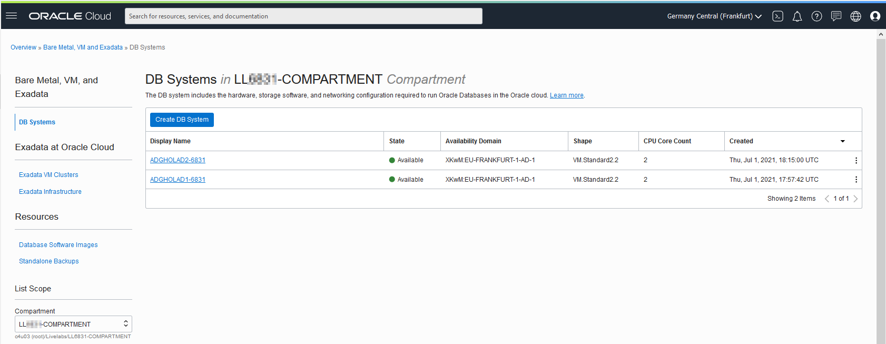
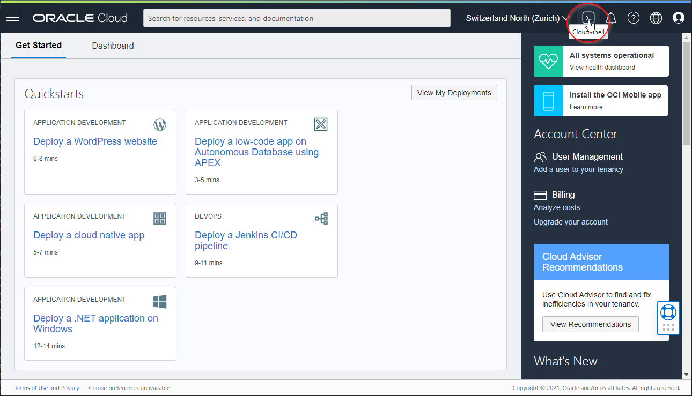
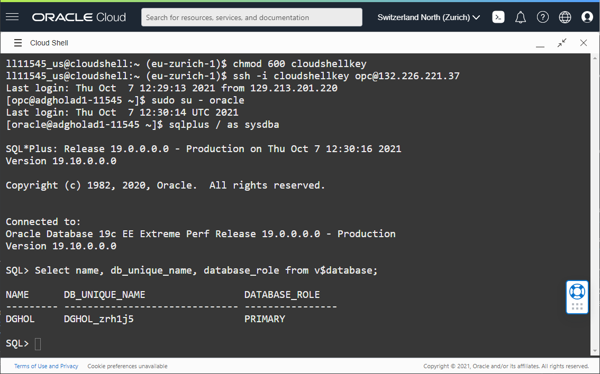

# Steps to Connect to the Database

## Introduction
In this lab, we will create the connection to primary and standby databases.

Estimated Lab Time: 15 Minutes

Watch the video below for a quick walk through of the lab.

[Youtube video showing how to connect](youtube:6Dp49VXqjtQ)

### Objectives
- Create a database connection to the primary database
- Create a database connection to the standby database

## Task 1: Create the Connection to the primary

<if type="livelabs">

1. Open up the menu in the left hand corner.  

2. From the menu, select **Oracle Database**, then **Oracle Base Database (VM, BM)**.

  

3. In the List Scope section on the left, enter the first part of the compartment assigned to you in the Search field, then click the compartment name.

  


   There are two Database Systems created for you. The system prefixed with `ADGHOLAD1` is your primary database, and the system prefixed with `ADGHOLAD2` is your secondary database.

</if>

4. Click the name of the primary database (`ADGHOLAD1`).

  

  Scroll down on the page and click on **Nodes(1)** to find on which host it resides.
  The Public IP Address part is the IP Address we want to know. Make a copy of this on the clipboard or make sure to have this information noted down.

  

5. Open the **Cloud Shell** using the icon next to the region.  If you get a policy error, ensure you have chosen the correct compartment you were assigned.

  

  The Cloud Shell opens after a few seconds and shows the **prompt**.

6. Download the private key for the Oracle Cloud World LiveLab using the below command in the Cloud Shell.
    ````
    <copy>wget http://bit.ly/ocw22-ssh</copy>
    ````

7. Unzip the archive:
    ```
    <copy>unzip ocw22-ssh</copy>
    ```

   *Please note: The file does not have a file extension!*

   You will find the following files:

      * ocw2022_rsa (privayte key)
      * ocw2022_rsa.pub (public key)
      * ocw2022-putty.ppk (private key in Putty format - for Windows only)


8. Change the permission of the private key `ocw2022_rsa` to `0600` and connect to the primary host as `opc`, using the public IP address that you have noted down earlier.
    ````
    <copy>chmod 600 ocw2022_rsa</copy>
    ````

    ````
    <copy>ssh -i ocw2022_rsa opc@IP_ADDRESS</copy>
    ````

    Replace `IP_ADDRESS` with the real public IP address.


9. You should be connected to the primary database host. You can become **oracle** with `sudo su - oracle` and connect to the instance with the command `sqlplus / as sysdba` and execute a query:

    ````
    <copy>Select name, db_unique_name, database_role from v$database;</copy>
    ````

  


## Task 2: Create the Connection to the Standby in a new tab

1. **Duplicate the tab in your browser**. If your browser does not support tab duplication, open a new tab and connect again to the **Cloud Console**.

2. From the menu, navigate again to **Oracle Database**, then  **Oracle Base Database (VM, BM)**.

  This time, select the **ADGHOLAD2** DB System (the standby database).

  

  Scroll down on the page and click on **Nodes(1)** to find on which host it resides.
  The Public IP Address part is the IP Address we want to know. Make a copy of this on the clipboard or make sure to have this information noted down.

  

5. Open the **Cloud Shell** using the icon next to the region.

  

  The Cloud Shell opens after a few seconds and shows the **prompt**.

7. The private key that you have uploaded in the previous step should already be there. The same key can be used to connect to the standby database host.

  Connect to the standby host as `opc`, using the public IP address that you have noted down earlier.
    ````
    <copy>ssh -i ocw2022_rsa opc@IP_ADDRESS2</copy>
    ````
    Replace `IP_ADDRESS2` with the public IP address of the standby database host.

9. You should be connected to the standby database host. You can become **oracle** using `sudo su - oracle` and connect to the instance with the command `sqlplus / as sysdba` and execute a query:

    ````
    <copy>Select name, db_unique_name, database_role from v$database;</copy>
    ````

  

You have now successfully created a database connection to the primary and the standby database.

## Acknowledgements

- **Author** - Ludovico Caldara, Product Manager Data Guard, Active Data Guard and Flashback Technologies
- **Contributors** - Robert Pastijn, Suraj Ramesh
- **Last Updated By/Date** -  Ludovico Caldara, July 2022
