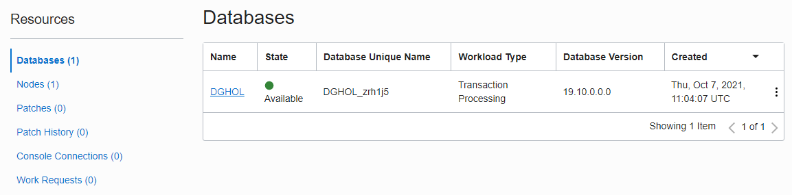
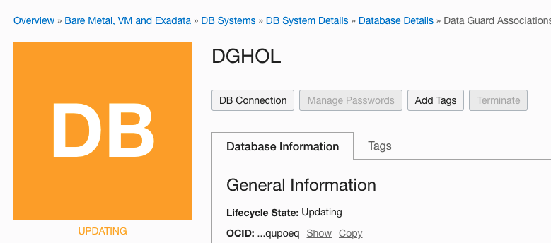
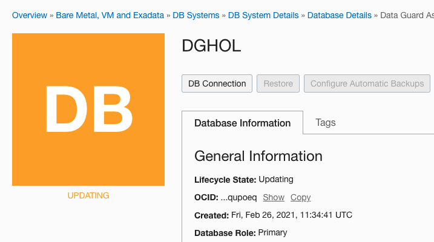

# How to Perform Database Failover

## Introduction
In this lab, we will be performing a switchover operation.

Oracle Data Guard helps you change the role of databases between primary and standby using either a switchover or failover operation.

A switchover is a role reversal between the primary database and one of its standby databases. A switchover guarantees no data loss and is typically done for planned maintenance of the primary system. During a switchover, the primary database transitions to a standby role, and the standby database transitions to the primary role.
When working with the OCI console, a switchover is always started from the primary database.

A failover is a role transition in which one of the standby databases is transitioned to the primary role after the primary database (all instances in the case of an Oracle RAC database) fails or has become unreachable.
A failover may or may not result in data loss depending on the protection mode in effect at the time of the failover.
When working with the OCI console, a failover is started from the standby database that will become primary.

Estimated Lab Time: 15 Minutes

Watch the video below for a quick walk through of the lab.

[Video showing how to perform a failover](youtube:9KUo95KhnVQ)

### Objectives
- Verify the database roles in the database
- Perform a failover

### Prerequisites
- Connect to the Database
- Perform a switchover

## Task 1: Verify the database roles in the database
1. From the **first browser tab** with Cloud Shell, connect to the primary host (skip this step if you are still connected from the previous lab):
    ````
    <copy>ssh -i cloudshellkey opc@IP_ADDRESS</copy>
    ````
    Replace `cloudshellkey` with the name of your private key file, and `IP_ADDRESS` with the real public IP address.

2. You should be connected to the primary database host. You can become **oracle** with `sudo su - oracle` and connect to the instance with the command `sqlplus / as sysdba` and execute a query:

    ````
    <copy>Select name, db_unique_name, database_role from v$database;</copy>
    ````

  

1. From the **second browser tab** with Cloud Shell, connect to the standby host (skip this step if you are still connected from the previous lab):
    ````
    <copy>ssh -i cloudshellkey opc@IP_ADDRESS</copy>
    ````
    Replace `cloudshellkey` with the name of your private key file, and `IP_ADDRESS` with the real public IP address.

2. You should be connected to the primary database host. You can become **oracle** with `sudo su - oracle` and connect to the instance with the command `sqlplus / as sysdba` and execute a query:

    ````
    <copy>Select name, db_unique_name, database_role from v$database;</copy>
    ````
  


We can conclude from the previous outputs which database is PRIMARY and which is a PHYSICAL STANDBY.

## Task 2: Perform the role transition

1. In the OCI console, navigate to the DB System Details of the ADGHOLAD1 database and scroll down to the Databases section.

    Overview
    -> Oracle Base Database (VM, BM)
    -> DB Systems

2. Select **ADGHOLAD1**
    

3. Click on the name **DGHOL** and in the next screen scroll down and click on **Data Guard Associations (1)** in the left pane.

    

4. Click on the 3 dots on the right, and click **Failover**
    

5. This will cause some downtime, so the tooling asks for the password. Enter the SYS password (WElcome123##) and click **OK**. The role transition starts.
    

6. At this point, the lifecycle state will be updating and the role transition happens in the background.
    

7. After some time the role transition finished and the state is Available again.
    

## Task 3: Reinstate the old primary, the new standby

A failover means that the old primary, in our case the DB ADGHOLAD2, will be disabled. To use this database again as a standby database, we need to reinstate it.

1. To do so, navigate to the details of the DB System **ADGHOLAD1**:

    Overview
    -> Oracle Base Database (VM, BM)
    -> DB Systems

2. And select ADGHOLAD1.

3. Scroll down and click on the **DGHOL** database.

4. This brings you to the Database details. Scroll down on the page and click on **Data Guard Associations (1)**. You can see that the **Peer Role** is **Disabled Standby**.

    

5. Click on the 3 dots on the right, and click **Reinstate**
    

6. A reinstate flashes back the former primary database to a state suitable to become standby database again. So the tooling asks for the password. Enter the SYS password (WElcome123##) and click **OK**. The reinstate starts.
    

7. At this point, the lifecycle state will be updating and the reinstate happens in the background.
    

8. After some time the role transition finished and the state is Available again. The **Peer Role** is **Standby** again.
    


## Task 4: Verify the database roles in the database
1. From the **first browser tab** with Cloud Shell, reissue the verification of the role:

    ````
    <copy>Select name, db_unique_name, database_role from v$database;</copy>
    ````
  

1. Do the same in the **second browser tab** :
    ````
    <copy>Select name, db_unique_name, database_role from v$database;</copy>
    ````
  

  We can conclude that the Database that was PRIMARY is now PHYSICAL STANDBY, and vice versa.

You have now successfully performed a failover. You may now [proceed to the next lab](#next).


## Acknowledgements

- **Author** - Ludovico Caldara, Product Manager Data Guard, Active Data Guard and Flashback Technologies
- **Contributors** - Robert Pastijn, Database Product Management
- **Last Updated By/Date** -  Ludovico Caldara, July 2022
