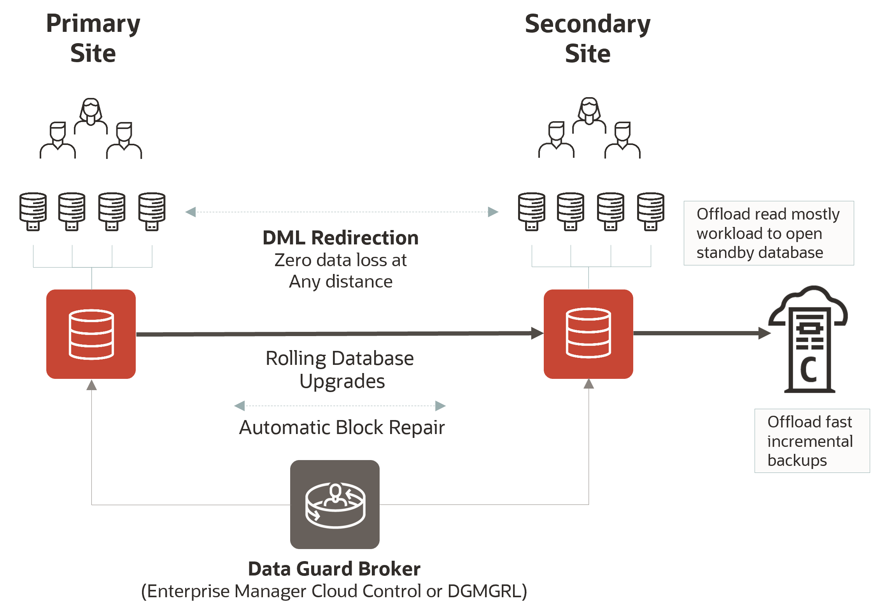

# Oracle Database 19c Active Data Guard Fundamentals

## Introduction

Oracle Data Guard provides a comprehensive set of services that create, maintain, manage, and monitor one or more standby databases to enable production Oracle databases to survive disasters and data corruptions.

Oracle Data Guard maintains these standby databases as copies of the production database. Then, if the production database becomes unavailable because of a planned or an unplanned outage, Oracle Data Guard can switch any standby database to the production role, minimizing the downtime associated with the outage. Oracle Data Guard can be used with traditional backup, restoration, and cluster techniques to provide a high level of data protection and data availability.

Oracle Data Guard transport services are also used by other Oracle features such as Oracle Streams and Oracle GoldenGate for efficient and reliable transmission of redo from a source database to one or more remote destinations.

Oracle (Active) Data Guard capabilities in Oracle Database 19c further enhance its strategic objective of preventing data loss, providing high availability, eliminating risk, and increasing return on investment by enabling highly functional active disaster recovery systems that are simple to deploy and manage.

It accomplishes this by providing the management, monitoring, and automation software infrastructure to create and maintain one or more synchronized standby databases that protect Oracle data from failures, data corruption, human error, and disasters

This workshop focuses on **Creating Active Data Guard 19c in Oracle Cloud Infrastructure using Database Cloud Service Systems (DBCS)**.

Estimated Workshop Time: 2 Hours

<if type="odbw">If you would like to watch us do the workshop, click [here](https://youtu.be/IF_HAzrzizc).</if>

### Workshop Objectives
- Create the primary database
- Create the standby database
- Connect to the database
- Perform a switchover
- Perform a failover
- Enable Active Data Guard DML Redirection
- Automatic block media recovery
- Restore point propagation
- Change the SYS password

### Prerequisites
- An Oracle Cloud Account - Please view this workshop's LiveLabs landing page to see which environments are supported

*Note: If you have a **Free Trial** account, when your Free Trial expires your account will be converted to an **Always Free** account. You will not be able to conduct Free Tier workshops unless the Always Free environment is available. **[Click here for the Free Tier FAQ page.](https://www.oracle.com/cloud/free/faq.html)***

## Disclaimer
The following is intended to outline our general product direction. It is intended for information purposes only, and may not be incorporated into any contract. It is not a commitment to deliver any material, code, or functionality, and should not be relied upon in making purchasing decisions. The development, release, and timing of any features or functionality described for Oracle’s products remains at the sole discretion of Oracle.

## Acknowledgements

- **Author** - Pieter Van Puymbroeck, Product Manager Data Guard, Active Data Guard and Flashback Technologies
- **Contributors** - Robert Pastijn, Kamryn Vinson
- **Last Updated By/Date** -  Suraj Ramesh,September 2021
