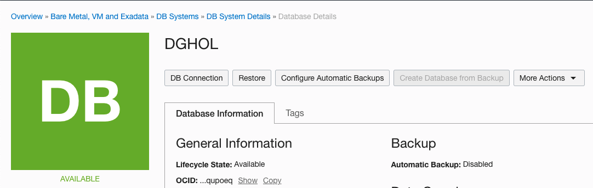
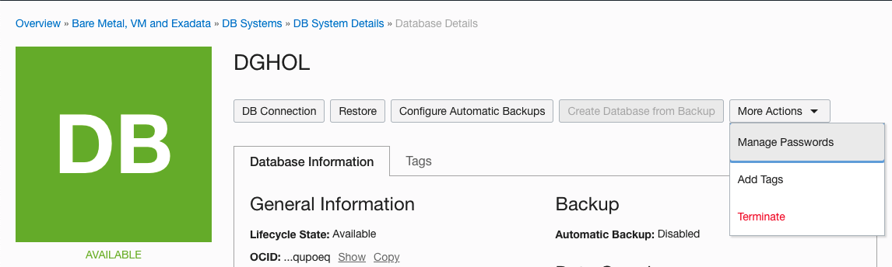

# Steps to Change the Passwords

## Introduction

In this lab, we will use cloud interface to change the passwords.

In a cloud environment it is important to use the provided cloud tooling as much as possible. It is possible to keep your own passwords, however this can break the automation in cloud interface.

This lab will show you how to correctly change the SYS password in a Data Guard environment.

Doing this right is important. When you change the SYS password in a Data Guard environment, Data Guard will propagate password changes for the SYS user to the standby database.

Estimated Lab Time: 15 Minutes

### Objectives
- Change the SYS password
- Log in to the database as the SYS user

## Task 1: Change the SYS password

1. Navigate to the HOLDG primary database following using the below path

    Overview
    Bare Metal, VM and Exadata
    DB Systems (choose ADGHOLAD1)
    DB System Details

2. At the bottom click the HOLDG database.

    

3. Find the drop down which lists **More Actions** and click **Manage Passwords**.

    

4. Enter the new SYS password. Keep in mind that the Password must be 9 to 30 characters and contain at least 2 uppercase, 2 lowercase, 2 special, and 2 numeric characters. The special characters must be _, #, or -.

    As the password for this lab, use: **WelC0me1##**

    And click **Apply**

    

## Task 2: Verify

1. Using SQL Developer, try to log in to the database as the SYS user. This will fail if you before stored the password. The tool prompts you for the new password.

    

2. When you specify the new password, the connection succeeds.

    

## Acknowledgements

- **Author** - Pieter Van Puymbroeck, Product Manager Data Guard, Active Data Guard and Flashback Technologies
- **Contributors** - Robert Pastijn, Database Product Management
- **Last Updated By/Date** -  Suraj Ramesh, September 2021
