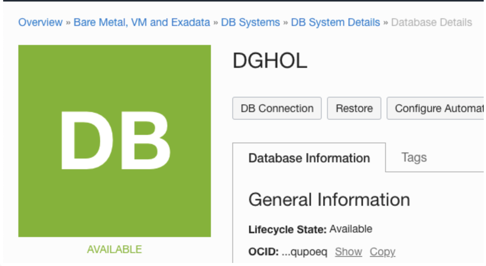
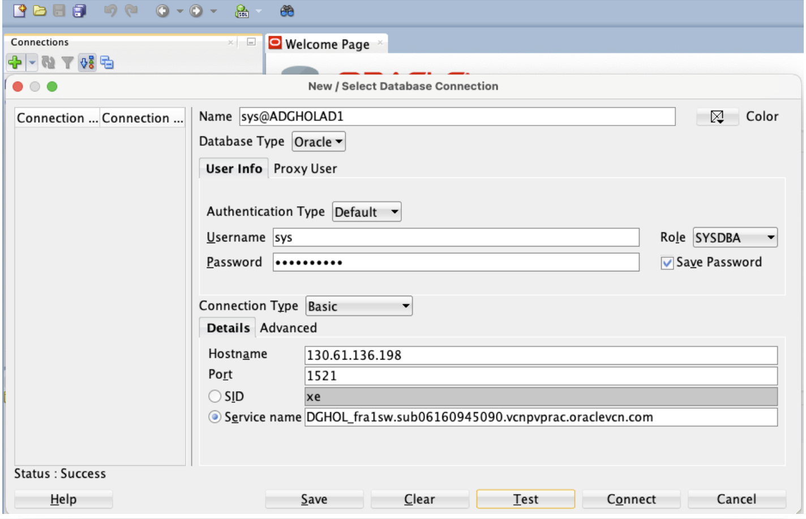
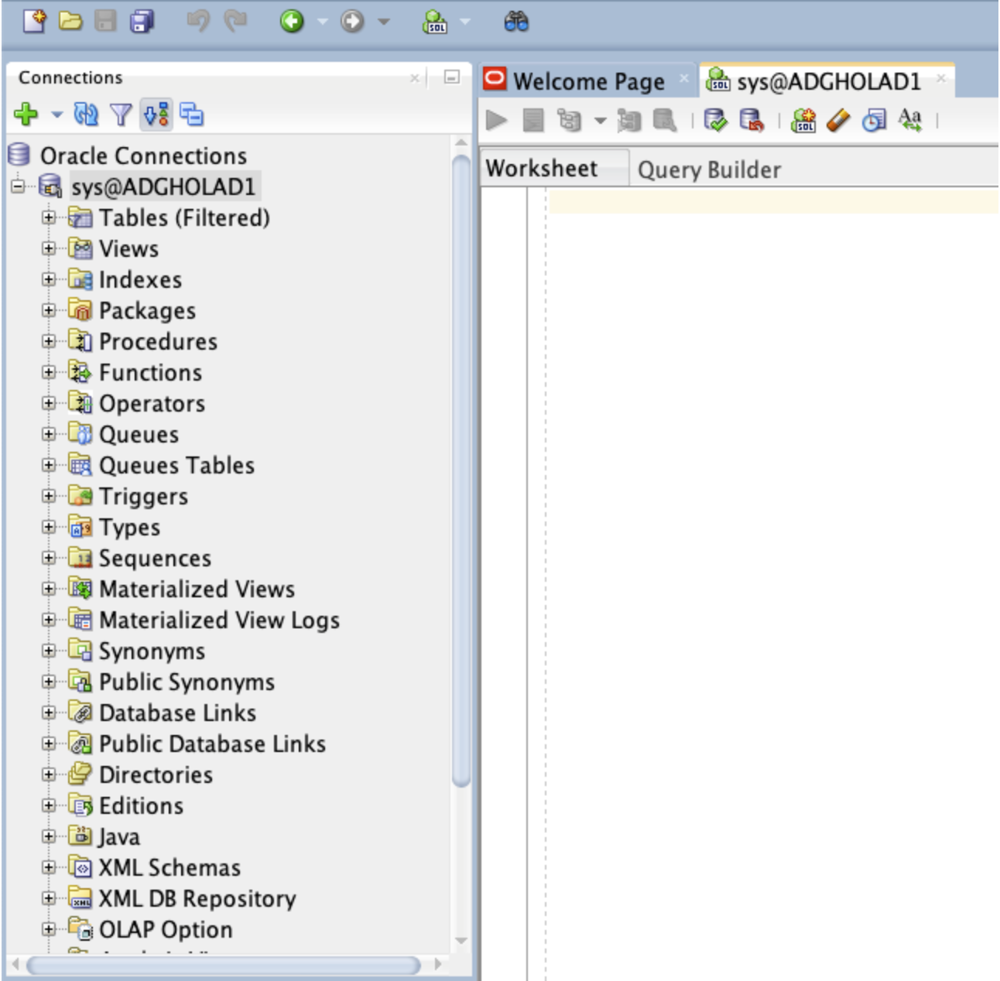
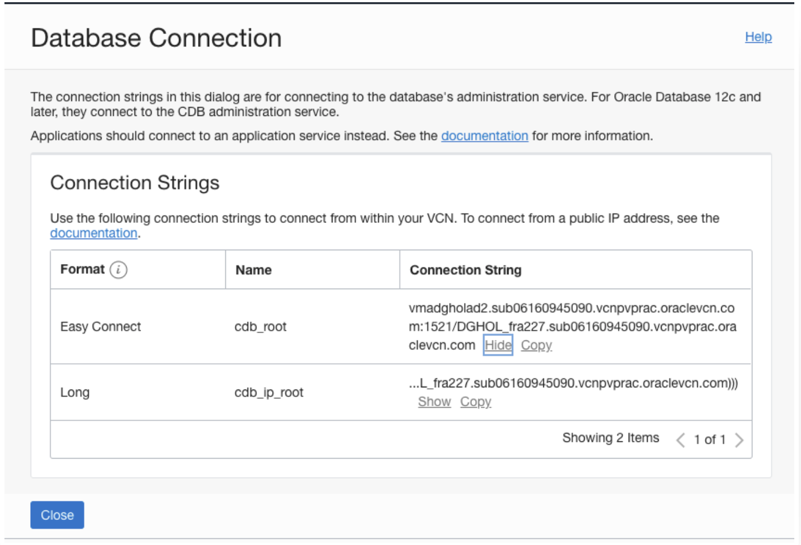
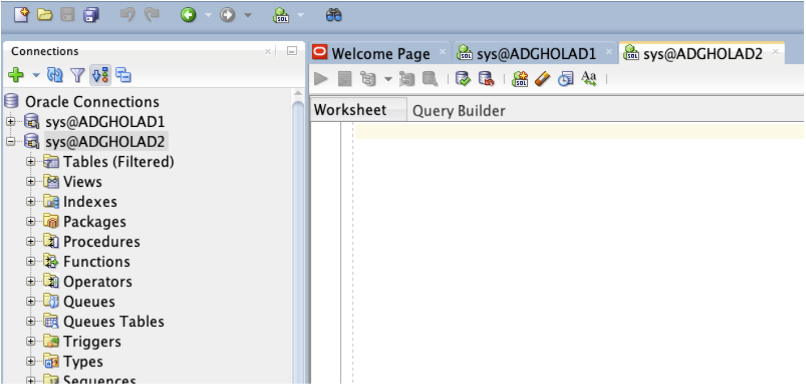

# Steps to Connect to the Database

## Introduction
In this lab, we will create the connection to primary & standby databases.

### Connection to the Databases

We will use SQL Developer to connect to our new database system with a primary and a standby database.
You can run this tool from any desktop that has network connectivity to the database system.

You can download SQL Developer from this link: [SQL Developer Home page](https://www.oracle.com/be/database/technologies/appdev/sqldeveloper-landing.html)

When you first open SQL Developer, the screen looks like this:

Estimated Lab Time: 30 Minutes

### Objectives
- Create a database connection to the primary database
- Create a database connection to the standby database

## Task 1: Create the Connection to the primary

<if type="livelabs">
1.  Open up the hamburger menu in the left hand corner.  

2.  From the hamburger menu, select **Bare Metal, VM, and Exadata** in the Oracle Database category.

  

3. In the List Scope section on the left, enter the first part of the compartment assigned to you in the Search field, then click the compartment name.

  

   There are two Database Systems created for you. The system prefixed with `ADGHOLD1` is your primary database, and the system prefixed with `ADGHOLD2` is your secondary database.

</if>

1. Click the name of the primary database (`ADGHOLD1`).

  

2. Scroll down and click the database name `DGHOL` to get to the database details screen.

  

  There you click the **DB Connection** button and the Database Connection information window opens.

  

3. Click the **Show** Hyperlink from the Easy Connect format and make a note of the connection string. The part after the / (slash) is the service name. Make a copy of this on the clipboard or make sure to have this information noted down. Then close this window.

  

4. The second thing we need to connect to the database using the IP from the host it is running on.

  To get that information, navigate to the Overview
  Bare Metal, VM and Exadata
  DB Systems (Select the **ADGHOLAD1** DB System)
  DB System Details

  Scroll down on the page and click on **Nodes(1)** to find on which host it resides.
  The Public IP Address part is the IP Address we want to know. Make a copy of this on the clipboard or make sure to have this information noted down.

  

5. Then we go back to SQL Developer to add the connection. Click the **Green Plus icon** at the top left.

  To add the connection, use following information:

      * Name: sys@ADGHOLAD1
      * Username: sys
      * Password: WElcome123##
      * Save Password: checked
      * Role: SYSDBA
      * Hostname: The Public IP Address you found in the step above
      * Service name: The service name you found in the step above (the part after the / (slash)).

  

6. Then click the **Test** button and this connection should be successful. When it is successful, click the save button and click the **Connect** button.

  

  > **Note:** If the Status is failed with the error "**The Network adapter could not establish the connection**" disconnect from your company's VPN and try again.

## Task 2: Create the Connection to the Standby

1. First, we need to know the service name from the standby Database and the IP address it listens to.

  To get that information, navigate to the Overview
  Bare Metal, VM and Exadata
  DB Systems  (Select the **ADGHOLAD2** DB System)
  DB System Details
  Database Details

  

2. There you click the **DB Connection** button and the Database Connection information window opens.

  

3. Click the **Show** Hyperlink from the Easy Connect format and make a note of the connection string. The part after the / (slash) is the service name. Make a copy of this on the clipboard or make sure to have this information noted down. Then close this window.

4. The second thing we need to connect to the database is the IP Address from the host it is running on.

  To get that information, navigate to the Overview
  -> Bare Metal, VM and Exadata
  -> DB Systems
  -> DB System Details

  Scroll down on the page and click **Nodes(1)** to find on which host it resides.
  The Public IP Address part is the IP Address we want to know. Make a copy of this on the clipboard or make sure to have this information noted down.

  

5. Then we go back to SQL Developer.

  To add the connection, click the **Green Plus icon** at the top left.
  The wizard opens.

  To add the connection, use following information:

      * Name: sys@ADGHOLAD2
      * Username: sys
      * Password: WElcome123##
      * Save Password: checked
      * Role: SYSDBA
      * Hostname: The Public IP Address you found in the step above
      * Service name: The service name you found in the step above (the part after the / (slash)).

  

6. Then click the **Test** button and this connection should be successful. When it is successful, click the save button and click the **Connect** button.

  

You have now successfully created a database connection to the primary and the standby database.

## Acknowledgements

- **Author** - Pieter Van Puymbroeck, Product Manager Data Guard, Active Data Guard and Flashback Technologies
- **Contributors** - Robert Pastijn, Database Product Management
- **Last Updated By/Date** -  Suraj Ramesh, September 2021
