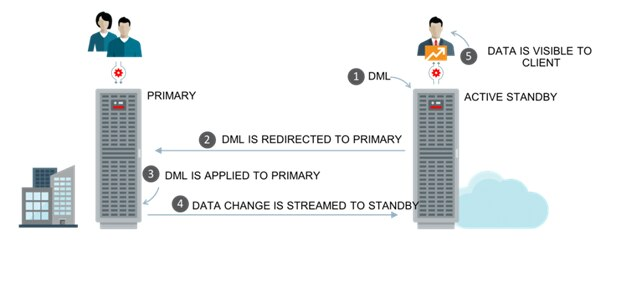
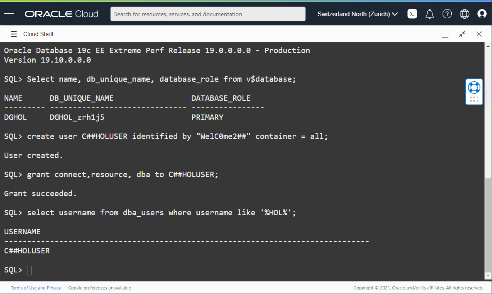
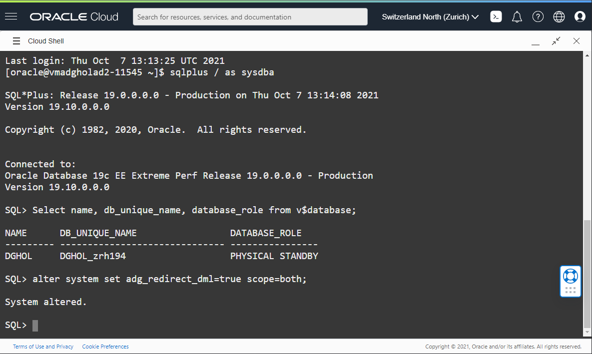
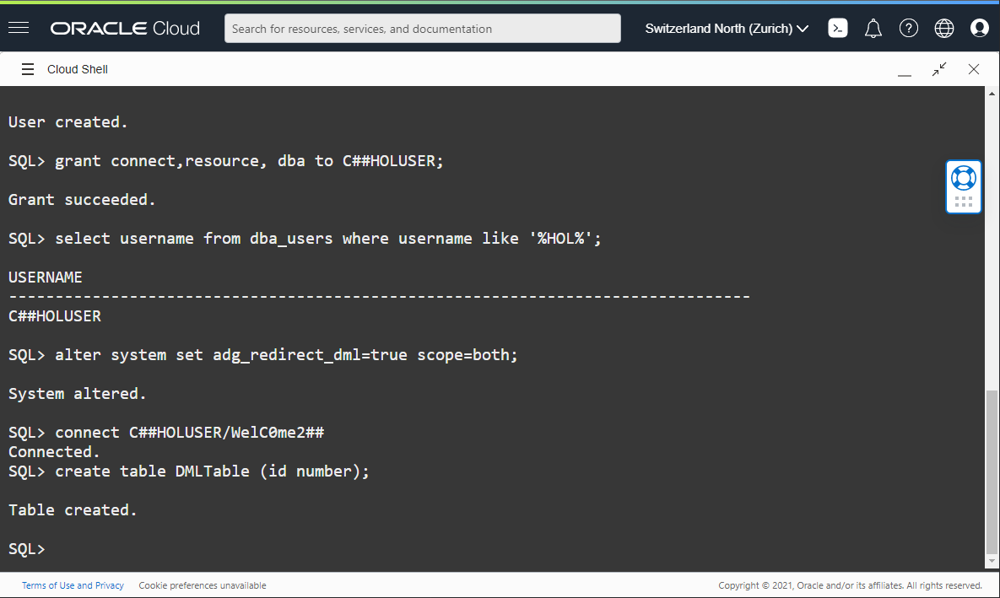
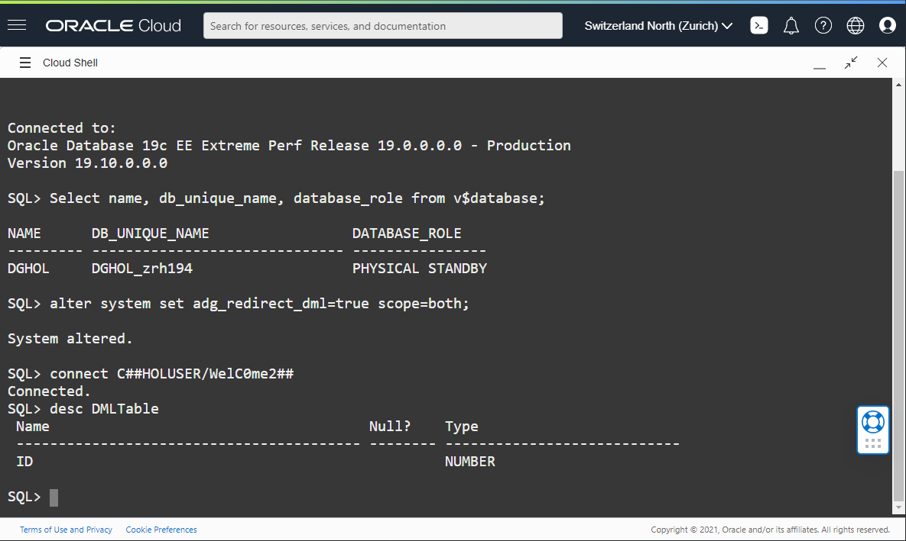
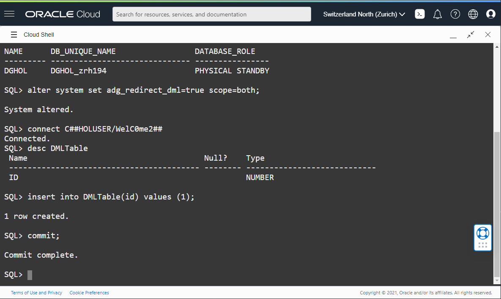

# How to enable Active Data Guard DML Redirection

## Introduction
In this lab, we will enable the 19c New Feature Active Data Guard DML Redirection.

Estimated Lab Time: 20 Minutes

Watch the video below for a quick walk through of the lab.

[](youtube:nvTV9UxRkMo)

### Enable Active Data Guard DML Redirection

Oracle Active Data Guard 19c DML Redirection is a new feature which allow you to perform occasional DML using a read only standby database.



The DML Redirection process breaks down in 5 steps:

1. The Client issues a DML to the read-only Standby Database
2. The standby notices it is DML and sends this DML towards the primary database using an internal database link
3. The primary executes the DML (which then generates redo)
4. This redo is a normal redo stream and together with the normal redo stream is sent to the standby database
5. The standby database applies the received redo stream and releases the lock on the session so the session can see the result.

### Objectives
- Create a common user in the Database
- Enable Active Data Guard DML Redirection
- Create a table
- Use Active Data Guard DML Redirection

### Prerequisites
- Connect to the Database

## Task 1: Create a common user

DML redirection for user tables, is not possible using the SYS user.
When you try to run a DML statement, it will fail with:  

**ORA-16397**: *statement redirection from Oracle Active Data Guard standby database to primary database failed*

So we will create a common user in the Database to learn about this feature.

1. Using a Cloud Shell used in the previous labs, open the connection to the primary database, which should now be ADGHOLAD1.

    This can be verified by using the following query.

    ````
    <copy>Select name, db_unique_name, database_role from v$database;</copy>
    ````
    

2. Then use following query to create a common user in all the pdbs.

    ````
    <copy>create user C##HOLUSER identified by "WelC0me2##" container = all;</copy>
    ````

3. Grant this user the minimum privileges required to perform its duties. In a production environment, grant necessary privileges only. This is just for demonstration purposes that we give this user all the rights possible. For this lab and ease of things, we grant powerful role to the user.

    ````
    <copy>grant connect,resource, dba to C##HOLUSER;</copy>
    ````

4. Verify with this query if the user has been created correctly:

    ````
    <copy>select username from dba_users where username like '%HOL%';</copy>
    ````
    


## Task 2: Enable the system for ADG DML Redirect

Automatic redirection of DML operations to the primary can be configured at the system level or the session level. The session level setting overrides the system level setting.

* To enable automatic redirection of DML operations to the primary at the system level, set `ADG_REDIRECT_DML` to true.
* To disable automatic redirection of DML operations to the primary at the system level, set `ADG_REDIRECT_DML` to false.

In this Lab we will configure the DML Redirection on database level.
This parameter must be set **on both the primary and standby database**.

More information about this parameter can be found in the [Oracle Documentation.](https://docs.oracle.com/en/database/oracle/oracle-database/19/refrn/ADG_REDIRECT_DML.html#GUID-AC98F026-33BE-41FE-8F2F-EFA296723AD8)

You can use following alter system command to enable this parameter.

````
<copy>alter system set adg_redirect_dml=true scope=both;</copy>
````
On the primary:


On the standby:


At this point, the databases are enabled for Active Data Guard DML redirection.


## Task 3: Create a table

1. To create a table in the common users's schema, it is necessary to create a connection as the common user. Use the following command to switch to the common user on the **primary** database:
    ````
    <copy>connect C##HOLUSER/WelC0me2##</copy>
    ````

2. Do the same for the connection to the **standby** database.
    ````
    <copy>connect C##HOLUSER/WelC0me2##</copy>
    ````

7. Create a new table on the **primary** database:

    ````
    <copy>create table DMLTable (id number);</copy>
    ````
    

8. Describe the table on the **standby** with the `desc DMLTable` command.
    


## Task 4: Use DML Redirection

1. On the **standby** database try to insert a row in this table with following SQL Statement

    ````
    <copy>insert into DMLTable(id) values (1);</copy>
    ````

2. and of course do not forget to `commit;`.

    

    You will notice that it is slower than an insert on the primary. This is expected because the DML redirection transparently creates a database link and use it to execute the insert on the primary.

3. Then on the **primary** database, verify if the row is visible as well.

    ````
    <copy>select * from DMLTable;</copy>
    ````

    


You have now successfully used Active Data Guard DML Redirection. You may now [proceed to the next lab](#next).

## Acknowledgements

- **Author** - Pieter Van Puymbroeck, Product Manager Data Guard, Active Data Guard and Flashback Technologies
- **Contributors** - Robert Pastijn, Ludovico Caldara, Suraj Ramesh
- **Last Updated By/Date** -  Ludovico Caldara, October 2021
