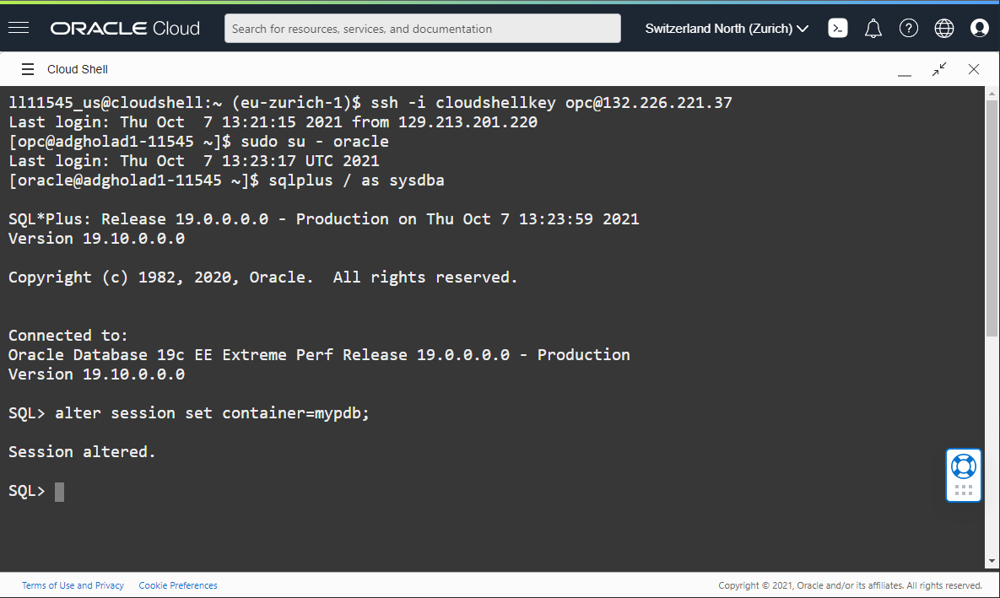
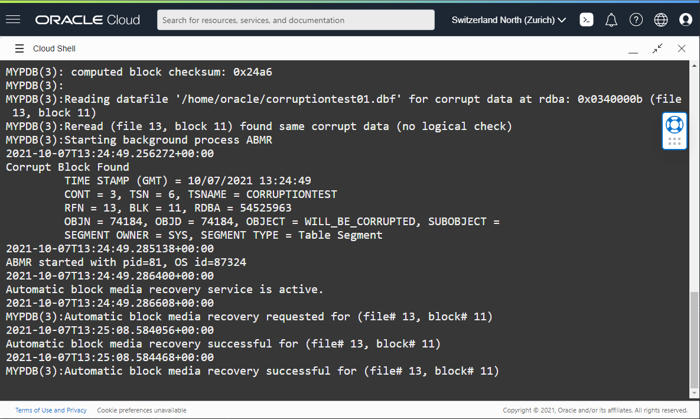

#Performing Automatic Block Media Recovery

## Introduction
In this lab, we will see how Active Data Guard Automatic Block media recovery works.

Block corruptions are a common source of database outages. A database block is
corrupt when its content has changed from what Oracle Database expects to find. If
not prevented or repaired, block corruption can bring down the database and possibly
result in the loss of key business data.

Data Guard maintains a copy of your data in a standby database that is continuously updated with changes from the primary database. Data Guard validates all changes before it applies to the standby database, preventing physical corruptions that occur in the storage layer from causing data loss and downtime. The primary database automatically attempts to repair the corrupted block in real time by fetching a good version of the same block from an Active Data Guard physical standby database. This process works in both ways.

In this lab we will introduce a block corruption in the database and see Active Data Guard repairing it.

Estimated Lab Time: 40 Minutes

Watch the video below for a quick walk through of the lab.

[](youtube:05IR37v7kg8)

05IR37v7kg8
### Objectives
- Setup your environment
- Corrupt the datafile
- Access the table

### Prerequisites
- Connect to the Database


## Task 1: Set the environment

This lab uses 3 sql scripts. You can download them now or later, following the lab instructions.

* [01-abmr.sql](./scripts/01-abmr.sql)
* [02-abmr.sql](./scripts/02-abmr.sql)
* [03-abmr.sql](./scripts/03-abmr.sql)

You will also need the two browser tabs with Cloud Shell connected to the **primary** host. This has been explained in the **Lab: Steps to Connect to the Database**

1. From the one of the tabs connected to the **primary** host, download the three SQL scripts as `oracle`:
  ````
  <copy>
  wget https://oracle.github.io/learning-library/data-management-library/database/data-guard/19c-adg-fundamentals/media-recovery/scripts/01-abmr.sql
  wget https://oracle.github.io/learning-library/data-management-library/database/data-guard/19c-adg-fundamentals/media-recovery/scripts/02-abmr.sql
  wget https://oracle.github.io/learning-library/data-management-library/database/data-guard/19c-adg-fundamentals/media-recovery/scripts/03-abmr.sql </copy>
  ````

    

2. On the same tab, tail the alert log:

    ````
    <copy> tail -f  /u01/app/oracle/diag/rdbms/${ORACLE_UNQNAME,,}/${ORACLE_SID}/trace/alert_${ORACLE_SID}.log</copy>
    ````
    

## Task 2: Setup the environment

1. On the second tab, log onto the **primary** database and set the container database to `mypdb` with:

    ````
    <copy>alter session set container=mypdb;</copy>
    ````
    


1. Run the `01-abmr.sql` script.
  ````
  <copy>@01-abmr.sql</copy>
  ````
  This script creates a tablespace, adds a table in it and inserts a row. This will also return the rowID. Take a note of this number as you will need it in step 2, the step that will introduce corruption.

  ````
  SQL> <copy>show con_name</copy>

  CON_NAME
  ------------------------------
  MYPDB
  SQL> <copy>@01-abmr.sql</copy>
  SQL> set feed on;
  SQL> Col owner format a20;
  SQL> var rid varchar2(25);
  SQL> col segment_name format a20;
  SQL> drop tablespace corruptiontest including contents and datafiles;
  drop tablespace corruptiontest including contents and datafiles
  *
  ERROR at line 1:
  ORA-00959: tablespace 'CORRUPTIONTEST' does not exist

  SQL> create tablespace corruptiontest datafile '/home/oracle/corruptiontest01.dbf' size 1m;

  Tablespace created.

  SQL> create table will_be_corrupted(myfield varchar2(50)) tablespace corruptiontest;

  Table created.

  SQL> insert into will_be_corrupted(myfield) values ('This will have a problem') returning rowid into :rid;

  1 row created.

  SQL> print

  RID
  --------------------------------------------------------------------------------------------------------------------------------
  AAASGFAANAAAAAPAAA

  SQL> Commit;

  Commit complete.

  SQL> Alter system checkpoint;

  System altered.

  SQL> select * from will_be_corrupted;

  MYFIELD
  --------------------------------------------------
  This will have a problem

  1 row selected.

  SQL> --select owner, segment_name,tablespace_name,file_id,block_id from dba_extents where segment_name='WILL_BE_CORRUPTED'; -- will be segment id

  SQL> select dbms_rowid.ROWID_BLOCK_NUMBER(ROWID, 'SMALLFILE') FROM will_be_corrupted where myfield='This will have a problem';

  DBMS_ROWID.ROWID_BLOCK_NUMBER(ROWID,'SMALLFILE')
  ------------------------------------------------
                          11

  1 row selected.

  SQL>
  ````

In this example, you will need to remember the number 11.

## Task 3: Corrupt the datafile
1. In the same session, execute script `02-abmr.sql`.
    This script will ask for a number. This is the number from the first step and we will use this to corrupt the datafile which the first script has created.

    ````
    SQL> <copy>@02-abmr.sql</copy>
    ````
    ````
    SQL> <copy>host dd conv=notrunc bs=1 count=2 if=/dev/zero of=/home/oracle/corruptiontest01.dbf seek=$((&block_id*8192+16))</copy>
    Enter value for block_id: 11
    2+0 records in
    2+0 records out
    2 bytes (2 B) copied, 0.000608575 s, 3.3 kB/s

    SQL>
    ````

At this point, we have a corrupt datafile, but the database is not aware of it yet.


## Task 4: Access the table

By accessing the table, Oracle will need to read the data. This demo database is not active, so it will be necessary to flush the caches before we access the table. That way, the data must be read from disk. This data is corrupt and without any error returned to the user, Active Data Guard will repair the corrupt block before returning the query result.

1. Use the script 03-abmr.sql for this.

    Check the Database alert log closely while executing this step.

    In the sqlplus window we will see this

    ````
    SQL> <copy>@03-abmr.sql</copy>
    SQL> <copy>alter system flush buffer_cache;</copy>

    System altered.

    SQL> <copy>select * from will_be_corrupted;</copy>

    MYFIELD
    --------------------------------------------------
    This will have a problem

    1 row selected.

    SQL>
    ````

    The corrupted block has not generated any error to the user session. In the alert log from the primary database we notice that the automated block media recovery took place.

      

## Task 5: Cleanup

To clean this excercise, just drop the tablespace.
1. In the sqlplus window, use this command:

    ````
    SQL> <copy>drop tablespace corruptiontest including contents and datafiles;</copy>

    Tablespace dropped.

    SQL>
    ````

You have now seen Active Data Guard Automatic Block media recovery working. You may now [proceed to the next lab](#next).


## Acknowledgements

- **Author** - Pieter Van Puymbroeck, Product Manager Data Guard, Active Data Guard and Flashback Technologies
- **Contributors** - Robert Pastijn, Ludovico Caldara, Suraj Ramesh
- **Last Updated By/Date** -  Ludovico Caldara, October 2021
