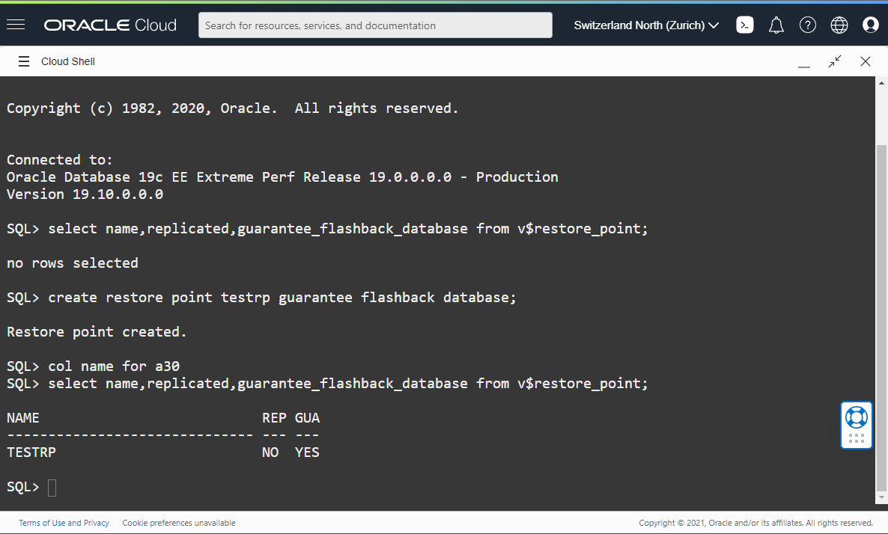
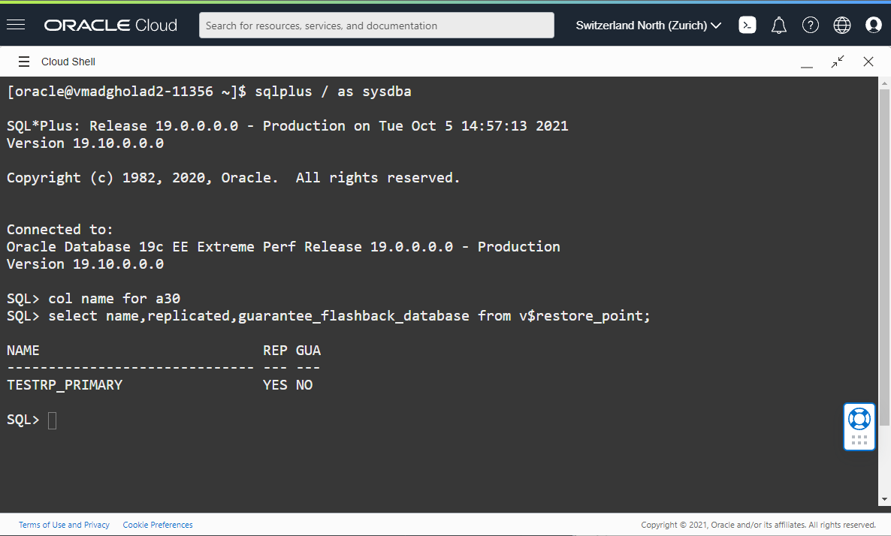

# Testing Restore Point Propagation

## Introduction
In this lab, we will test the 19c new feature "Restore point propagation"

Oracle 19c supports automatic restore point propagation from the primary database to the standby database.

This can be particularly useful in situations where during a logical operation on the primary database, the database will immediately fail beyond repair. When you perform a failover, the database would be in the same state as the primary, which would be logically corrupt.

To avoid this, we are now forwarding the restore points automatically from the primary database to the standby database.

Using this feature you can also flashback the standby database to a known good point in time.

To accommodate this, the `v$restore_point` view updates with a `REPLICATED` column, and the restore point name suffixes with `_PRIMARY.`

Please note that Guaranteed Restore Points on the primary are replicated as regular Restore Points on the standby, to prevent possible problems on the primary database due to flashback retention on the standby database.

Estimated Lab Time: 20 Minutes

Watch the video below for a quick walk through of the lab.

[](youtube:4KVfLFQWdiw)

### Objectives
- Create a restore point in the primary database
- Check the restore points
- Drop the restore point in the primary database

### Prerequisites
- Connect to the Database

## Task 1: Create a restore point in the primary

2. From the first Cloud Shell tab, connect to the **primary** database and check the restore points with the following query

    ````
    <copy>select name,replicated,guarantee_flashback_database from v$restore_point;</copy>
    ````

3. Do the same on the **standby** database.

    ````
    <copy>select name,replicated,guarantee_flashback_database from v$restore_point;</copy>
    ````

4. Next, create a restore point in the **primary** database

    ````
    <copy>create restore point testrp guarantee flashback database;</copy>
    ````

5. Check the restore points on the **primary** with following query

    ````
    <copy>select name,replicated,guarantee_flashback_database from v$restore_point;</copy>
    ````
    

6. Check the restore points also on the **standby** database.
    ````
    <copy>select name,replicated,guarantee_flashback_database from v$restore_point;</copy>
    ````
    

  The restore point drop is now replicated to the standby and it suffixes with `_PRIMARY` and the replicated column on the primary indicates as YES.

## Task 2: Drop the restore point

1. Next, drop the restore point on the **primary** database with following query
    ````
    <copy>drop restore point testrp;</copy>
    ````

2. Check the restore points on the **primary** with following query

    ````
    <copy>select name,replicated,guarantee_flashback_database from v$restore_point;</copy>
    ````

6. Check the restore points also on the **standby** database.

    ````
    <copy>select name,replicated,guarantee_flashback_database from v$restore_point;</copy>
    ````

You have now successfully used Active Data Guard Restore point propagation. You may now [proceed to the next lab](#next).


## Acknowledgements

- **Author** - Pieter Van Puymbroeck, Product Manager Data Guard, Active Data Guard and Flashback Technologies
- **Contributors** - Robert Pastijn, Ludovico Caldara, Suraj Ramesh
- **Last Updated By/Date** -  Ludovico Caldara, October 2021
