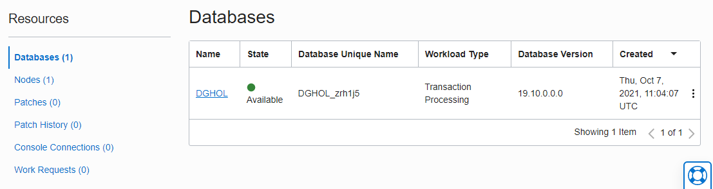
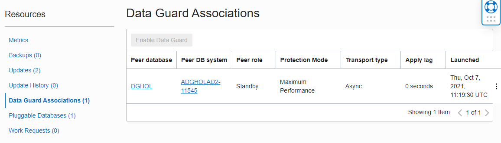
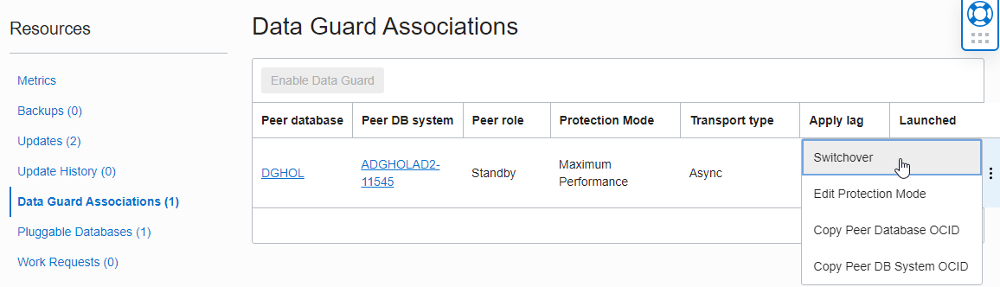

# How to Perform Database Switchover

## Introduction
In this lab, we will be performing a switchover operation.

Oracle Data Guard helps you change the role of databases between primary and standby using either a switchover or failover operation.

A switchover is a role reversal between the primary database and one of its standby databases. A switchover guarantees no data loss and is typically done for planned maintenance of the primary system. During a switchover, the primary database transitions to a standby role, and the standby database transitions to the primary role.

A failover is a role transition in which one of the standby databases is transitioned to the primary role after the primary database (all instances in the case of an Oracle RAC database) fails or has become unreachable.

A failover may or may not result in data loss depending on the protection mode in effect at the time of the failover.

Estimated Lab Time: 15 Minutes

### Perform Database switchover

A switchover is always started from the primary database, where a failover is initiated from the standby database.
The difference between a switchover and a failover is that a switchover is a graceful operation where a failover is only needed when the primary database is broken beyond repair or that repair would take too long.

We will use SQL Developer to connect to the Database System. You can run this tool from any desktop that has network connectivity to the Database System.

You can download SQL Developer from this link: [SQL Developer Home page](https://www.oracle.com/be/database/technologies/appdev/sqldeveloper-landing.html)


### Objectives
- Verify the database roles in the database
- Perform a switchover

### Prerequisites
- Connect to the Database


## Task 1: Verify the database roles in the database

1. Using SQL Developer, you can drag and drop the panes so that they are next to each other or shown split horizontally.

    


2. Verify the roles with the following query:

    ````
    <copy>Select name, db_unique_name, database_role from v$database;</copy>
    ````

3. Enter this query in both panes and click the run button to see the result.

    

We can conclude that the Database in AD1 is the primary database and the database in AD2 is the Standby database.


## Task 2: Perform the role transition

1. In the Oracle Cloud Infrastructure console, navigate to the DB System Details of the ADGHOLAD1 database and scroll down to the Databases section.

    Overview
    -> Bare Metal, VM and Exadata
    -> DB Systems

2. Select **ADGHOLAD1**
    

3. Click name **DGHOL** and in the next screen scroll down immediately and click on **Data Guard Associations**

    

4. Click the 3 dots on the right, and click **Switchover**
    

5. This is a DBA responsibility, so the tooling asks the password. Enter the SYS password (WElcome123##) from the Primary database and click **OK** then the role transition starts.
    

6. At this point, the lifecycle state will be updating and the role transition happens in the background.
    

7. After some time the role transition finished and the state is Available again.
    

    > **Note:** If you get an error indicating that the failover failed and you need to open an SR, try again and enter the sys password correctly.

## Task 3: Verify the database roles in the database

1. Using SQL Developer, verify the roles again with following Query:

    ````
    <copy>Select name, db_unique_name, database_role from v$database;</copy>
    ````

2. Enter this query in both panes and click the run button to see the result.

    

We can conclude that the Database in AD2 is the primary database and the database in AD1 is the Standby database.

You have now successfully performed a graceful role transition.

## Acknowledgements

- **Author** - Pieter Van Puymbroeck, Product Manager Data Guard, Active Data Guard and Flashback Technologies
- **Contributors** - Robert Pastijn, Database Product Management
- **Last Updated By/Date** -  Suraj Ramesh,September 2021
