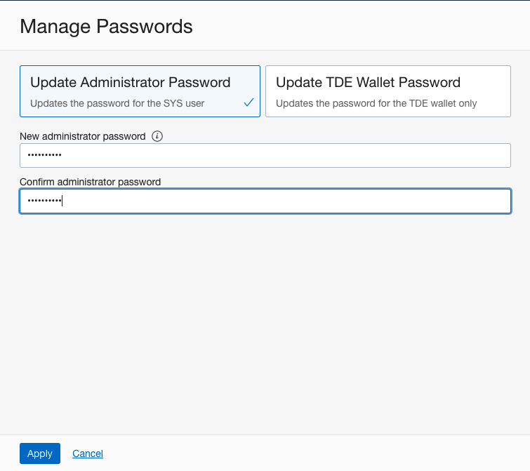
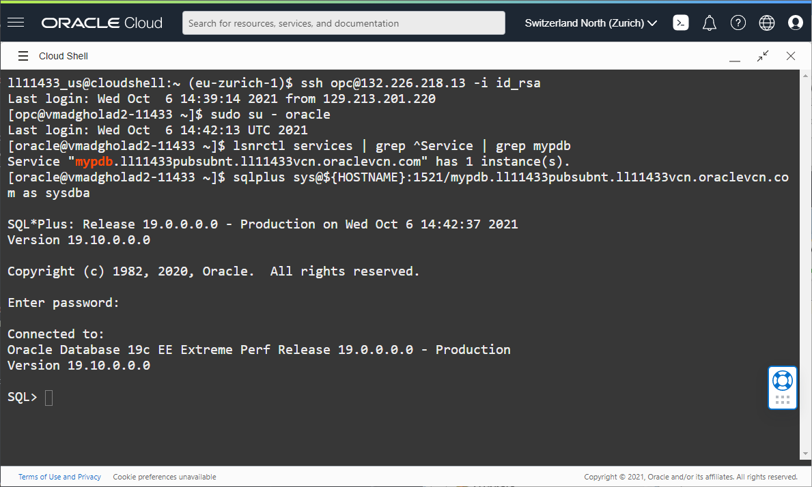

# Steps to Change the Passwords

## Introduction

In this lab, we will use cloud interface to change the passwords.

In a cloud environment it is important to use the provided cloud tooling as much as possible. It is possible to keep your own passwords, however this can break the automation in cloud interface.

This lab will show you how to correctly change the SYS password in a Data Guard environment.

Doing this right is important. When you change the SYS password in a Data Guard environment, Data Guard will propagate password changes for the SYS user to the standby database.

Estimated Lab Time: 15 Minutes

Watch the video below for a quick walk through of the lab.

[](youtube:IXDzG0qkutY)

### Objectives
- Change the SYS password
- Log in to the database as the SYS user

## Task 1: Change the SYS password

1. Navigate to the DGHOL primary database following using the below path

    Overview
    Bare Metal, VM and Exadata
    DB Systems (choose ADGHOLAD1)
    DB System Details

2. At the bottom of the page, click the DGHOL database.

    

3. Click on the drop down button **More Actions** and click **Manage Passwords**.

    

4. Enter the new SYS password. Keep in mind that the Password must be 9 to 30 characters and contain at least 2 uppercase, 2 lowercase, 2 special, and 2 numeric characters. The special characters must be _, #, or -.

    As the password for this lab, use: **WelC0me1##**

    And click **Apply**

    

## Task 2: Verify

1. From the Cloud Shell, connect to the **standby host**.

  From there, issue this command as `oracle` to get the service name of the PDB:
  ````
  <copy>lsnrctl services | grep ^Service | grep mypdb</copy>
  ````
2.  Note down the full name between the quotes, for example `mypdb.ll11433pubsubnt.ll11433vcn.oraclevcn.com`

3. Connect via sqlplus using the following command:
 ````
  <copy>sqlplus sys@${HOSTNAME}:1521/SERVICE_NAME as sysdba</copy>
 ````
 Replace `SERVICE_NAME` with the full name you have noted down before.
 You should be able to connect using the new password  **WelC0me1##**




## Acknowledgements

- **Author** - Pieter Van Puymbroeck, Product Manager Data Guard, Active Data Guard and Flashback Technologies
- **Contributors** - Robert Pastijn, Ludovico Caldara, Suraj Ramesh
- **Last Updated By/Date** -  Ludovico Caldara, October 2021
