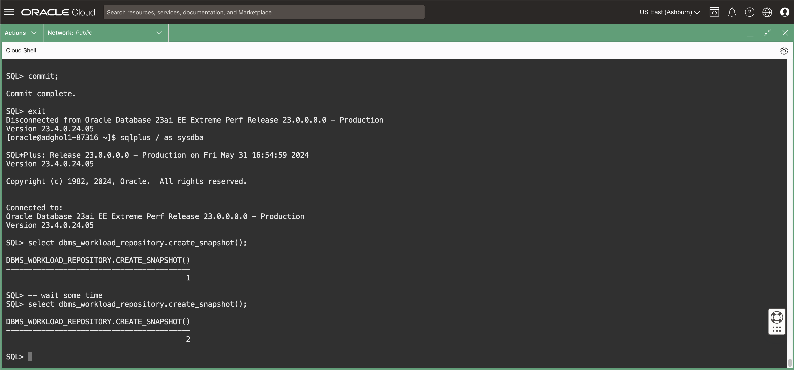
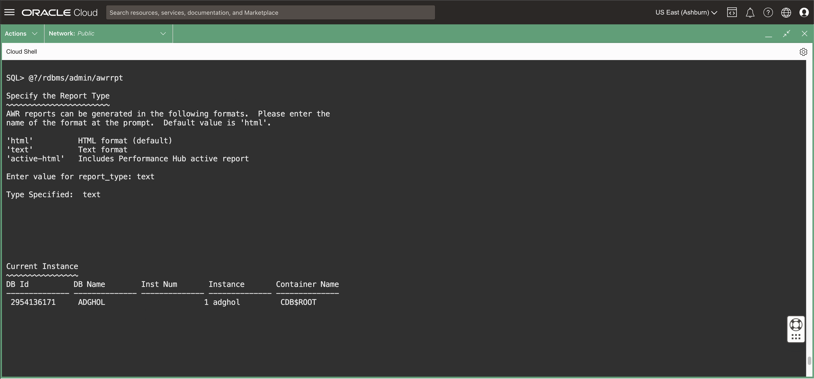
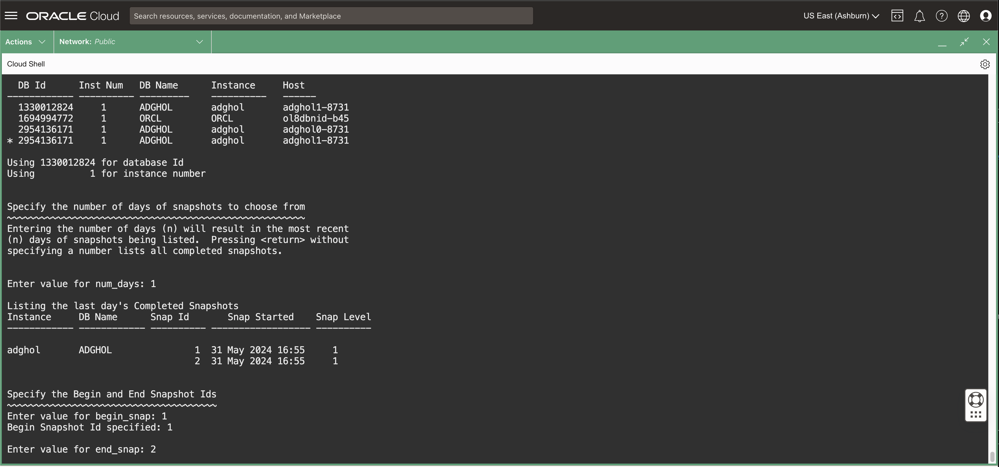
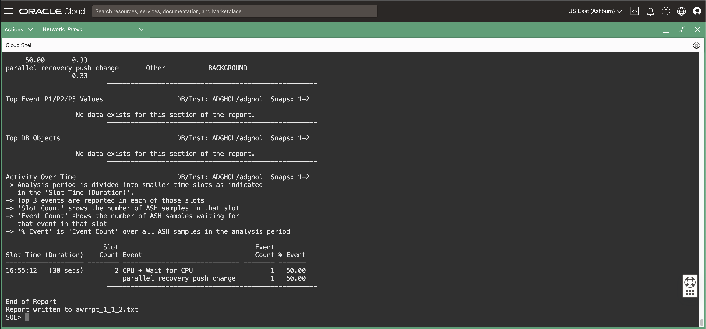
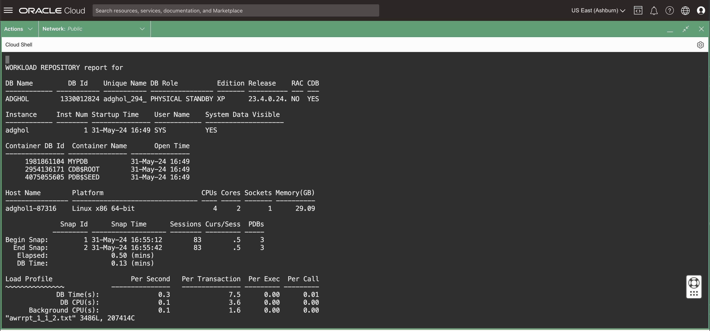

# Create AWR reports on the standby database
## Introduction
In real-world environments, it is common to require Automatic Workload Repository (AWR) reports for the standby databases to troubleshoot the redo apply throughput or the standby database performance in general.

Before Oracle Database 23ai, creating a snapshot on the standby database was impossible without configuring a SYS$UMF topology. The process was cumbersome and required manual intervention after a role change (e.g., a switch over). Oracle Database 23ai greatly simplifies the task by allowing the seamless creation of AWR snapshots!


Estimated Lab Time: 5 Minutes

[Oracle Active Data Guard 23ai](videohub:1_584ic86r)

### Requirements
To try this lab, you must have completed the following labs:
* [Prepare the database hosts](../prepare-host/prepare-host.md)
* [Prepare the databases](../prepare-db/prepare-db.md)
* [Configure Data Guard](../configure-dg/configure-dg.md)
* [Verify the Data Guard configuration](../verify-dg/verify-dg.md)

### Objectives
* Create two AWR snapshots
* Create an AWR report
* Review the report

## Task 1: Create two AWR snapshots

1. On the host where the standby database is running (adghol1), connect as SYSDBA and create an AWR snapshot:

    ```
    <copy>
    sql / as sysdba
    </copy>
    ```

    ```
    <copy>
    select dbms_workload_repository.create_snapshot();
    </copy>
    ```


2. Wait 1-2 minutes and create another snapshot:

    ```
    <copy>
    select dbms_workload_repository.create_snapshot();
    </copy>
    ```

    

## Task 2: Create an AWR report

1. Run the script `awrrpt.sql` to create an AWR report:
    ```
    <copy>
    @?/rdbms/admin/awrrpt
    </copy>
    ```

    

2. Select **text** as the report_type.
    You will notice that the DBID list shows a different DBID for the standby database. That is because the new DBID is generated synthetically to distinguish the primary snapshots from the standby snapshots.

3. The DBID and SID are pre-selected by the reporting tool, so you only need to specify the number of days (**1**), and the snapshots to generate the report (**1** and **2**):

    
    

## Task 3: Review the report

1. Exit SQLcl and open the AWR report for reading:
    ```
    <copy>
    exit
    less awrrpt_1_1_2.txt
    </copy>
    ```

    
    You will notice that the AWR report belongs to the standby database.
  

You have successfully created AWR reports for the standby database and completed the Data Guard overview workshop.

Good job!

- **Author** - Ludovico Caldara, Product Manager Data Guard, Active Data Guard and Flashback Technologies
- **Contributors** - Robert Pastijn
- **Last Updated By/Date** -  Ludovico Caldara, July 2025
