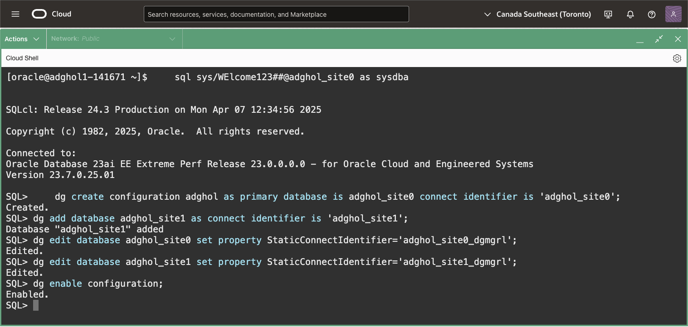

# Create the Data Guard configuration

## Introduction
In this lab, we configure Oracle Data Guard using the broker.

The broker automates all the aspects of a Data Guard topology, including setting up the redo transport, coordinating switchovers and failovers, monitoring the lags, etc.

For more information about the Data Guard broker, refer to the [broker documentation](https://docs.oracle.com/en/database/oracle/oracle-database/23/dgbkr/oracle-data-guard-broker-concepts.html#GUID-723E5B73-A350-4B2E-AF3C-5EA4EFC83966).

Estimated Lab Time: 5 Minutes

[Oracle Active Data Guard 23ai](videohub:1_te5deac3)

### Requirements
To try this lab, you must have completed:
* Lab 1: Prepare the database hosts
* Lab 2: Prepare the databases

### Objectives
- Configure Data Guard

## Task 1: Configure Data Guard

You should have two Cloud Shell tabs connected to the primary and secondary hosts, adghol0 and adghol1. Otherwise, follow the first steps of Lab 1 until you have both SSH connections established.

For this live lab, we will use the new `sql` (SQLcl) integration for Data Guard instead of the traditional `dgmgrl` command line. Starting with Oracle 21c, it is possible to use SQLcl to run most Data Guard commands. The commands are identical, except they require `DG` to be prepended before the actual Data Guard command.

1. From a terminal (**which one of the two hosts is irrelevant for this task**), connect to the primary database using the `sql` command line tool (SQLcl). We use the DGConnectIdentifier for that (the one that connects to the service named after the `db_unique_name`).

    ```
    <copy>
    sql sys/WElcome123##@adghol_site0 as sysdba
    </copy>
    ```
  
2. Create the configuration using the `DG CREATE CONFIGURATION` command. 
 
    ```
    <copy>
    dg create configuration adghol as primary database is adghol_site0 connect identifier is 'adghol_site0';
    </copy>
    ```
 
3. Add the standby database to the configuration using the `DG ADD DATABASE` command.

    ```
    <copy>
    dg add database adghol_site1 as connect identifier is 'adghol_site1';
    </copy>
    ```

4. Set the `StaticConnectIdentifier` for both databases.
    Although the broker builds the default static connect identifier if it's not explicitly configured, it is still a good practice to set it to ease the troubleshooting. In this lab, we need to set it to specify the FQDN of the hosts or the DNS will not solve the remote host.

    ```
    <copy>
    dg edit database adghol_site0 set property StaticConnectIdentifier='adghol_site0_dgmgrl';
     
    dg edit database adghol_site1 set property StaticConnectIdentifier='adghol_site1_dgmgrl';
    </copy>
    ```

5. Enable the configuration. This final command will set the required parameters and execute the required commands to start the redo shipping from the primary to the standby database and start the standby recovery:

    ```
    <copy>
    dg enable configuration;
    </copy>
    ```

    

    The command `dg show configuration` should report success. 

    ```
    <copy>
    dg show configuration;
    </copy>
    ```
    If you see the following warning:
    ```
    Warning: ORA-16854: apply lag could not be determined
    ```
    Try using `select DBMS_DG.HEALTH_CHECK from dual;` to force a refresh of the status cache.

    

    That means that the primary can contact the standby database with the `DGConnectIdentifier`, send the redo stream with no lag, and the standby database can apply it successfully without lag.

6. Exit from the SQLcl command line:
    
    ```
    <copy>
    exit
    </copy>
    ```

For more information about setting up Data Guard, read the [Data Guard Broker Documentation](https://docs.oracle.com/en/database/oracle/oracle-database/23/dgbkr/examples-using-data-guard-broker-DGMGRL-utility.html#GUID-D9018A5C-8C7A-4F6C-A7D3-B14E5AF7D4BC).

You have successfully created the Oracle Data Guard configuration. In the next lab, we will see how to monitor and alter the configuration.

## Acknowledgements

- **Author** - Ludovico Caldara, Product Manager Data Guard, Active Data Guard and Flashback Technologies
- **Contributors** - Robert Pastijn
- **Last Updated By/Date** -  Ludovico Caldara, July 2025
