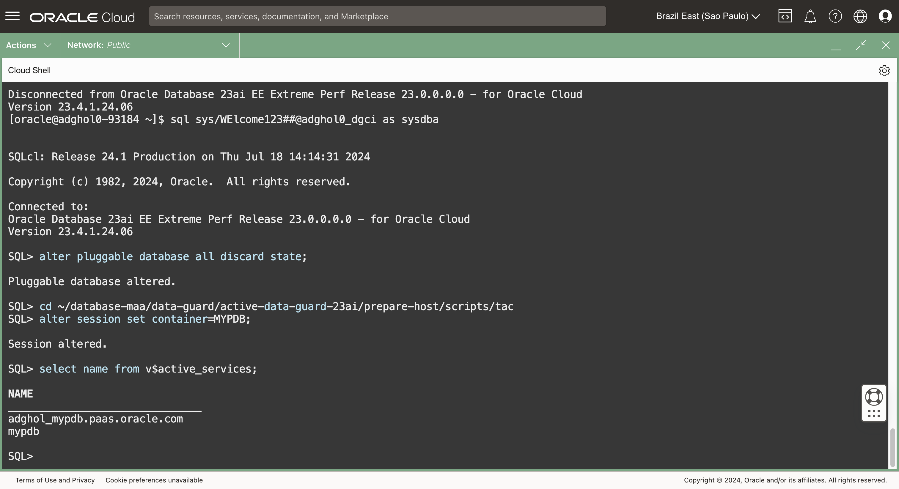
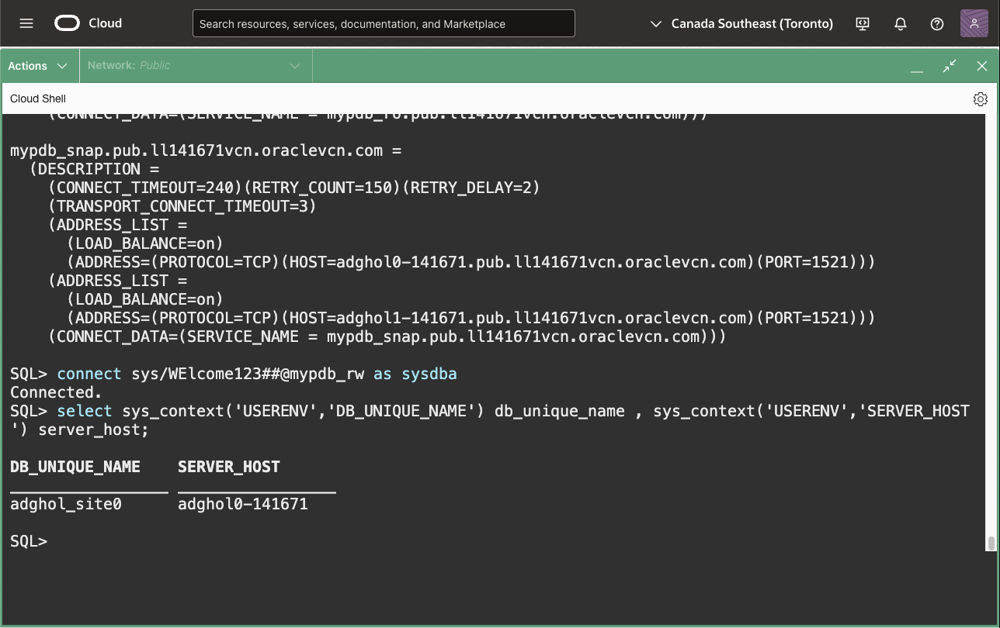

# Create role-based services

## Introduction

Once the Data Guard configuration is in place, it is crucial to connect to the databases using highly-available connection strings. Besides having multiple addresses, the connection strings must use specific application services (for example, the OLTP read-write service for the HR application). The read-write services should only be available on the primary database. If this is not the case, the application will have issues when connecting to a database that is not available for write operations.  Also, when having a highly-available connection string, it's possible to keep the same connection string across role changes (e.g. after a failover or a switchover), without reconfiguring the application connectivity.

The services that run only on databases with specific roles are called role-based services.

**Never configure your applications to connect to the default services!** Always use a role-based application service with high availability properties.

**Don't use any PDB saved states!** Saving a PDB's state will automatically open the PDB and the primary role services on the standby database when the PDB is opened there, which can lead to unwanted situations (e.g., the read/write application pointing to the standby database). Always discard the PDB states when configuring Data Guard.

Oracle recommends using use Oracle Clusterware or Oracle Restart for single-instance databases when configuring role-based services. For Oracle Real Application Clusters, Oracle Clusterware is a requirement. The Oracle Data Guard broker is aware of Oracle Clusterware, and delegates the stop and start of the instances to it. Also, Oracle Clusterware optimally manages the role-based services.

However, when Oracle Clusterware is unavailable (like on the database servers created for this lab), one has to manage role-based services differently. Typically, we use the `DBMS_SERVICES` package and startup triggers to stop and start the correct services, depending on the database role.

In this lab, we will create the services for the primary, physical standby, and snapshot standby roles, along with the trigger that stops and starts them. We will then test the connection to the primary service.


Estimated Lab Time: 5 Minutes

[Oracle Active Data Guard 23ai](videohub:1_b9sod4ej)

### Requirements
To try this lab, you must have successfully completed:
* Lab 1: Prepare the database hosts
* Lab 2: Prepare the databases
* Lab 3: Configure Data Guard
* Lab 4: Verify the Data Guard configuration

### Objectives
* Discard all PDB saved states
* Create and start the role-based services
* Review the connection strings and connect to the primary service

## Task 1: Discard all PDB saved states

1. From a terminal (**which one of the two hosts is irrelevant for this lab**), connect to the primary database as SYSDBA and discard any existing saved states.
    
    ```
    <copy>
    sql sys/WElcome123##@adghol_site0 as sysdba
    alter pluggable database all discard state;
    </copy>
    ```


## Task 2: Create and start the role-based services

1. Review the scripts that we'll use to create the services. We downloaded the scripts in the first lab. **Without quitting SQLcl, change the directory**:

    ```
    <copy>
    cd ~/database-maa/data-guard/active-data-guard-23ai/prepare-host/scripts/tac
    </copy>
    ```

2. Verify the existing services:

    ```
    <copy>
    alter session set container=MYPDB;
    select name from v$active_services;
    </copy>
    ```

    

3. Create and start the services using the scripts in the following order (we set the container again, just to be sure):

    ```
    <copy>
    set echo on
    alter session set container=MYPDB;
    @create_pdb_services.sql
    @create_pdb_service_trigger.sql
    @execute_pdb_service_trigger.sql
    </copy>
    ```
 
    
 
    The first script creates the service definition with high availability properties. Three services are created:
    * `MYPDB_RW` for the primary role
    * `MYPDB_RO` for the physical standby role
    * `MYPDB_SNAP` for the snapshot standby role
 
    The second script creates the startup trigger to start or stop the services depending on the database role.
 
    The last script executes the same code as the startup trigger, so the services are started without restarting the PDB.

4. After the execution, the read-write service is running with high availability properties:

    ```
    <copy>
    select name from v$active_services;
    select name, aq_ha_notification, commit_outcome, session_state_consistency, failover_restore from v$active_services;
    </copy>
    ```

    

## Task 3: Review the connection strings and connect to the primary service

1. Without quitting SQLcl, review the connection strings in `tnsnames.ora`

    ```
    <copy>
    ! cat $ORACLE_HOME/network/admin/tnsnames.ora
    </copy>
    ```

    

2. Connect to the read-write service and verify that you are connected to the primary database (also notice that we don't require "*from dual*" anymore):

    ```
    <copy>
    connect sys/WElcome123##@mypdb_rw as sysdba
    select sys_context('USERENV','DB_UNIQUE_NAME') db_unique_name , sys_context('USERENV','SERVER_HOST') server_host;
    </copy>
    ```

    

3. Exit the SQLcl command line:

    ```
    <copy>
    exit
    </copy>
    ```

For more information about creating services with DBMS_SERVICE, read the [PL/SQL Packages and Types Reference](https://docs.oracle.com/en/database/oracle/oracle-database/23/arpls/DBMS_SERVICE.html#GUID-C11449DC-EEDE-4BB8-9D2C-0A45198C1928).

You have successfully created, started, and connected to the application role-based service.

## Acknowledgements

- **Author** - Ludovico Caldara, Product Manager Data Guard, Active Data Guard and Flashback Technologies
- **Contributors** - Robert Pastijn
- **Last Updated By/Date** -  Ludovico Caldara, July 2025
