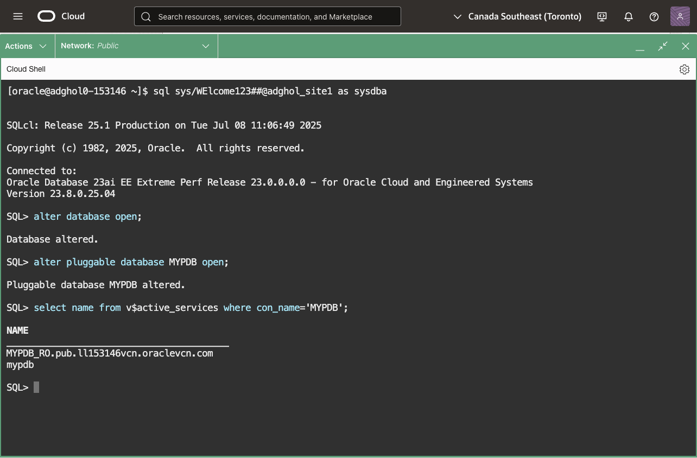
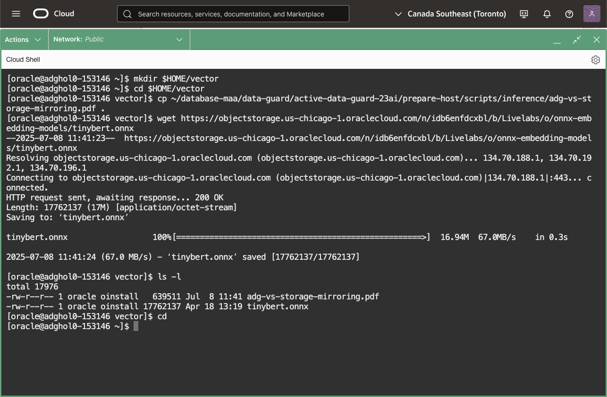
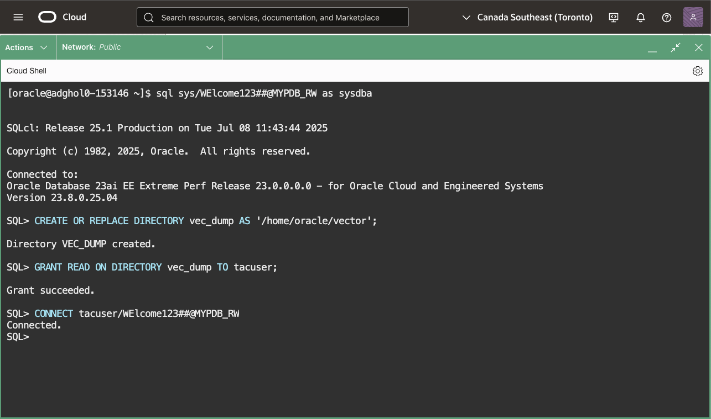
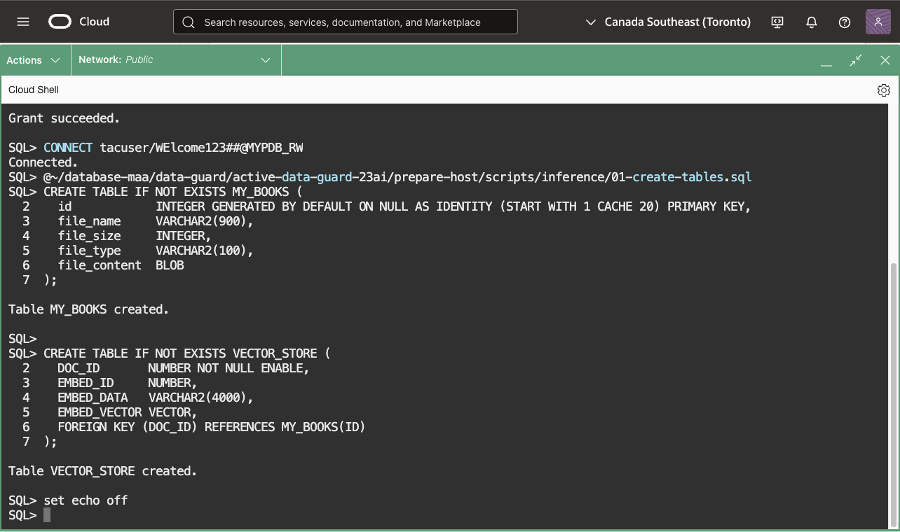
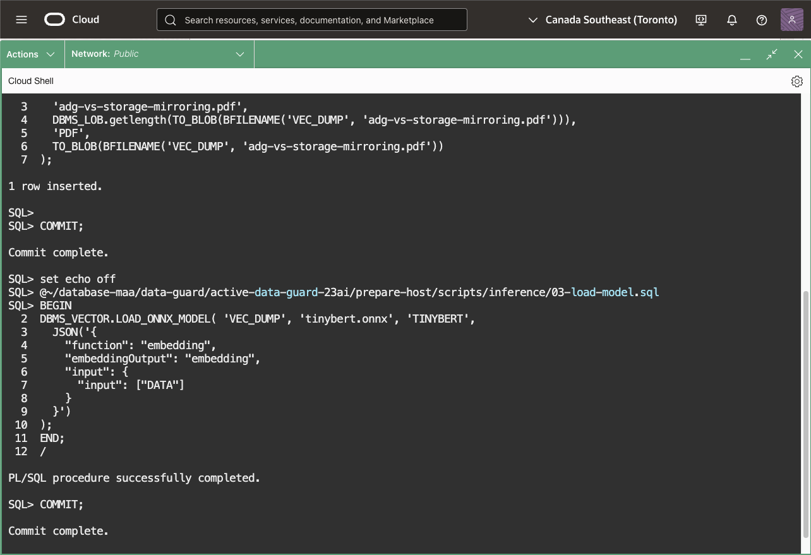
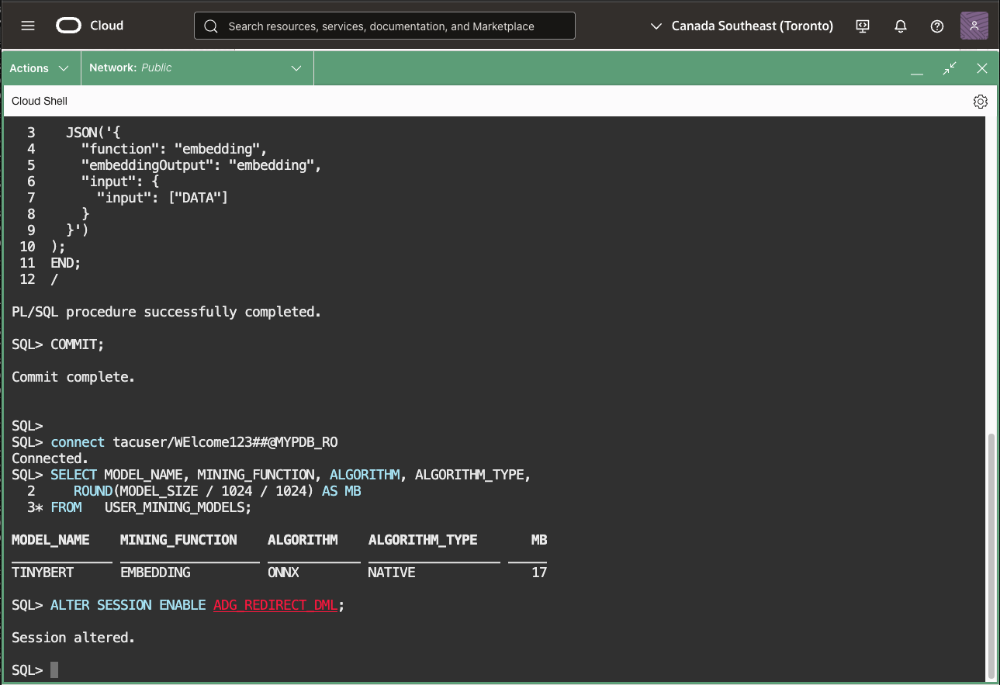
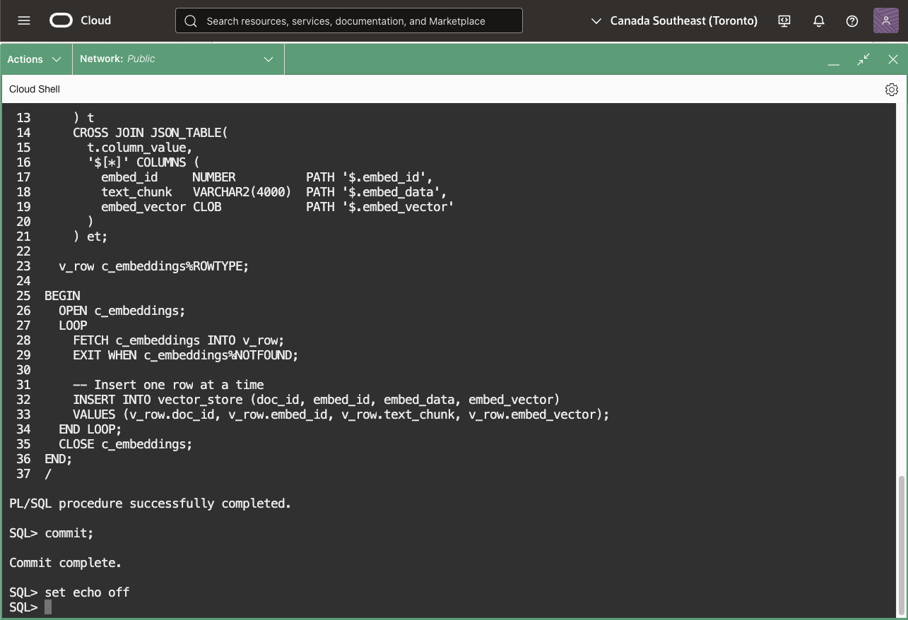
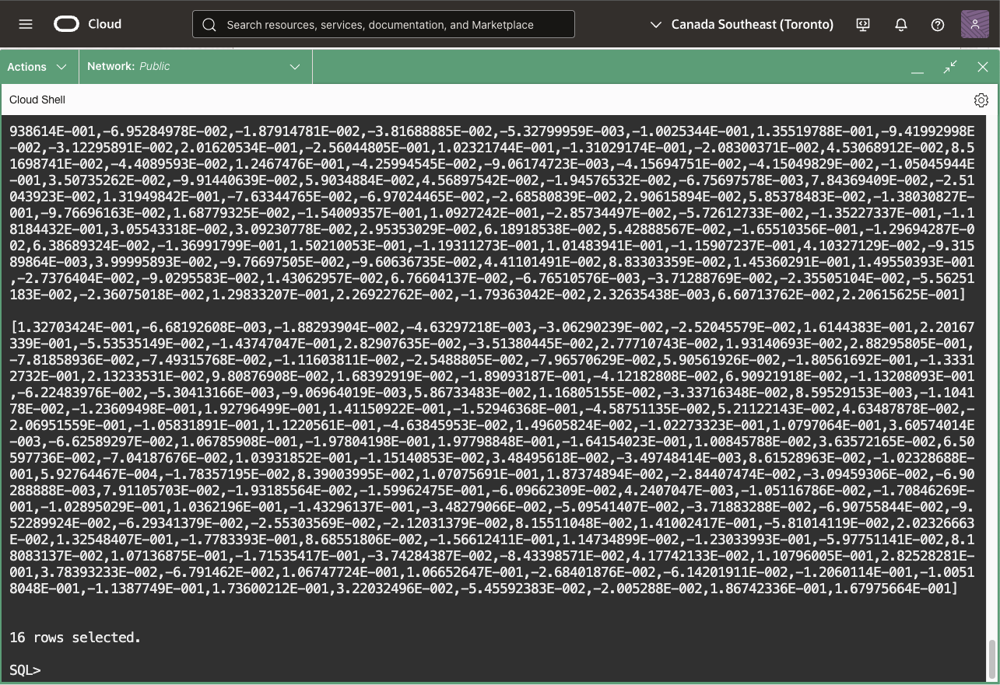

# AI Inference with Real-Time Query and DML Redirect

## Introduction

You have a copy of your production data on the standby database, so why not use it to offload some work from the primary database? 
A standby database can simultaneously be opened read-only and applying changes from the primary database. This feature is called **Real-Time Query** and is part of the Active Data Guard option.
Real-Time Query can offload read-only workloads like reports, read-only application modules, or even AI inferencing using ONNX models. If the transport is synchronous, the reading sessions can optionally get **consistent reads** of all the transactions committed on the primary database if they wish to do so.

Additionally, the standby database can automatically redirect write requests to the primary database in an ACID-compliant way, with the changes visible only in the privacy of the transaction started on the standby database.
This functionality broadens the use cases for the physical standby, including running read-write workloads directly on the standby database or generating embeddings and inserting them into `vector` columns. The **DML Redirection** feature also supports PL/SQL calls.

In this lab you will run Generative AI inference into an Oracle Database environment by importing an ONNX model on the primary database and executing it on the physical standby database. Leveraging Real-Time Query and DML redirection features, we offload the resource-intensive workload of generating embeddings to the standby database while seamlessly inserting the results into the primary database. This approach provides a scalable and efficient method for embedding generation without impacting the performance or availability of the primary database.

You will learn how to load an ONNX model in Oracle, use SQL to invoke the model on standby, and utilize DML redirection to write inference results to the primary database.

By the end of this lab, you'll have a working example of an AI-enabled Oracle setup that decouples inference from data ingestion, demonstrating how Active Data Guard excels in offloading complex tasks from the primary database.


Estimated Lab Time: 15 Minutes

[Oracle Active Data Guard 23ai](videohub:1_bv2fa9uo)

### Requirements
To try this lab, you must have completed the following labs:
* [Prepare the database hosts](../prepare-host/prepare-host.md)
* [Prepare the databases](../prepare-db/prepare-db.md)
* [Configure Data Guard](../configure-dg/configure-dg.md)
* [Verify the Data Guard configuration](../verify-dg/verify-dg.md)
* [Create role-based services](../create-services/create-services.md)

### Objectives

* Open the standby database and enable Real-Time Query
* Download a sample PDF and ONNX model.
* Load the document the primary database.
* Load the ONNX model on the primary database.
* Run embedding generation on the standby database.
* Run a vector search.

## Task 1: Open the standby database and enable Real-Time Query

1. From any terminal, connect to the standby database as SYSDBA.
    ```
    <copy>
    sql sys/WElcome123##@adghol_site1 as sysdba
    </copy>
    ```

2. Open the CDB and the PDB, then verify that the read-only service `MYPDB_RO` is started:
    ```
    <copy>
    alter database open;
    alter pluggable database MYPDB open;
    select name from v$active_services where con_name='MYPDB';
    exit
    </copy>
    ```

    

## Task 2: Download a sample PDF and ONNX model

1. On the primary database host `adghol0`, create the directory `$HOME/vector` and download the PDF and model:

    ```
    mkdir $HOME/vector
    cd $HOME/vector
    cp ~/database-maa/data-guard/active-data-guard-23ai/prepare-host/scripts/inference/adg-vs-storage-mirroring.pdf .
    wget https://objectstorage.us-chicago-1.oraclecloud.com/n/idb6enfdcxbl/b/Livelabs/o/onnx-embedding-models/tinybert.onnx
    cd
    ```

    

## Task 3: Load the document on the primary database
1. Connect to the primary database to create the directory and configure the permissions:

    ```
    <copy>
    sql sys/WElcome123##@MYPDB_RW as sysdba
    </copy>
    ```

    ```
    <copy>
    CREATE OR REPLACE DIRECTORY vec_dump AS '/home/oracle/vector';
    GRANT READ ON DIRECTORY vec_dump TO tacuser;
    </copy>
    ```

    

2. Connect as `tacuser` user and create the supporting tables:
    ```
    <copy>
    CONNECT tacuser/WElcome123##@MYPDB_RW
    </copy>
    ```


    ```
    <copy>
    @~/database-maa/data-guard/active-data-guard-23ai/prepare-host/scripts/inference/01-create-tables.sql
    </copy>
    ```

    

3. Insert the sample PDF document as a BLOB on the primary database:

    ```
    <copy>
    @~/database-maa/data-guard/active-data-guard-23ai/prepare-host/scripts/inference/02-load-pdf.sql
    <copy>
    ```

## Task 4: Load the ONNX model on the primary database

1. Still connected as `tacuser` on the primary database, load the model:

    ```
    <copy>
    @~/database-maa/data-guard/active-data-guard-23ai/prepare-host/scripts/inference/03-load-model.sql
    </copy>
    ```

    

## Task 5: Run embedding generation on the standby database.

1. Connect to the standby database and verify the model availability:

    ```
    <copy>
    connect tacuser/WElcome123##@MYPDB_RO
    </copy>
    ```

    ```
    <copy>
    SELECT MODEL_NAME, MINING_FUNCTION, ALGORITHM, ALGORITHM_TYPE,
       ROUND(MODEL_SIZE / 1024 / 1024) AS MB
    FROM   USER_MINING_MODELS;
    </copy>
    ```

2. Enable DML Redirection:
    ```
    <copy>
    ALTER SESSION ENABLE ADG_REDIRECT_DML;
    </copy>
    ```

    

3. Generate and insert the embeddings:

    ```
    <copy>
    @~/database-maa/data-guard/active-data-guard-23ai/prepare-host/scripts/inference/04-generate-embeddings.sql
    </copy>
    ```

    

    **Note:** The generation would work as an INSERT .. SELECT on the primary database. On the standby database, the `dbms_vector_chain.utl_to_embeddings` procedure returns a type `VARRAY_VECTOR_T` which is not yet supported by DML redirection. For that reason you see a separation of vector generation and insertion in a PL/SQL block.

## Task 6: Verify the inserted vectors

1. Query the table `embed_vector` to get the embeddings generated in the previous step.
    ```
    <copy>
    select vector_serialize(embed_vector) from vector_store;
    exit
    </copy>
    ```

    

For more information about Real-Time Query, read the [documentation](https://docs.oracle.com/en/database/oracle/oracle-database/23/sbydb/managing-oracle-data-guard-physical-standby-databases.html#GUID-D5FB88EC-799D-40E7-80E1-19474E3167E4).

You have successfully tested Real-Time Query, DML Redirection, and inferencing with ONNX models on the Standby Database!

- **Author** - Ludovico Caldara, Product Manager Data Guard, Active Data Guard and Flashback Technologies
- **Contributors** - Robert Pastijn;
- **Last Updated By/Date** -  Ludovico Caldara, July 2025
