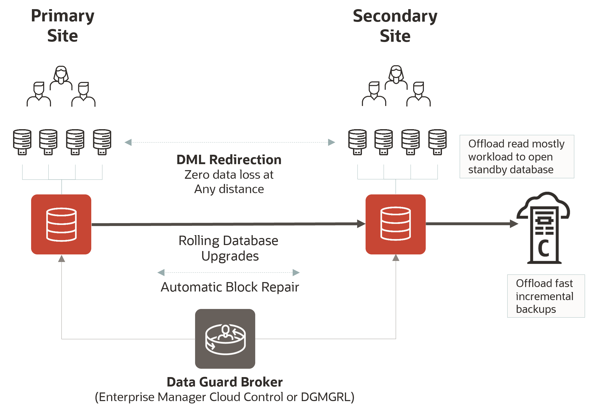

# Oracle Database 23ai Active Data Guard

## Introduction

Oracle Data Guard provides a comprehensive set of services that create, maintain, manage, and monitor one or more standby databases to enable production Oracle databases to survive disasters and data corruption.

Oracle Data Guard maintains these standby databases as copies of the production database. If the production database becomes unavailable due to a planned or an unplanned outage, Oracle Data Guard can switch any standby database to the production role, minimizing the downtime associated with the outage. Oracle Data Guard can be used with traditional backup, restoration, and cluster techniques to provide a high level of data protection and data availability.

Oracle (Active) Data Guard capabilities in Oracle Database 23ai further enhance its strategic objective of preventing data loss, providing high availability, eliminating risk, and increasing return on investment by enabling highly functional active disaster recovery systems that are simple to deploy and manage.

It accomplishes this by providing the management, monitoring, and automation software infrastructure to create and maintain one or more synchronized standby databases that protect Oracle data from failures, data corruption, human error, and disasters.

This workshop focuses on **Creating Active Data Guard 23ai in Oracle Cloud Infrastructure using Base Database Services (BaseDB)**.

Instead of leveraging the Control Plane automation to create the Data Guard association, this workshop will guide you through the manual creation of the standby database and the Data Guard configuration to provide a similar experience to on-premises and hybrid environments. Similarly, complex topologies that cannot be achieved with the Control Plane automation require manual Data Guard setup in the Oracle Cloud Infrastructure.

Estimated workshop time: 2 Hours for the fundamental labs (labs 1 to 10)

### Workshop Objectives
#### Fundamental labs
- Prepare the database hosts
- Prepare the databases
- Configure Data Guard
- Perform a Switchover
- Create role-based services
- Transparent Application Continuity
- Test your deployments with Snapshot Standby
- Activate Real-Time Query
- Use Real-Time Query and DML Redirection
- Create AWR reports on the standby database
- Automatic Block Repair

### Prerequisites
- An Oracle Cloud Account - Please view this workshop's LiveLabs landing page to see which environments are supported

<i>Note: If you have a **Free Trial** account, when your Free Trial expires, your account will be converted to an **Always Free** account. You cannot conduct Free Tier workshops unless the Always Free environment is available. **[Click here for the Free Tier FAQ page.](https://www.oracle.com/cloud/free/faq.html)**</i>

## Disclaimer
The following is intended to outline our general product direction. It is intended for information purposes only, and may not be incorporated into any contract. It is not a commitment to deliver any material, code, or functionality, and should not be relied upon in making purchasing decisions. The development, release, and timing of any features or functionality described for Oracle’s products remains at the sole discretion of Oracle.

## Acknowledgements

- **Author** - Ludovico Caldara, Product Manager Data Guard, Active Data Guard and Flashback Technologies
- **Contributors** - Robert Pastijn, Kamryn Vinson
- **Last Updated By/Date** -  Ludovico Caldara, July 2025
