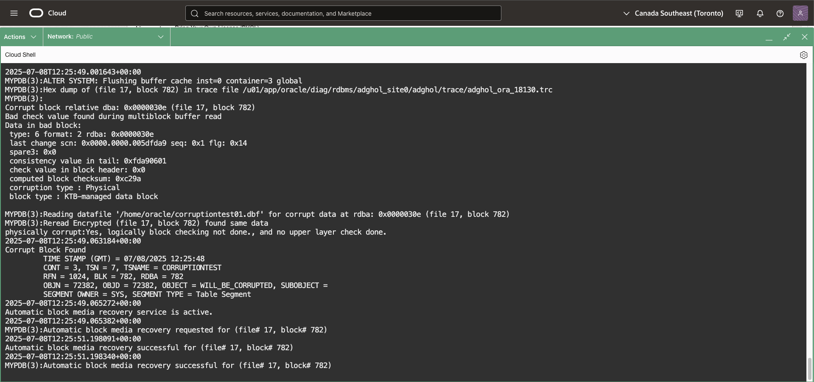
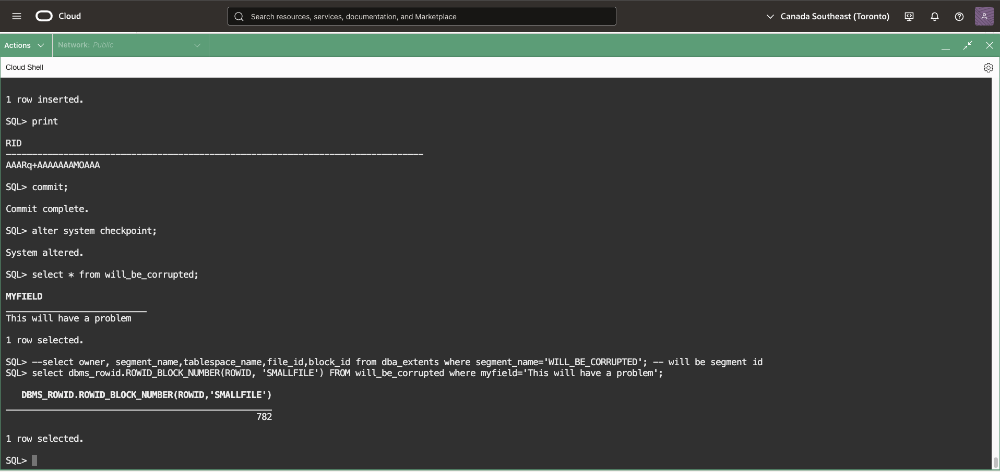
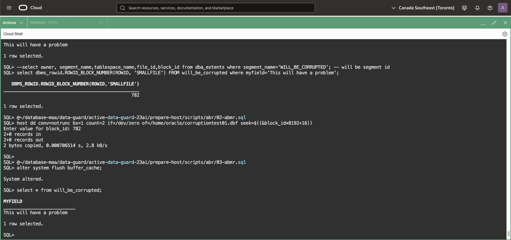

# Performing Automatic Block Repair

## Introduction
In this lab, we will see how Active Data Guard Automatic Block Repair works.

[Video explaining the basics of automatic block recovery](youtube:WFoTNPgKll4)

Block corruptions are a common source of database outages. A database block is corrupt when its content has changed from what Oracle Database expects to find. If not prevented or repaired, block corruption can raise errors, bring down the database, and possibly result in the loss of key business data.

Oracle Data Guard maintains a copy of your data in a standby database that is continuously updated with changes from the primary database. Data Guard validates all changes before it applies to the standby database, preventing physical corruptions that occur in the storage layer from causing data loss and downtime. When Active Data Guard is in use, the primary database automatically attempts to repair the corrupted block in real time by fetching a good version of the same block from an Active Data Guard physical standby database. This process works in both ways.

In this lab we will introduce a block corruption in the database and see Active Data Guard repairing it.

Estimated Lab Time: 10 Minutes

Watch the video below for a quick walk through of the lab.

[Video showing the steps to demonstrate automatic block recovery](videohub:1_nl43temm)


### Requirements
To try this lab, you must have completed the following labs:
* [Prepare the database hosts](../prepare-host/prepare-host.md)
* [Prepare the databases](../prepare-db/prepare-db.md)
* [Configure Data Guard](../configure-dg/configure-dg.md)
* [Verify the Data Guard configuration](../verify-dg/verify-dg.md)
* [Create role-based services](../create-services/create-services.md)
* [Use Real-Time Query and DML Redirection](../real-time-query-dml/real-time-query-dml.md)


### Objectives
* Setup the environment
* Corrupt the datafile
* Access the table
* Cleanup


## Task 1: Setup the environment

1. From the one of the tabs connected to the **primary** host `adghol0`, tail the alert log of the primary database:

    ````
    <copy> tail -f  /u01/app/oracle/diag/rdbms/${ORACLE_UNQNAME,,}/${ORACLE_SID}/trace/alert_${ORACLE_SID}.log</copy>
    ````

      

2. **On another tab**, **connect again to the primary host** `adghol0` (**the lab will not work otherwise!!**)
    ````
    <copy>
    ssh adghol0
    sudo su - oracle
    </copy>
    ````

    ````
    <copy>
    sql sys/WElcome123##@mypdb_rw as sysdba
    </copy>
    ````

3. Run the `01-abmr.sql` script.
    ````
    <copy>@~/database-maa/data-guard/active-data-guard-23ai/prepare-host/scripts/abr/01-abmr.sql</copy>
    ````

    This script creates a tablespace, adds a table in it and inserts a row. This will also return the rowID. Take a note of this number as you will need it in step 2, the step that will introduce corruption.

      

In this example, you will need to remember the number `782`. This might vary on your environment.

## Task 2: Corrupt the datafile
1. In the same session, execute script `02-abmr.sql`.
    This script will ask for a number. This is the number from the first step and we will use this to corrupt the datafile which the first script has created.

    ````
    <copy>
    @~/database-maa/data-guard/active-data-guard-23ai/prepare-host/scripts/abr/02-abmr.sql
    </copy>
    ````


At this point, we have a corrupt datafile, but the database is not aware of it yet.


## Task 3: Access the table

By accessing the table, Oracle will need to read the data. This demo database is not active, so it will be necessary to flush the caches before we access the table. That way, the data must be read from disk. This data is corrupt and without any error returned to the user, Active Data Guard will repair the corrupt block before returning the query result.

1. Use the script 03-abmr.sql for this.

    Check the Database alert log closely while executing this step.

    ````
    <copy>
    @~/database-maa/data-guard/active-data-guard-23ai/prepare-host/scripts/abr/03-abmr.sql
    </copy>
    ````

    In the sqlplus window we will see this

      

    The corrupted block has not generated any error to the user session. In the alert log from the primary database we notice that the automated block media recovery took place.

      

## Task 4: Cleanup

To clean this excercise, just drop the tablespace.
1. In the sqlplus window still connected to the PDB, use this command:

    ````
    <copy>
    drop tablespace corruptiontest including contents and datafiles;
    exit
    </copy>
    ````

You have now seen Active Data Guard Automatic Block media recovery working. You may now [proceed to the next lab](#next).


## Acknowledgements

- **Author** - Ludovico Caldara, Product Manager Data Guard, Active Data Guard and Flashback Technologies
- **Contributors** - Robert Pastijn, Ludovico Caldara, Suraj Ramesh
- **Last Updated By/Date** -  Ludovico Caldara, July 2025
