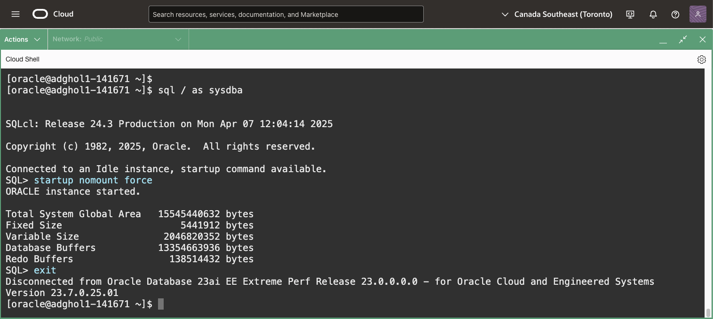

# Prepare the databases for Data Guard

## Introduction
In this lab, we prepare the databases for the Data Guard configuration.

This lab uses a manual Data Guard configuration on top of two OCI Base Database Service systems. The first one, on host `adghol0`, is the primary database. We will wipe out the second one on host `adghol1` to restore it as a standby database.

Estimated Lab Time: 15 Minutes

### Requirements
To try this lab, you must have successfully completed **Lab 1: Prepare the database hosts**

### Objectives
- Prepare the primary database for Data Guard
- Clean-up the standby database system
- Prepare the connection strings
- Duplicate the database for standby
- Finish the standby database configuration

## Task 1: Prepare the primary database for Data Guard

You should have two Cloud Shell tabs connected to the primary and secondary hosts, adghol0 and adghol1. If you don't, follow the first steps of Lab 1 until you have both SSH connections established.
Make sure you are using the `oracle` user.

1. On host `adghol0`, get the `DB_UNIQUE_NAME` of the primary database. On OCI BaseDB, the environment variable `$ORACLE_UNQNAME` is set to the correct value:

  ```
  <copy>echo $ORACLE_UNQNAME</copy>
  ```

  Note its value down as you will require it many times during this workshop.

  **From now on, we'll refer to its value as `ADGHOL0_UNIQUE_NAME`.**

2. Connect to the Data Guard broker client command-line (dgmgrl) using the sys password:

  ```
  <copy>dgmgrl sys/WElcome123##</copy>
  ```

3. Execute the following command to prepare the primary database for its Data Guard role.

  Make sure to change the value of `ADGHOL0_UNIQUE_NAME` accordingly.

  ```
  <copy>
  prepare database for data guard
  with db_unique_name is ADGHOL0_UNIQUE_NAME
  db_recovery_file_dest_size is "200g"
  db_recovery_file_dest is "/u03/app/oracle/fast_recovery_area"
  restart;
  </copy>
  ```

  

  This new 23ai command checks and sets many required and recommended parameters and settings, including:
  * SPFILE preparation
  * Recommended parameters
  * Archivelog mode
  * Force logging
  * Flashback logging
  * RMAN archivelog deletion policy
  * Standby redo logs (SRLs)
  * DB_UNIQUE_NAME

  Because some of these changes might require a restart of the instance, we specified the `restart` keyword to confirm we agree to do that, if required.

  For more information, [refer to the documentation](https://docs.oracle.com/en/database/oracle/oracle-database/23/dgbkr/oracle-data-guard-broker-commands.html#GUID-46F6267D-E3CF-4544-AC47-A22D9704BAF2).


## Task 2: Clean-up the standby database system

1. On host `adghol1`, get the DB_UNIQUE_NAME of the standby database. On OCI BaseDB, the environment variable `$ORACLE_UNQNAME` is set to the correct value:

  ```
  <copy>echo $ORACLE_UNQNAME</copy>
  ```

  Note its value down as you will require it many times during this workshop.

  **From now on, we'll refer to its value as ADGHOL1_UNIQUE_NAME.**

2. Connect as SYSDBA and shutdown the current database (make sure you are on host `adghol1`):

  ```
  <copy>sqlplus / as sysdba</copy>
  ```
  then:
  ```
  <copy>
  shutdown abort
  exit
  </copy>
  ```

3. Remove data files, redo logs, and control files. We will restore everything from the primary database:

  ```
  <copy>
  rm -rf /u02/app/oracle/oradata/${ORACLE_UNQNAME,,}/${ORACLE_UNQNAME^^}/*
  rm -rf /u03/app/oracle/redo/${ORACLE_UNQNAME^^}/*
  rm -f /u02/app/oracle/oradata/${ORACLE_UNQNAME,,}/control01.ctl /u03/app/oracle/fast_recovery_area/${ORACLE_UNQNAME,,}/control02.ctl
  </copy>
  ```

  

## Task 3: Prepare the connection strings

In this workshop, we use easy connect (EZCONNECT) as a naming method in the Data Guard configuration. Using EZCONNECT has the advantage that it does not require modifications to the `tnsnames.ora` or other naming methods like LDAP.

While `tnsnames.ora` has some advantages (highly-available and complex connection strings with simple asliases), EZCONNECT is quicker to configure and easier to troubleshoot in case of problems.

For a Data Guard configuration, we need two connection strings for each member: the `DGConnectIdentifier`, and the `StaticConnectIdentifier`.

The `DGConnectIdentifier` must connect to the service named after the database `db_unique_name`, and it is used by almost every connection made by the Data Guard broker.

The `StaticConnectIdentifier` connects to the static service registered with the listener (the step that we did in Lab 1), and by default is named `db_unique_name_DGMGRL`.

1. On the first host (adghol0), execute the following command to build the `DGConnectIdentifier` of the primary database:

 ```
 <copy>
 # GET THE StaticConnectIdentifier (ADGHOL0_DGCI)
 echo ${HOSTNAME}.$(dnsdomainname):1521/${ORACLE_UNQNAME}.$(dnsdomainname)
 </copy>
 ```
 The output will be similar to this:
 ```
 adghol0-1234.ll1234pubsubnt.ll1234vcn.oraclevcn.com:1521/adghol_53k_lhr.ll1234pubsubnt.ll1234vcn.oraclevcn.com
 ```
 Note it down for future reference. **We will refer to it as ADGHOL0_DGCI** ( **DGC**onnect**I**dentifier).

1. Repeat the command, but using _DGMGRL this time, to build the `StaticConnectIdentifier` of the primary database:

 ```
 <copy>
 # GET THE StaticConnectIdentifier (ADGHOL0_SCI)
 echo ${HOSTNAME}.$(dnsdomainname):1521/${ORACLE_UNQNAME}_DGMGRL.$(dnsdomainname)
 </copy>
 ```
 The output will be similar to this:
 ```
 adghol0-1234.ll1234pubsubnt.ll1234vcn.oraclevcn.com:1521/adghol_53k_lhr_DGMGRL.ll1234pubsubnt.ll1234vcn.oraclevcn.com
 ```
 Note it down for future reference. **We will refer to it as ADGHOL0_SCI** ( **S**tatic**C**onnect**I**dentifier).

  

1. Repeat the two above commands on the second host to get the connect identifiers for the standby database:

 ```
 <copy>
 # GET THE DGConnectIdentifier (ADGHOL1_DGCI)
 echo ${HOSTNAME}.$(dnsdomainname):1521/${ORACLE_UNQNAME}.$(dnsdomainname)

 # GET THE StaticConnectIdentifier (ADGHOL1_SCI)
 echo ${HOSTNAME}.$(dnsdomainname):1521/${ORACLE_UNQNAME}_DGMGRL.$(dnsdomainname)
 </copy>
 ```
 Note them down for future reference. **We will refer to them as ADGHOL1_DGCI and ADGHOL1_SCI**.

More information about Easy Connect and naming methods:
* [Database Net Services Administrator's Guide - Choosing a Naming Method](https://docs.oracle.com/en/database/oracle/oracle-database/23/netag/identifying-and-accessing-database.html#GUID-E15FE9BE-EC02-4349-A63A-E9229C05395A)

More information about Data Guard `DGConnectIdentifier` and `StaticConnectIdentifier`:
* [Oracle Data Guard Broker Properties - DGConnectIdentifier](https://docs.oracle.com/en/database/oracle/oracle-database/23/dgbkr/oracle-data-guard-broker-properties.html#GUID-32FF0A08-67DA-41AC-8BE8-0596CAF130BA)
* [Oracle Data Guard Broker Properties - StaticConnectIdentifier](https://docs.oracle.com/en/database/oracle/oracle-database/23/dgbkr/oracle-data-guard-broker-properties.html#GUID-2F938A76-A178-4A35-A629-F67F34212CAB)

## Task 4: Duplicate the database for standby

1. On node `adghol1`, where we prepare the standby database, start the standby instance:

  ```
  <copy>sqlplus / as sysdba</copy>
  ```
  then:
  ```
  <copy>
  startup nomount force
  exit
  </copy>
  ```

  

2. With the Recovery Manager (RMAN) command-line, connect to the primary and standby instances.

  For the standby instance, we must use the static service registered with the listener, because the instance is in nomount, and no other services are available yet.

  In the command, replace `ADGHOL0_DGCI` and `ADGHOL1_SCI` with the values you noted earlier.

  ```
  <copy>
  rman \
  target sys/WElcome123##@ADGHOL0_DGCI \
  auxiliary=sys/WElcome123##@ADGHOL1_SCI
  </copy>
  ```

  Example:

  ```
  rman \
  target sys/WElcome123##@adghol0-1234.ll1234pubsubnt.ll1234vcn.oraclevcn.com:1521/adghol_53k_lhr.ll1234pubsubnt.ll1234vcn.oraclevcn.com \
  auxiliary=sys/WElcome123##@adghol1-1234.ll1234pubsubnt.ll1234vcn.oraclevcn.com:1521/adghol_p4n_lhr_DGMGRL.ll1234pubsubnt.ll1234vcn.oraclevcn.com
  ```

  

1. Run the duplicate command. The `FOR STANDBY` clause restores a copy of the control file for the standby role.

  ```
  <copy>
  run {
  allocate channel c1 device type disk;
  allocate auxiliary channel a1 device type disk;
  allocate auxiliary channel a2 device type disk;
  DUPLICATE TARGET DATABASE  FOR STANDBY FROM ACTIVE DATABASE USING BACKUPSET NOFILENAMECHECK;
  }
  </copy>
  ```
  

  Then exit from the RMAN command line:
  ```
  <copy>exit</copy>
  ```

## Task 5: Finish the standby database configuration

1. Connect to the freshly duplicated standby database and clear the online and standby redo logs:

  ```
  <copy>sqlplus / as sysdba </copy>
  ```

  ```
  <copy>
  select * from v$standby_log;
  alter database clear logfile group 1, group 2, group 3;
  alter database clear logfile group 4, group 5, group 6;
  </copy>
  ```

  

  The standby redo logs (sometimes shortened as SRLs) are fundamental to receive the current redo stream from the primary database.

  

1. Set some recommended parameters:

  ```
  <copy>
  alter system set dg_broker_start=true scope=spfile;
  alter system set db_files=1024 scope=spfile;
  alter system set log_buffer=256M scope=spfile;
  alter system set db_lost_write_protect=typical scope=spfile;
  alter system set db_block_checksum=typical scope=spfile;
  alter system set db_flashback_retention_target=120 scope=spfile;
  alter system set parallel_threads_per_cpu=1 scope=spfile;
  alter system set standby_file_management=auto scope=spfile;
  </copy>
  ```

1. Restart the instance to take the new parameters:

  ```
  <copy>
  startup force mount
  exit
  </copy>
  ```

You have successfully duplicated and configured the standby database for Data Guard. In the next lab, we will create and verify the Data Guard configuration.

## Acknowledgements

- **Author** - Ludovico Caldara, Product Manager Data Guard, Active Data Guard and Flashback Technologies
- **Contributors** - Robert Pastijn
- **Last Updated By/Date** -  Ludovico Caldara, December 2023
