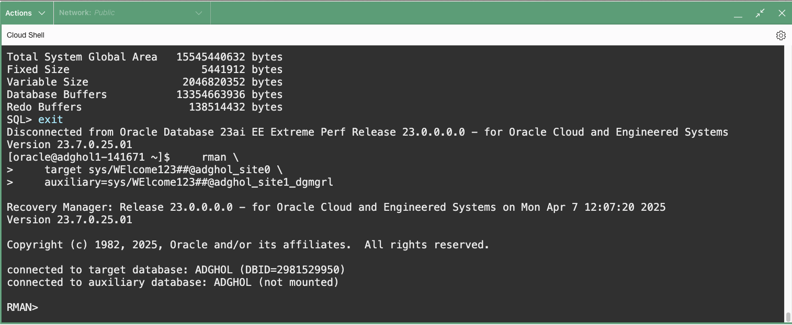
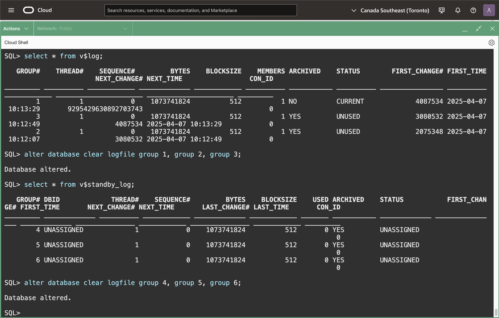

# Prepare the databases for Data Guard

## Introduction
In this lab, we prepare the databases for the Data Guard configuration.

This lab uses a manual Data Guard configuration on top of two OCI Base Database Service systems. The first one, on host `adghol0`, is the primary database. We will wipe out the second one on host `adghol1` to restore it as a standby database.

Estimated Lab Time: 15 Minutes

[Oracle Active Data Guard 23ai](videohub:1_qae0kglg)

### Requirements
To try this lab, you must have completed **Lab 1: Prepare the database hosts**

### Objectives
- Prepare the primary database for Data Guard
- Clean up the standby database system
- Duplicate the database for standby
- Finish the standby database configuration

## Task 1: Prepare the primary database for Data Guard

You should have two Cloud Shell tabs connected to the primary and secondary hosts, adghol0 and adghol1. Otherwise, follow the first steps of Lab 1 until you have both SSH connections established.
Make sure you are using the `oracle` user.

1. **On the primary host** `adghol0`, connect to the Data Guard broker client command line (dgmgrl). We use **SQLcl** for most steps, but some, including `PREPARE DATABASE`, still require `dgmgrl`.

    ```
    <copy>
    # to execute on ADGHOL0
    dgmgrl /
    </copy>
    ```

3. Execute the following command to prepare the primary database for its Data Guard role.

    ```
    <copy>
    prepare database for data guard
    with db_unique_name is adghol_site0
    db_recovery_file_dest_size is "200g"
    db_recovery_file_dest is "/u03/app/oracle/fast_recovery_area"
    restart;
    </copy>
    ```

    

    This new 23ai command checks and sets many required and recommended parameters and settings, including:
    * SPFILE preparation
    * Recommended parameters
    * Archivelog mode
    * Force logging
    * Flashback logging
    * RMAN archivelog deletion policy
    * Standby redo logs (SRLs)
    * `DB_UNIQUE_NAME`

    Because some of these changes require a restart of the instance, we specified the `restart` keyword to confirm we agree to do that, if required.

    For more information, [refer to the documentation](https://docs.oracle.com/en/database/oracle/oracle-database/23/dgbkr/oracle-data-guard-broker-commands.html#GUID-46F6267D-E3CF-4544-AC47-A22D9704BAF2).

4. Exit the `dgmgrl` command-line:
    
    ```
    <copy>exit</copy>
    ```


## Task 2: Clean up the standby database system

1. **On the secondary host** `adghol1`, connect as SYSDBA and shut down the current database (make sure you are on host `adghol1`):

    ```
    <copy>
    # to execute on ADGHOL1
    sql / as sysdba
    </copy>
    ```
    Then:
    ```
    <copy>
    shutdown abort
    exit
    </copy>
    ```

3. Remove data files, redo logs, and control files. We will restore everything from the primary database:

    ```
    <copy>
    rm -rf /u02/app/oracle/oradata/${ORACLE_UNQNAME,,}/${ORACLE_UNQNAME^^}/*
    rm -rf /u03/app/oracle/redo/${ORACLE_UNQNAME^^}/*
    rm -f /u02/app/oracle/oradata/${ORACLE_UNQNAME,,}/control01.ctl /u03/app/oracle/fast_recovery_area/${ORACLE_UNQNAME,,}/control02.ctl
    </copy>
    ```

    

## Task 3: Duplicate the database for standby

Oracle recommends using `RESTORE FROM SERVICE` to instantiate the standby database. That has the advantage of letting users retry the restore operation without restarting the copy of the data files that have already been restored. However we use the `DUPLICATE` command in this lab for simplicity.

1. **On the secondary host** `adghol1`, where we prepare the standby database, start the standby instance:

    ```
    <copy>
    # to execute on ADGHOL1
    sql / as sysdba
    </copy>
    ```
    Then:
    ```
    <copy>
    startup nomount force
    exit
    </copy>
    ```

    

2. Connect to the primary and standby instances with the Recovery Manager (RMAN) command line, 

    For the standby instance, we must use the static service registered with the listener because the instance is in nomount, and no other services are available yet.

    ```
    <copy>
    rman \
    target sys/WElcome123##@adghol_site0 \
    auxiliary=sys/WElcome123##@adghol_site1_dgmgrl
    </copy>
    ```

    If you have any issues with the connection, verify that the connection strings can be resolved. We created them in the previous lab.

    

3. Run the duplicate command. The `FOR STANDBY` clause restores a copy of the control file for the standby role.

    ```
    <copy>
    run {
    allocate channel c1 device type disk;
    allocate auxiliary channel a1 device type disk;
    allocate auxiliary channel a2 device type disk;
    DUPLICATE TARGET DATABASE  FOR STANDBY FROM ACTIVE DATABASE USING BACKUPSET NOFILENAMECHECK;
    }
    </copy>
    ```
    

    Then exit the RMAN command line:
    ```
    <copy>exit</copy>
    ```

    For more information about the DUPLICATE command, [refer to the documentation](https://docs.oracle.com/en/database/oracle/oracle-database/23/rcmrf/DUPLICATE.html).

## Task 4: Finish the standby database configuration

1. Connect to the freshly duplicated standby database and clear the online and standby redo logs:

    ```
    <copy>
    # to execute on ADGHOL1
    sql / as sysdba
    </copy>
    ```

    ```
    <copy>
    select * from v$log;
    alter database clear logfile group 1, group 2, group 3;
    select * from v$standby_log;
    alter database clear logfile group 4, group 5, group 6;
    </copy>
    ```

    

    The standby redo logs (sometimes shortened as SRLs) are fundamental for receiving the current redo stream from the primary database.

    

2. Set some recommended parameters:

    ```
    <copy>
    alter system set dg_broker_start=true scope=spfile;
    alter system set db_files=1024 scope=spfile;
    alter system set log_buffer=256M scope=spfile;
    alter system set db_lost_write_protect=typical scope=spfile;
    alter system set db_block_checksum=typical scope=spfile;
    alter system set db_flashback_retention_target=120 scope=spfile;
    alter system set parallel_threads_per_cpu=1 scope=spfile;
    alter system set standby_file_management=auto scope=spfile;
    </copy>
    ```

3. Restart the instance to take the new parameters:

    ```
    <copy>
    startup force mount
    exit
    </copy>
    ```
    

You have successfully duplicated and configured the standby database for Data Guard. In the next lab, we will create and verify the Data Guard configuration.

## Acknowledgements

- **Author** - Ludovico Caldara, Product Manager Data Guard, Active Data Guard and Flashback Technologies
- **Contributors** - Robert Pastijn
- **Last Updated By/Date** -  Ludovico Caldara, July 2025
