# Prepare the hosts for Data Guard

## Introduction
In this lab, we connect to the database hosts and do some preliminary preparation for the Data Guard configuration.

Estimated Lab Time: 15 Minutes

[Oracle Active Data Guard 23ai](videohub:1_1cq91vn7)

### Objectives
- Prepare the connection to the database hosts
- Prepare the primary database host
- Prepare the standby database host
- Copy the TDE wallet and password file

## Task 1: Prepare the connection to the database hosts

1. Open up the menu in the left-hand corner.  

2. From the menu, select **Oracle Database**, then **Oracle Base Database Service**.

   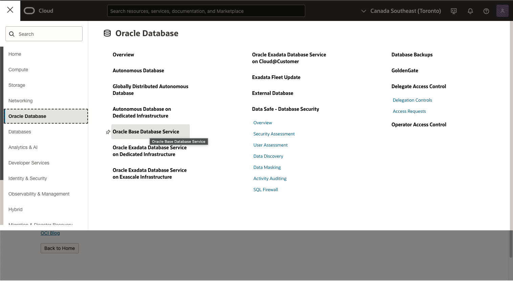

3. In the List Scope section on the left, enter the first part of the compartment assigned to you in the Search field, then click the compartment name.
    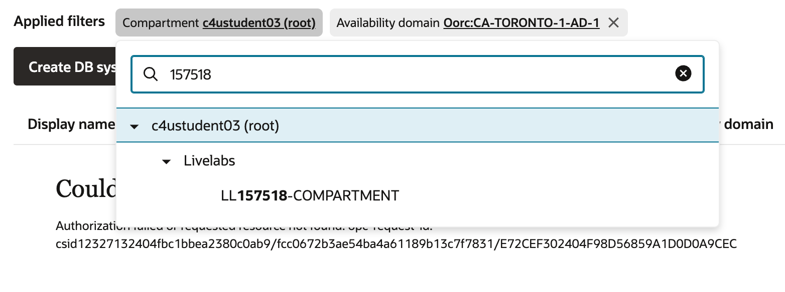
    
   There are two Database Systems created for you. The system prefixed with `adghol0` is the primary database, and the system prefixed with `adghol1` is the secondary database that will become the standby database.
   
4. Click the name of the primary database (`adghol0`).
    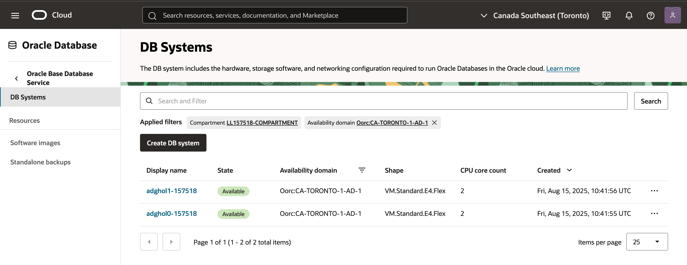
5. Scroll down on the page and click on **Nodes(1)** to find the host's **Public IP Address**.
    **Copy the address on the clipboard and make sure to have this information noted down for later.**
    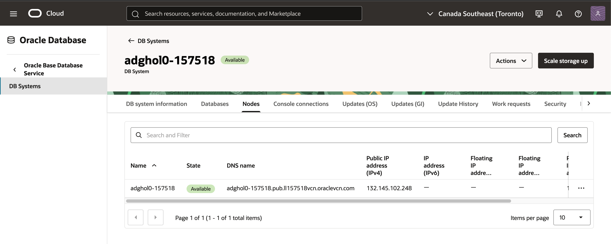

6. Navigate back to the **Oracle Base Database Service** 
    

7. click the name of the secondary database (`adghol1`).
    

8. Scroll down on the page and click on **Nodes(1)** to find the host's **Public IP Address**.
    **Copy the address on the clipboard and make sure to have this information noted down for later.**
    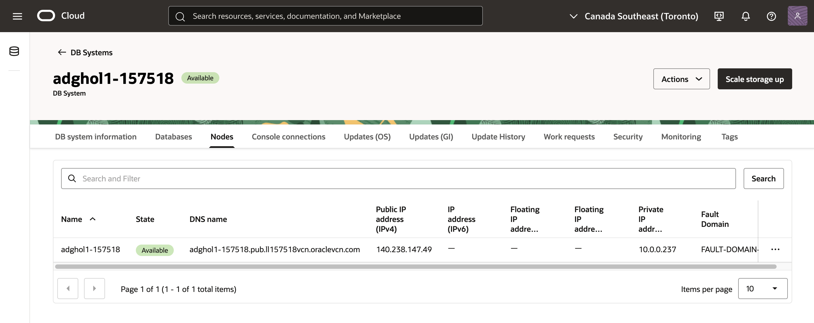

9. Open the **Cloud Shell** using the icon next to the region.
    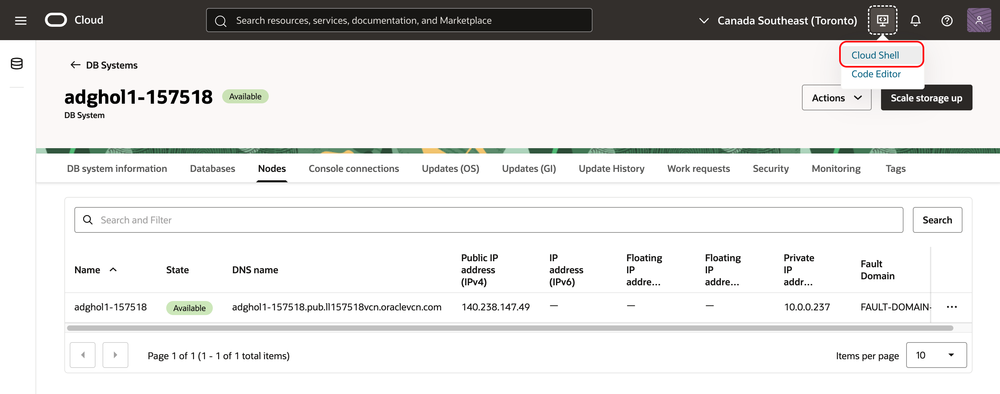
  The Cloud Shell opens and shows the **prompt**.
  You can maximize it for a better experience. You can enter `N` if it asks to run a tutorial.

10. Download the SSH keys using wget. We employ a LiveLabs-generic SSH key pair to streamline the environment provisioning process, saving you valuable time. This approach allows you to commence the hands-on exercises promptly without the need to worry about initial configurations.
    ````
    <copy>
    wget https://objectstorage.us-ashburn-1.oraclecloud.com/p/pFCXNoopaTHpNpK2n1eyvnzzVi4bcDGN5wCf7ZJA-Le-BwUnsibXb1SQT-VdPF9x/n/c4u04/b/events/o/id_rsa_livelabs.zip
    </copy>
    ````

11. Unzip the archive
    ```
    <copy>
    unzip id_rsa_livelabs.zip
    </copy>
    ```

    You will find the following files:

      * id\_rsa\_livelabs (private key)
      * id\_rsa\_livelabs.pub (public key)
      * id\_rsa\_livelabs.ppk (private key in Putty format - for Windows only)

   
12. Change the permission of the private key to `0600`:
    ````
    <copy>chmod 600 id_rsa_livelabs</copy>
    ````

13. Prepare the SSH config file to connect to the hosts.
    ````
    <copy>
    mkdir ~/.ssh
    </copy>
    ````
    **Replace IP_ADDRESS0 and IP_ADDRESS1 with the IPs that you noted down earlier**.
    ````
    <copy>
    bash -c "cat <<EOF > ~/.ssh/config
    Host adghol0
        Hostname \$0
        User opc
        IdentityFile ~/id_rsa_livelabs

    Host adghol1
        Hostname \$1
        User opc
        IdentityFile ~/id_rsa_livelabs
    EOF" IP_ADDRESS0 IPADDRESS1
    </copy>
    ````
15. Verify the SSH config file content:
    ````
    <copy>
    cat ~/.ssh/config
    </copy>
    ````
    it should look similar to this (with the correct IP addresses):
    ````
    Host adghol0
    Hostname 129.147.41.182
        User opc
        IdentityFile ~/id_rsa_livelabs
    
    Host adghol1
        Hostname 168.74.74.51
        User opc
        IdentityFile ~/id_rsa_livelabs
    ````
16. Try the connection to the primary host:
    ````
    <copy>
    ssh adghol0
    </copy>
    ````

    The first connection will ask:
    ````
    Are you sure you want to continue connecting (yes/no/[fingerprint])? 
    ````

    Type `yes`.
    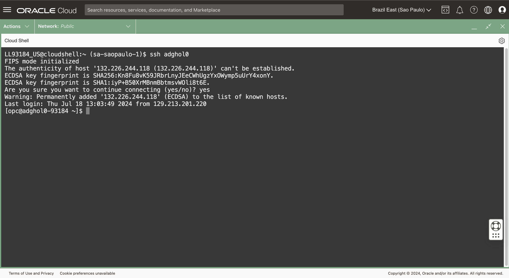

   You should be connected to the primary database host.

## Task 2: Prepare the primary database host

1. As the `opc` user on `adghol0`, install git that we will use later:

    ````
    <copy>sudo dnf install -y git</copy>
    ````
   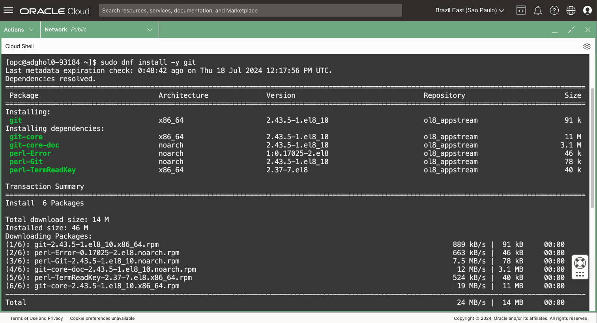

2. Become the `oracle` user:

    ```
    <copy>sudo su - oracle</copy>
    ```

3. Download the helper scripts using git, we will use them for the configuration and during some labs during the workshop:

    ```
    <copy>
    git clone -b main -n --filter=tree:0 --depth=1 https://github.com/oracle-livelabs/database-maa.git
    cd database-maa
    git sparse-checkout set --no-cone data-guard/active-data-guard-23ai/prepare-host/scripts
    git checkout
    </copy>
    ```
   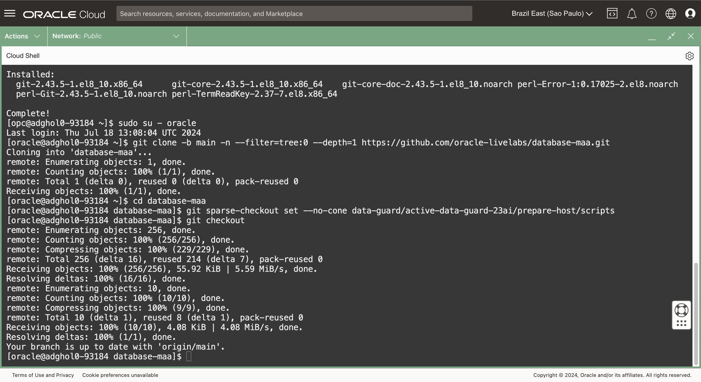

4. Execute the preparation script. It will:
    * Create the static service registration entry in listener.ora
    * Create the entries for the DGConnectIdentifier and StaticConnectIDentifier
    * Create the application TNS entries in tnsnames.ora
    ```
    <copy>
    sh ~/database-maa/data-guard/active-data-guard-23ai/prepare-host/scripts/prepare.sh
    </copy>
    ```

5. Verify the content of `listener.ora` and `tnsnames.ora`
    ```
    <copy>
    cat $ORACLE_HOME/network/admin/listener.ora
    cat $ORACLE_HOME/network/admin/tnsnames.ora
    </copy>
    ```
    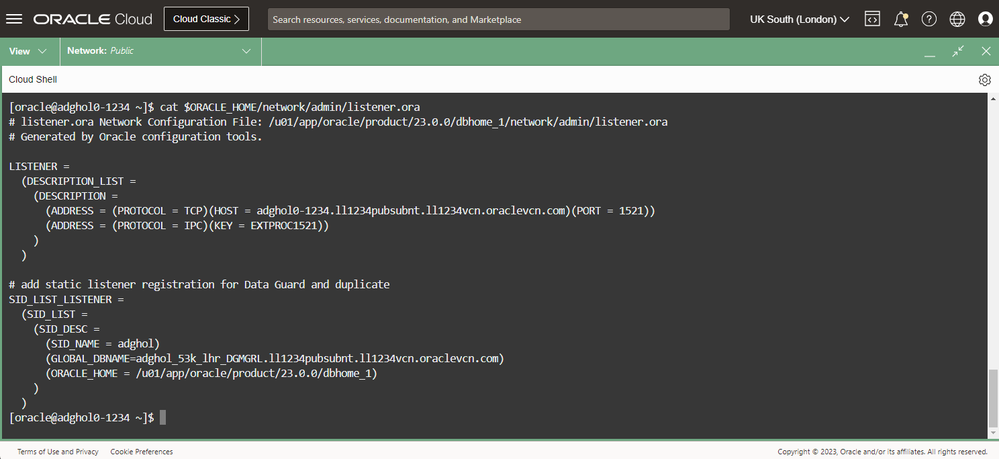

    After this step, there should be a total of seven connection descriptors in `tnsnames.ora`:
    * `adghol_site0`
    * `adghol_site0_dgmgrl`
    * `adghol_site1`
    * `adghol_site1_dgmgrl`
    * `mypdb_rw`
    * `mypdb_r0`
    * `mypdb_snap`

    The first four are the DGConnectIdentifier and StaticConnectIdentifier for the two databases. The last three are the descriptors that the the application will use to connect to the role-based services.

    More information about the Data Guard connect identifiers:
    * The `DGConnectIdentifier` connects to the default service named after the `DB_UNIQUE_NAME` (`adghol_site0` and `adghol_site1` in our lab) or another service accessible when the instance is mounted.
    * The `StaticConnectIdentifier` connects to the service statically registered with the listener (we created it in the previous step). In this lab we use `adghol_site0_dgmgrl` and `adghol_site1_dgmgrl`.
    The static service registration is required for the duplicate, and also, because there is no Oracle Clusterware. Data Guard has to restart the remote instance with a SQL*Net connection when switching over.
    By default, without Oracle Clusterware, Data Guard expects a static service named `{DB_UNIQUE_NAME}_DGMGRL.{DOMAIN_NAME}`. It is possible to override this name using the Data Guard property `StaticConnectIdentifier` (we will see that over the next labs).
    For more information about static service registration, check the documentation: [Configuring Static Service Registration](https://docs.oracle.com/en/database/oracle/oracle-database/23/netag/enabling-advanced-features.html#GUID-0203C8FA-A4BE-44A5-9A25-3D1E578E879F)

    For even more information about Data Guard `DGConnectIdentifier` and `StaticConnectIdentifier`, read the documentation:
    * [Oracle Data Guard Broker Properties - DGConnectIdentifier](https://docs.oracle.com/en/database/oracle/oracle-database/23/dgbkr/oracle-data-guard-broker-properties.html#GUID-32FF0A08-67DA-41AC-8BE8-0596CAF130BA)
    * [Oracle Data Guard Broker Properties - StaticConnectIdentifier](https://docs.oracle.com/en/database/oracle/oracle-database/23/dgbkr/oracle-data-guard-broker-properties.html#GUID-2F938A76-A178-4A35-A629-F67F34212CAB)


## Task 3: Prepare the standby database host

1.  **Duplicate the tab in your browser**. If your browser does not support tab duplication, open a new tab and connect again to the Cloud Console.
    If you get any errors opening the Cloud Shell, make sure the correct compartment is selected.

2. Connect to the secondary host:
    ````
    <copy>
    ssh adghol1
    </copy>
    ````

    The first connection will ask:
    ````
    Are you sure you want to continue connecting (yes/no/[fingerprint])? 
    ````

    Type `yes`.

1. Install the git package that we will use later:
    ```
    <copy>sudo dnf install -y git</copy>
    ```
   

2. Become the `oracle` user:
    
    ```
    <copy>sudo su - oracle</copy>
    ```

3. Download the helper scripts using git:

    ```
    <copy>
    git clone -b main -n --filter=tree:0 --depth=1 https://github.com/oracle-livelabs/database-maa.git
    cd database-maa
    git sparse-checkout set --no-cone data-guard/active-data-guard-23ai/prepare-host/scripts
    git checkout
    </copy>
    ```
   
     
4. Execute the preparation script also on the secondary host. It will:
    * Create the static service registration entry in listener.ora
    * Create the application TNS entries in tnsnames.ora
    ```
    <copy>
    sh ~/database-maa/data-guard/active-data-guard-23ai/prepare-host/scripts/prepare.sh
    </copy>
    ```
  
5. Verify the content of `listener.ora` and `tnsnames.ora`
    ```
    <copy>
    cat $ORACLE_HOME/network/admin/listener.ora
    cat $ORACLE_HOME/network/admin/tnsnames.ora
    </copy>
    ```

## Task 4: copy the Transparent Data Encryption (TDE) wallet and password file

Oracle Data Guard requires the same Transparent Data Encryption (TDE) master keys in the primary and standby database wallets. The quickest way to achieve that is to copy the entire wallet from the primary to the standby database.

Similarly, the default Data Guard authentication mechanism uses the password file. The password files must match to ensure that there are no authentication problems.

1. **On the primary host** (adghol0), **as oracle**, copy the keys in a location accessible from the user opc:
    ```
    <copy>
    cd /opt/oracle/dcs/commonstore/wallets/$ORACLE_UNQNAME/tde
    tar cvf /tmp/wallet.tar cwallet.sso ewallet.p12
    cp $ORACLE_HOME/dbs/orapwadghol /tmp
    chmod 644 /tmp/orapwadghol
    </copy>
    ```
  
2. Temporarily **go back to the Cloud Shell environment** by exiting the shell twice:
    ```
    exit
    exit
    ```
  
3. From the **Cloud Shell** environment, copy the wallet and password file from one node to the other, then delete them:
    ```
    <copy>
    scp adghol0:/tmp/wallet.tar /tmp
    scp adghol0:/tmp/orapwadghol /tmp
    scp /tmp/wallet.tar adghol1:/tmp
    scp /tmp/orapwadghol adghol1:/tmp
    rm /tmp/wallet.tar
    rm /tmp/orapwadghol
    </copy>
    ```
    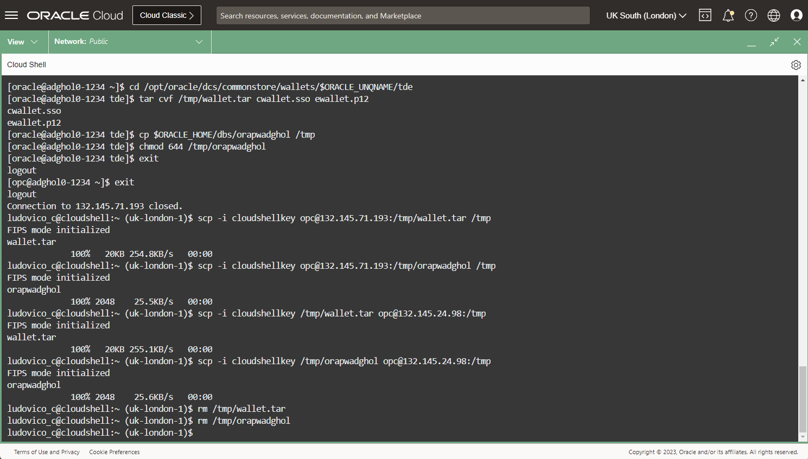
  
4. **Connect back to the first host** and remove the wallet and password file from the temporary location:
    ```
    <copy>
    ssh adghol0
    sudo su - oracle
    rm /tmp/wallet.tar
    rm /tmp/orapwadghol
    </copy>
    ```

5. **On the standby host** (`adghol1`), **as oracle**, copy the files to the correct locations and permissions (as `oracle`), then remove the temporary files as `opc`. 
    **Note:** Use the appropriate browser tab connected to the `adghol1` server. Throughout the lab, make sure to have two browser tabs, one connected to `adghol0` and one connected to `adghol1`. Please carefully run the commands on the correct host according to the instructions provided.
    ```
    <copy>
    cd /opt/oracle/dcs/commonstore/wallets/$ORACLE_UNQNAME/tde
    tar xvf /tmp/wallet.tar
    cp /tmp/orapwadghol $ORACLE_HOME/dbs
    chmod 600 $ORACLE_HOME/dbs/orapwadghol
    exit
    rm /tmp/wallet.tar
    rm /tmp/orapwadghol
    sudo su - oracle
    </copy>
    ```
    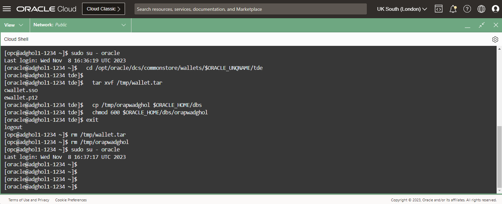

You have successfully prepared the two hosts with everything required to start configuring the databases and Data Guard.

## Acknowledgements

- **Author** - Ludovico Caldara, Product Manager Data Guard, Active Data Guard and Flashback Technologies
- **Contributors** - Robert Pastijn
- **Last Updated By/Date** -  Ludovico Caldara, July 2025
