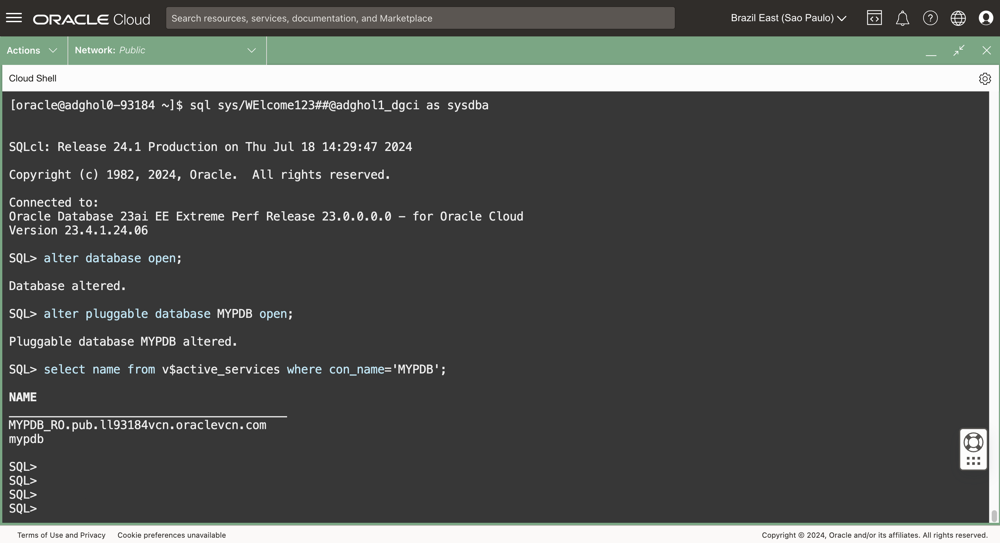
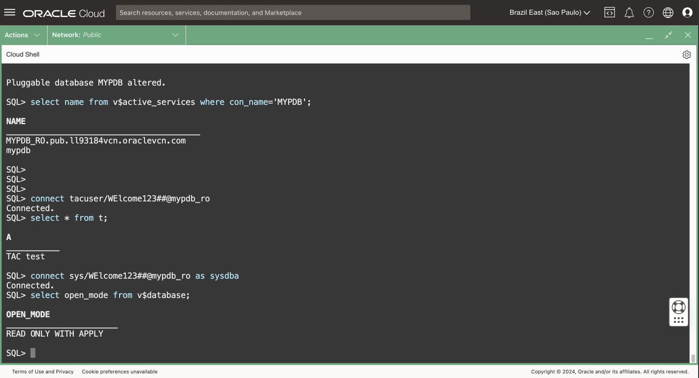
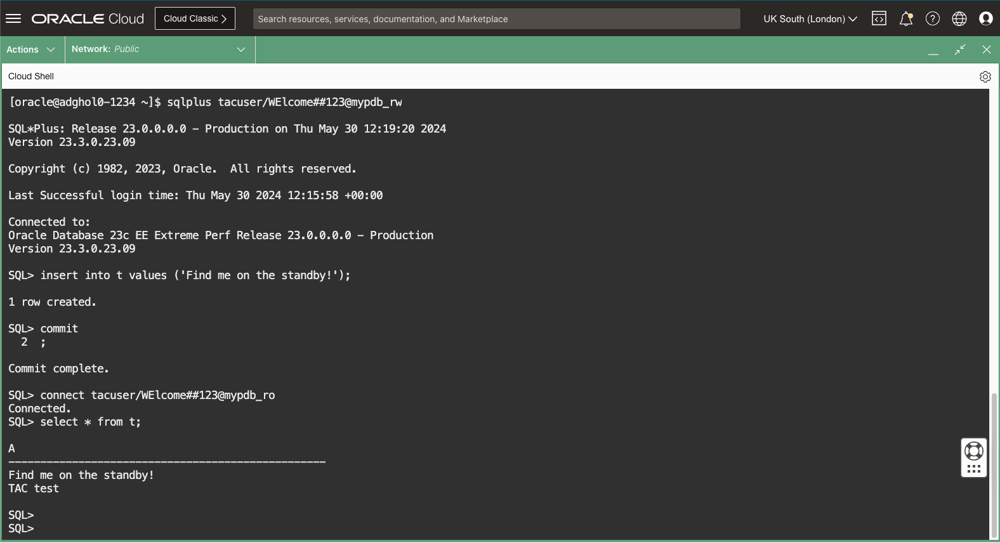
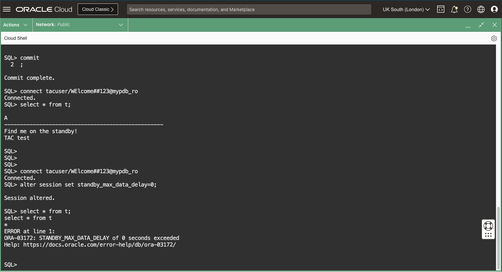
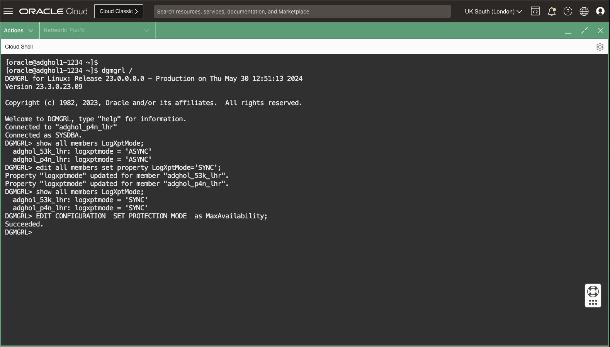
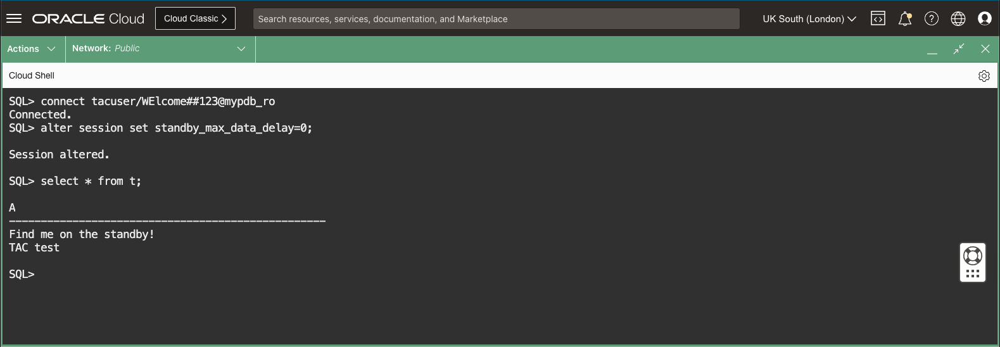
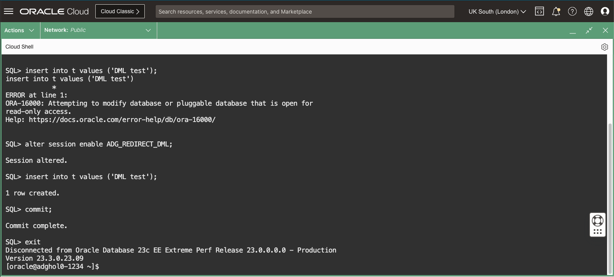

# Use Real-Time Query and DML Redirection

## Introduction

You have a copy of your production data on the standby database, so why not use it to offload some work from the primary database? 
A standby database can simultaneously be opened read-only and applying changes from the primary database. This feature is called **Real-Time Query** and is part of the Active Data Guard option.
Real-Time Query can offload read-only workloads like reports or read-only application modules. If the transport is synchronous, the reading sessions can wait for the received redo to be applied, providing **consistent reads** of all the transactions committed on the primary database.

Additionally, the standby database can automatically redirect write requests to the primary database in an ACID-compliant way, with the changes visible only in the privacy of the transaction started on the standby database.
This functionality broadens the use cases for the physical standby, including running read-write workloads directly on the standby database. The **DML Redirection** feature also supports DDLs and PL/SQL calls.

Estimated Lab Time: 15 Minutes

[Oracle Active Data Guard 23ai](videohub:1_fzrzvek5)

### Requirements
To try this lab, you must have completed the following labs:
* [Prepare the database hosts](../prepare-host/prepare-host.md)
* [Prepare the databases](../prepare-db/prepare-db.md)
* [Configure Data Guard](../configure-dg/configure-dg.md)
* [Verify the Data Guard configuration](../verify-dg/verify-dg.md)
* [Create role-based services](../create-services/create-services.md)

### Objectives
* Open the standby database and enable Real-Time Query
* Enable synchronous transport and causal consistency
* Enable DML redirection

## Task 1: Open the standby database and enable Real-Time Query

1. From any terminal, connect to the standby database as SYSDBA.
    ```
    <copy>
    sql sys/WElcome123##@adghol_site1 as sysdba
    </copy>
    ```

2. Open the CDB and the PDB, then verify that the read-only service `MYPDB_RO` is started:
    ```
    <copy>
    alter database open;
    alter pluggable database MYPDB open;
    select name from v$active_services where con_name='MYPDB';
    </copy>
    ```

    

3. Connect with an application user to the read-only service. Regardless of where the standby database is, the role-based service will land you there:
    ```
    <copy>
    connect tacuser/WElcome123##@mypdb_ro
    </copy>
    ```

    We have created the user `tacuser` in the lab *Transparent Application Continuity*. If you have not tried it, you can copy the user creation commands from there and create the table `t` in the primary database.

4. Read-only queries will work on the standby database while it applies the changes coming from the primary.
    ```
    <copy>
    select * from t;
    </copy>
    ```


5. Connect to the read-only service (standby database) as `SYS` and check the standby database open_mode.
    ```
    <copy>
    connect sys/WElcome123##@mypdb_ro as sysdba
    select open_mode from v$database;
    </copy>
    ```

    You should see the following line in the output indicating that the feature Real-Time Query is activated:
    ```
    READ ONLY WITH APPLY
    ```

    

6. Connect to the primary database as `tacuser` and insert a record into the table `t`:
    ```
    <copy>
    connect tacuser/WElcome123##@mypdb_rw
    </copy>
    ```
    ```
    <copy>
    insert into t values ('Find me on the standby!');
    commit;
    </copy>
    ```
    
7. Connect to the read-only service and verify that the inserted data is visible:
    ```
    <copy>
    connect tacuser/WElcome123##@mypdb_ro
    select * from t;
    </copy>
    ```

    

## Task 2: Enable synchronous transport and causal consistency
The standby database can read consistent data (read all the data as soon as it's committed on the primary), despite having an asynchronous APPLY process. But that requires the TRANSPORT to be synchronous; otherwise, the commands that enforce consistent reads will fail. That is because the sessions on a synchronous standby database know that all the redo has been written to the standby redo logs and can wait for the last written SCN to be applied to ensure a consistent read.

1. On the standby database, try to do a read consistent with the primary database.
    It will fail:
    ```
    <copy>
    connect tacuser/WElcome123##@mypdb_ro
    alter session set standby_max_data_delay=0;
    select * from t;
    </copy>
    ```
    
    
    For more information on causal consistency, refer to the documentation: [Concepts and Administration - Real-Time Query](https://docs.oracle.com/en/database/oracle/oracle-database/23/sbydb/managing-oracle-data-guard-physical-standby-databases.html#GUID-07CB190C-C248-4FF5-AB64-EAA9C6D42677)
    
2. From another terminal, connect to the Data Guard configuration with `dgmgrl` and set the transport mode to synchronous:

    ```
    <copy>
    dgmgrl /
    </copy>
    ```

    Change the log transport mode to synchronous for primary and standby, then set the MaxAvailability protection mode:
    ```
    <copy>
    -- show/edit all members new in 23ai
    show all members LogXptMode;
    edit all members set property LogXptMode='SYNC';
    show all members LogXptMode;
    EDIT CONFIGURATION  SET PROTECTION MODE  as MaxAvailability;
    </copy>
    ```

    

    We do these commands from `dgmgrl`, because:
    * `SHOW/EDIT ALL MEMBERS`
    * `EDIT CONFIGURATION SET PROTECTION MODE`
    are not integrated yet in SQLcl at the time of writing the lab.

3. Back to the session using the read-only service, doing a read that is consistent with the primary will work:
    ```
    <copy>
    connect tacuser/WElcome123##@mypdb_ro
    alter session set standby_max_data_delay=0;
    select * from t;
    </copy>
    ```

    

## Task 3: Enable DML redirection
1. Finally, still while connected to the read-only service, enable DML redirection and see that DML will work while connected to the standby database.

    The first try will fail with:
    `ORA-16000: database or pluggable database open for read-only access`:

    ```
    <copy>
    insert into t values ('DML test');
    </copy>
    ```

2. After enabling DML redirection, it will succeed:
    ```
    <copy>
    alter session enable ADG_REDIRECT_DML;
    insert into t values ('DML test');
    commit;
    exit
    </copy>
    ```
    
    

For more information about Real-Time Query, read the [documentation](https://docs.oracle.com/en/database/oracle/oracle-database/23/sbydb/managing-oracle-data-guard-physical-standby-databases.html#GUID-D5FB88EC-799D-40E7-80E1-19474E3167E4).

You have successfully configured Real-Time Query and DML Redirection.

- **Author** - Ludovico Caldara, Product Manager Data Guard, Active Data Guard and Flashback Technologies
- **Contributors** - Robert Pastijn;
- **Last Updated By/Date** -  Ludovico Caldara, July 2025
