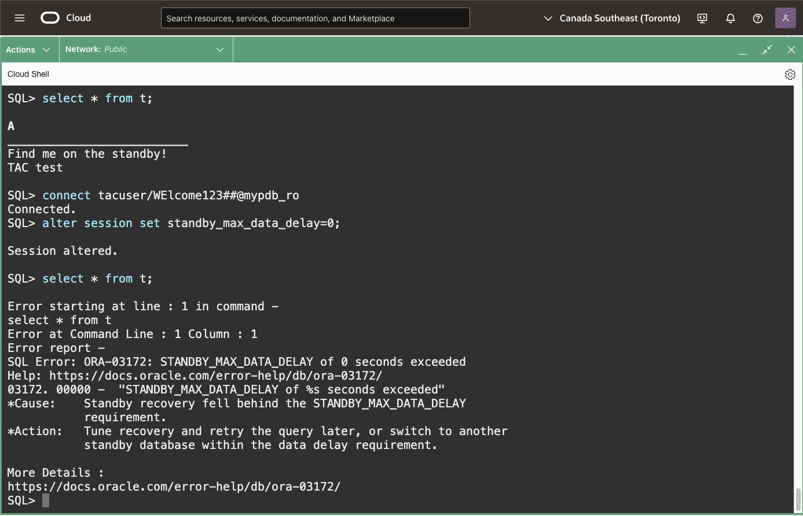
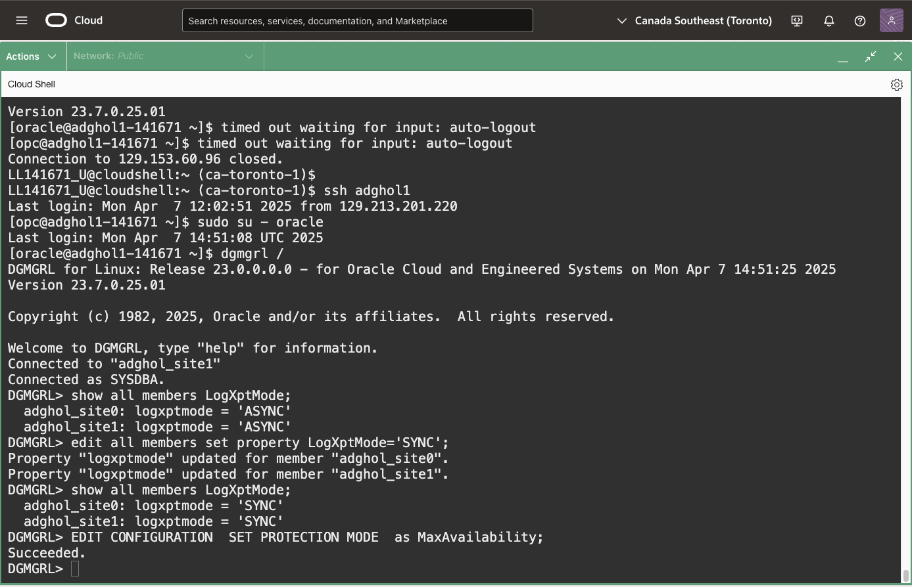

# Use Real-Time Query and DML Redirection

## Introduction

You have a copy of your production data on the standby database, so why not use it to offload some work from the primary database? 
A standby database can be open read only while it applies changes coming from the primary database. This feature is called **Real-Time Query**, and it's part of the Active Data Guard option.
Real-Time Query can offload read-only workloads, such as reports or read-only application modules. If the transport is synchronous, the reading sessions can wait for the received redo to be applied, providing **consistent reads** of all the transactions committed on the primary database.

Additionally, the standby database can be configured to automatically redirect write requests to the primary database, in an ACID-compliant way, with the changes visible only in the privacy of the transaction started on the standby database.
This functionality broadens the use cases for the physical standby, including running read-write workloads directly on the standby database. The feature, called **DML Redirection**, also supports DDLs and PL/SQL calls (although with some documented limitations).

Estimated Lab Time: 15 Minutes

### Requirements
To try this lab, you must have successfully completed the following labs:
* [Prepare the database hosts](../prepare-host/prepare-host.md)
* [Prepare the databases](../prepare-db/prepare-db.md)
* [Configure and Verify Data Guard](../configure-dg/configure-dg.md)
* [Create role-based services](../create-services/create-services.md)

### Objectives
* Open the standby database and enable Real-Time Query
* Enable synchronous transport and causal consistency
* Enable DML redirection

## Task 1: Open the standby database and enable Real-Time Query

On the host `adghol1` (it should be the host running the standby database), connect to the standby database as SYSDBA:
```
<copy>
sqlplus / as sysdba
</copy>
```

Open the CDB and the PDB, then verify that the read-only service `mypdb_RO` is started:
```
<copy>
alter database open;
alter pluggable database MYPDB open;
select name from v$active_services where con_id>=2;
exit
</copy>
```


Connect with an application user to the read-only service. Regardless of where the standby database is, the role-based service will land you there:
```
<copy>
connect tacuser/WElcome123##@mypdb_ro
</copy>
```

Read-only queries will work on the standby database while it is applying the changes coming from the primary.
```
<copy>
select * from t;
exit
</copy>
```


From another terminal, connect with `dgmgrl` to the configuration and check the standby database status. Change ADGHOL1_UNIQUE_NAME with the actual DB_UNIQUE_NAME:
```
<copy>
dgmgrl /
show database ADGHOL1_UNIQUE_NAME
exit
</copy>
```

You should see the following line in the output indicating that the feature Real-Time Query is activated:
```
Real Time Query:    ON
```


From the same terminal, connect to the primary database and insert a record into the table `t`:
```
<copy>
sqlplus tacuser/WElcome123##@mypdb_rw
</copy>
```
```
<copy>
insert into t values ('Find me on the standby!');
commit;
</copy>
```

Connect to the read-only service and verify that the inserted data is visible:
```
<copy>
connect tacuser/WElcome123##@mypdb_ro
select * from t;
</copy>
```


## Task 2: Enable synchronous transport and causal consistency
The standby database can read consistent data (read all the data as soon as it's committed on the primary), despite having an asynchronous APPLY process. But that requires the TRANSPORT to be synchronous, otherwise the commands that enforce consistent reads will fail. This is because the sessions on a synchronous standby database know that all the redo has been written to the standby redo logs, and can wait for the last written SCN to be applied to ensure a consistent read.

On the standby database, try to do a read consistent with the primary:
```
<copy>
connect tacuser/WElcome123##@mypdb_ro
alter session set standby_max_data_delay=0;
select * from t;
</copy>
```



From another terminal, connect to the Data Guard configuration with `dgmgrl` and set the transport mode to synchonous:

```
<copy>
dgmgrl /
</copy>
```

Change the log transport mode to synchronous for primary and standby, then set the MaxAvailability protection mode:
```
<copy>
-- show/edit all members new in 23ai
show all members LogXptMode;
edit all members set property LogXptMode='SYNC';
show all members LogXptMode;
EDIT CONFIGURATION  SET PROTECTION MODE  as MaxAvailability;
</copy>
```



Back to the session using the read-only service, the read consistent with the primary will work:
```
<copy>
connect tacuser/WElcome123##@mypdb_ro
alter session set standby_max_data_delay=0;
select * from t;
exit
</copy>
```


## Task 3: Enable DML redirection
Finally, while connected to the read-only service, enable DML redirection and see that DML will work while connected to the standby database.

The first try will fail with
`ORA-16000: database or pluggable database open for read-only access`:
```
<copy>
insert into t values ('DML test');
</copy>
```

After enabling DML redirection, it will succeed:
```
<copy>
alter session enable ADG_REDIRECT_DML;
insert into t values ('DML test');
commit;
exit
</copy>
```


- **Author** - Ludovico Caldara, Product Manager Data Guard, Active Data Guard and Flashback Technologies
- **Contributors** - Robert Pastijn;
- **Last Updated By/Date** -  Ludovico Caldara, June 2024
