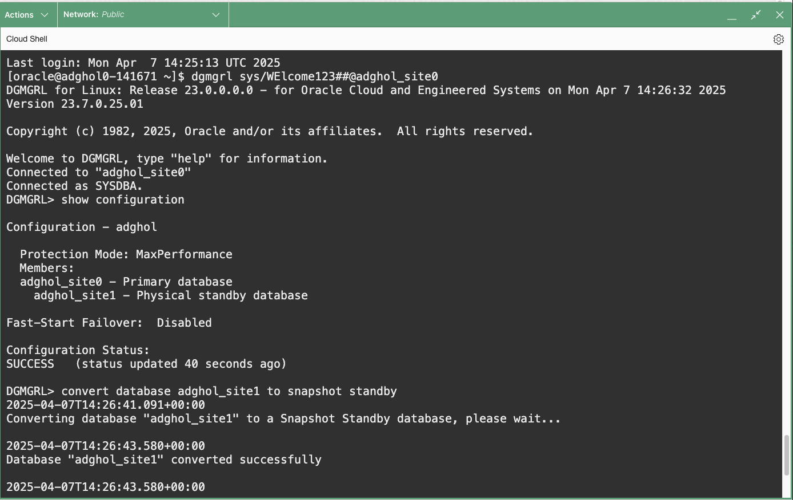
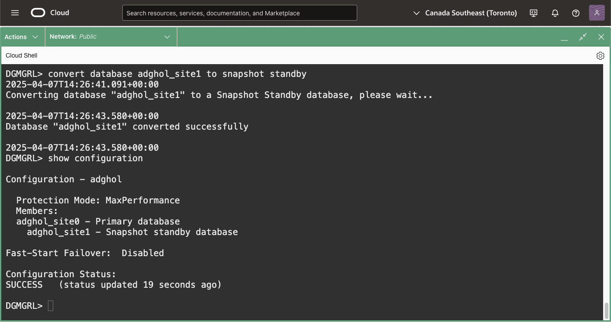
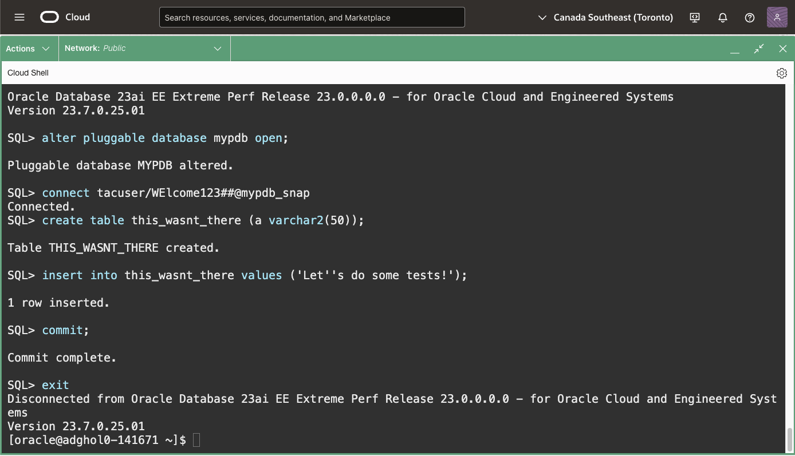
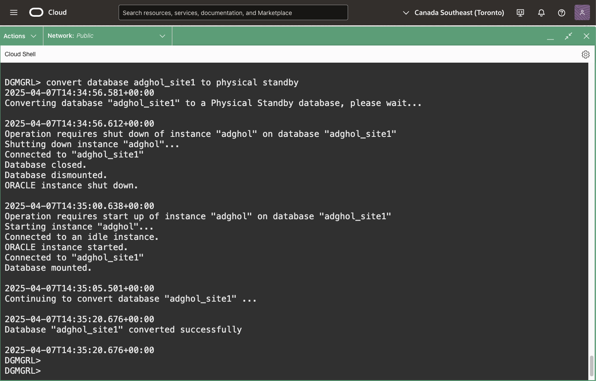

# Test Your Deployments with Snapshot Standby

## Introduction

A Data Guard standby database does more than protect your data. You can use it for maintenance (by switching over the primary workload to the secondary site while you do the maintenance on the primary site) or temporarily open your standby database in read/write mode to test changes on a copy of the primary database.
This capability is called **snapshot standby**.
Data Guard allows you to transition from physical standby to a snapshot standby with a single command.
When the snapshot standby is converted back to a physical standby, the modifications made to it are automatically reverted by flashing back the database.
This functionality can be helpful in testing:
* application deployments
* structural changes (e.g., new indexes)
* new patches or even new versions

Estimated Lab Time: 5 Minutes

[Oracle Active Data Guard 23ai](videohub:1_w5u4zktb)

### Requirements
To try this lab, you must have completed the following labs:
* [Prepare the database hosts](../prepare-host/prepare-host.md)
* [Prepare the databases](../prepare-db/prepare-db.md)
* [Configure Data Guard](../configure-dg/configure-dg.md)
* [Verify the Data Guard configuration](../verify-dg/verify-dg.md)
* [Create role-based services](../create-services/create-services.md)

### Objectives
* Convert the physical standby to a snapshot standby
* Change some data
* Convert back to physical standby

## Task 1: Convert the physical standby to a snapshot standby

1. From a terminal (**the host is irrelevant**), connect with `dgmgrl` and convert the standby database to a snapshot standby.

    ```
    <copy>
    dgmgrl sys/WElcome123##@adghol_site0
    </copy>
    ```
    ```
    <copy>
    show configuration
    convert database adghol_site1 to snapshot standby
    </copy>
    ```

    

    Note, we don't use SQLcl for the conversion because the command `CONVERT DATABASE` isn't yet integrated in SQLcl.
    The conversion stops the apply process on the standby database, creates a guaranteed restore point, and opens it in read-write mode.

    While the database is in snapshot standby mode, it continues to receive the redo from the primary database, protecting it.

2. After the conversion, the configuration reports the new role.

    ```
    <copy>
    show configuration
    exit
    </copy>
    ```

    


## Task 2: Open the PDB, connect to the snapshot standby service, and change some data

1. Connect to the standby database.
    ```
    <copy>
    sql sys/WElcome123##@adghol_site1 as sysdba
    </copy>
    ```

2. Open the PDB:
    ```
    <copy>
    alter pluggable database mypdb open;
    </copy>
    ```

3. Connect to the snapshot standby service. The startup trigger starts the service only when the PDB is in a snapshot standby role.
    ```
    <copy>
    connect tacuser/WElcome123##@mypdb_snap
    </copy>
    ```
    The user `tacuser` has been created during the lab *Transparent Application Continuity*. If you haven't tried it, you can copy the instructions to create the user from there.
    ```
    <copy>
    create table this_wasnt_there (a varchar2(50));
    insert into this_wasnt_there values ('Let''s do some tests!');
    commit;
    exit
    </copy>
    ```

    
  

## Task 3: Convert back to physical standby

1. Connect to either the primary or the standby database with `dgmgrl` and convert the standby database back to the physical standby role.
    ```
    <copy>
    dgmgrl sys/WElcome123##@adghol_site0
    show configuration
    convert database adghol_site1 to physical standby
    show configuration verbose
    exit
    </copy>
    ```

    

    Immediately after the conversion, the command can report a warning. You can wait until the next health check (default every minute) and run `show configuration` again.

    The conversion to physical standby closes the standby database, flashes it back to the previously created restore point, and starts the apply process again.
    If `show configuration verbose` reports a warning, try running it again, as the standby might take some seconds to start receiving redo from the primary. You can force a refresh of the status cache with `select DBMS_DG.HEALTH_CHECK from dual;`

For more information about Snapshot Standby Database, read the [documentation](https://docs.oracle.com/en/database/oracle/oracle-database/23/sbydb/managing-oracle-data-guard-physical-standby-databases.html).

You have successfully tested a snapshot standby database.

- **Author** - Ludovico Caldara, Product Manager Data Guard, Active Data Guard and Flashback Technologies
- **Contributors** - Robert Pastijn
- **Last Updated By/Date** -  Ludovico Caldara, July 2025
