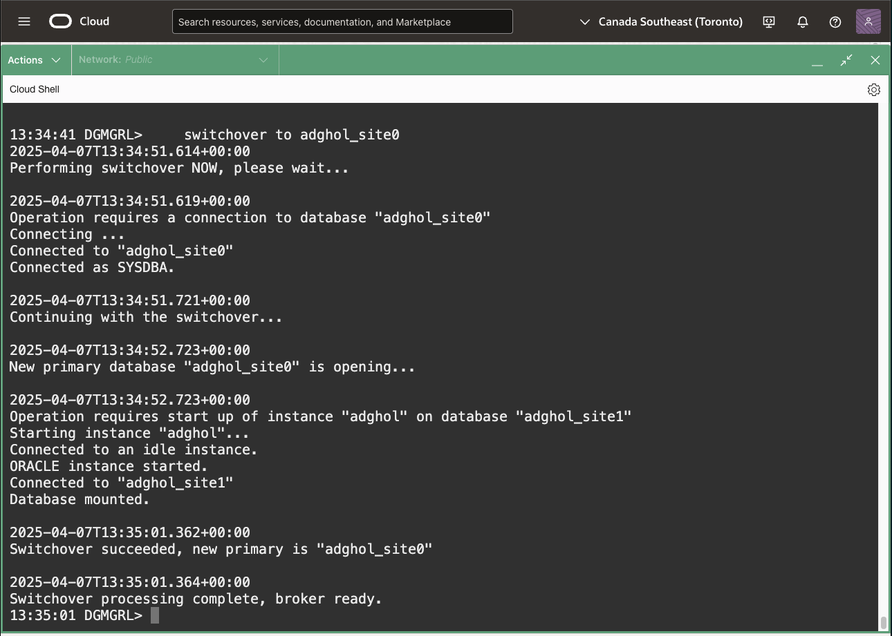

# Perform a switchover

## Introduction
This lab is not required for the subsequent labs and it leaves the situation unaltered. Therefore, you can skip it if you want to concentrate on the next labs.

In this lab, we will execute a switchover to swap the roles between the primary and the standby databases.

The switchover operation will terminate the work on the current primary database, flush all the redo to the standby database, which will perform a final, complete recover before opening as the new primary database. When the new primary database successfully opens, the former primary is restarted as a physical standby database, keeping the new primary database protected.

The broker automates all the aspects of a Data Guard topology, including setting up the redo transport, coordinating switchovers and failovers, monitoring the lags, etc.

For more information about the switchover operation, refer to the [Switchover and Failover Operations documentation](https://docs.oracle.com/en/database/oracle/oracle-database/23/dgbkr/using-data-guard-broker-to-manage-switchovers-failovers.html#GUID-44E7A982-7CD4-4A51-B00E-62C0698C5CD6)

Estimated Lab Time: 5 Minutes

### Requirements
To try this lab, you must have successfully completed:
* Lab 1: Prepare the database hosts
* Lab 2: Prepare the databases
* Lab 3: Configure and Verify Data Guard

### Objectives
- Run the validation command
- Execute the Switchover
- Switch back to the first node

## Task 1: Run the validation command

1. Connect to the Data Guard broker using the primary's DGConnectIdentifier.

    ```
    <copy>
    dgmgrl sys/WElcome123##@adghol_site0
    </copy>
    ```

2. Validate the readiness of the standby database with the `VALIDATE DATABASE STRICT ALL` command. 

    ```
    <copy>
    show configuration
    validate database adghol_site1 strict all
    </copy>
    ```

    It will show **Ready for Switchover: No**. The only reason should be: **One or more pluggable databases have save state enabled.**

    

## Task 2: Execute the Switchover

1. Execute the switchover to the standby database:

    ```
    <copy>
    set time on
    switchover to adghol_site1
    </copy>
    ```

    

    If you used Data Guard before 23ai, you might notice a faster role transition!

1. The `show configuration verbose` command should show the new situation (the primary database is now `adghol_site1`):

    ```
    <copy>
    show configuration verbose
    </copy>
    ```

    

    If you still get a warning, try waiting until the next health check. They happen automatically every minute.


## Task 3: Switch back to the first node

1. Move the primary role back to the database `adghol_site0` so that the next labs will work properly.

    ```
    <copy>
    validate database adghol_site0 strict all
    switchover to adghol_site0
    </copy>
    ```

    
    


You have successfully tested a switchover operation.

## Acknowledgements

- **Author** - Ludovico Caldara, Product Manager Data Guard, Active Data Guard and Flashback Technologies
- **Contributors** - Robert Pastijn
- **Last Updated By/Date** -  Ludovico Caldara, July 2025
