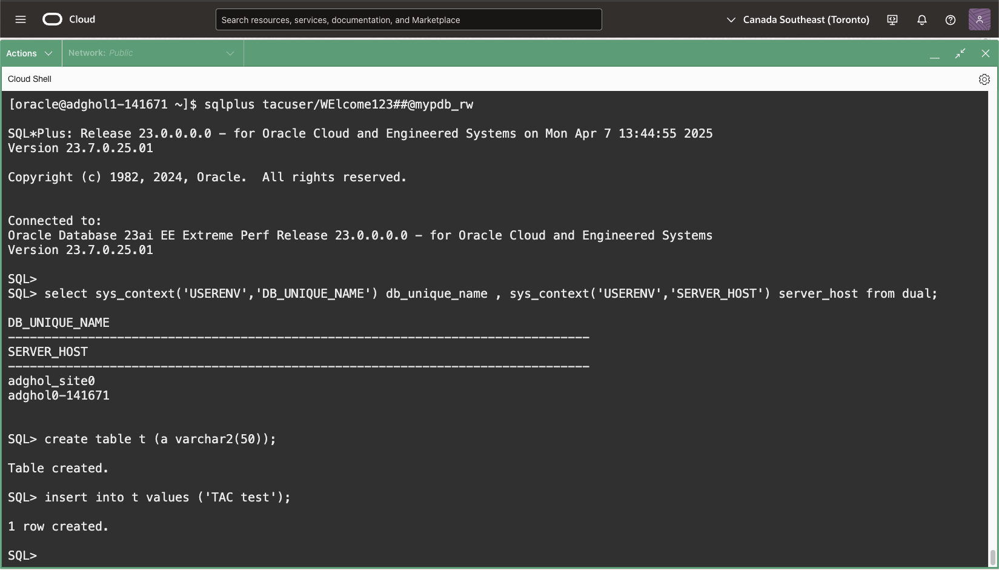
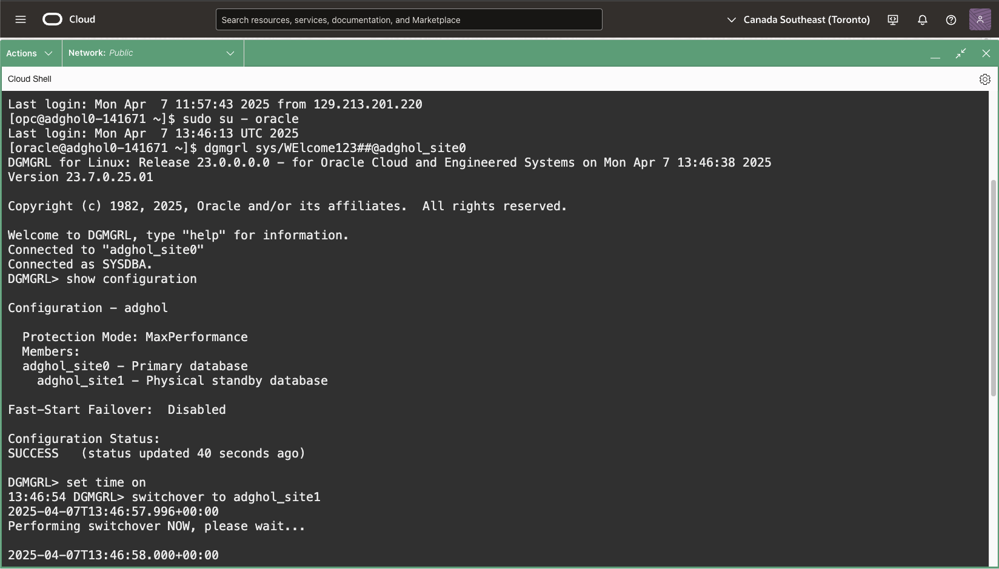
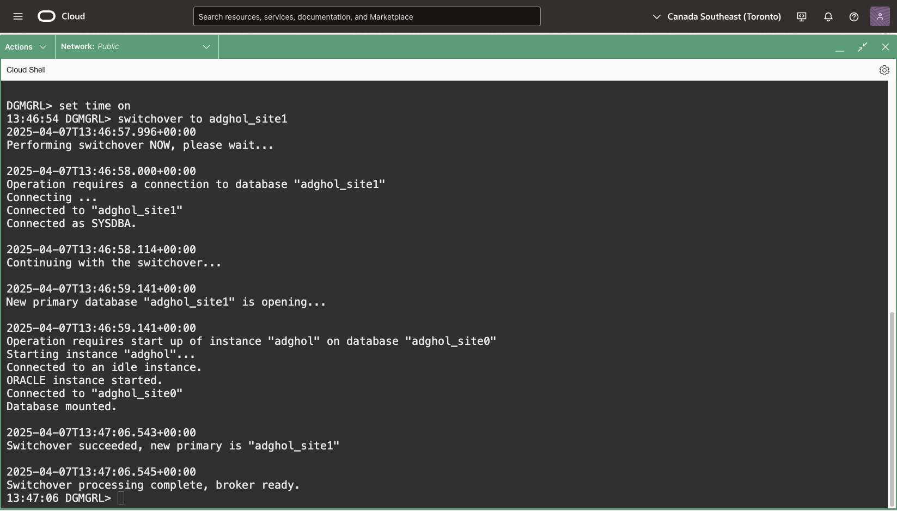
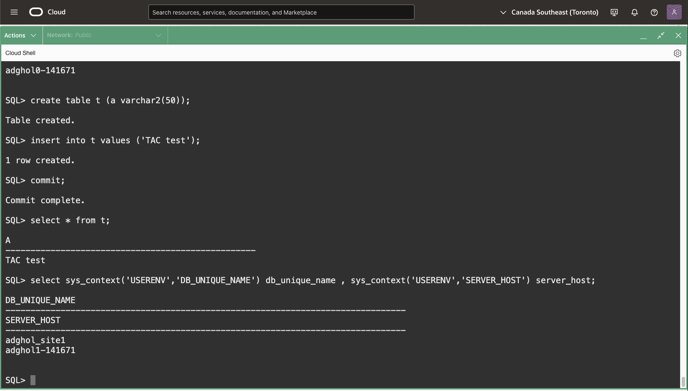

# Transparent Application Continuity

## Introduction

When switching over or failing over the Data Guard configuration, the correct services start, and the highly available connection string still works for new connections.

What about existing connections? More importantly, what about active transactions at the time of the role change?

Transparent Application Continuity brilliantly solves this problem. Once the session is terminated, the client retries to connect until the service is available again. Then, Transparent Application Continuity restores the session state and replays the transaction to the state the session had before the failure.

Estimated Lab Time: 10 Minutes

[Oracle Active Data Guard 23ai](videohub:1_9u5fnubu)

### Requirements
To try this lab, you must have completed the following labs:
* [Prepare the database hosts](../prepare-host/prepare-host.md)
* [Prepare the databases](../prepare-db/prepare-db.md)
* [Configure Data Guard](../configure-dg/configure-dg.md)
* [Verify the Data Guard configuration](../verify-dg/verify-dg.md)
* [Create role-based services](../create-services/create-services.md)

### Objectives
* Create the application user
* Start a user transaction
* Execute a switchover
* Commit the user transaction

## Task 1: Create the application user

1. From a terminal (**the host is irrelevant for this lab**), connect to the read-write service on the primary:
    ```
    <copy>
    sql sys/WElcome123##@mypdb_rw as sysdba
    </copy>
    ```

2. Create the user and role for the application:
     ```
     <copy>
     create user TACUSER identified by WElcome123##;
     CREATE ROLE TAC_ROLE NOT IDENTIFIED ;
     GRANT DB_DEVELOPER_ROLE TO TAC_ROLE;
     GRANT CREATE MINING MODEL TO TAC_ROLE;
     GRANT KEEP DATE TIME TO TAC_ROLE;
     GRANT KEEP SYSGUID TO TAC_ROLE;
     GRANT TAC_ROLE TO TACUSER;
     ALTER USER TACUSER QUOTA UNLIMITED ON USERS;
     exit
     </copy>
     ```

     

## Task 2: Start a user transaction

1. **In a new terminal**, connect as the newly created user using `sqlplus`, and start a transaction. Note: we require `sqlplus` instead of `sql` for this task because the way `sql` uses `PREPARED STATEMENT`, which is incompatible with Transparent Application Continuity.

    ```
    <copy>
    sqlplus tacuser/WElcome123##@mypdb_rw
    </copy>
    ```

    ```
    <copy>
    select sys_context('USERENV','DB_UNIQUE_NAME') db_unique_name , sys_context('USERENV','SERVER_HOST') server_host from dual;
    create table t (a varchar2(50));
    insert into t values ('TAC test');
    </copy>
    ```

    

## Task 3: Execute a switchover

1. **From the other terminal**, connect to the primary database and execute a switchover. We will use `dgmgrl`this time.

    ```
    <copy>
    dgmgrl sys/WElcome123##@adghol_site0
    show configuration
    set time on
    switchover to adghol_site1
    </copy>
    ```

    

    

    You don't need to wait for the switchover to finish; you can continue to the next step.

## Task 4: Commit the user transaction

1. Back to the `sqlplus` session connected as `tacuser`, commit the transaction that we left pending:
    ```
    <copy>
    commit;
    select * from t;
    select sys_context('USERENV','DB_UNIQUE_NAME') db_unique_name , sys_context('USERENV','SERVER_HOST') server_host;
    exit
    </copy>
    ```

    

    You should see that the commit succeeds, the data inserted before the switchover is there, and that we are now connected to the second host where the new primary resides.

## Task 5: Switch back to the original primary

Remember to switch back before continuing with the next labs. The labs expect `ADGHOL0` to be the primary environment. 

1. **From the terminal where you have the dgmgrl session**, execute another switchover back to the database on host `adghol`:

    ```
    <copy>
    show configuration
    switchover to adghol_site0
    </copy>
    ```

2. Exit the dgmgrl command line:
    
    ```
    <copy>
    exit
    </copy>
    ```

## Task 6 (optional): List the recent switchovers

1. From a terminal (**the host is irrelevant for this lab**), connect to the read-write service on the primary:
    
    ```
    <copy>
    sql sys/WElcome123##@mypdb_rw as sysdba
    </copy>
    ```

2. Query the view `v$dg_broker_role_change` to get the recent role changes:
    
    ```
    <copy>
    select event, old_primary, new_primary, begin_time, end_time from v$dg_broker_role_change;
    </copy>
    ```
    

You have successfully tested Transparent Application Continuity.

- **Author** - Ludovico Caldara, Product Manager Data Guard, Active Data Guard and Flashback Technologies
- **Contributors** - Robert Pastijn
- **Last Updated By/Date** -  Ludovico Caldara, July 2025
