# Verify the Data Guard configuration

## Introduction
In this lab we will check the configuration and gain a basic knowledge of how to control and monitor Data Guard.

Estimated Lab Time: 15 Minutes

### Requirements
To try this lab, you must have successfully completed:
* Lab 1: Prepare the database hosts
* Lab 2: Prepare the databases
* Lab 3: Configure Data Guard

### Objectives
- Run the validation commands
- Stop and start the redo transport and the apply process
- Review the Data Guard configuration and processes
- Control Data Guard with PL/SQL

## Task 1: Run the validation commands

Oracle Data Guard broker provides several commands to check the health of the Data Guard configuration. You can run them to get familiar with the output:

1. The command `show configuration verbose` gives the configuration status and additionally shows all the configuration-level properties:

  ```
  <copy>show configuration verbose;</copy>
  ```

  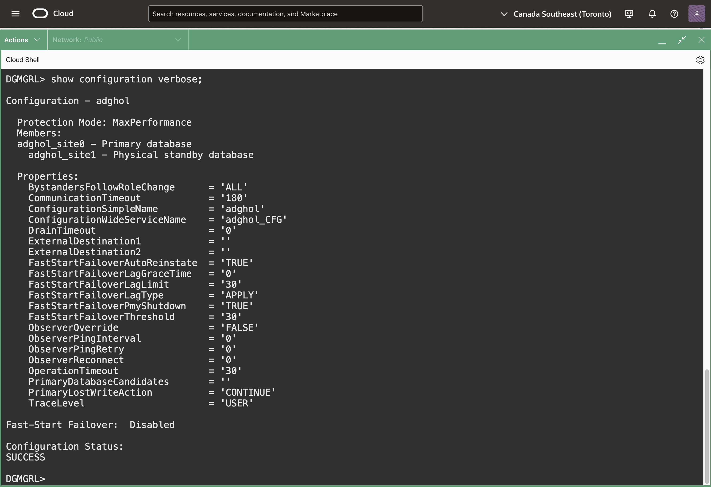

1. The command `validate static connect identifier for all` checks that the static connect identifiers of all members are reachable by all members.

  ```
  <copy>validate static connect identifier for all;</copy>
  ```

1. Similarly, the command `validate network configuration for all` checks the network configuration is healthy.

  ```
  <copy>validate network configuration for all;</copy>
  ```

  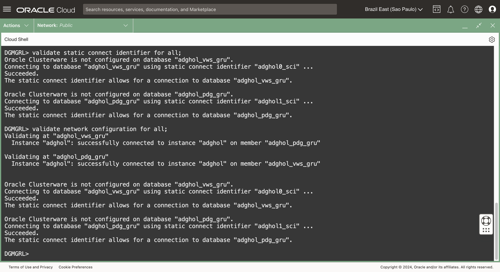

1. The command `validate database` shows the database readiness for switchover and failover. The `verbose` keyword gives additional detail regarding the different checks performed during the validation.

  The output will be different between the primary and standby databases.

  Replace the db_unique_name as usual:

  ```
  <copy>validate database verbose ADGHOL0_UNIQUE_NAME;</copy>
  ```

  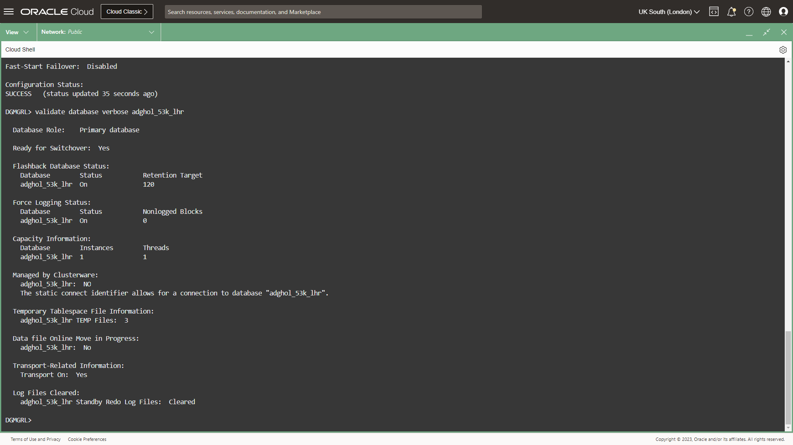

  ```
  <copy>validate database verbose ADGHOL1_UNIQUE_NAME;</copy>
  ```

  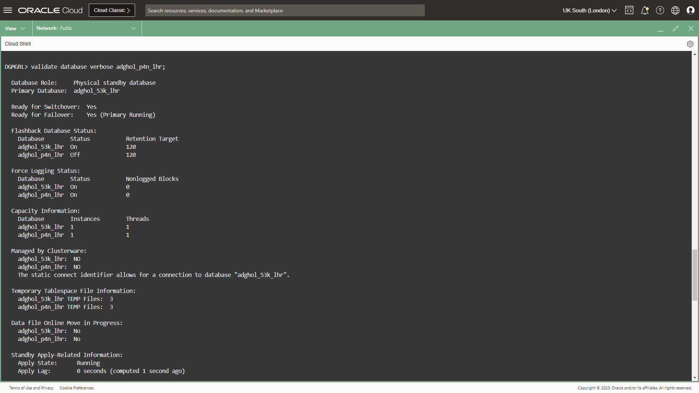
  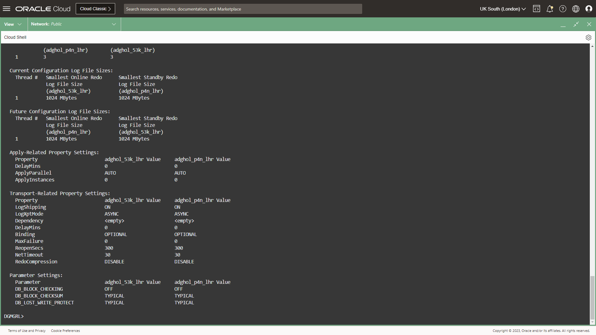

1. The command `validate database ... strict all` makes a stricter validation, reporting `Ready for Switchover: No` in case any of the checks fail, regardless if they are strictly required for a switchover or not.

  ```
  <copy>validate database ADGHOL1_UNIQUE_NAME strict all;</copy>
  ```

  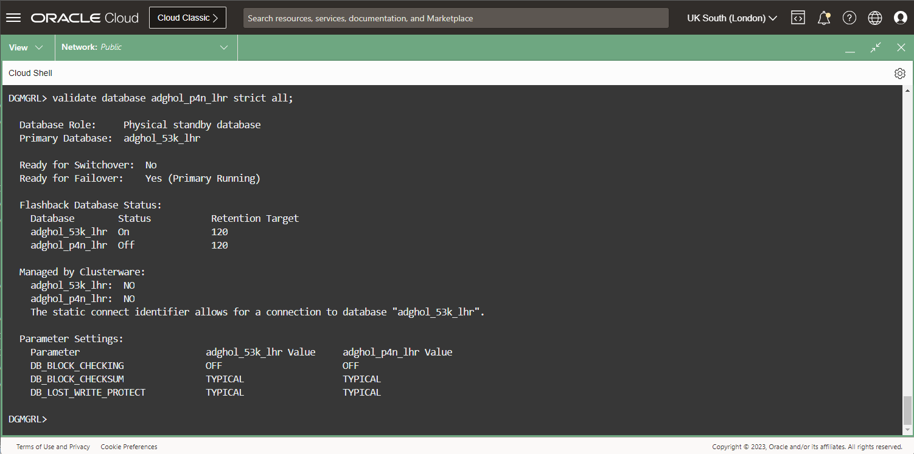

  In this case, you can see that the configuration is not ready for the switchover. The output shows that the Flashback logging is not enabled on the standby database. This won't prevent the switchover from working but might give unexpected problems later, for example, the inability to reinstate the new primary in case of failover.

  Don't worry, we will fix that later.

1. The command `validate database ... spfile` shows the differences between the initialization parameters of the primary database and those of the standby database. Only the parameters that are relevant to Data Guard are shown.

  ```
  <copy>validate database ADGHOL1_UNIQUE_NAME spfile;</copy>
  ```

  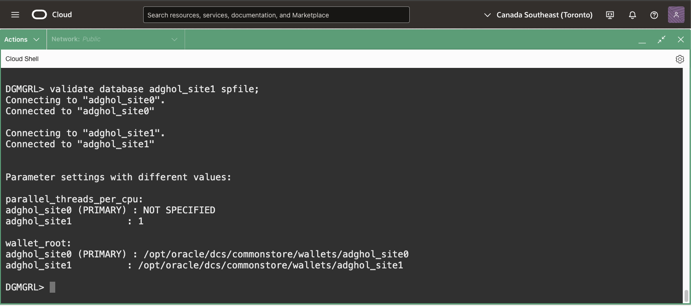

1. The command `validate dgconnectidentifier` verifies that a specific connect identifier is correctly reachable from all members of the configuration, and that it's possible to connect to it using the same username and password used to start the broker command line session. That is useful when diagnosing connectivity or authentication problems (ORA-01017), especially before executing a role transition.

  Change the DGConnectIdentifier with the appropriate one.
  ```
  <copy>validate dgconnectidentifier ADGHOL0_DGCI;</copy>
  ```

  ```
  <copy>validate dgconnectidentifier ADGHOL1_DGCI;</copy>
  ```

## Task 2 (OPTIONAL): Stop and start the redo transport and the apply process

When operating Oracle Data Guard, you will need to stop and start the recovery, pause the redo log shipping, etc.

The following examples show how to do it.

1. Stop the apply process on the standby database. Replace `ADGHOL1_UNIQUE_NAME` with the actual standby database db_unique_name.

  ```
<copy>edit database ADGHOL1_UNIQUE_NAME set state=apply-off;</copy>
  ```

1. Restart the apply process.

  ```
<copy>edit database ADGHOL1_UNIQUE_NAME set state=apply-on;</copy>
  ```

1. Stop the redo transport from the primary to the standby database(s). Speficy the primary db_unique_name this time.

  ```
<copy>edit database ADGHOL0_UNIQUE_NAME set state=transport-off;</copy>
  ```

1. Restart the transport process.

  ```
<copy>edit database ADGHOL0_UNIQUE_NAME set state=transport-on;</copy>
  ```

1. When you have multiple standby databases, you might want to stop the transport to a specific standby database instead of stopping the whole transport from the primary. In that case, you can do that by changing the property `LogShipping` on the standby database:

  ```
<copy>edit database ADGHOL1_UNIQUE_NAME set property logshipping=off;</copy>
  ```

  That will only alter the corresponding log_archive_dest on the source database shipping to the specified standby database.

1. Restart the log shipping to the standby database.
  ```
<copy>edit database ADGHOL1_UNIQUE_NAME set property logshipping=on;</copy>
  ```

  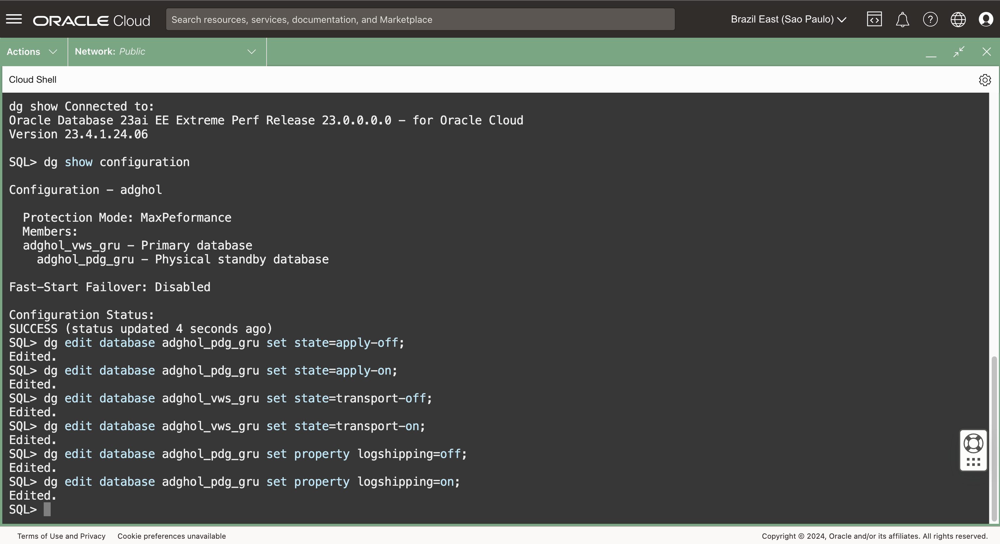

## Task 3: Review the Data Guard configuration and processes

Oracle Data Guard exposes many fixed views that help observing and monitoring the Data Guard configuration. It is important to get familiar with them.

1. Connect with SQLcl to the primary database using its DGConnectIdentifier.

   ```
   <copy>
   sql sys/WElcome123##@ADGHOL0_DGCI as sysdba
   </copy>
   ```
    
   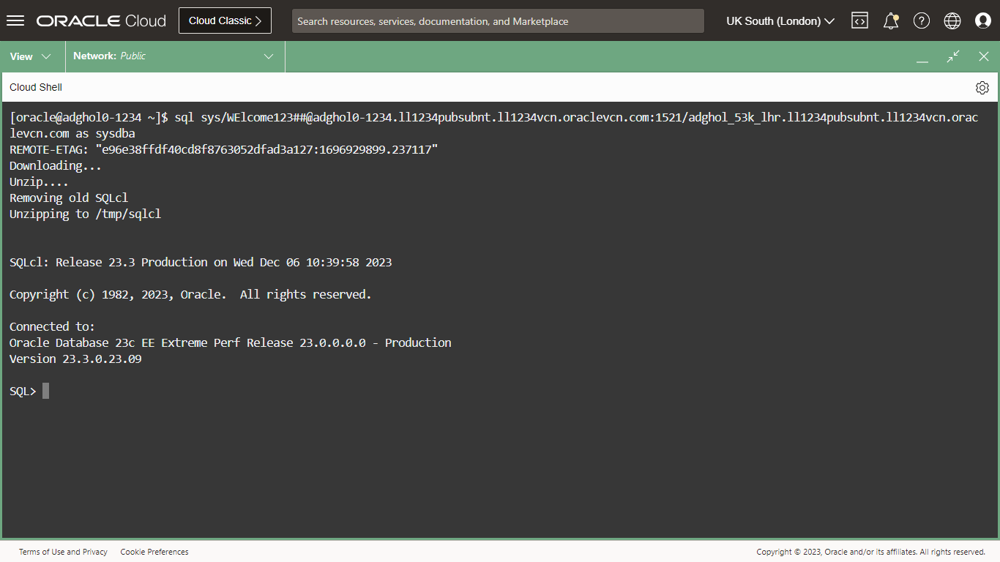

   For example:
   ```
   <copy>
   sql sys/WElcome123##@hol23c0.dbhol23c.misclabs.oraclevcn.com:1521/chol23c_rxd_lhr.dbhol23c.misclabs.oraclevcn.com as sysdba
   </copy>
   ```

   The function `sql` created during Lab 1 should download and run the latest version of SQLcl.

2. Change the date formats, and query `v$dataguard_config`:

   ```
   <copy>
   alter session set nls_date_format='YYYY-MM-DD HH24:MI:SS';
   alter session set nls_timestamp_format='YYYY-MM-DD HH24:MI:SS';
   select * from v$dataguard_config;
   </copy>
   ```

  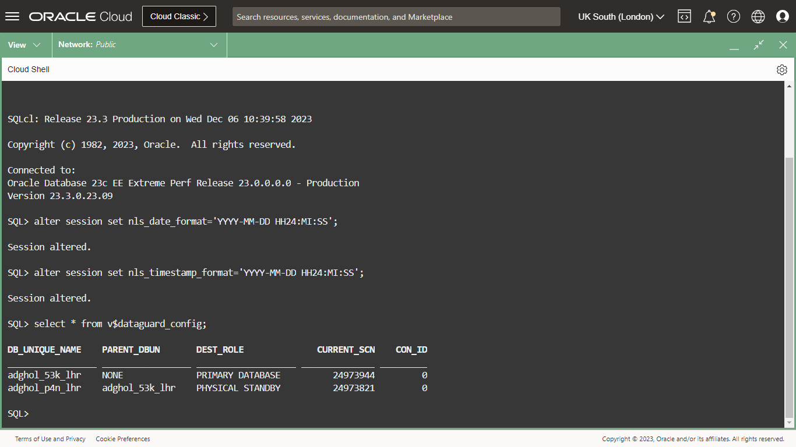

  The view `v$dataguard_config` contains the member of the configuration. The content is the same on the primary and standby databases, and it's helpful to understand the topology at a glance.

1. Query the broker properties from `v$dg_broker_property`:

   ```
   <copy>
   select member, dataguard_role, property, substr(value,1,20), scope, valid_role from v$dg_broker_property;
   </copy>
   ```

  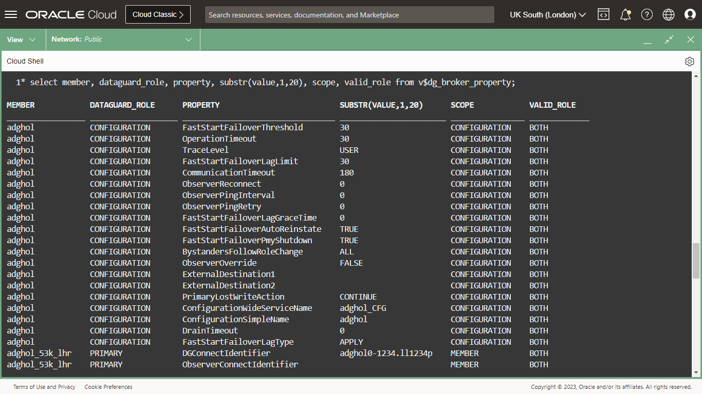

   This view is new in 23ai, and is practical to get any configuration property from a SQL*Net connection, without the need to use `dgmgrl` for that.

1. Query the view `v$dataguard_process`:

   ```
   <copy>
   select name, role, action, client_role, group#, sequence#, block#, block_count, dest_id  from v$dataguard_process;
   </copy>
   ```

  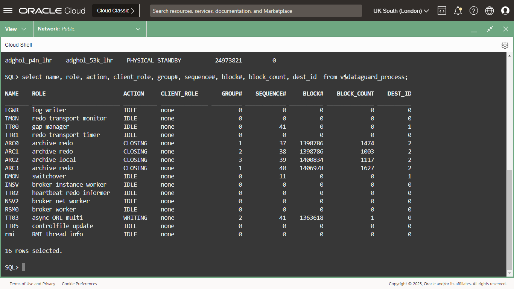

  The view `v$dataguard_process` contains information about the background processes related to Data Guard. For the primary database, you will see, among others:
  * LGWR - the logwriter process
  * TMON - the redo transport monitor process
  * TT0* - there are multiple processes with this name, notably the async ORL multi,  responsible for sending the data asynchronously to the standby database.
  * ARC* - the archiver processes

  Where it applies, these processes will show information about which thread, group, sequence, and block are reading, writing, or sending.

1. Connect to the standby database and select from the same views:

   ```
   <copy>
   connect sys/WElcome123##@ADGHOL1_DGCI as sysdba
   </copy>
   ```

   ```
   <copy>
   select * from v$dataguard_config;
   </copy>
   ```

2. On the standby database you can query the view `v$dataguard_stats` that contains information about the transport and apply lags.

   ```
   <copy>
   select source_db_unique_name, name, value, time_computed, datum_time from v$dataguard_stats;
   </copy>
   ```
  The column `VALUE` contains a value different from `+00 00:00:00` for the transport or apply lag if there is a lag (in this case, ecerything is OK).

   `DATUM_TIME` is extremely important to detect if the standby database is actively receiving data from the primary database. If it does, `DATUM_TIME` will be no more than 1 second older than the current date. Otherwise, you will see `DATUM_TIME` matching the timestamp of the last information received from the primary.

  If you query it again, you will see the `DATUM_TIME` increasing.
   ```
   <copy>
   select source_db_unique_name, name, value, time_computed, datum_time from v$dataguard_stats;
   </copy>
   ```

  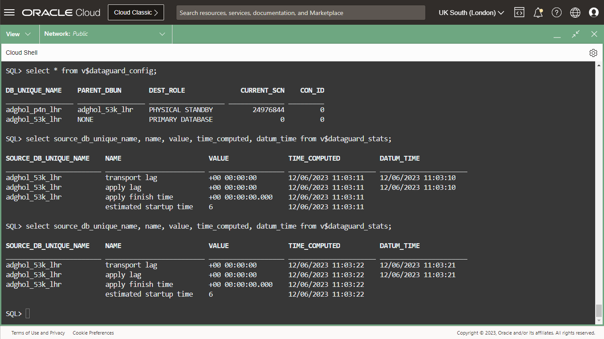

1. Finally, query the view `v$dataguard_process` on the standby to get information about the standby processes:

   ```
   <copy>
   select name, role, action, client_role, group#, sequence#, block#, block_count, dest_id  from v$dataguard_process;
   </copy>
   ```

  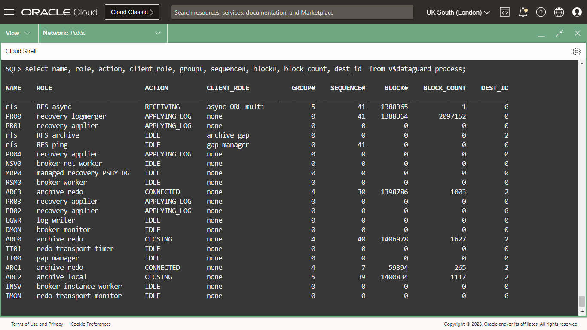

  As you can see, there are more processes related to Data Guard on the standby database. Notably:
  * RFS  - the processes receiving the redo from the primary
  * MRP0 - the process coordinating the recovery processes
  * PR0* - the recovery processes (logmerger, appliers)


## Task 4: Control Data Guard with PL/SQL and enable Flashback Logging

During the validation in Task 2 we have seen that we must enable flashback on the standby database. Remember?

1. While connected to the standby database, try to enable flashback logging. This will fail because the recovery is in progress.

   ```
   <copy>
   select flashback_on from v$database;
   alter database flashback on;
   </copy>
   ```

  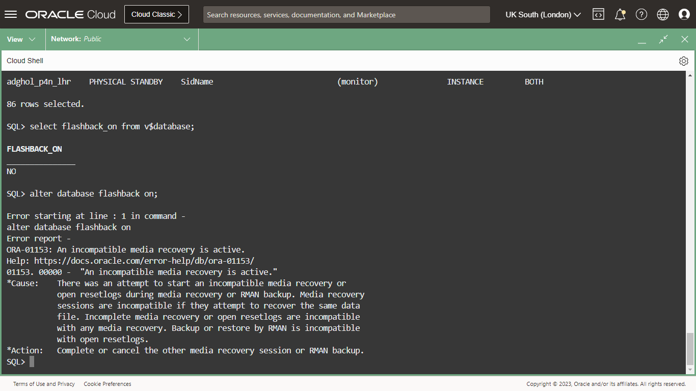

2. We need to stop the recovery. Starting with 23ai, we can also use the new procedures in the `DBMS_DG` package:

   ```
   <copy>
    set serveroutput on
      declare
      severity binary_integer;
      retcode  binary_integer;
      standby_dbuname v$dataguard_config.db_unique_name%type;
    begin
      select db_unique_name into standby_dbuname from v$dataguard_config where dest_role='PHYSICAL STANDBY';
      retcode := dbms_dg.set_state_apply_off ( member_name => standby_dbuname, severity => severity);
      dbms_output.put_line('retcode: '||to_char(retcode)||'  severity: '||to_char(severity));
    end;
    /
   </copy>
   ```

  Run it on the primary or standby database. As you can see, the procedure dynamically gets the standby `db_unique_name` from `v$dataguard_config` using then stops the apply using `dbms_dg.set_state_apply_off`.

  Notice that we cannot use `raise_application_error` on the standby database because it is not a fixed procedure: that means that its definition is in the dictionary and cannot be accessed by a mounted database. More complex procedure can run only on the primary database, or must be rewritten in a way that works on a mounted database.

  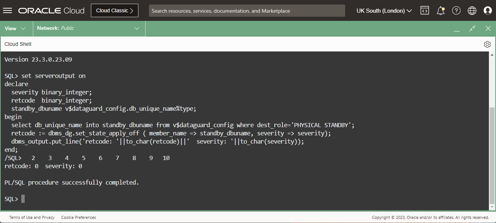

1. At this point, you can enable the flashback logging on the standby database:

   ```
   <copy>
    alter database flashback on;
    select flashback_on from v$database;
   </copy>
   ```

1. As a final step, we must enable the apply. We can do that again using the PL/SQL API:

  ```
  <copy>
  set serveroutput on
    declare
    severity binary_integer;
    retcode  binary_integer;
    standby_dbuname v$dataguard_config.db_unique_name%type;
  begin
    select db_unique_name into standby_dbuname from v$dataguard_config where dest_role='PHYSICAL STANDBY';
    retcode := dbms_dg.set_state_apply_on ( member_name => standby_dbuname, severity => severity);
    dbms_output.put_line('retcode: '||to_char(retcode)||'  severity: '||to_char(severity));
  end;
  /
  </copy>
  ```

  

You have successfully verified and altered the Oracle Data Guard configuration. In the next lab, we will execute the switchover to move the primary workload to the standby database.

## Acknowledgements

- **Author** - Ludovico Caldara, Product Manager Data Guard, Active Data Guard and Flashback Technologies
- **Contributors** - Robert Pastijn
- **Last Updated By/Date** -  Ludovico Caldara, December 2023
