# Verify the Data Guard configuration

## Introduction
In this lab, we will check the configuration and gain a basic knowledge of controlling and monitoring Data Guard.

Estimated Lab Time: 15 Minutes

[Oracle Active Data Guard 23ai](videohub:1_o9gcduc3)

### Requirements
To try this lab, you must have completed:
* Lab 1: Prepare the database hosts
* Lab 2: Prepare the databases
* Lab 3: Configure Data Guard

### Objectives
- Run the validation commands
- Stop and start the redo transport and the apply process
- Review the Data Guard configuration and processes
- Control Data Guard with PL/SQL

## Task 1: Run the validation commands

Oracle Data Guard broker provides several commands to check the health of the Data Guard configuration. You can run them to familiarize yourself with the output.

The SQLcl integration does not yet support `VALIDATE` commands. Therefore, we will use `dgmgrl` for validation purposes.

1. Connect with `dgmgrl` using `sys` username and password. It is irrelevant from which host you connect.
    ```
    <copy>dgmgrl sys/WElcome123##@adghol_site0</copy>
    ```

2. The command `show configuration verbose` gives the configuration status and additionally shows all the configuration-level properties:

    ```
    <copy>show configuration verbose;</copy>
    ```

    

3. The command `validate static connect identifier for all` checks that the specified service is statically registered with the listener:

    ```
    <copy>validate static connect identifier for all;</copy>
    ```

4. Similarly, the command `validate network configuration for all` checks that all member's instances are reachable by each other.
    ```
    <copy>validate network configuration for all;</copy>
    ```

    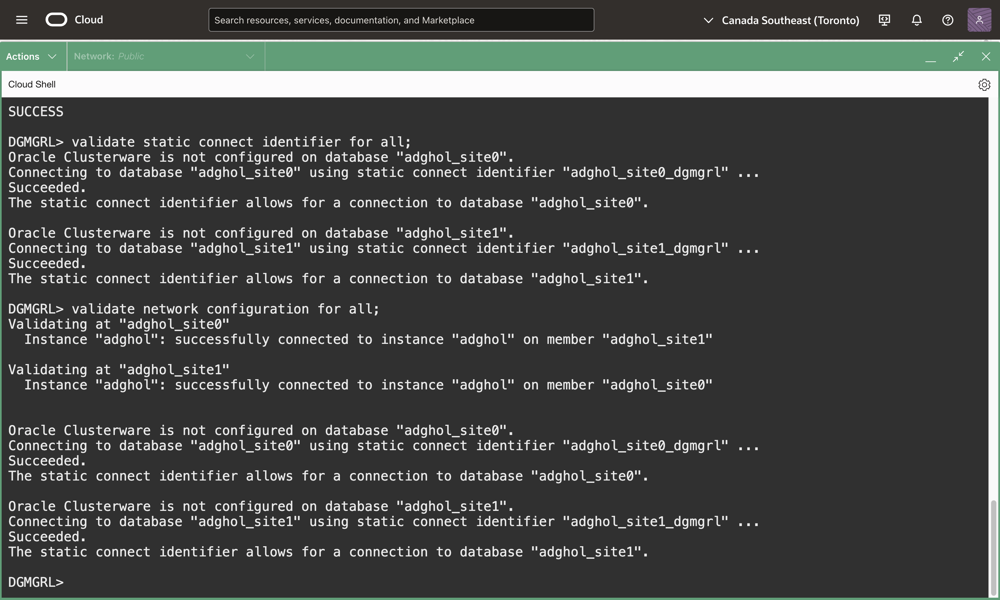

5. The command `validate database` shows the database readiness for switchover and failover. The `verbose` keyword details the different checks performed during the validation. The output will be different between the primary and standby databases.

    ```
    <copy>validate database verbose adghol_site0;</copy>
    ```

    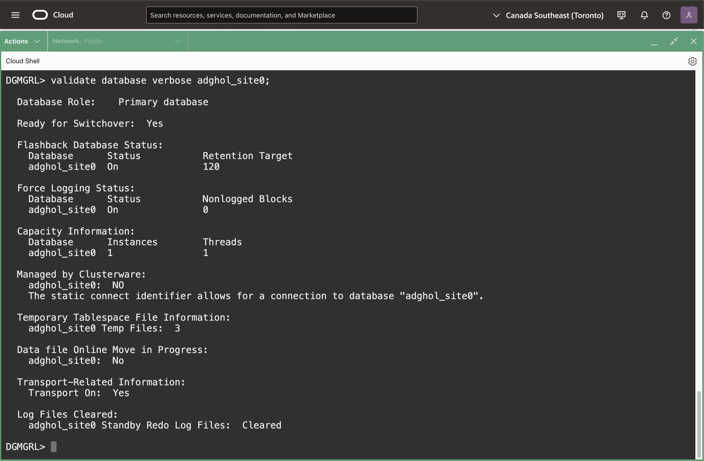

    ```
    <copy>validate database verbose adghol_site1;</copy>
    ```

    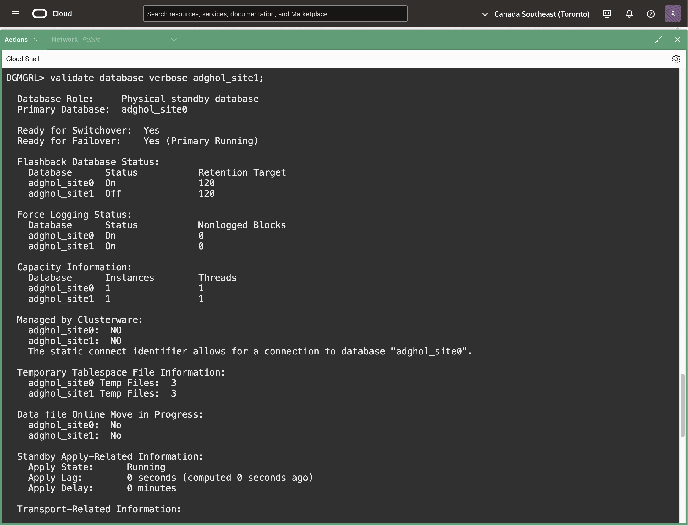
    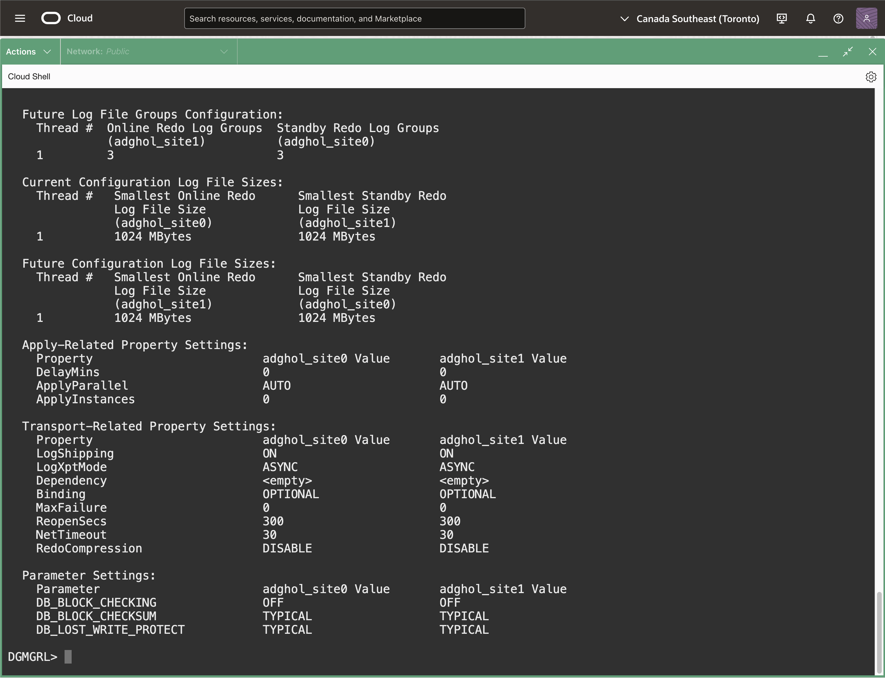

6. The command `validate database ... strict all` makes a stricter validation, reporting `Ready for Switchover: No` in case any of the checks fail, regardless of whether they are strictly required for a switchover.

    ```
    <copy>validate database adghol_site1 strict all;</copy>
    ```

    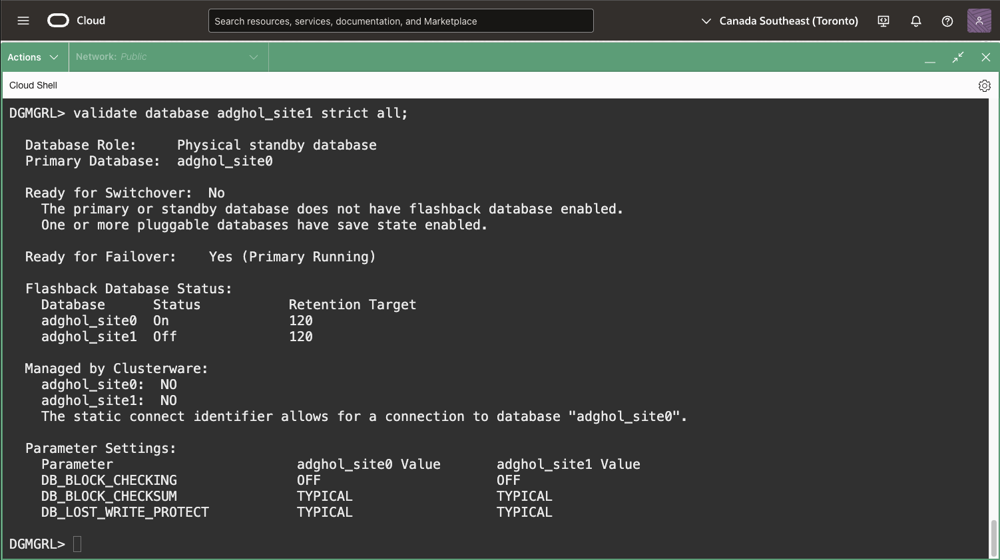

    In this case, you can see that the configuration **is not ready for the switchover**. The output shows that the Flashback logging is not enabled on the standby database and that some PDBs have save state enabled. It won't prevent the switchover from working but might give unexpected problems later, for example, the inability to reinstate the database after a failover.

    Don't worry; we will fix that later.

7. The command `validate database ... spfile` shows the differences between the initialization parameters of the primary database and those of the standby database. Only the parameters that are relevant to Data Guard are shown.

    ```
    <copy>validate database adghol_site1 spfile;</copy>
    ```

    

8. The command `validate dgconnectidentifier` verifies that a specific connect identifier is correctly reachable from all members of the configuration, and that it's possible to connect to it using the same username and password used to start the broker command line session. This is useful when diagnosing connectivity or authentication problems (ORA-01017), especially before executing a role transition.

    Note that we use the TNS aliases here, which in our case match the DB_UNIQUE_NAME, but that would work also with other naming technologies:
    ```
    <copy>validate dgconnectidentifier adghol_site0;</copy>
    ```

    ```
    <copy>validate dgconnectidentifier adghol_site1;</copy>
    ```

    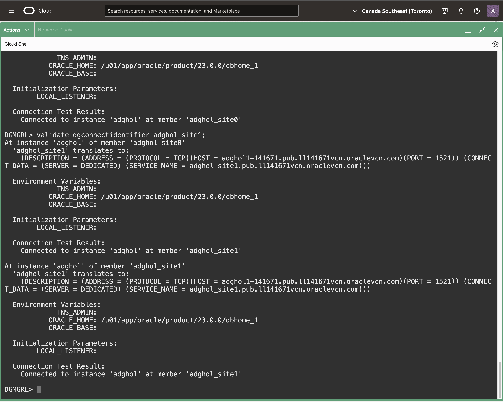

9. Exit the `dgmgrl` command-line. We will perform the other activities using SQLcl.

    ```
    <copy>
    exit
    </copy>
    ```

## Task 2 (OPTIONAL): Stop and start the redo transport and the apply process

When operating Oracle Data Guard, you often stop and start the recovery, pause the redo log shipping, etc.

The following examples show how to do it.

1. Connect with SQLcl to the primary database using its DGConnectIdentifier.

    ```
    <copy>
    sql sys/WElcome123##@adghol_site0 as sysdba
    </copy>
    ```
     
    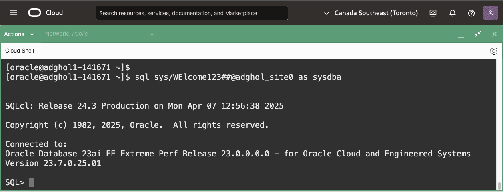

2. Stop the apply process on the standby database.

    ```
    <copy>
    dg edit database adghol_site1 set state=apply-off;
    </copy>
    ```

3. Restart the apply process.

    ```
    <copy>
    dg edit database adghol_site1 set state=apply-on;
    </copy>
    ```

4. Stop the redo transport from the primary to the standby database(s). **Note:** we speficy the primary `db_unique_name` this time.

    ```
    <copy>
    dg edit database adghol_site0 set state=transport-off;
    </copy>
    ```

5. Restart the transport process.

    ```
    <copy>
    dg edit database adghol_site0 set state=transport-on;
    </copy>
    ```

6. When you have multiple standby databases, you can stop the transport to a specific standby database instead of stopping the whole transport from the primary. In that case, you can change the property `LogShipping` on the standby database:

    ```
    <copy>
    dg edit database adghol_site1 set property logshipping=off;
    </copy>
    ```

    That will only alter the corresponding log_archive_dest on the source database shipping to the specified standby database.

7. Restart the log shipping to the standby database.
    ```
    <copy>
    dg edit database adghol_site1 set property logshipping=on;
    </copy>
    ```

    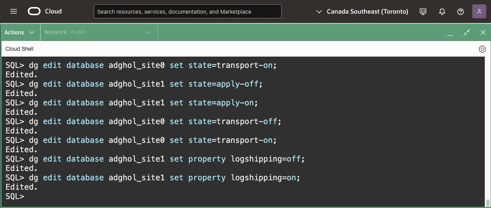

## Task 3: Review the Data Guard configuration and processes

Oracle Data Guard exposes many fixed views that help observe and monitor the Data Guard configuration. It is essential to get familiar with them.

1. **If you haven't already**, connect with SQLcl to the primary database using its DGConnectIdentifier.

    ```
    <copy>
    sql sys/WElcome123##@adghol_site0 as sysdba
    </copy>
    ```
     
2. Query `v$dg_broker_config`:

    ```
    <copy>
    select database, connect_identifier, dataguard_role, redo_source, severity, switchover_ready, failover_ready, transport_mode
    from v$dg_broker_config;
    </copy>
    ```

    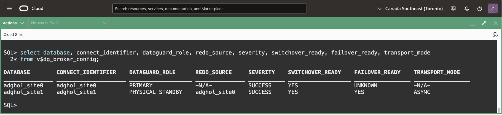

    The view `v$dg_broker_config` contains the configuration members. The content is the same on the primary and standby databases, and it's helpful to understand the topology.

3. Query the broker properties from `v$dg_broker_property`:

    ```
    <copy>
    select member, dataguard_role, property, substr(value,1,20), scope, valid_role from v$dg_broker_property;
    </copy>
    ```

    

    This view is new in 23ai and is practical for getting any configuration property from a SQL*Net connection.

4. Query the view `v$dataguard_process`:

    ```
    <copy>
    select name, role, action, client_role, group#, sequence#, block#, block_count, dest_id  from v$dataguard_process;
    </copy>
    ```

    

    The view `v$dataguard_process` contains information about the background processes related to Data Guard. For the primary database, you will see, among others:
    * LGWR - the log writer process
    * TMON - the redo transport monitor process
    * TT0* - there are multiple processes with this name, notably the async ORL multi, which is responsible for sending the data asynchronously to the standby database.
    * ARC* - the archiver processes
 
    Where it applies, these processes will show information about which thread, group, sequence, and block are reading, writing, or sending.

5. Connect to the standby database and select from the same views:

    ```
    <copy>
    connect sys/WElcome123##@adghol_site1 as sysdba
    </copy>
    ```

    ```
    <copy>
    select database, connect_identifier, dataguard_role, redo_source, severity, switchover_ready, failover_ready, transport_mode
    from v$dg_broker_config;
    </copy>
    ```

6. On the standby database, you can query the view `v$dataguard_stats`, which contains information about the transport and apply lag.

    ```
    <copy>
    select source_db_unique_name, name, value, time_computed, datum_time from v$dataguard_stats;
    </copy>
    ```
    The column `VALUE` contains a value different from `+00 00:00:00` for the transport or apply lag if there is a lag (in this case, everything is OK).

    `DATUM_TIME` is extremely important to detect if the standby database actively receives data from the primary database. If it does, `DATUM_TIME` will be no more than 1 second older than the current date. Otherwise, you will see `DATUM_TIME` matching the timestamp of the last information received from the primary.

    If you query it again, you will see the `DATUM_TIME` increasing.
    ```
    <copy>
    select source_db_unique_name, name, value, time_computed, datum_time from v$dataguard_stats;
    </copy>
    ```

    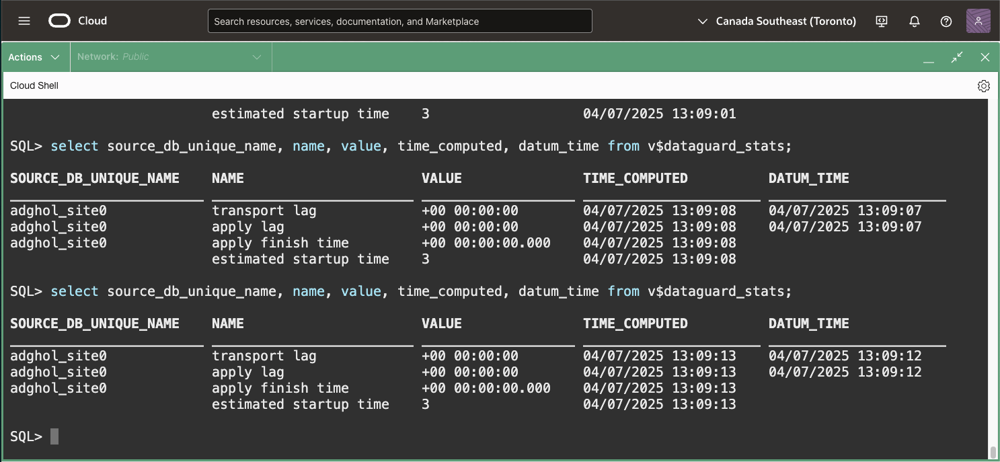

7. Finally, query the view `v$dataguard_process` on the standby to get information about the standby processes:

    ```
    <copy>
    select name, role, action, client_role, group#, sequence#, block#, block_count, dest_id  from v$dataguard_process;
    </copy>
    ```

    

    As you can see, there are more processes related to Data Guard on the standby database. Notably:
    * RFS  - the processes receiving the redo from the primary
    * MRP0 - the process coordinating the recovery processes
    * PR0* - the recovery processes (log merger, appliers)


## Task 4: Control Data Guard with PL/SQL and enable Flashback Logging

During the validation in Task 2 we have seen that we must enable flashback on the standby database. Remember?

1. **While connected to the standby database**, try to enable flashback logging. It will fail because the recovery is in progress.

    ```
    <copy>
    -- to exeute when connected to adghol_site1
    select flashback_on from v$database;
    alter database flashback on;
    </copy>
    ```

    

2. We need to stop the recovery. We could use the DG commands that we have seen in Task 2. Starting with 23ai, we can also use the new procedures in the `DBMS_DG` package:

    ```
    <copy>
     set serveroutput on
       declare
       severity binary_integer;
       retcode  binary_integer;
       standby_dbuname v$dataguard_config.db_unique_name%type;
     begin
       select db_unique_name into standby_dbuname from v$dataguard_config where dest_role='PHYSICAL STANDBY';
       retcode := dbms_dg.set_state_apply_off ( member_name => standby_dbuname, severity => severity);
       dbms_output.put_line('retcode: '||to_char(retcode)||'  severity: '||to_char(severity));
     end;
     /
    </copy>
    ```

    Run it on the primary or standby database. As you can see, the procedure dynamically gets the standby `db_unique_name` from `v$dataguard_config` and then stops the apply using `dbms_dg.set_state_apply_off`.

    Notice that we cannot use `raise_application_error` on the standby database because it is not a fixed procedure: that means that its definition is in the dictionary and cannot be accessed by a mounted database. More complex procedure can run only on the primary database, or must be rewritten in a way that works on a mounted database.

    

    (Alternatively, you could use the DG command equivalent for it):
    ```
    <copy>
    dg edit database adghol_site1 set state=apply-off;
    </copy>
    ```

3. At this point, you can enable the flashback logging on the standby database:

    ```
    <copy>
     alter database flashback on;
     select flashback_on from v$database;
    </copy>
    ```

4. As a final step, we must enable the apply. We can do that again using the PL/SQL API:

    ```
    <copy>
    set serveroutput on
      declare
      severity binary_integer;
      retcode  binary_integer;
      standby_dbuname v$dataguard_config.db_unique_name%type;
    begin
      select db_unique_name into standby_dbuname from v$dataguard_config where dest_role='PHYSICAL STANDBY';
      retcode := dbms_dg.set_state_apply_on ( member_name => standby_dbuname, severity => severity);
      dbms_output.put_line('retcode: '||to_char(retcode)||'  severity: '||to_char(severity));
    end;
    /
    </copy>
    ```

    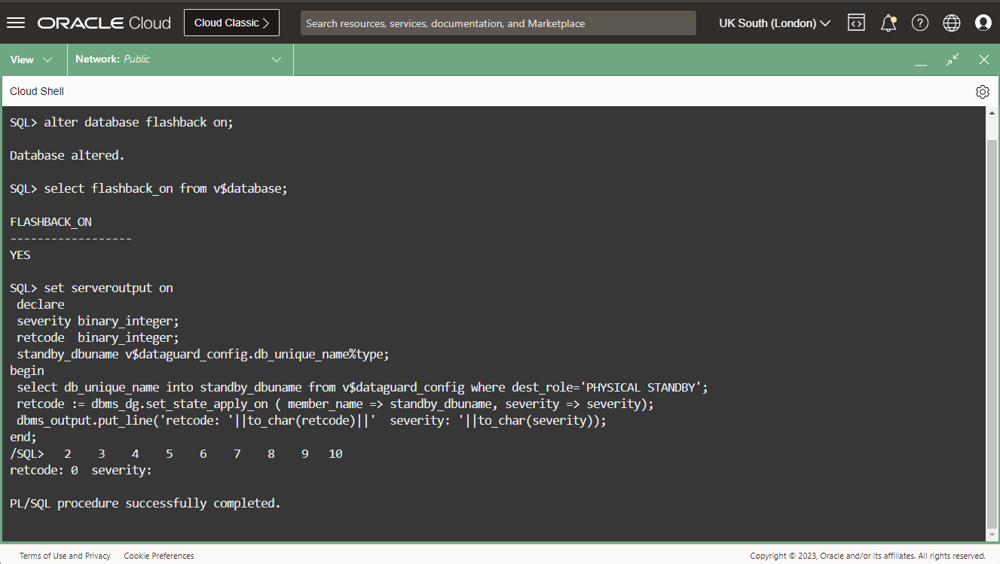

    (Alternatively, you could use the DG command equivalent for it):
    ```
    <copy>
    dg edit database adghol_site1 set state=apply-on;
    </copy>
    ```

5. Exit the SQLcl command-line.

    ```
    <copy>
    exit
    </copy>
    ```


You have successfully verified and altered the Oracle Data Guard configuration. In the next lab, we will create role-based services to connect the applications to the correct database depending on the role (primary or standby).

## Acknowledgements

- **Author** - Ludovico Caldara, Product Manager Data Guard, Active Data Guard and Flashback Technologies
- **Contributors** - Robert Pastijn
- **Last Updated By/Date** -  Ludovico Caldara, July 2025
