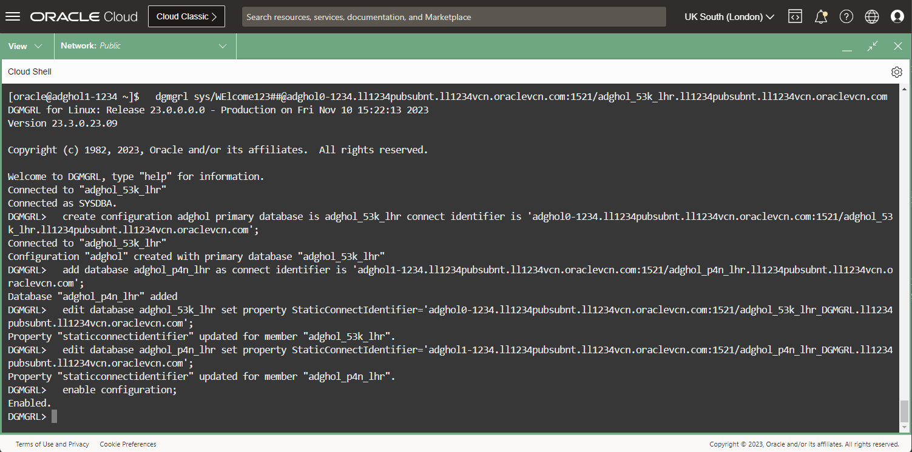
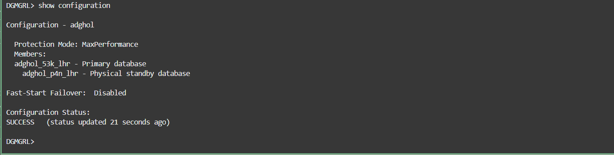

# Create and verify the Data Guard configuration

## Introduction
In this lab, we configure Oracle Data Guard using the broker.

The broker automates all the aspects of a Data Guard topology, including setting up the redo transport, coordinating switchovers and failovers, monitoring the lags, etc.

For more information about the Data Guard broker, refer to the [broker documentation](https://docs.oracle.com/en/database/oracle/oracle-database/23/dgbkr/oracle-data-guard-broker-concepts.html#GUID-723E5B73-A350-4B2E-AF3C-5EA4EFC83966).

After configuring the broker, we will check the configuration and have a basic knowledge of how to control and monitor Data Guard.

Estimated Lab Time: 10 Minutes

### Requirements
To try this lab, you must have successfully completed:
* Lab 1: Prepare the database hosts
* Lab 2: Prepare the databases

### Objectives
- Configure Data Guard
- Run the validation commands
- Stop and start the redo transport and the apply process
- Review the Data Guard configuration and processes
- Control Data Guard with PL/SQL

## Task 1: Configure Data Guard

You should have two Cloud Shell tabs connected to the primary and secondary hosts, adghol0 and adghol1. If you don't, follow the first steps of Lab 1 until you have both SSH connections established.

1. From a terminal (which one of the two is irrelevant for this task), connect to the primary database using the broker client command-line (DGMGRL). We use the DGConnectIdentifier for that (the service named after the db_unique_name). Replace `ADGHOL0_DGCI` with the one noted down during Lab 2.

  ```
  <copy>
  dgmgrl sys/WElcome123##@ADGHOL0_DGCI
  </copy>
  ```
  For example:
  ```
  dgmgrl sys/WElcome123##@adghol0-1234.ll1234pubsubnt.ll1234vcn.oraclevcn.com:1521/adghol_53k_lhr.ll1234pubsubnt.ll1234vcn.oraclevcn.com
  ```

1. Create the configuration using the `CREATE CONFIGURATION` command. Again, replace `ADGHOL0_DGCI` with the actual connect string and `ADGHOL0_UNIQUE_NAME` with the actual db_unique_name:

  ```
  <copy>
  create configuration adghol primary database is ADGHOL0_UNIQUE_NAME connect identifier is 'ADGHOL0_DGCI';
  </copy>
  ```
  For example:
  ```
  create configuration adghol primary database is adghol_53k_lhr connect identifier is 'adghol0-1234.ll1234pubsubnt.ll1234vcn.oraclevcn.com:1521/adghol_53k_lhr.ll1234pubsubnt.ll1234vcn.oraclevcn.com';
  ```

1. Add the standby database to the configuration using the `ADD DATABASE` command. Replace `ADGHOL1_DGCI` and `ADGHOL1_UNIQUE_NAME` with the actual connect string and db_unique_name of the standby database:

  ```
  <copy>
  add database ADGHOL1_UNIQUE_NAME as connect identifier is 'ADGHOL1_DGCI';
  </copy>
  ```
  For example:
  ```
  add database adghol_p4n_lhr as connect identifier is 'adghol1-1234.ll1234pubsubnt.ll1234vcn.oraclevcn.com:1521/adghol_p4n_lhr.ll1234pubsubnt.ll1234vcn.oraclevcn.com';
  ```

  Notice that we don't specify the static service (suffixed with _DGMGRL), because under normal operation, the broker expect the standby to be mounted, therefore the default service is available.

1. (Optional): set the `StaticConnectIdentifier` for both databases.
  Although the broker builds the default static connect identifier if it's not explicitly configured, it is still a good practice to set it to ease troubleshooting.

  Replace `ADGHOL0_DGCI`, `ADGHOL0_SCI`, `ADGHOL1_DGCI`, and `ADGHOL1_SCI` with the actual values:
  ```
  <copy>
  edit database ADGHOL0_UNIQUE_NAME set property StaticConnectIdentifier='ADGHOL0_SCI';

  edit database ADGHOL1_UNIQUE_NAME set property StaticConnectIdentifier='ADGHOL1_SCI';
  </copy>
  ```
  For example:
  ```
  <copy>
  edit database adghol_53k_lhr set property StaticConnectIdentifier='adghol0-1234.ll1234pubsubnt.ll1234vcn.oraclevcn.com:1521/adghol_53k_lhr_DGMGRL.ll1234pubsubnt.ll1234vcn.oraclevcn.com';

  edit database adghol_p4n_lhr set property StaticConnectIdentifier='adghol1-1234.ll1234pubsubnt.ll1234vcn.oraclevcn.com:1521/adghol_p4n_lhr_DGMGRL.ll1234pubsubnt.ll1234vcn.oraclevcn.com';
  </copy>
  ```

1. Enable the configuration. This final command will set the required parameters and execute the required commands to start redo shipping and apply from the primary to the standby database:

  ```
  <copy>
  enable configuration;
  </copy>
  ```

  

  The command `show configuration` should report success.

  ```
  <copy>
  enable configuration;
  </copy>
  ```

  

  That means that the primary can contact the standby database with the `DGConnectIdentifier`, send the redo stream with no lag, and the standby database can apply it successfully without lag.

## Task 2: Run the validation commands (optional)

Oracle Data Guard broker provides several commands to check the health of the Data Guard configuration. You can run them to get familiar with the output:

1. The command `show configuration verbose` gives the configuration status and additionally shows all the configuration-level properties:

  ```
  <copy>show configuration verbose;</copy>
  ```

1. The command `validate static connect identifier for all` checks that the static connect identifiers of all members are reachable by all members.

  ```
  <copy>validate static connect identifier for all;</copy>
  ```

1. Similarly, the command `validate network configuration for all` checks the network configuration is healthy.

  ```
  <copy>validate network configuration for all;</copy>
  ```

1. The command `validate database` shows the database readiness for switchover and failover. With the `verbose` keyword, it gives additional detail regarding the different checks performed during the validation.

  The output will be different from primary and standby database.

  Replace the db_unique_name as usual:

  ```
  <copy>validate database verbose ADGHOL0_UNIQUE_NAME;</copy>
  ```

  ```
  <copy>validate database verbose ADGHOL1_UNIQUE_NAME;</copy>
  ```

1. The command `validate database ... strict all` makes a stricter validation, reporting `Ready for Switchover: No` in case any of the checks fail, regardless if they are strictly required for a switchover or not.

  ```
  <copy>validate database ADGHOL1_UNIQUE_NAME strict all;</copy>
  ```

  In this case, you can see that the configuration is not ready for the switchover. The output shows that the Flashback logging is not enabled on the standby database. This won't prevent the switchover from working, but might give unexpected problems later, for example, the inability to reinstate the new primary in case of failover.

  Don't worry, we will fix that later.

1. The command `validate database ... spfile` shows the differences between the initialization parameters of the primary database and those of the standby database. Only the parameters that are relevant to Data Guard are shown.

  ```
  <copy>validate database ADGHOL1_UNIQUE_NAME spfile;</copy>
  ```

1. The command `validate dgconnectidentifier` verifies that a specific connect identifier is correctly reachable from all members of the configuration, and that it's possible to connect to it using the same username and password used to start the broker command-line session. That is really important when diagnosing connectivity or authentication problems (ORA-01017), especially before executing a role transition.

  Change the DGConnectIdentifier with the appropriate one.
  ```
  <copy>validate dgconnectidentifier ADGHOL0_DGCI;</copy>
  ```

  ```
  <copy>validate dgconnectidentifier ADGHOL1_DGCI;</copy>
  ```

## Task 3: Stop and start the redo transport and the apply process (optional)

edit database chol23c_r2j_lhr set state=apply-off;
edit database chol23c_r2j_lhr set state=apply-on;
edit database chol23c_rxd_lhr set state=transport-off;
edit database chol23c_rxd_lhr set state=transport-on;
edit database chol23c_r2j_lhr set property logshipping=off;
edit database chol23c_r2j_lhr set property logshipping=on;


## Task 4: Review the Data Guard configuration and processes

sql sys/Welcome#Welcome#123@hol23c0.dbhol23c.misclabs.oraclevcn.com:1521/chol23c_rxd_lhr.dbhol23c.misclabs.oraclevcn.com as sysdba
alter session set nls_date_format='YYYY-MM-DD HH24:MI:SS';
alter session set nls_timestamp_format='YYYY-MM-DD HH24:MI:SS';
--- tmux resize-pane -Z -t :.0
select * from v$dataguard_config;
select name, role, action, client_role, group#, sequence#, block#, block_count, dest_id  from v$dataguard_process;
---# ---------------------------------------- SHOWING THE PROCESSES ON THE STANDBY
--- tmux select-pane -t :.0
connect sys/Welcome#Welcome#123@hol23c1.dbhol23c.misclabs.oraclevcn.com:1521/chol23c_r2j_lhr.dbhol23c.misclabs.oraclevcn.com as sysdba
select * from v$dataguard_config;
select * from v$dataguard_stats;
select * from v$dataguard_status;
---# the process PR00 is a parallel recovery slave of MRP0. It should show the sequence and block increasing
select name, role, action, client_role, group#, sequence#, block#, block_count, dest_id  from v$dataguard_process;

## Task 5: Control Data Guard with PL/SQL

select member, dataguard_role, property, substr(value,1,20), scope, valid_role from v$dg_broker_property;
select flashback_on from v$database;
alter database flashback on;
set serveroutput on
DECLARE
  severity BINARY_INTEGER;
  retcode  BINARY_INTEGER;
BEGIN
  retcode := DBMS_DG.SET_STATE_APPLY_OFF ( member_name => 'chol23c_r2j_lhr', severity => severity);
  dbms_output.put_line('retcode: '||to_char(retcode)||'  severity: '||to_char(severity));
END;
/
select * from v$dataguard_stats;
alter database flashback on;
select flashback_on from v$database;
select name, role, action, action_dur, client_role, sequence#, block#, dest_id  from v$dataguard_process;
DECLARE
  severity BINARY_INTEGER;
  retcode  BINARY_INTEGER;
BEGIN
  retcode := DBMS_DG.SET_STATE_APPLY_ON ( member_name => 'chol23c_r2j_lhr', severity => severity);
  dbms_output.put_line('retcode: '||to_char(retcode)||'  severity: '||to_char(severity));
END;
/
--- tmux resize-pane -Z -t :.0
