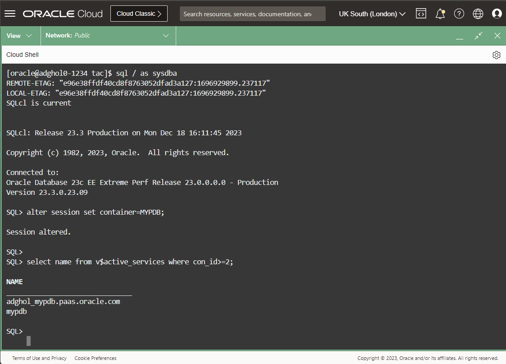
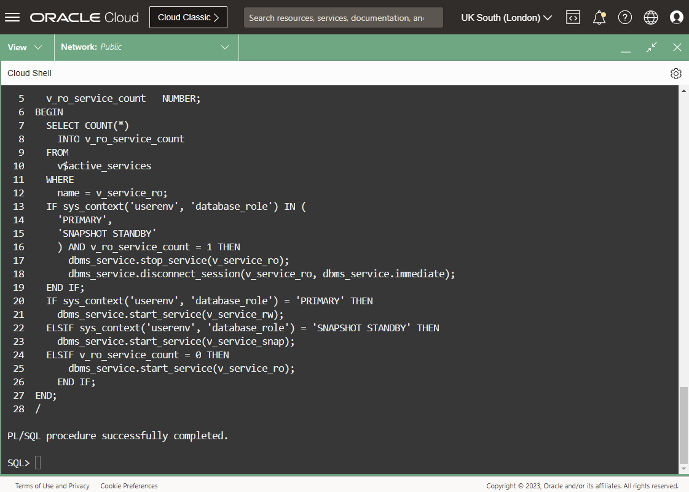
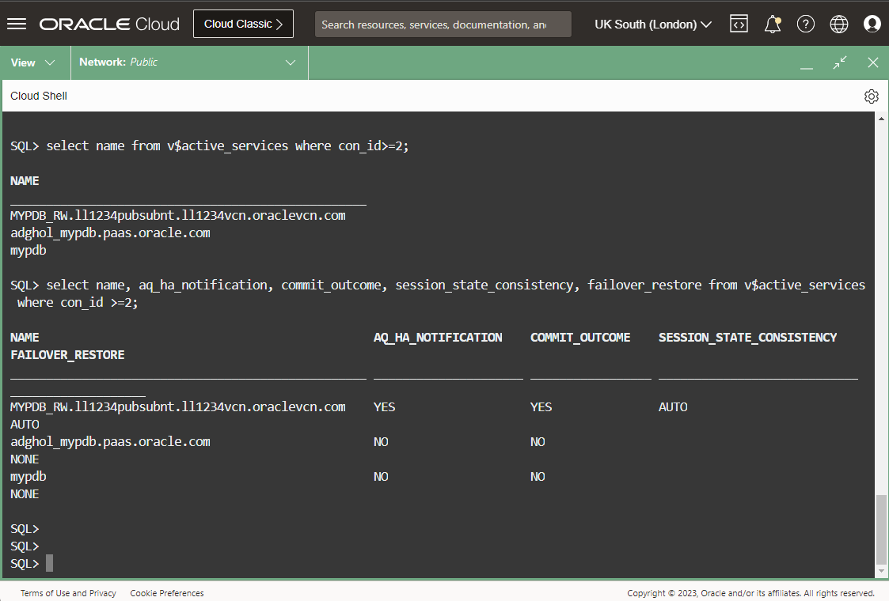

# Create role-based services

## Introduction

Once the Data Guard configuration is in place, it is important to connect to the databases using highly-available connection strings. The connection strings, besides having multiple addresses, require connections to specific application services (for example, the OLTP read-write service for the HR application). The read-write services should only be available on the primary database. If it's not the case, the application would run into problems when connecting to a database that is not available for write operations.  Also, when having a highly-available connection strings, it's possible to keep the same connection string across role changes (e.g. after a failover or a switchover), without reconfiguring the application connectivity.

The services that run only on databases with specific roles are called role-based services.

**Never configure your applications to connect to the default services!** Always use a role-based application service with high availability properties.

Oracle recommends that you use Oracle Clusterware for Real Application Clusters databases, or Oracle Restart for single instance databases when you need to configure role-based services. The Oracle Data Guard broker is aware of Oracle Clusterware, and delegates the stop and start of the instances to it. Also, Oracle Clusterware optimally manages the role-based services.

However, when Oracle Clusterware is not available (like on single-instance deployments on OCI Base Database Services), one has to manage role-based services in a different way. Typically, we use the `DBMS_SERVICES` package along with startup triggers to stop and start the correct services depending on the database role.

In this lab, we will create the services for the primary, physical standby, and snapshot standby roles, along with the trigger that stops and starts them. We will then test the connection to the primary service.


Estimated Lab Time: 5 Minutes

### Requirements
To try this lab, you must have successfully completed:
* Lab 1: Prepare the database hosts
* Lab 2: Prepare the databases
* Lab 3: Configure and Verify Data Guard

### Objectives
* Create and start the role-based services
* Review the connect strings and connect to the primary service

## Task 1: Create and start the role-based services

1. Review the scripts that we'll use to create the services. We downloaded the scripts in the first lab. They are in the directory:

  ```
  <copy>
  cd ~/livelabs-database-maa/data-guard/active-data-guard-23c/prepare-host/scripts/tac
  </copy>
  ```

2. Connect to the PDB and verify the existing services:

  ```
  <copy>
sql / as sysdba
  </copy>
  ```

  ```
  <copy>
alter session set container=MYPDB;
select name from v$active_services where con_id>=2;
  </copy>
  ```

  

3. Create and start the services using the scripts in the following order:

  ```
  <copy>
  set echo on
  @create_pdb_services.sql
  @create_pdb_service_trigger.sql
  @execute_pdb_service_trigger.sql
  </copy>
  ```

  

  The first script creates the service definition with high availability properties. Three services are created:
  * MYPDB_RW for the primary role
  * MYPDB_RO for the physical standby role
  * MYPDB_SNAP for the snapshot standby role

  The second script creates the startup trigger to start or stop the services depending on the database role.

  The last script executes the same code as the startup trigger, so the services are started without restarting the PDB.

4. After the execution, the read-write service is running with high availability properties:

  ```
  <copy>
select name from v$active_services where con_id>=2;
select name, aq_ha_notification, commit_outcome, session_state_consistency, failover_restore from v$active_services where con_id >=2;
exit
  </copy>
  ```

  

## Task 2: Review the connect strings and connect to the primary service


  ```
  <copy>
  </copy>
  ```

## Acknowledgements

- **Author** - Ludovico Caldara, Product Manager Data Guard, Active Data Guard and Flashback Technologies
- **Contributors** - Robert Pastijn
- **Last Updated By/Date** -  Ludovico Caldara, December 2023
