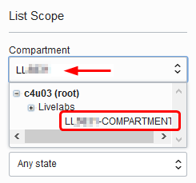
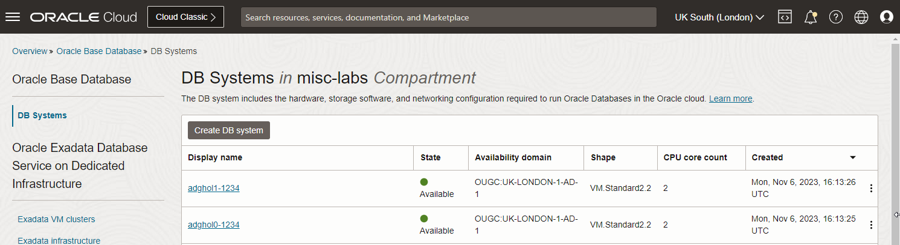
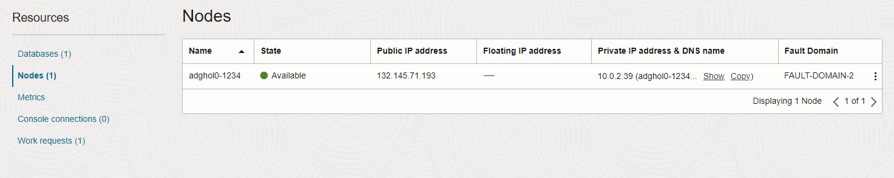
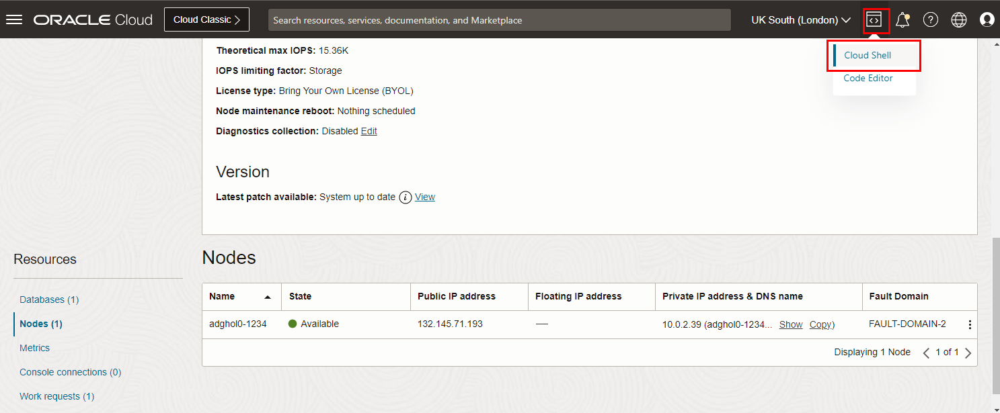
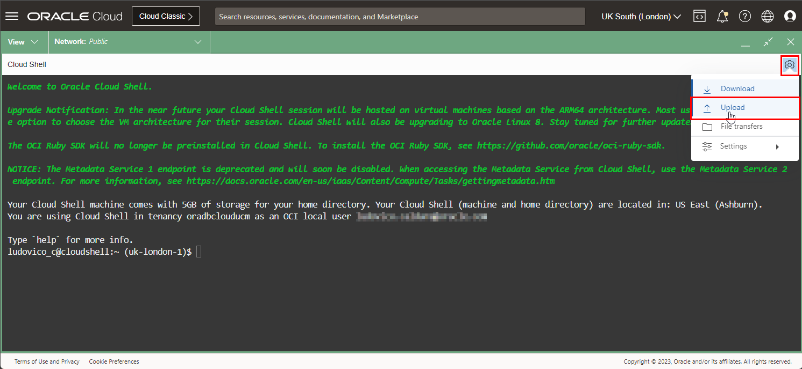
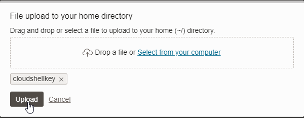
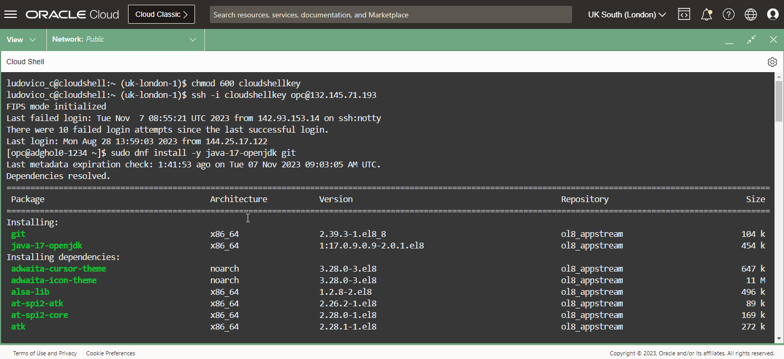
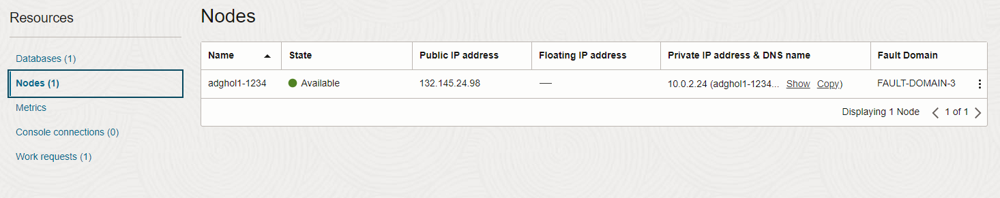

# Prepare the hosts for Data Guard

## Introduction
In this lab, we connect to the database hosts and do some preliminary preparation for the Data Guard configuration.

Estimated Lab Time: 15 Minutes

### Objectives
- Create a connection to the primary database host
- Prepare the primary database host
- Create a connection to the standby database host
- Prepare the standby database host

## Task 1: Create the connection to the primary database host

1. Open up the menu in the left hand corner.  

2. From the menu, select **Oracle Database**, then **Oracle Base Database (VM, BM)**.

  

3. In the List Scope section on the left, enter the first part of the compartment assigned to you in the Search field, then click the compartment name.

  

   There are two Database Systems created for you. The system prefixed with `adghol0` is your primary database, and the system prefixed with `adghol1` is your secondary database.

1. Click the name of the primary database (`adghol0`).

  

  Scroll down on the page and click on **Nodes(1)** to find the host's **Public IP Address**. Copy the address on the clipboard and make sure to have this information noted down for later.

  

5. Open the **Cloud Shell** using the icon next to the region.

  

  The Cloud Shell opens after a few seconds and shows the **prompt**.

7. Find your ssh private key which has been created earlier to connect to the host where the primary database is located.

  a. If you have used Reserve Workshop on Livelabs option(Green Button), you should have used anyone of the method for generating SSH key pairs using [How to Generate SSH Keys](https://oracle-livelabs.github.io/common/labs/generate-ssh-key/?lab=generate-ssh-keys) .

  Now, you should have the **Public** and **Private** key pair. You must have provided the Public Key while reserving the lab and you need the repsective Private key to connect the DB Server.

  b. If you have used Run on Your Tenancy option (Brown Button), you must use the downloaded public and private keys ( While creating the DB Systems) for connecting to the DB servers.

  In all the labs we use Cloud shell to connect to the DB server. You can also connect to the DB servers in anyone of your preferred way such as Terminal in Mac, Powershell in Windows, Putty etc.  Refer the above mentioned link [How to Connect to Servers](https://oracle-livelabs.github.io/common/labs/generate-ssh-key/?lab=generate-ssh-keys) for detailed instructions. Once you are connected to the DB server, **rest of the instructions will remain same**.

7. Using the **Upload** facility, upload the private key in the **Cloud Shell** environment.

  

  

8. Change the permission of the private key to `0600` and connect to the primary host as `opc`, using the public IP address that you have noted down earlier.
    ````
    <copy>chmod 600 cloudshellkey</copy>
    ````
    Replace `cloudshellkey` with the name of your private key file.
    ````
    <copy>ssh -i cloudshellkey opc@IP_ADDRESS</copy>
    ````
    Replace `cloudshellkey` with the name of your private key file, and `IP_ADDRESS` with the real public IP address.

  You should be connected to the primary database host.

## Task 2: Prepare the primary database host

1. Install some packages that we will use later:

    ````
    <copy>sudo dnf install -y java-17-openjdk git</copy>
    ````

  

1. Become the `oracle` user:

    ````
    <copy>sudo su - oracle</copy>
    ````

1. Download the helper scripts using git:

  ````
  <copy>
  git clone -b adghol23c -n --filter=tree:0 --depth=1 https://github.com/lcaldara-oracle/livelabs-database-maa.git
  cd livelabs-database-maa
  git sparse-checkout set --no-cone data-guard/active-data-guard-23c/prepare-host/scripts
  git checkout
  </copy>
  ````

1. Execute the preparation script. This will:
  * Set up a function for the execution of the last version of SQLcl
  * Create the static service registration entry in listener.ora
  * Create the application TNS entries in tnsnames.ora

  ```
  <copy>
  sh ~/livelabs-database-maa/data-guard/active-data-guard-23c/prepare-host/scripts/prepare.sh
  </copy>
  ```

  The static listener registration is required for the duplicate, and also because there is no Oracle Clusterware: the Data Guard has to restart the remote instance with a SQL*Net connection.

## Task 3: Create a connection to the standby database host

1. Duplicate the tab in your browser. If your browser does not support tab duplication, open a new tab and connect again to the Cloud Console.

2. Repeat all the steps from **Task 1: Create the connection to the primary database host**

  This time, select the **adghol1** DB System (the standby database).

  

  Scroll down on the page and click on **Nodes(1)** to get the public IP address. Copy it to the clipboard and make sure to have this information noted down.

  

5. Open the **Cloud Shell** using the icon next to the region.

  

  The Cloud Shell opens after a few seconds and shows the **prompt**.

7. The private key that you have uploaded in the previous step should already be there. The same key can be used to connect to the standby database host.

  Connect to the standby host as `opc`, using the public IP address that you have noted down earlier.
    ````
    <copy>ssh -i cloudshellkey opc@IP_ADDRESS2</copy>
    ````
    Replace `cloudshellkey` with the name of your private key file, and `IP_ADDRESS2` with the public IP address of the standby database host.

9. You should be connected to the standby database host. You can become **oracle** using `sudo su - oracle` and connect to the instance with the command `sqlplus / as sysdba` and execute a query:

    ````
    <copy>Select name, db_unique_name, database_role from v$database;</copy>
    ````

  

You have now successfully created a database connection to the primary and the standby database.

## Acknowledgements

- **Author** - Ludovico Caldara, Product Manager Data Guard, Active Data Guard and Flashback Technologies
- **Contributors** - Robert Pastijn, Suraj Ramesh
- **Last Updated By/Date** -  Ludovico Caldara, July 2022
