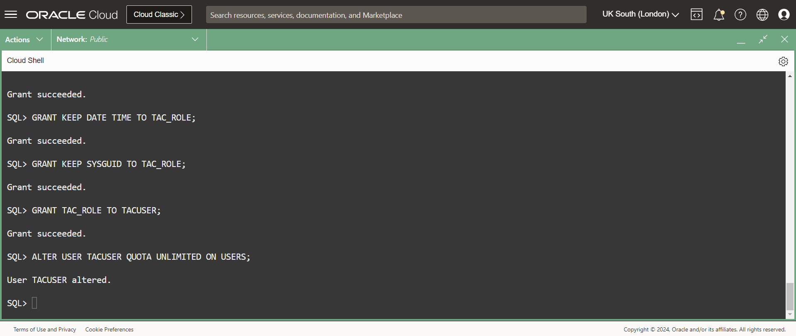
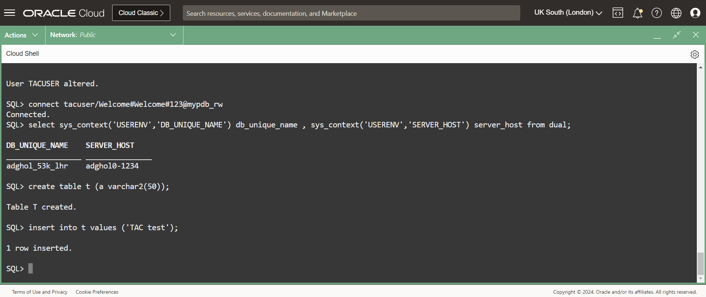
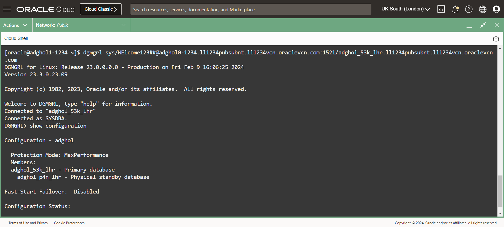
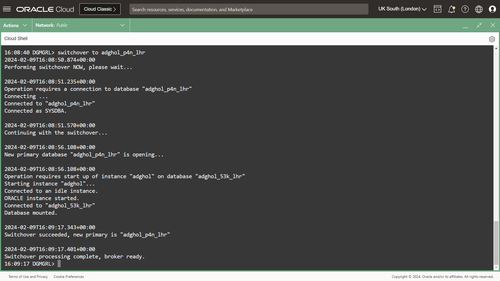
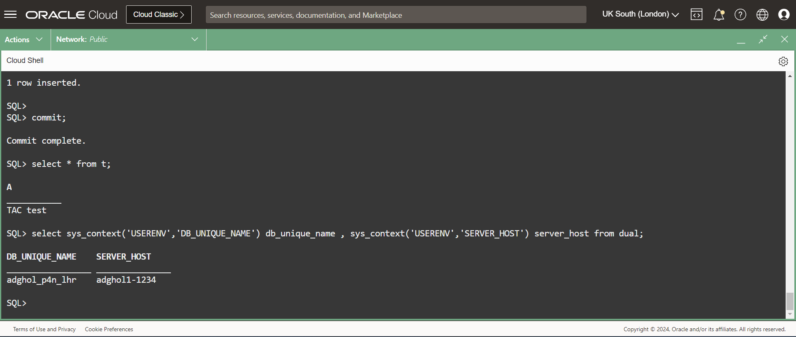

# Transparent Application Continuity

## Introduction

When switching over or failing over the Data Guard configuration, the correct services are started, and the highly available connection string still works for new connections.

What about existing connections? But more importantly, what about transactions that were active at the time of the role change?

Transparent Application Continuity solves this problem brilliantly. Once the session is terminated, the client retries to connect until the service is available again, and then Transparent Application Continuity restores the session state and replays the transaction to the state before the session failure.

Estimated Lab Time: 10 Minutes

### Requirements
To try this lab, you must have successfully completed the following labs:
* [Prepare the database hosts](../prepare-host/prepare-host.md)
* [Prepare the databases](../prepare-db/prepare-db.md)
* [Configure and Verify Data Guard](../configure-dg/configure-dg.md)
* [Create role-based services](../create-services/create-services.md)

### Objectives
* Create the application user
* Start a user transaction
* Execute a switchover
* Commit the user transaction

## Task 1: Create the application user

1. Connect to the read-write service on the primary:
  ```
  <copy>
sql sys/WElcome123##@mypdb_rw as sysdba
  </copy>
  ```

2.  Create the user and role for the application:

  ```
  <copy>
drop user TACUSER cascade;
create user TACUSER identified by Welcome#Welcome#123;
CREATE ROLE TAC_ROLE NOT IDENTIFIED ;
GRANT CREATE TYPE TO TAC_ROLE ;
GRANT CREATE VIEW TO TAC_ROLE ;
GRANT CREATE TABLE TO TAC_ROLE ;
GRANT ALTER SESSION TO TAC_ROLE ;
GRANT CREATE CLUSTER TO TAC_ROLE ;
GRANT CREATE SESSION TO TAC_ROLE ;
GRANT CREATE SYNONYM TO TAC_ROLE ;
GRANT CREATE TRIGGER TO TAC_ROLE ;
GRANT CREATE OPERATOR TO TAC_ROLE ;
GRANT CREATE SEQUENCE TO TAC_ROLE ;
GRANT CREATE INDEXTYPE TO TAC_ROLE ;
GRANT CREATE PROCEDURE TO TAC_ROLE ;
GRANT DROP ANY DIRECTORY TO TAC_ROLE ;
GRANT CREATE ANY DIRECTORY TO TAC_ROLE ;
GRANT SELECT ANY DICTIONARY TO TAC_ROLE ;
GRANT KEEP DATE TIME TO TAC_ROLE;
GRANT KEEP SYSGUID TO TAC_ROLE;
GRANT TAC_ROLE TO TACUSER;
ALTER USER TACUSER QUOTA UNLIMITED ON USERS;
  </copy>
  ```



## Task 2: Start a user transaction

1. Connect as the newly created user and start a transaction:

  ```
  <copy>
connect tacuser/Welcome#Welcome#123@mypdb_rw
  </copy>
  ```

  ```
  <copy>
select sys_context('USERENV','DB_UNIQUE_NAME') db_unique_name , sys_context('USERENV','SERVER_HOST') server_host from dual;
create table t (a varchar2(50));
insert into t values ('TAC test');
  </copy>
  ```



## Task 3: Execute a switchover

**From another window**, connect to the Data Guard Broker, and execute a switchover:

  ```
  <copy>
dgmgrl sys/WElcome123##@ADGHOL0_DGCI
show configuration
set time on
switchover to ADGHOL1_UNIQUE_NAME
  </copy>
  ```





You don't need to wait for the switchover to finish, you can continue to the next step.

## Task 4: Commit the user transaction

Back to the previous window, commit the transaction that we left pending:
  ```
  <copy>
commit;
select * from t;
select sys_context('USERENV','DB_UNIQUE_NAME') db_unique_name , sys_context('USERENV','SERVER_HOST') server_host from dual;
  </copy>
  ```



You should see that the commit succeeds, the data inserted before the switchover is there, and that we are now connected to the second host where the new primary resides.

## Task 5: Switch back to the original primary

Before continuing with the next labs, don't forget to switch back. The labs expect ADGHOL0 to be the primary environment. 

  ```
  <copy>
dgmgrl sys/WElcome123##@ADGHOL0_DGCI
show configuration
set time on
switchover to ADGHOL0_UNIQUE_NAME
  </copy>
  ```


- **Author** - Ludovico Caldara, Product Manager Data Guard, Active Data Guard and Flashback Technologies
- **Contributors** - Robert Pastijn
- **Last Updated By/Date** -  Ludovico Caldara, December 2023
