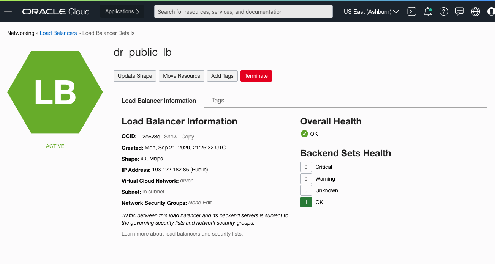
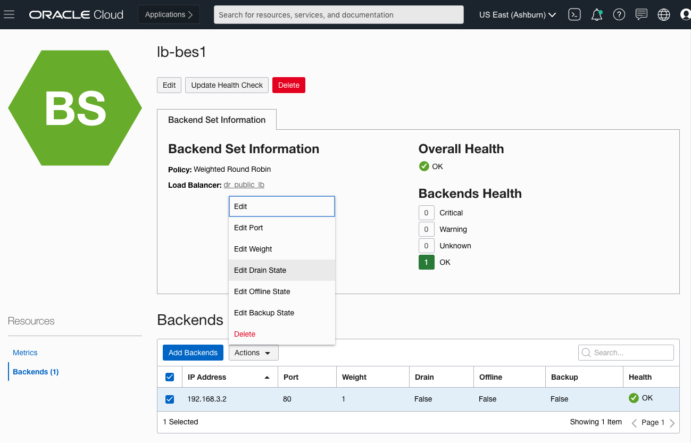
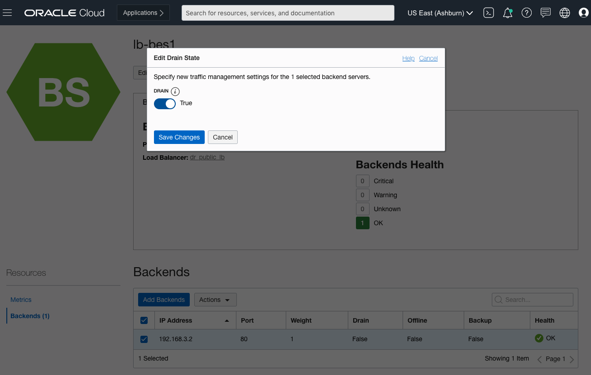
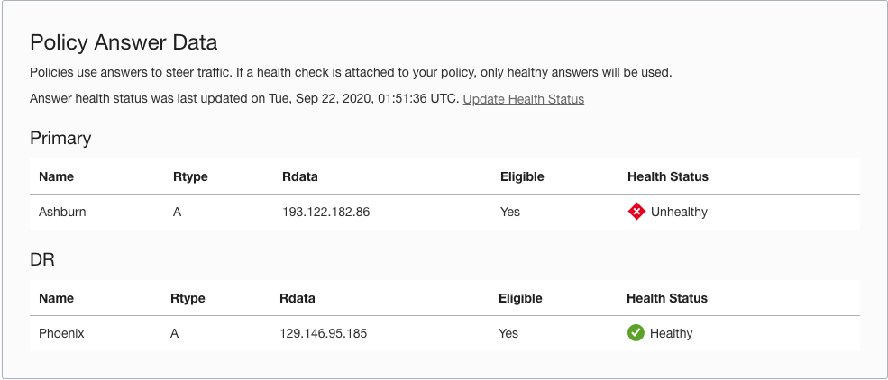
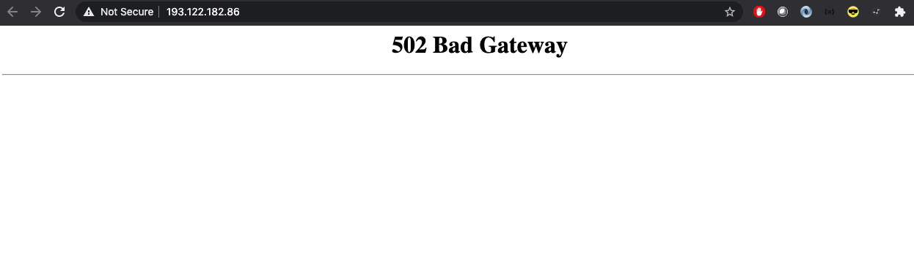
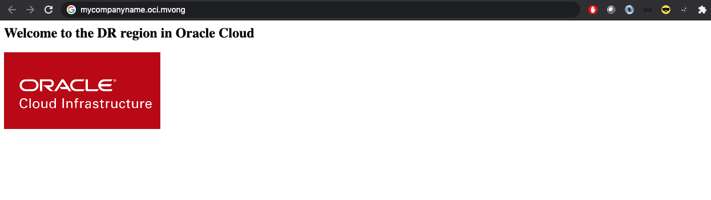

# Using Rsync for Application File Sync

## Introduction

In this lab, we will leverage the existing infrastructure created in the previous lab to simulate disaster recovery on the application level. To accomplish this, we will use **rsync** to synchronize files between two remote servers.

Estimated Lab Time: 90 minutes

### About Rsync

**Rsync** is a file copying tool that exists on most linux environments. It is capable of copying files locally and to/from another host over a remote shell. Its differentiating feat is its **delta-transfer algorithm** that focuses on syncing the changes observed in files. This optimizes the sync by reducing the amount of data sent over the network. **Rsync** is used extensively in **backups**, **disaster recovery**, and **mirroring** scenarios. 

### Objectives

In this lab you will: 
* Understand the syntax of **rsync**.
* Sync files locally.
* Sync files between a local host and a remote server.
* Simulate DR scenario for application tier.

### Prerequisites

* Access to an Oracle Cloud account
* Familiarity with Linux commands


## Task 1: Syncing Files between two Folders on the same Local Machine

In the first part of this lab, we will sync files locally on our machines to get an introductory grasp of rsync.

1. Create two folders. Name one "primary\_sync" and the other "DR\_sync".

    ```
    <local_machine>$ mkdir primary_sync DR_sync

    <local_machine>$ ls 
    ```

2. Create a file in "primary\_sync" and name it "primary.txt".

    ```
    <local_machine>$ touch primary_sync/primary.txt

    <local_machine>$ ls primary_sync 
    ```

3. Verify that only "primary\_sync" has a file in it and "DR\_sync" is empty.

    ```
    <local_machine>$ ls primary_sync/ DR_sync/
    ```

    Before we use rsync to sync the file between the folders, a little about the option flags we'll be using:
    * "-a" represents "archive". It allows us to sync all files in the source directory recursively while preserving any symbolic links, special and device files, modification times, group, owner, and permission.
    * "-v" represents "verbose". This flag lets us know what's happening when the command is run.
    * "-P" represents the combination of the "progress" and "partial" flags which allow us to see the transfer progress bar as well as the resumption of interrupted transfers.
    * "-n" represents "dry-run". This flag shows what content would have been transferred, useful to test out connectivity to the target host as well as target folder access. 

4. Great, now let's execute our first sync between the two folders. Let's include the "-n" flag first to make sure everything is in place before we actually sync the file.

    ```
    <local_machine>$ rsync -avP primary_sync/ DR_sync -n

    <local_machine>$ ls primary_sync/ DR_sync/
    ```

5. Removing the "-n" flag will sync the file over to the "DR\_sync" folder.

    ```
    <local_machine>$ rsync -avP primary_sync/ DR_sync 
  
    <local_machine>$ ls primary_sync/ DR_sync/
    ```

## Task 2: Syncing Files between a Local Host and a Remote Server

In the second part of the lab, we will simulate how an administrator would sync files between a local machine and a remote server.

1. Add the private key to your bastion server to your machine's SSH agent.

    ```
    <local_machine>$ ssh-add -k ~/<bastion_server_private_key>
    ```

2. Next SSH into the remote server. There are two new flags to consider:

    - "-A" enables us to forward our connection from an authentication agent. We populated this in the previous step.
    - "-J" allows us to connect to the target machine (application server) after connecting to the "jump host" (bastion server).

    ```
    <local_machine>$ ssh -A -J opc@<bastion_public_ip>   
    ```

3. Now let's begin syncing files from our local machine to the remote server. Leave the terminal window that's connected to the remote server open and open a new terminal window. In the terminal that's connected to your local machine, create an application file folder and name it "app\_files".

    ```
    <local_machine>$ mkdir app_files

    <local_machine>$ ls
    ```

4. Next, create an empty file in the application file folder and name it "app\_file\_1".

    ```
    <local_machine>$ touch app_files/app_file_1

    <local_machine>$ ls app_files
    ```

5. Now navigate back to the terminal window connected to the remote server. Verify that "app\_files/app\_file\_1" does not exist on the server.

    ```
    opc@<remote_server>$ ls 
    ```

6. We will now do a dry-run sync of the folder and its file from our local machine to the remote server. The syntax will differ a bit from Part 1 as we are leveraging a new option flag:

    - "-e" allows us to execute shell commands. We'll leverage this to hop into the remote server from the bastion server.

    ```
    <local_machine>$ rsync -avP -e "ssh -A -J opc@<bastion_public_ip>" app_files opc@<app_server_private_ip>:/home/opc/ -n
    ```

7. After testing the sync with the "-n" flag, remove it and re-run the command. You should now see that the "app_files" folder and its contents are synced to the remote server. Navigate to the remote server terminal and verify.

    ```
    opc@<remote_server>$ ls
    ```

## Task 3: Setting up Periodic and Automated Syncs using Cron

In the third and **optional** part of the lab, we'll go through the steps of automating rsync by setting it up as a cron job. Cron is a Linux tool that enables periodic repetition of commands.

1. Run the following command to open a text editor. This editor will contain all of the **rules** for command repetitions. 

    ```
    <source_machine>$ crontab -e
    ```

    **Configuring the crontab rule:**

    ```
    Syntax: 'm h dom mon dow command'
    m: minutes (0-59)
    h: hours (0-23)
    dom: day of the month (1-31)
    mon: month (1-12)
    dow: day of the week (0:sunday - 6:saturday)
    command: command to execute
    ```

    **Example for automated sync job for every month, every day, every hour at 30 minutes:**

    ```
    30 * * * * rsync -avP source_folder <user>@<remote_server_ip>:target_folder
    ```
 
2. Save the file and close the editor. Then verify that the crontab saved.

    ```
    <source_machine>$ crontab -l
    ```

## Task 4: Simulating DR with Rsync

In the fourth and final part of the lab, we'll go through the steps of simulating a DR scenario.

1. SSH into both of your regional application servers using the SSH agent.

    ```
    <local_machine>$ ssh-add -k <private_key>

    <local_machine>$ ssh -A -J opc@<bastion_public_ip> opc@<app_server_private_ip>
    ```

2. Change the owner and group of the application server folder and index file to opc user. Do this for both of your application servers.

    ```
    opc@<app_server>$ chown opc:opc /var/www/html

    opc@<app_server>$ chown opc:opc /var/www/html/index.html
    ``` 

3. Edit the index.html file in your primary application server to your liking. You may add additional html tags or change the text to reflect the change.

    ```
    opc@<app_server_1>$ vi /var/www/html/index.html
    ```

4. Use Rsync to synchronize the changes from the primary app server to the DR app server. Make sure that your private RSA key is present somewhere in the current application server.

    ```
    opc@<app_server_1>$ rsync -avP /var/www/html/index.html opc@<app_server_2_private_ip>:/var/www/html/index.html -n  // Dry-run

    opc@<app_server_1>$ rsync -avP /var/www/html/index.html opc@<app_server_2_private_ip>:/var/www/html/index.html     // Executes
    ```

5. Verify that the changes were synchronized between the application server index files.

    ```
    opc@<app_server_1>$ cat /var/www/html/index.html

    opc@<app_server_2>$ cat /var/www/html/index.html
    ```

6. Simulate DR scenario.

    -  Navigate from the upper left hamburger menu to **Networking** and click on **Load balancers**. Find the Load Balancer in your primary region.

      

    - Go to your backend set. 

      

    - Check mark your backends. Then click **actions**.

      

    - Set the **drain state** to **True**. This will stop all current connections and simulate the disaster. 

      

    - If you navigate to health/check traffic steering - you can see the health for the Primary region load balancer is now critical. If you visit the IP address of this load balancer, you will get 502 bad gateway. 

      


    **Before the drained state:**

    - **Primary Region:**
    
      

    - **DR Region:**

      

     - **DNS:**

      


    **After draining the backend set:**

    - **Primary Region:**

      

    - **DR Region:**

      

    - **DNS:**

      

You may proceed to the next lab.

## Learn More

* [Intro to rsync](https://linux.die.net/man/1/rsync)
* [Using rsync](https://www.digitalocean.com/community/tutorials/how-to-use-rsync-to-sync-local-and-remote-directories-on-a-vps)

## Acknowledgements

* **Authors** - Mark Vong, Cloud Engineer; Jason Jang, Cloud Engineer
* **Contributor(s)** -  Goutham M L, Cloud Engineer
* **Last Updated By** - Mark Vong, October 2020
