# Lab 5: Configure and Execute Full Stack Backup Recovery

## Introduction

In this lab, use the supplied configuration script to configure OCI Full Stack Backup Recovery (Full Stack BR) for protected resources in the Ashburn region. Full Stack BR protects two compute virtual machines and an individual volume group for each VM within one region.

Watch the video below for a quick walk-through of the lab.
[Configure and Execute Full Stack Backup Recovery](videohub:1_d7qsytvw)

The synthetic AI workload runs on both compute VMs and completes one job every minute. Record the job counter before and after Full Stack BR operations to observe workload continuity during backup and recovery testing.

The configuration script creates the backup policy and Full Stack BR protection group, adds the compute and volume group members, and activates protection. You then review the member backups, create a recovery point, and run the recovery plan.

**Before you begin:** Start the Start Drill in Lab 3, Task 2, Steps 1–4. Then:

- Begin Lab 5 during the drill wait using the Ashburn Cloud Shell.
- Keep the Phoenix drill execution open in another browser tab.
- Check the drill status between Lab 5 steps.

**When the Start Drill shows Succeeded:** Pause Lab 5 and note your current task and step. Leave running operations open, return to [Lab 3](?lab=execute-prechecks-start-drill), complete the remaining checks, and finish [Lab 4](?lab=test-recovery). Then resume Lab 5.

If the drill fails, return to Lab 3 to investigate.

**After Lab 4:** Return to your recorded Lab 5 task and step. Check any operation you left running before continuing; do not submit it again. Complete the remaining tasks in this lab.

Estimated Time: 20 minutes

### Objectives

In this lab, you will:

- Record the synthetic AI workload baseline and monitor the job counters throughout the backup and recovery activities.
- Run the Full Stack BR configuration script.
- Review the Ashburn Full Stack BR protection group and its protected members.
- Review the default backup plan and its plan groups.
- Review the catalog and Full Stack BR recovery point.
- Run backup and recovery plans and verify their executions.

## Task 1: Record the Synthetic AI Workload Baseline

1. In the **Ashburn** region, open the OCI Console navigation menu and select **Compute**, then **Instances**. In the compartment assigned to you, locate these two compute instances:

    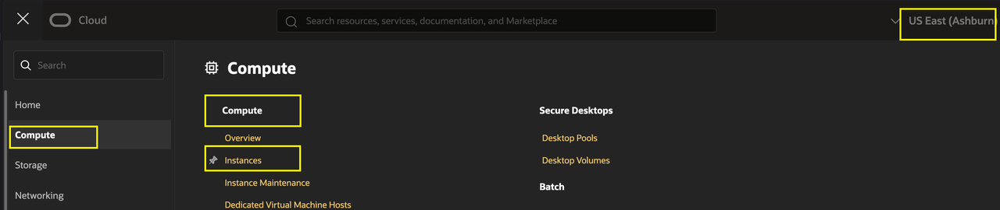

    - `fsr-ai-app-recovery-vm-0`
    - `fsr-ai-app-recovery-vm-1`

    Open each instance and copy its **Public IP address**.

    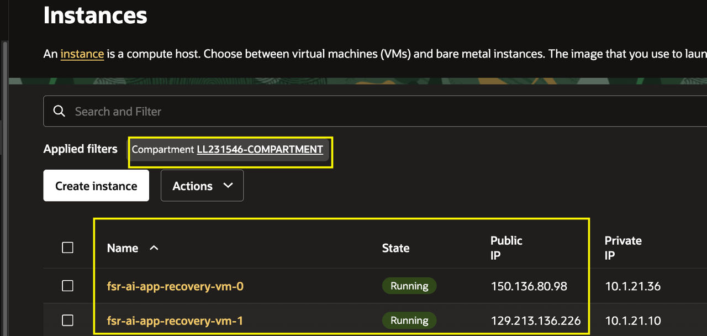

2. In separate browser tabs, open `http://<public-ip-1>` for VM 0 and `http://<public-ip-2>` for VM 1. Use the first tab to monitor VM 0 and the second tab to monitor VM 1. Record the number of completed AI jobs shown by the synthetic AI workload on each VM. These values are the baseline for the Full Stack BR backup and recovery validation. Keep both tabs open throughout Lab 5 and return to them at each major Full Stack BR milestone to record the updated counters.

    Copy the following table into your notes and record the counters from both workload tabs there. Return to it at each checkpoint in Tasks 4 and 5. Record your initial baseline now.

    | Checkpoint | VM 0 | VM 1 |
    |---|---|---|
    | Initial baseline — Task 1, Step 2 | Record | Record |
    | Before backup — Task 4, Step 3 | Record | Record |
    | After backup — Task 4, Step 8 | Record | Record |
    | First observation after Compute Instances - Start succeeds — Task 5, Step 7 | Record | Record |
    | After recovery completes — Task 5, Step 8 | Record | Record |
    | Next scheduler update — Task 5, Step 8 | Record | Record |

   If a browser security warning appears when opening the VM workload page, proceed to the site and continue.

   If you encounter another browser error, try the following troubleshooting steps:

   - Try opening the page in a different browser or in a private/incognito window.
   - If you are connected to a VPN, disconnect from the VPN and try again.
   - If the issue persists, go to the **Compute VMs** section, open the **three-dot menu** for the affected VM, and reboot the VM.
   - After the VM has rebooted, retry accessing the workload page.

   **In the example run, the baseline is 454 completed jobs on each VM. Your values will vary depending on when each VM was started and how long the workload has been running. Always use the values displayed in your own VM tabs when comparing checkpoints.**

    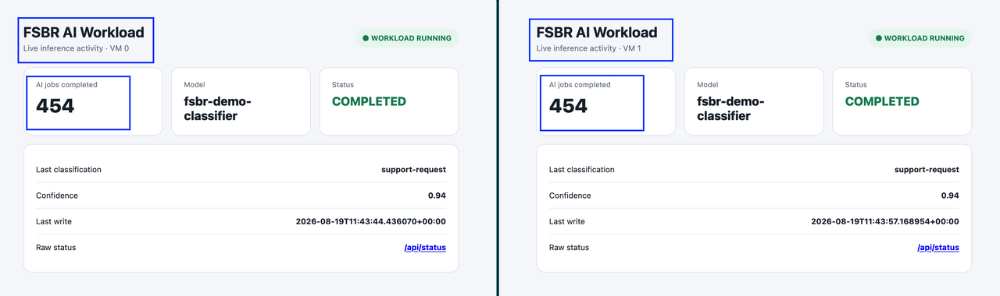

## Task 2: Configure Full Stack BR

1. In the Ashburn Cloud Shell, change to the application directory created in Lab 1.

    Run:

    ```bash
    <copy>
    cd ~/oci-ai-resiliency-lab
    </copy>
    ```

2. Review the Full Stack BR configuration flow before you run the wrapper. Unlike the interactive Full Stack DR configuration in Lab 2, this Full Stack BR configuration runs without confirmation prompts. Allow each phase to complete and monitor the timestamped progress messages. The script performs these actions in order:

    - Creates or verifies the Full Stack BR log bucket and creates the backup policy.
    - Creates the Full Stack BR protection group.
    - Adds the individual volume group and compute-instance members for both VMs.
    - Activates the Full Stack BR protection group.
    - Waits for protection activation to complete. Review the service-generated default plans in Task 4; this workshop does not add user-defined BR plan groups.

3. Run the Full Stack BR configuration wrapper:

    ```bash
    <copy>
    ./scripts/configure-fsbr-vm-vg.sh
    </copy>
    ```

    The script displays its inputs, creates or verifies the log bucket, prepares the individual volume groups, and begins creating the Full Stack BR backup policy and protection group.

    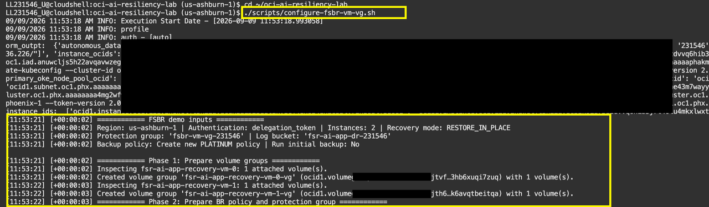

    As the script progresses, it creates the Full Stack BR protection group and adds the four members: two compute instances and their two individual volume groups.

    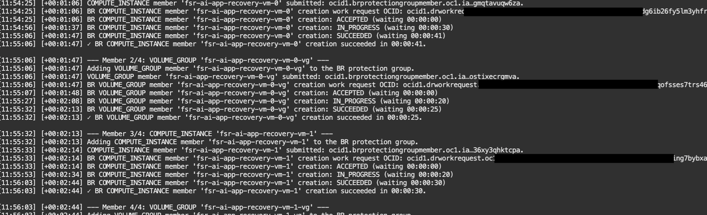

    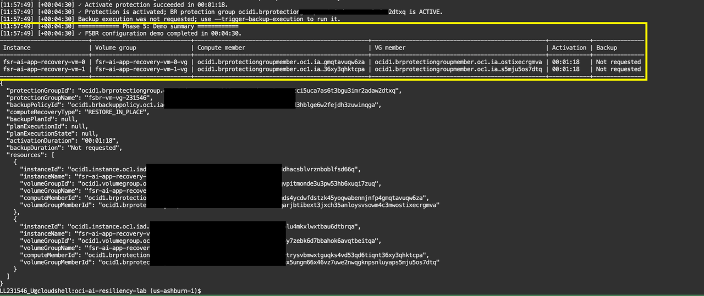

4. Monitor the script output until it returns successfully. Record the Full Stack BR protection group and backup policy identifiers that it reports. The standard command does not execute a backup; you will run the backup plan in Task 4. You will create or review member backups, recovery points, and recovery-plan executions in the OCI Console in the following tasks.

## Task 3: Review the Full Stack BR Protection Group

1. In the Ashburn OCI Console, open the navigation menu and select **Migration & Recovery**, then **Backup Recovery**.

    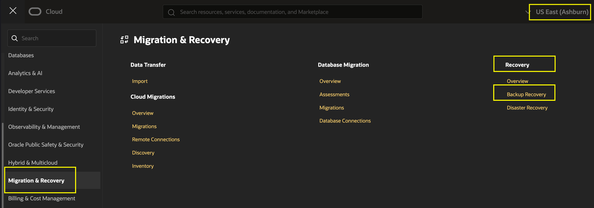

    Confirm that the **Backup Recovery** protection-group page is open and that the Full Stack BR protection group created by the script appears in the assigned compartment. Its name follows the pattern `fsbr-vm-vg-xxxxxx`, where `xxxxxx` is generated for your environment.

    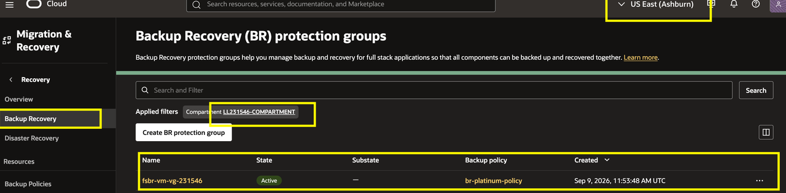

2. Select the compartment used for the workshop and open the Full Stack BR protection group created by the script.

3. Open the **Members** tab. Confirm that the protection group contains:

    - `fsr-ai-app-recovery-vm-0`.
    - `fsr-ai-app-recovery-vm-1`.
    - The individual volume group attached to each compute instance.

    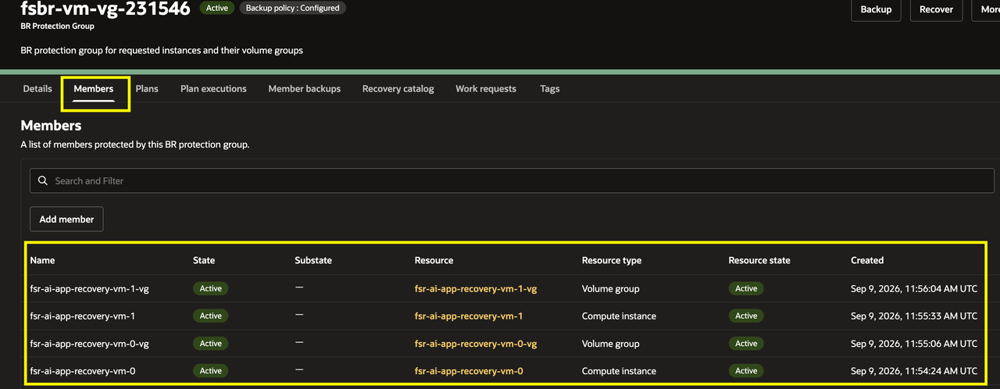

    The protection group defines the single-region Ashburn protection boundary. Each volume group protects the application storage used by its associated compute member.

4. Confirm that the member resources are available and that each volume group is associated with its expected compute instance. Record any member or association warning before continuing.

## Task 4: Review the Default Backup Plan and Run a Full Stack BR Backup

1. Open the **Plans** tab for the Full Stack BR protection group. Confirm that the default backup and recovery plans are present and in the **Active** state.

    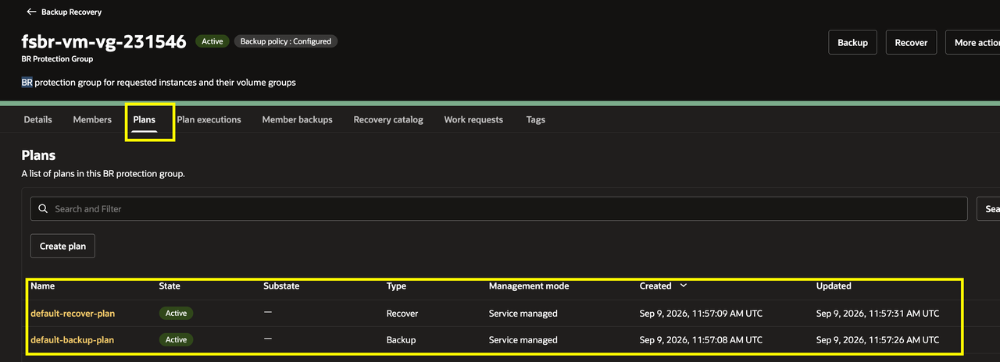

2. Open **default-backup-plan** and select the **Plan groups** tab. Review the plan groups, including the prechecks, volume-group backup, and compute-instance backup groups.

    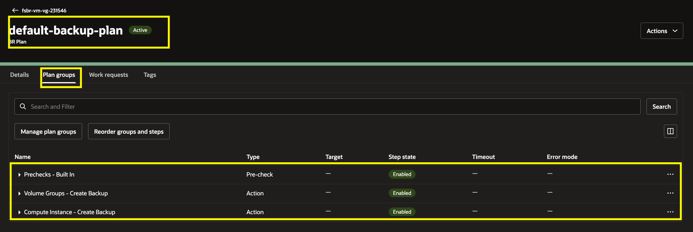

3. Before running the backup plan, return to the two workload tabs and record the current **AI jobs completed** value from VM 0 and VM 1. In the example run, this value is **483 jobs** on each VM. Use the values displayed in your own VM tabs as the pre-backup baseline for comparison after the backup and restore operations. Enter both values in the **Before backup** row of the recording table in Task 1, Step 2.

    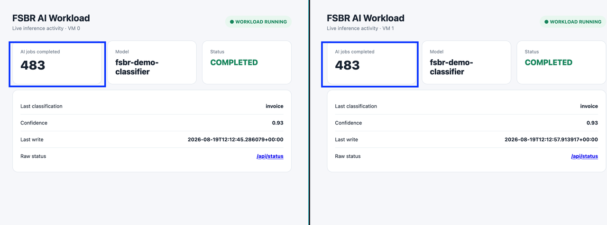

4. On the **default-backup-plan** page, open **Actions** and select **Execute plan**.

    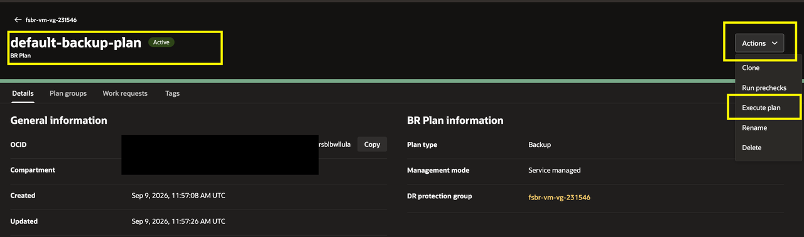

    In the execution form, enter a name such as `First backup`, leave prechecks enabled, and select **Execute plan**.

    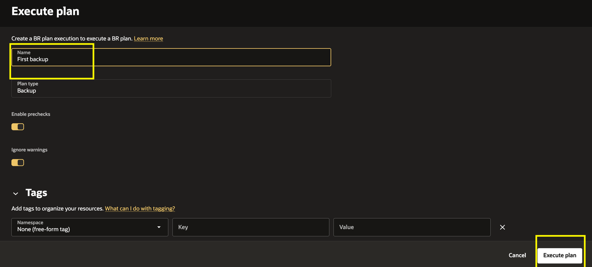

5. Open the **Plan executions** tab, select **First backup**, and monitor the plan execution groups. The prechecks run first, followed by the volume-group and compute-instance backup groups.

    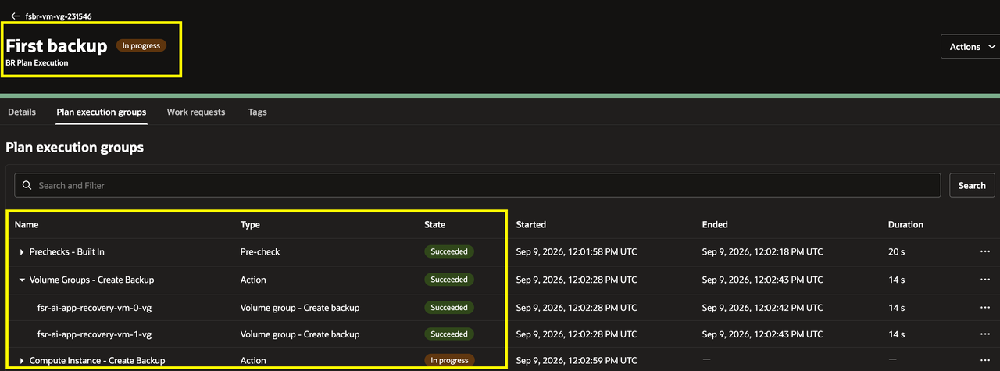

6. Wait a few minutes for the execution to complete successfully. Confirm that **First backup** shows **Succeeded**.

    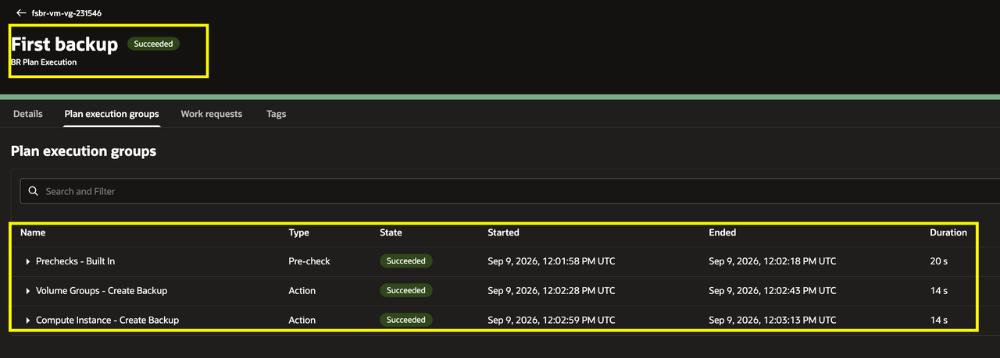

7. Open the **Member backups** tab for the Full Stack BR protection group. Confirm that backups are available for both compute instances and both individual volume groups.

    Wait a minute or so for all four member backups to appear with an **Active** status.

    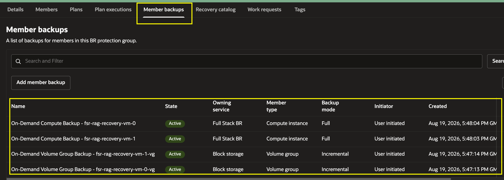

8. Return to the two workload tabs and record the updated **AI jobs completed** value from VM 0 and VM 1. In the example run, this value is **491 jobs** on each VM. Compare the values with the pre-backup baseline, using the values displayed in your own VM tabs. Enter both values in the **After backup** row of the recording table.

    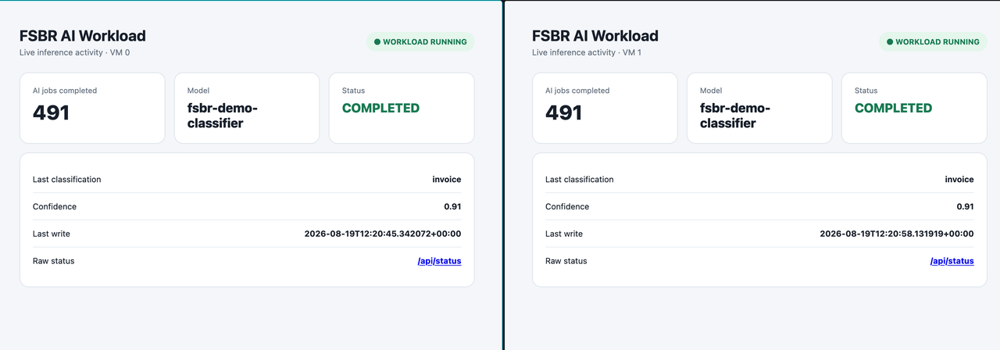

## Task 5: Create a Recovery Point and Run the Recovery Plan

1. Open the **Recovery catalog** tab for the Full Stack BR protection group. Confirm that the catalog is active and that the **Create recovery point** button is available.

    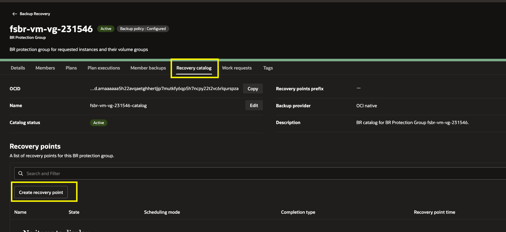

2. Select **Create recovery point**. Enter `First recovery point` as the name and description, leave the recovery point date and time disabled, keep **Completion mode** set to **Allow partial**, and select the object storage bucket and log location shown for your environment. Select **Create**.

    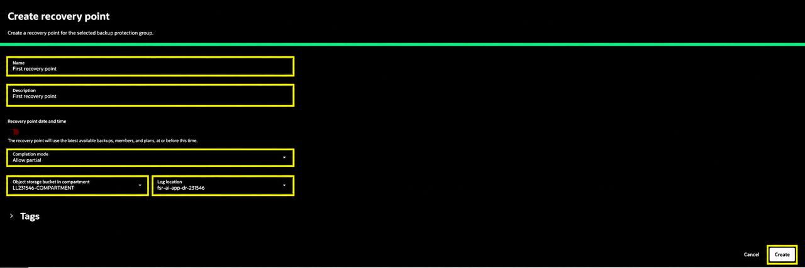

3. Monitor the Recovery catalog until **First recovery point** is **Active**. Confirm that the recovery point is available and uses the member backups created in Task 4.

    Open the recovery point details. Confirm that the recovery point references the latest Active member backups created by **First backup** in Task 4: two compute-instance backups and two volume-group backups.

    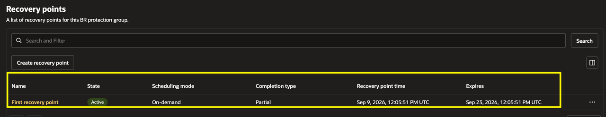

4. After **First recovery point** becomes **Active**, review the member backups it references. Recovery restores the workload state captured by those backups, not the counter value when the recovery point becomes active. Use the pre-backup and post-backup counters recorded in Task 4 as comparison checkpoints. The restored value may fall between them because the workload continues running during backup.

5. In the Recovery catalog, select **First recovery point**. Confirm that its state is **Active**, then select **Actions** → **Recover now**.

    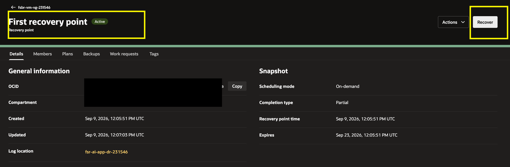

6. In the execution form, confirm that **default-recover-plan** is selected and that the recovery point is **First recovery point**. Leave prechecks enabled and enter a name such as `Recovery plan execution`.

    **Note:** During recovery, both demo VMs stop briefly and their storage is restored from the selected backups. Changes made after those backups are lost, and the plan replaces and terminates the original volumes. The workloads resume as the VMs restart.

    Select **Execute plan**.

    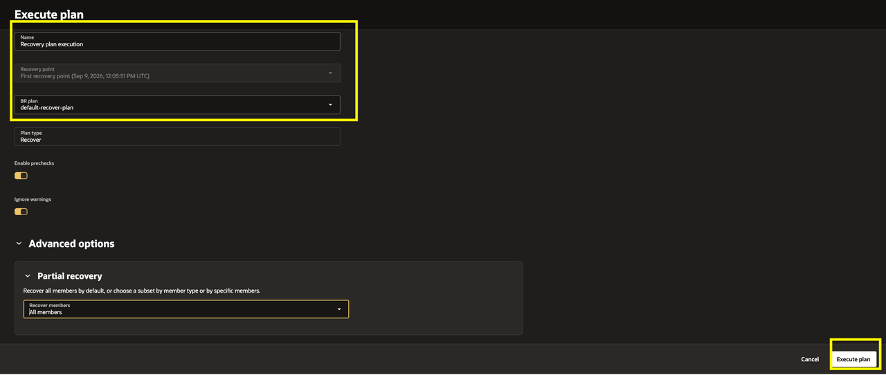

7. Open the **Plan executions** tab, select **Recovery plan execution**, and monitor the plan execution groups. Confirm that the prechecks, compute stop, volume-group restore, boot-volume replacement, compute start, block-volume replacement, **Volume Groups - Replace Volumes**, and **Compute Instances - Terminate Volumes** groups progress to completion.

    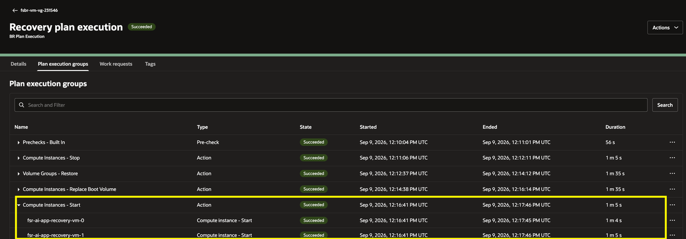

    When you observe the **Compute Instances - Start** group complete successfully, return to the two workload tabs and check the **AI jobs completed** counter on both VMs. Enter both values in the **First observation after Compute Instances - Start succeeds** row of the recording table.

    Compare each VM's restored counter with its own **Before backup** and **After backup** values in the recording table. The recovery point restores the state captured by its referenced backups. Counters may have increased by the time you observe them because the scheduler resumes after restart.

    If you were completing Labs 3–4 when the VMs restarted, record the counters when you return. They may be higher because the workload continued running; do not repeat recovery just to reproduce the example counters.

    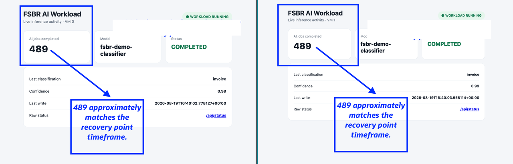

    When all groups show **Succeeded**, confirm that the recovery plan execution is successful.

    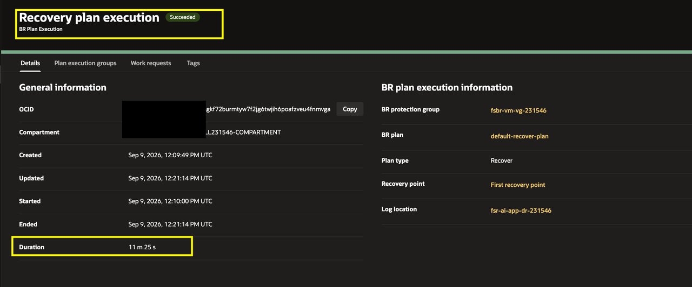

    Expand the execution groups to review the successful operations for both compute instances.

    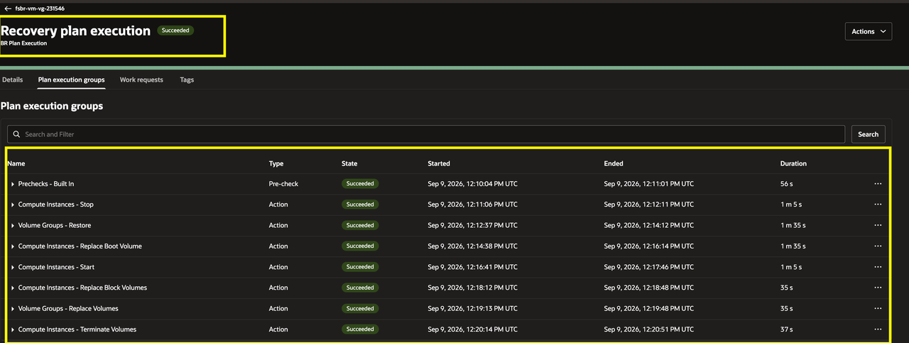

8. After the recovery plan completes, review the final **AI jobs completed** values on both workload tabs. Enter both values in the **After recovery completes** row of the recording table. The counters may be slightly higher than the recovery-point value because the scheduler resumes as the VMs restart. In a production workload, the selected recovery point determines the state restored according to the recovery requirement.

    Keep both workload tabs open and wait for the next scheduler update, which occurs about once per minute. Record both counters in the **Next scheduler update** row and confirm that each counter increases from its recorded post-recovery value. If a counter does not increase, wait for one more update and check the workload status before considering recovery validation complete.

## Conclusion

You have completed the Full Stack BR track by protecting and recovering the Ashburn compute instances and their individual volume groups. If you finished this lab before completing Full Stack DR, return to [Lab 3: Execute Prechecks and the Full Stack DR Start Drill Plan](?lab=execute-prechecks-start-drill), Task 2, Step 5. Monitor the existing drill and complete the remaining checks; do not start another drill. After confirming that the drill succeeded, finish [Lab 4: Execute the Post-DR Script and Validate the App](?lab=test-recovery).

If you have already completed Lab 3 and Lab 4, you have finished both workshop tracks.

Together, OCI Full Stack DR and OCI Full Stack BR help you protect, recover, and validate the infrastructure, data, and application services that support a resilient AI workload.

## Acknowledgements

* **Author** - Suraj Ramesh, Lead Principal Product Manager, Oracle Database High Availability (HA), Scalability and Maximum Availability Architecture (MAA)
* **Last Updated By/Date** - September 2026
