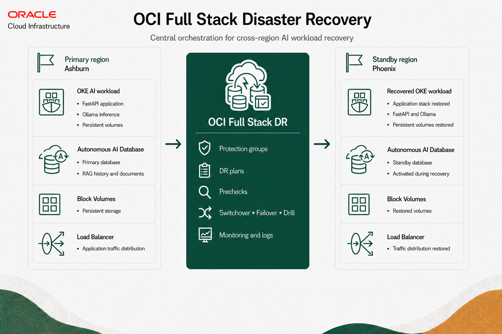
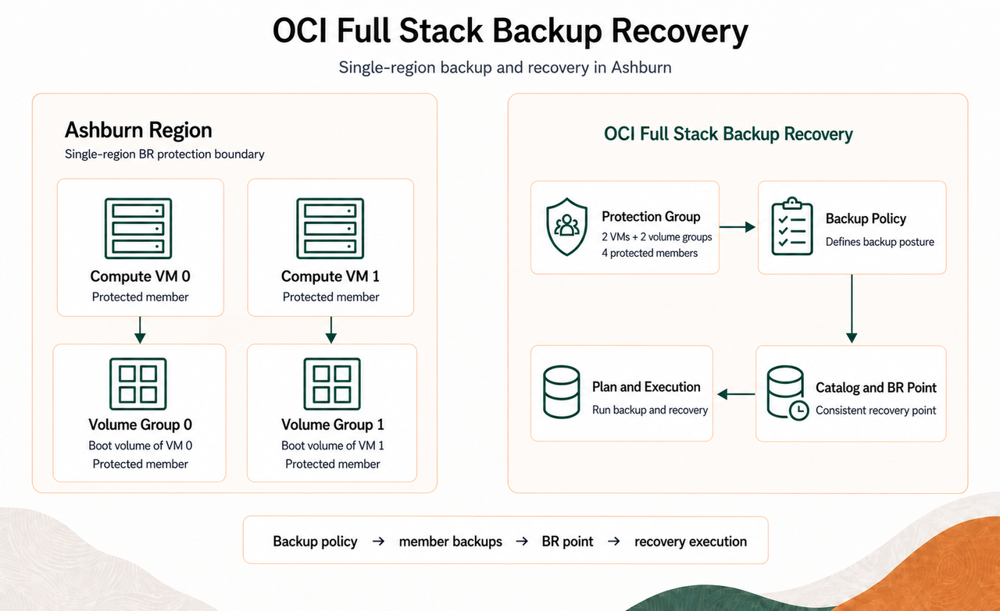

# Introduction

## Introduction

In this workshop, you learn how Oracle Cloud Infrastructure (OCI) Full Stack Disaster Recovery (Full Stack DR) and OCI Full Stack Backup Recovery (Full Stack BR) protect and recover different parts of a resilient AI environment.

Watch the video below for a quick overview of the workshop.
[Full Stack DR and Full Stack BR Workshop Overview](videohub:1_dtqjch4l)

The Full Stack DR track uses an AI Retrieval-Augmented Generation (RAG) application deployed on Oracle Kubernetes Engine (OKE). It includes a web frontend, FastAPI backend, AI inference service, persistent application storage, and Oracle Autonomous AI Database connectivity. The Full Stack BR track uses a separate synthetic AI workload running on two compute virtual machines.

The workshop focuses on resiliency services rather than application development. You first deploy the supplied AI workload and then complete two related tracks.

### Workshop Tracks

- **OCI Full Stack DR:** Protect the OKE application and Autonomous AI Database across the Ashburn primary region and Phoenix standby region. Configure DR protection groups and plans, execute a Start Drill plan, and validate the recovered AI application in Phoenix.
- **OCI Full Stack BR:** Protect two Ashburn compute virtual machines. Each VM runs the synthetic AI workload and has its own volume group. Configure the BR protection group and backup policy, review the catalog and recovery point, and run a backup and recovery plan.

This workshop demonstrates resiliency at two levels: Full Stack DR provides cross-region application recovery, while Full Stack BR provides regional backup and recovery. The synthetic AI workload and application validation steps help you observe service continuity and confirm that recovery operations restore the required resources.

Together, these tracks demonstrate cross-region application DR orchestration with Full Stack DR and single-region backup and recovery orchestration with Full Stack BR.

## Task 1: Service Overview

1. Review the services and resources used in this workshop.

    ### OCI Full Stack Disaster Recovery

    OCI Full Stack DR orchestrates the transition of compute, database, and application resources between OCI regions. It automates the steps needed to recover one or more business systems without redesigning or re-architecting existing infrastructure, databases, or applications, and without specialized management or conversion servers. Full Stack DR can coordinate a broad set of OCI services that make up an application stack. The supported resource types include:

    **Compute**

    - Compute instances (including dedicated VM hosts)

    **Oracle Database**

    - Oracle Autonomous AI Database Serverless
    - Oracle Autonomous AI Database on Dedicated Exadata Infrastructure
    - Oracle Autonomous AI Database on Exadata Cloud@Customer
    - Oracle Base Database Service
    - Oracle Exadata Database Service on Dedicated Infrastructure
    - Oracle Exadata Database Service on Exascale Infrastructure
    - Oracle Exadata Database Service on Cloud@Customer

    **MySQL Database**

    - MySQL HeatWave

    **Storage**

    - Boot and Block Volumes (Volume Groups)
    - File Systems
    - Object Storage buckets

    **Networking**

    - Load Balancers
    - Network Load Balancers

    **Developer Services**

    - Kubernetes Engine (OKE)
    - Integration Instance

    For these supported services, Full Stack DR automatically creates the recovery steps required to transition protected resources between regions. You can further customize the plans by adding user-defined plan groups for other OCI services and applications running on virtual machines.

    Full Stack DR brings these service-specific recovery operations together into ordered plans with dependencies, prechecks, execution logs, and post-recovery validation. Each service's native replication, backup, or standby technology must be configured separately.

    In this workshop, Full Stack DR uses replication, prechecks, plans, and execution monitoring to recover the OKE application and Autonomous AI Database from Ashburn to Phoenix. You execute a Start Drill plan and validate the recovered application.

    ### Full Stack Backup Recovery

    OCI Full Stack BR provides coordinated backup and recovery for OCI resources within one region. It protects infrastructure state, backup configuration, member backups, and recovery points.

    In this workshop, Full Stack BR protects two Ashburn compute virtual machines and an individual volume group for each VM. You configure the BR protection group and policy, review the catalog and recovery point, and run a backup and recovery plan.

    ### How the Services Work Together

    Full Stack DR handles cross-region application recovery, while Full Stack BR handles regional backup and recovery for compute and storage. Together, they support a complete resiliency process:

    - **Know** the resources, dependencies, regions, and recovery readiness of the application.
    - **Protect** application data, volumes, database services, and Kubernetes resources.
    - **Recover** the protected stack through tested and repeatable plans.
    - **Prove** recovery by validating application health, AI responses, document access, and database persistence.

    ### Benefits of the Services

    OCI Full Stack DR and BR help organizations:

    - Coordinate recovery for the full application stack.
    - Reduce recovery time through repeatable operational steps.
    - Use service-level plans, prechecks, logs, and monitoring to manage recovery.
    - Protect the infrastructure and data required by AI workloads.
    - Customize recovery plans with application-specific validation.
    - Test recovery readiness through drills before an outage.

## Workshop Architecture

The workshop uses a primary OKE and Autonomous AI Database environment in Ashburn and a standby recovery environment in Phoenix. Autonomous Data Guard protects the databases, and cross-region volume replication protects the AI workload persistent volume. Full Stack DR coordinates the application, storage, database, and validation workflow. Full Stack BR provides regional backup and recovery for protected compute and volume resources.

### Full Stack Disaster Recovery

### Full Stack Backup Recovery

Each compute VM has its own volume group containing its boot volume. The BR protection group has four members: two compute VMs and two individual volume groups.

## Environment Details

- The workshop uses Ashburn as the primary region and Phoenix as the standby region.
- The bootstrap script creates the `fsdr-iad-primary` and `fsdr-phx-standby` Kubernetes contexts.
- The application package validates the frontend, backend, AI inference service, and Autonomous AI Database connection.
- The workshop configures cross-region replication before creating the Full Stack DR protection groups and plans.
- Full Stack BR uses the compute instances and their individual volume groups to create backups, catalog recovery points, and run backup and recovery plans.

### Pre-provisioned Resources and Lab Setup

The workshop environment includes the following resources for the two resiliency services:

- **Full Stack DR:** A primary OKE cluster and Autonomous AI Database in Ashburn, a standby OKE cluster and Autonomous AI Database in Phoenix, and Autonomous Data Guard between the databases. Lab 1 creates and configures the AI workload persistent volume group with cross-region replication.
- **Full Stack BR:** Two compute instances running the synthetic AI workload in Ashburn. Lab 5 creates one volume group per VM containing its boot volume. The script adds both VMs and both volume groups to the BR protection group as four members.

## Objectives

- Deploy and validate the cloud-native AI workload.
- Configure the Full Stack DR resources.
- Execute plan prechecks and the Full Stack DR Start Drill plan.
- Monitor the Start Drill plan and validate the recovered application.
- Configure Full Stack BR protection groups and backup policies.
- Review the Full Stack BR recovery catalog and recovery points.
- Run Full Stack BR backup and recovery plans and verify their executions.
- Troubleshoot common policy, context, replication, and application-validation issues.

## Lab Execution Order

Estimated Workshop Time: approximately 90 minutes

For this workshop:

1. Complete Lab 1.
2. Complete Lab 2.
3. Start Lab 3 and run the Start Drill.
4. While the Start Drill is running, begin Lab 5.
5. When the Start Drill succeeds, pause Lab 5 and complete Labs 3 and 4.
6. Resume Lab 5 and complete the remaining steps.

Lab 5 may still be in progress when you return to Labs 3 and 4. Keep running operations open; do not cancel or restart them.

## Reference Links

[OCI Full Stack Disaster Recovery](https://www.oracle.com/cloud/full-stack-disaster-recovery/)

[OCI Full Stack Disaster Recovery User Guide](https://docs.oracle.com/en-us/iaas/disaster-recovery/index.html)

You may now [Proceed to the next lab](#next)

## Acknowledgements

* **Author** - Suraj Ramesh, Lead Principal Product Manager, Oracle Database High Availability (HA), Scalability and Maximum Availability Architecture (MAA)
* **Last Updated By/Date** - September 2026
