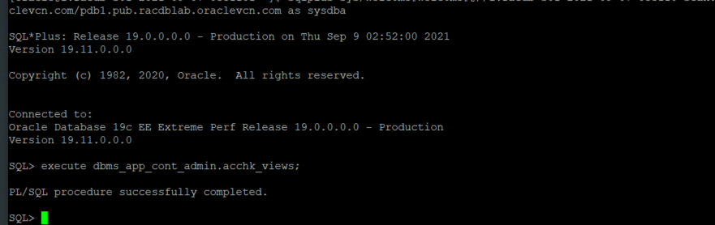
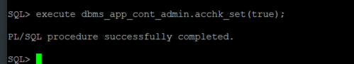
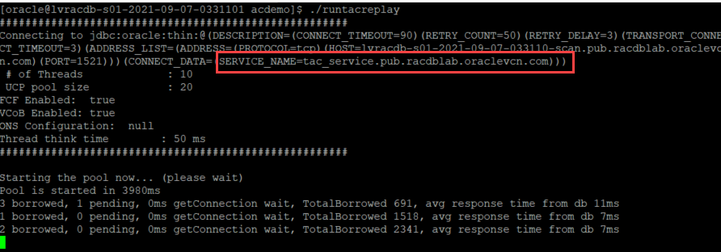
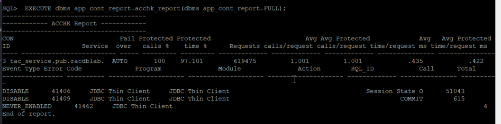
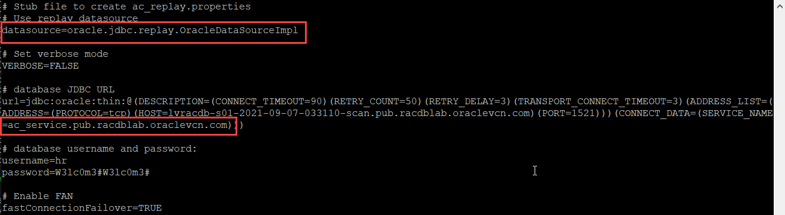
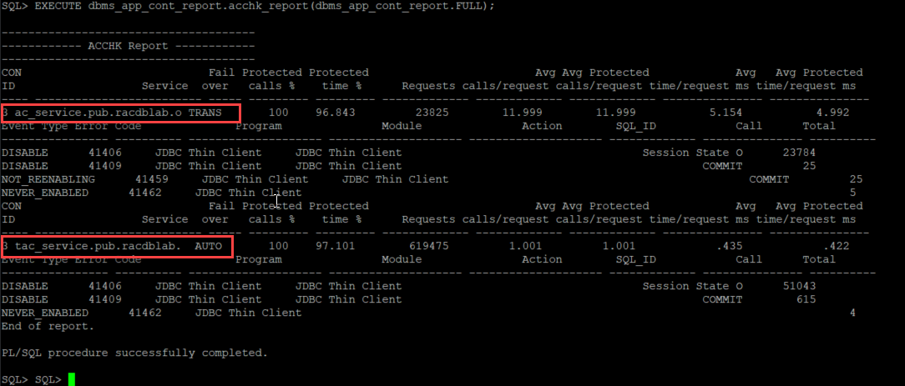

# Application Continuity

## Introduction

This lab walks you through the use and functioning of **acchk**, a database-resident untility for measuring the protection offered by Application Continuity. ACCHK provides guidance on the level of protection for each application that uses Application Continuity and helps guide you to increase protection, if required.

Estimated Lab Time: 20 Minutes

Watch the video below for a quick walk through of the lab.

[](youtube:NPL1n78YlRk)


### Prerequisites
- An Oracle LiveLabs or Paid Oracle Cloud account
- Lab: Generate SSH Key
- Lab: Build a DB System
- Lab: Services
- Lab: Install Sample Client
- Lab: Transparent Application Continuity


## Task 1:  Enabling ACCHK

The Application Continuity Protection Check (ACCHK) utility provides protection guidance for applications that use Application Continuity. For the protected applications, ACCHK also reports which operations of an application are protected, and which operations of an application are not protected.

1. Build the ACCHK views

    **Note:** This step is only required for 19c, it is not required for later versions. If you are running on 19.11 or later 19cDBRU then you have to manually build the ACCHK views before using ACCHK. This is not required for versions later than 19c.

    Connect to the PDB, *pdb1* as the *sys* user

    ````
    <copy>
    sudo su - oracle
    sqlplus sys/W3lc0m3#W3lc0m3#@//<REPLACE SCAN NAME>/pdb1.<REPLACE DOMAIN NAME> as SYSDBA
    </copy>
    ````

    Build the ACCHK views

    ````
    <copy>
    EXECUTE DBMS_APP_CONT_ADMIN.acchk_views;
    </copy>
    ````

    

2. Enable ACCHK

    Note: In Oracle Database 19c you must enable ACCHK on the instance(s) that the service your application will connect to is running (or all instances to be sure).

    As the SYS user enable ACCHK

    ````
    <copy>
    execute dbms_app_cont_admin.acchk_set(true);
    </copy>
    ````

    

3. Now run your application

    Make sure you are using a service that is enabled for Application Continuity (AC or TAC)

    There is no need to introduce any failures - just exercise as much of your application as possible

    Use the Java client for this exercise:   

    Use ACDEMO

    ````
    <copy>
    sudo su - oracle
    cd acdemo
    ./runtacreplay  
    </copy>
    ````

    

4. Generate the acchk report from within SQL\*Plus

    ````
    <copy>
    set serveroutput on
    set lines 200
    EXECUTE dbms_app_cont_report.acchk_report(dbms_app_cont_report.FULL);
    </copy>
    ````

    

    The report above shows the Java client *acdemo* using the TAC-enabled service *tac\_service*. As you can see this application is provided 100% protection from TAC.

    Note: If ACCHK produces the message *Nothing to report*, this is due to acchk_set(true) not being run on the instance that the service connected to was being offered.

5. You may have the choice of using AC or TAC (if you are using Oracle Database 19c clients and you use an Oracle Connection Pool). Our recommendation is to always start with TAC if you can, but there may be reasons why AC may be considered. Use acchk to compare the protection offered by Application Continuity

    We will use the Java client in this example.
    The script *runreplay* will configure the acdemo client to use the *ac\_service*

    You can examine the file *ac\_replay.properties* to show the configuration:

    ````
    <copy>
    sudo su - oracle
    cd acdemo
    cat ac_replay.properties
    </copy>
    ````

    

6. Ensure ACCHK is enabled

    ````
    <copy>
    sqplus sys/W3lc0m3#W3lc0m3#@//<REPLACE SCAN NAME>/pdb1.<REPLACE DOMAIN NAME> as SYSDBA
    </copy>
    ````

    Note: In Oracle Database 19c you must enable ACCHK on the instance(s) that the service your application will connect to is running (or all instances to be sure).

    As the SYS user in SQL\*Plus run the following command:

    ````
    execute dbms_app_cont_admin.acchk_set(true);
    ````

    Run the *runreplay* script from the operating system:

    ````
    <copy>
    sudo su - oracle
    cd /home/oracle/acdemo
    runreplay
    </copy>
    ````

    The acchk report can be either **FULL** or **SUMMARY**. The report is produced per PDB per SERVICE

7. And generate the report again

    

    You should now see two entries, one for the service *tac\_service* and one for the service *ac\_service*.

    The **failover_type** column indicates AUTO for TAC and TRANS (abbreviation of TRANSACTION) for AC. You may notice that the level of protection is almost identical (100% of calls, but some difference in time protected).

    The reason why a call is not protected is shown in each case, for example:

    ````
    Event Type       Error Code              Program               Module               Action        SQL_ID   Call              Total
    ---------------- ---------- -------------------- -------------------- -------------------- ------------- --------------- ----------
    DISABLE           41406     JDBC Thin Client     JDBC Thin Client                                          Session State O    51043
    DISABLE           41409     JDBC Thin Client     JDBC Thin Client                                                COMMIT         615
    NEVER_ENABLED     41462     JDBC Thin Client                                                                                      4
    ````

    A commit causes AC to disable. With TAC we will re-enable on the next call, with AC it is on the next request. The acdemo application does not perform actions after the commit.

8. ACCHK generates trace files from which it populates the database views DBA\_ACCHK\_EVENTS, DBA\_ACCHK\_EVENTS\_SUMMARY, DBA\_ACCHK\_STATISTICS and DBA\_ACCHK\_STATISTICS\_SUMMARY

    These views can be examined to gain more insight

9. Cleaning entries

    If you are going to perform multiple tests with different applications using the same service you will have to remove the trace files ACCHK generates before changing clients. Not removing the trace files will produce an aggregated report (for all users of a given service) which may not be useful.

    To remove the trace files used by ACCHK clean the entries under ORACLE BASE

    In the LiveLabs systems ORACLE_BASE is set to /u01/app/oracle

    ````
    <copy>
    cd $ORACLE_BASE/diag/rdbms/<REPLACE DB NAME>/<REPLACE INSTANCE NAME>/trace
    rm <REPLACE INSTANCE NAME>_ora_*.trc
    rm <REPLACE INSTANCE NAME>_ora_*.trm
    </copy>
    ````

    For example

    ````
    cd /u01/app/oracle/diag/rdbms/rackpemw_iad1pc/racKPEMW2/trace
    rm racKPEMW2_ora_*.trc
    rm racKPEMW2_ora_*.trm
    ````

You may now *proceed to the next lab*.  

## Appendix Troubleshooting Tips

Currently no issues reported

## Acknowledgements
* **Authors** - Troy Anthony
* **Contributors** - Kay Malcolm
* **Last Updated By/Date** - Troy Anthony, September 2021
