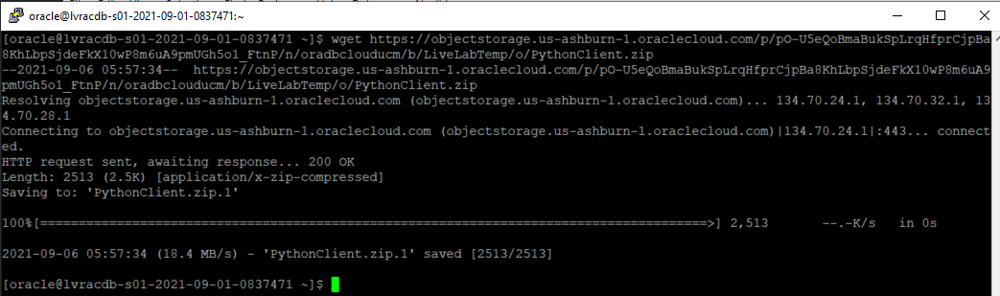
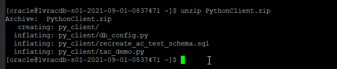
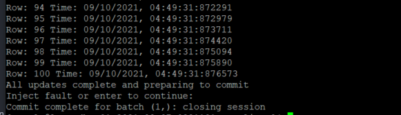
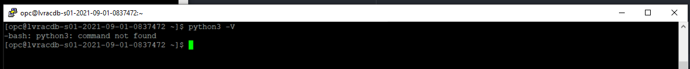
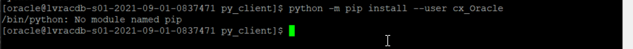
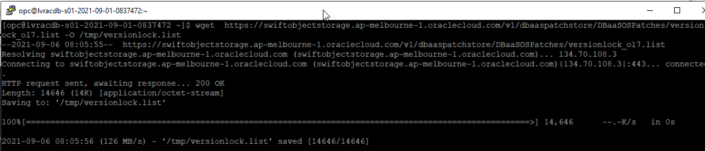
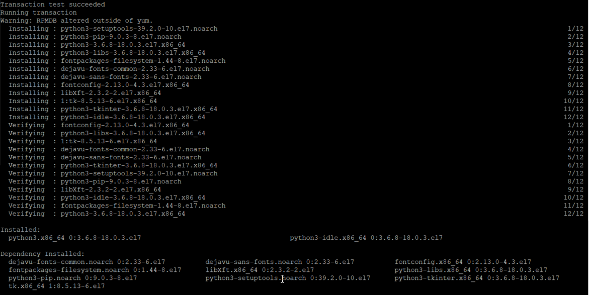

# Application Continuity

## Introduction

This lab walks you through the installing a Java client and a Python client for later use in this lab. Both clients are independant of one another.
The clients each have SQL scripts to create their own objects.

Estimated Lab Time: 10 Minutes

Watch the video below for an overview of the Application Continuity lab
[](youtube:KkwxbwII3O4)


### Prerequisites
- An Oracle LiveLabs or Paid Oracle Cloud account
- Lab: Generate SSH Key
- Lab: Build a DB System

## Task 0: Gather useful data
The following values are used in many of the commands referenced in this lab and subsequent labs. Make a copy of your values so that they can be substituted in commands referenced in these exercises.

Connect to one of your nodes and collect the following information

1. SCAN ADDRESS

    ````
    sudo su - oracle
    srvctl config scan
    ````
   

The SCAN name is supplied on the first line (and does not include the *comma*). In the example shown the SCAN Name is **lvracdb-s01-2021-09-01-083747-scan.pub.racdblab.oraclevcn.com**

2. Database name and Instance Name

    ````
    <copy>
    sudo su - oracle
    srvctl config database
    </copy>
    ````
        

In this example the database name is **lvrac_iad2kd**

3. Instance Name

The instance names are constructed from the database name. The Instance Name is formed from the that portion of the database name before the "\_" and appended with the number *1* (for instance \#1) and the number *2* (instance \#2)
In this example, Instance \#1 would be **lvrac1** and Instance \#2 would be **lvrac2**

The Oracle background processes will include the instance name. For example, on Node-1
    ````
    <copy>
    ps -ef | grep smon
    </copy>
    ````
   

4. Password

The default password used is **W3lc0m3#W3lc0m3#** - if you have specified a new password take note of it

5. PDB1 default service

A pdb named **pdb1** has been created for you, the default service name for this pdb is **pdb1.<your domain name>**. You can get your domain name from the domain listed with the SCAN ADDRESS.
In this example the default service for PDB1 is:

    ````
    pdb1.pub.racdblab.oraclevcn.com
    ````
6. The values you have collected will need to be substituted in to commands referenced in the labs.

For example, to relocate a service you would be instructed to use the command:

    ````
    srvctl relocate service -d <REPLACE DB NAME> -s <REPLACE SERVICE NAME> -i oldinst <REPLACE INSTANCE NAME> -newinst <REPLACE INSTANCE NAME>
    ````
which, in my example becomes:

    ````
    srvctl relocate service -d lvrac_iad2kd -s ac_service -oldinst lvrac1 -newinst lvrac2
    ````   
Or to connect to the default PDB service as the SYSTEM user, you would be instructed to:

    ````
    sqlplus SYSTEM/<REPLACE PASSWORD>@//<REPLACE SCAN NAME>/<REPLACE PDB SERVICE NAME>
    ````    
which in my example is:

    ````
    sqlplus SYSTEM/W3lc0m3#W3lc0m3#@//lvracdb-s01-2021-09-01-083747-scan.pub.racdblab.oraclevcn.com/pdb1.pub.racdblab.oraclevcn.com
    ````    
       

## Task 1:  Install Java Sample Program and configure services

The install script for this client (SETUP\_AC\_TEST.sh) will create the **hr** user if this user does not already exist.

1.  If you aren't already logged in to one of your cluster nodes, connect to a node using either Putty or MAC or Windows CYGWIN Emulator

**Note:** The initial lab on building the DB System has instructions on how to connect to either node using different methods.

2. Connect to the **oracle** user and download the sample program from the Object Store

    ````
    <copy>
    wget https://objectstorage.us-ashburn-1.oraclecloud.com/p/O8AOujhwl1dSTqhfH69f3nkV6TNZWU3KaIF4TZ-XuCaZ5w-xHEQ14ViOVhUXQjPB/n/oradbclouducm/b/LiveLabTemp/o/ACDemo_19c.zip
    </copy>
    ````
3. Unzip the ACDemo_19c.zip file
    ````
    <copy>
    cd /home/oracle
    unzip ACDemo_19c.zip
    </copy>
    ````
    The directory **acdemo** will be created with the following structure:

    ````
    unzip ACDemo_19c.zip
    Archive:  ACDemo_19c.zip
    creating: acdemo/
       creating: acdemo/classes/
       creating: acdemo/lib/
       creating: acdemo/src/
       creating: acdemo/win/
    inflating: README.txt
    inflating: SETUP_AC_TEST.sh
    ````
4. Set the execute bit **+x** on the SETUP\_AC\_TEST.sh script

    ````
    <copy>
    chmod +x SETUP_AC_TEST.sh
    </copy>
    ````
5. Run the script **SETUP\_AC\_TEST.sh**. You will be prompted for INPUTS. If a default value is shown, press **ENTER** to accept

    ````
    <copy>
    ./SETUP_AC_TEST.sh
    </copy>
    ````

    You will need to provide the password for the **SYSTEM** user - this is **"W3lc0m3#W3lc0m3#"** (without the quotation marks **" "**)
    Choose a name for your service. If this installation is not on the database tier many of the inputs will not have default values.

    On completion three services will be created
    **Note:** If services of the same name existed prior to running this script these services will have their original attributes - SETUP\_AC\_TEST does not attempt to modify them

   

6. Make the **run** scripts executable

    ````
    <copy>
    cd /home/oracle/acdemo
    chmod +x run*
    chmod +x kill_session.sh
    </copy>
    ````
## Task 2:  Install Python client

1. Download the python client from the object Store
    ````
    <copy>
    sudo su - oracle
    cd
    wget https://objectstorage.us-ashburn-1.oraclecloud.com/p/pO-U5eQoBmaBukSpLrqHfprCjpBa8KhLbpSjdeFkX10wP8m6uA9pmUGh5o1_FtnP/n/oradbclouducm/b/LiveLabTemp/o/PythonClient.zip
    </copy>
    ````
    

2. Unzip the Python client
    ````
    <copy>
    sudo su - oracle
    unzip PythonClient.zip
    </copy>
    ````  
    

3. Connect to the pluggable database *pdb1* as the **SYSTEM** user

    ````
    <copy>
    sudo su - oracle
    cd py_client
    sqlpus SYSTEM/W3lc0m3#W3lc0m3#@//<REPLACE SCAN NAME>/pdb1.pub.racdblab.oraclevcn.com
    </copy>
    ````
4. Create the *hr* user
   If you have already installed the Java client the **hr** user already exists (by default in **pdb1**) so this step is not required

    ````
    <copy>
    create user hr identified by W3lc0m3#W3lc0m3# default tablespace USERS temporary tablespace TEMP;
    grant connect, create session, resource to hr;
    grant create sequence to hr;
    alter user hr quota unlimited on USERS;
    exit;
    </copy>
    ````

5. Create the schema objects needed by the Python client

    ````
    <copy>
    sqlplus hr/W3lc0m3#W3lc0m3#@//<REPLACE SCAN NAME>/pdb1.pub.racdblab.oraclevcn.com
    @/home/oracle/py_client/recreate_ac_test_schema.sql
    </copy>
    ````

## Task 3: Install Python Oracle module and connect to a database

*cx\_Oracle* is a python module that enables access to Oracle databases. This module is supported by Oracle 11.2 and higher and works for both Python 2.X and 3.X. There are various ways in which cx\_Oracle can be installed. In this example, we will use pip (installed by default for python 3.4 and up). For more ways to install cx\_Oracle (like yum) check the documentation on [https://yum.oracle.com/oracle-linux-python.html#Aboutcx_Oracle](https://yum.oracle.com/oracle-linux-python.html#Aboutcx_Oracle "documentation").

1.  Since our client libraries are installed in our VM under the oracle user, we will now 'sudo' into the oracle user. (If you have an environment that does not have client libraries accessible to the user running the python3 script, install the Oracle instant client as described in the documentation.) Become the *Oracle* user.

    ````
    <copy>
    sudo su - oracle
    </copy>
    ````
    

2.  Install the *cx\_Oracle* module using python3 and pip for the oracle user.

    ````
    <copy>
    python3 -m pip install --user cx_Oracle
    </copy>
    ````

    

If this command fails - refer to the **Troubleshooting Tips** section below    

3.  Test your install by launching the python console and list the available modules.

    ````
    <copy>
    . oraenv
    </copy>
    ````
Select your database
    ````
    ORACLE_SID = [lvrac2] ?
    ORACLE_HOME = [/home/oracle] ? /u01/app/oracle/product/19.0.0.0/dbhome_1
    The Oracle base remains unchanged with value /u01/app/oracle/product/19.0.0.0/dbhome_1
    ````
    

    ````
    <copy>
    python3
    help('modules')
    </copy>
    ````

This command will show you a list of installed modules that should include the cx\_Oracle module we installed in the previous step.

    

## Task 4 Test the Python client

1. As the Oracle user edit the configuration file **db_config.py**

    ````
    <copy>
    sudo su - oracle
    cd /home/oracle/py_client
    vi db_config.py
    </copy>
    ````
The contents of db_config.py will be similar to:

    ````
    user = "hr"
    pw = "W3lc0m3#W3lc0m3#"
    dsn = "//lvracdb-s01-2021-09-07-033110-scan.pub.racdblab.oraclevcn.com/ac_service.pub.racdblab.oraclevcn.com?CONNECT_TIMEOUT=120&TRANSPORT_CONNECT_TIMEOUT=2&RETRY_COUNT=20&RETRY_DELAY=3&LOAD_BALANCE=ON"
    minconn=100  
    ````

The Data Source Name (**dsn**) can either be a TNS ALIAS or an EZConnect Plus syntax as shown here. If using a TNS ALIAS add an entry to your *tnsnames.ora* file (in $ORACLE_HOME/network/admin) similar to:

    ````
    MyAlias=(DESCRIPTION =
     (CONNECT_TIMEOUT= 90)(RETRY_COUNT=50)(RETRY_DELAY=3)(TRANSPORT_CONNECT_TIMEOUT=3)
     (ADDRESS_LIST =(LOAD_BALANCE=on)
         (ADDRESS = (PROTOCOL = TCP)(HOST=<REPLACE SCAN NAME>)(PORT=1521)))
     (CONNECT_DATA=(SERVICE_NAME = <REPLACE SERVICE NAME>)))
    ````
2. Run the client with the command:

    ````
    <copy>
    python3 tac_demo.py
    </copy>
    ````   
    

3. The client will wait for you to press ENTER and will then issue a series of commands:
    

4. When you see the message **Inject fault or enter to continue:** the client has a set of uncommitted transactions submitted to the database. You can either inject a fault (crash the database instance from another session for example) or just press ENTER to continues

        

You may now *proceed to the next lab*.  

## Appendix Troubleshooting Tips

### Issue 1 Python3 (or pip) not installed



or pip module not found:

    

#### Fix for Issue #1
Install python3 using yum as the **opc** user

````
sudo yum -y install python3 python3-tools
````

If **There are no enabled repos** add a repository to your yum configuration

1. First locate your regionIdentifier

````
<copy>
curl -s http://169.254.169.254/opc/v1/instance/ |grep region
</copy>
````
This will return information similar to:

````
[opc@lvracdb-s01-2021-09-01-0837472 ~]$ curl -s http://169.254.169.254/opc/v1/instance/ |grep region
  "region" : "iad",
  "regionInfo" : {
  "regionKey" : "IAD",
  "regionIdentifier" : "us-ashburn-1"
````

My regionIdentifier is **us-ashburn-1**

2. Replace the regionIdentifier in the following command:
    Substitute your regionIdentifier for the string **<REPLACE REGION IDENTIFIER>**

````
<copy>
wget https://swiftobjectstorage.<REPLACE REGION IDENTIFIER>.oraclecloud.com/v1/dbaaspatchstore/DBaaSOSPatches/oci_dbaas_ol7repo -O /tmp/oci_dbaas_ol7repo
</copy>  
````


3. Replace the regionIdentifier in the following command:
    Substitute your regionIdentifier for the string **<REPLACE REGION IDENTIFIER>**

````
<copy>
wget  https://swiftobjectstorage.<REPLACE REGION IDENTIFIER>.oraclecloud.com/v1/dbaaspatchstore/DBaaSOSPatches/versionlock_ol7.list -O /tmp/versionlock.list
</copy>  
````



4. Confirm there are two files in /tmp directory

````
<copy>
ls -al /tmp/versionlock.list /tmp/oci_dbaas_ol7repo
</copy>
````

this should show:

````
$ ls -al /tmp/versionlock.list /tmp/oci_dbaas_ol7repo
    -rw-rw-r-- 1 opc opc   957 Feb 17  2021 /tmp/oci_dbaas_ol7repo
    -rw-rw-r-- 1 opc opc 14646 Aug 19 05:33 /tmp/versionlock.list
````

5. Move these files to the yum directory

    ````
    <copy>
    sudo mv /tmp/oci_dbaas_ol7repo /etc/yum.repos.d/ol7.repo
    sudo mv /tmp/versionlock.list /etc/yum/pluginconf.d/versionlock.list
    </copy>
    ````  
6. Load yum

````
<copy>
sudo yum repolist
</copy>
````

which will complete in a few minutes (only partial output shown):

````
$ sudo yum repolist
Loaded plugins: versionlock
ol7_UEKR4                                                                                | 3.0 kB  00:00:00
ol7_UEKR4_archive                                                                        | 2.5 kB  00:00:00
ol7_latest                                                                               | 3.6 kB  00:00:00
ol7_latest_archive                                                                       | 2.5 kB  00:00:00
(1/5): ol7_UEKR4/x86_64/updateinfo                                                       | 100 kB  00:00:00
...
(5/5): ol7_latest/x86_64/primary_db                                                      |  35 MB  00:00:03
(1/4): ol7_UEKR4_archive/x86_64/updateinfo                                               | 267 kB  00:00:01
...
Excluding 47 updates due to versionlock (use "yum versionlock status" to show them)
repo id                                repo name                                         status
````

7. Install Python3

    ````
    <copy>
    sudo yum -y install python3 python3-tools
    </copy>
    ````  

    ````
    Installed:
       python3.x86_64 0:3.6.8-18.0.3.el7                                     python3-idle.x86_64 0:3.6.8-18.0.3.el7

    Dependency Installed:
        dejavu-fonts-common.noarch 0:2.33-6.el7          dejavu-sans-fonts.noarch 0:2.33-6.el7          fontconfig.x86_64 0:2.13.0-4.3.el7
        fontpackages-filesystem.noarch 0:1.44-8.el7      libXft.x86_64 0:2.3.2-2.el7                    python3-libs.x86_64 0:3.6.8-18.0.3.el7
        python3-pip.noarch 0:9.0.3-8.el7                 python3-setuptools.noarch 0:39.2.0-10.el7      python3-tkinter.x86_64 0:3.6.8-18.0.3.el7
        tk.x86_64 1:8.5.13-6.el7
    Complete!
    ````

      

8. If you want to be able to run the Python client on either node repeat these steps on the other node.

## Acknowledgements
* **Authors** - Troy Anthony
* **Contributors** - Kay Malcolm
* **Last Updated By/Date** - Troy Anthony, September 2021
