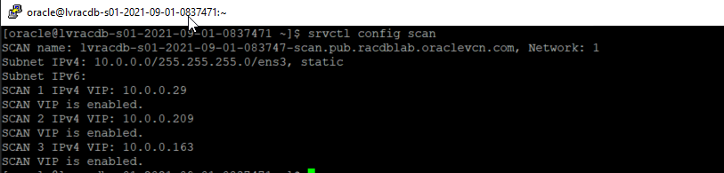
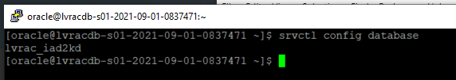
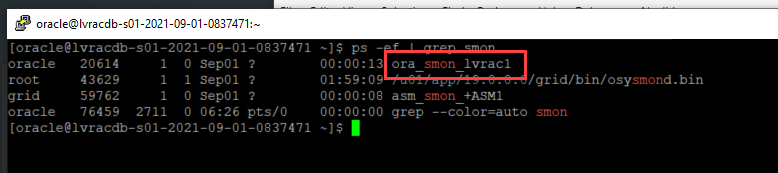
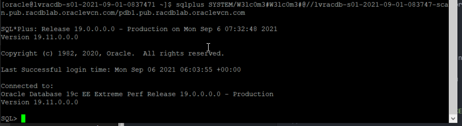

# Application Continuity

## Introduction

This lab walks you through the installing a Java client for later use in this lab. The Java client has an install script to create its own objects.

Estimated Lab Time: 10 Minutes

Watch the video below for a quick walk through of the lab.

[](youtube:LCYqgzlgaPs)

### Prerequisites
- An Oracle LiveLabs or Paid Oracle Cloud account
- Lab: Generate SSH Key
- Lab: Build a DB System

## Task 0: Gather useful data
The following values are used in many of the commands referenced in this lab and subsequent labs. Make a copy of your values so that they can be substituted in commands referenced in these exercises.

Connect to one of your nodes and collect the following information

1. SCAN ADDRESS is common to all nodes - connect to either node

      ````
      sudo su - oracle
      srvctl config scan
      ````

   

   The SCAN name is supplied on the first line (and does not include the *comma*). In the example shown the SCAN Name is **lvracdb-s01-2021-09-01-083747-scan.pub.racdblab.oraclevcn.com**

2. Database name and Instance Name

   The Database name is consistent across the cluster, the instance names are unique to each cluster.

      ````
      <copy>
      sudo su - oracle
      srvctl config database
      </copy>
      ````

        

   In this example the database name is **lvrac_iad2kd**

3. Instance Name

   The instance names are constructed from the database name. The Instance Name is formed from the that portion of the database name before the "\_" and appended with the number *1* (for instance \#1) and the number *2* (instance \#2)
   In this example, Instance \#1 would be **lvrac1** and Instance \#2 would be **lvrac2**

   The Oracle background processes will include the instance name. For example, on Node-1

      ````
      <copy>
      ps -ef | grep smon
      </copy>
      ````

   

4. Password

   The default password used is **W3lc0m3#W3lc0m3#** - if you have specified a new password take note of it

5. PDB1 default service

   A pdb named **pdb1** has been created for you, the default service name for this pdb is **pdb1.<your domain name>**. You can get your domain name from the domain listed with the SCAN ADDRESS.
   In this example the default service for PDB1 is:

      ````
      pdb1.pub.racdblab.oraclevcn.com
      ````

6. The Virtual IP (VIP) Names

   Collect the VIP names (one per node). Run the following on each node:

      ````
      <copy>
      sudo su - grid
      crsctl get nodename
      srvctl config vip -node <REPLACE NODE NAME>
      exit
      </copy>
      ````

7. The values you have collected will need to be substituted in to commands referenced in the labs. During the lab the srvctl comnmands can be run from either node, but some exercises require you to specifically target the database instance running a given service, for example. Operating system commands have to be run on a particular node (which one depends, typically, on where a given service is currently running).

   For example, to relocate a service you would be instructed to use the command:

      ````
      srvctl relocate service -d <REPLACE DB NAME> -s <REPLACE SERVICE NAME> -i oldinst <REPLACE INSTANCE NAME> -newinst <REPLACE INSTANCE NAME>
      ````

      which, in my example becomes

      ````
      srvctl relocate service -d lvrac_iad2kd -s ac_service -oldinst lvrac1 -newinst lvrac2
      ````

      Or to connect to the default PDB service as the SYSTEM user, you would be instructed to

      ````
      sqlplus SYSTEM/<REPLACE PASSWORD>@//<REPLACE SCAN NAME>/<REPLACE PDB SERVICE NAME>
      ````

      which in my example is

      ````
      sqlplus SYSTEM/W3lc0m3#W3lc0m3#@//lvracdb-s01-2021-09-01-083747-scan.pub.racdblab.oraclevcn.com/pdb1.pub.racdblab.oraclevcn.com
      ````

   

## Task 1:  Install Java Sample Program and configure services

The install script for this client (SETUP\_AC\_TEST.sh) will create the **hr** user if this user does not already exist.

1.  If you aren't already logged in to one of your cluster nodes, connect to a node using either Putty or MAC or Windows CYGWIN Emulator

   **Note:** The initial lab on building the DB System has instructions on how to connect to either node using different methods.

2. Connect to the **oracle** user and download the sample program from the Object Store

      ````
      <copy>
      wget https://objectstorage.us-ashburn-1.oraclecloud.com/p/O8AOujhwl1dSTqhfH69f3nkV6TNZWU3KaIF4TZ-XuCaZ5w-xHEQ14ViOVhUXQjPB/n/oradbclouducm/b/LiveLabTemp/o/ACDemo_19c.zip
      </copy>
      ````

3. Unzip the ACDemo_19c.zip file

      ````
      <copy>
      cd /home/oracle
      unzip ACDemo_19c.zip
      </copy>
      ````

   The directory **acdemo** will be created with the following structure:

      ````
      unzip ACDemo_19c.zip
      Archive:  ACDemo_19c.zip
      creating: acdemo/
         creating: acdemo/classes/
         creating: acdemo/lib/
         creating: acdemo/src/
         creating: acdemo/win/
      inflating: README.txt
      inflating: SETUP_AC_TEST.sh
      ````

4. Set the execute bit **+x** on the SETUP\_AC\_TEST.sh script

      ````
      <copy>
      chmod +x SETUP_AC_TEST.sh
      </copy>
      ````

5. Run the script **SETUP\_AC\_TEST.sh**. You will be prompted for INPUTS. If a default value is shown, press **ENTER** to accept

      ````
      <copy>
      ./SETUP_AC_TEST.sh
      </copy>
      ````

    You will need to provide the password for the **SYSTEM** user - this is **"W3lc0m3#W3lc0m3#"** (without the quotation marks **" "**)
    Choose a name for your service. If this installation is not on the database tier many of the inputs will not have default values.

    On completion three services will be created
    **Note:** If services of the same name existed prior to running this script these services will have their original attributes - SETUP\_AC\_TEST does not attempt to modify them

   

6. Make the **run** scripts executable

      ````
      <copy>
      cd /home/oracle/acdemo
      chmod +x run*
      chmod +x kill_session.sh
      </copy>
      ````

You may now *proceed to the next lab*.  

## Appendix Troubleshooting Tips

## Acknowledgements
* **Authors** - Troy Anthony
* **Contributors** - Kay Malcolm
* **Last Updated By/Date** - Troy Anthony, September 2021
