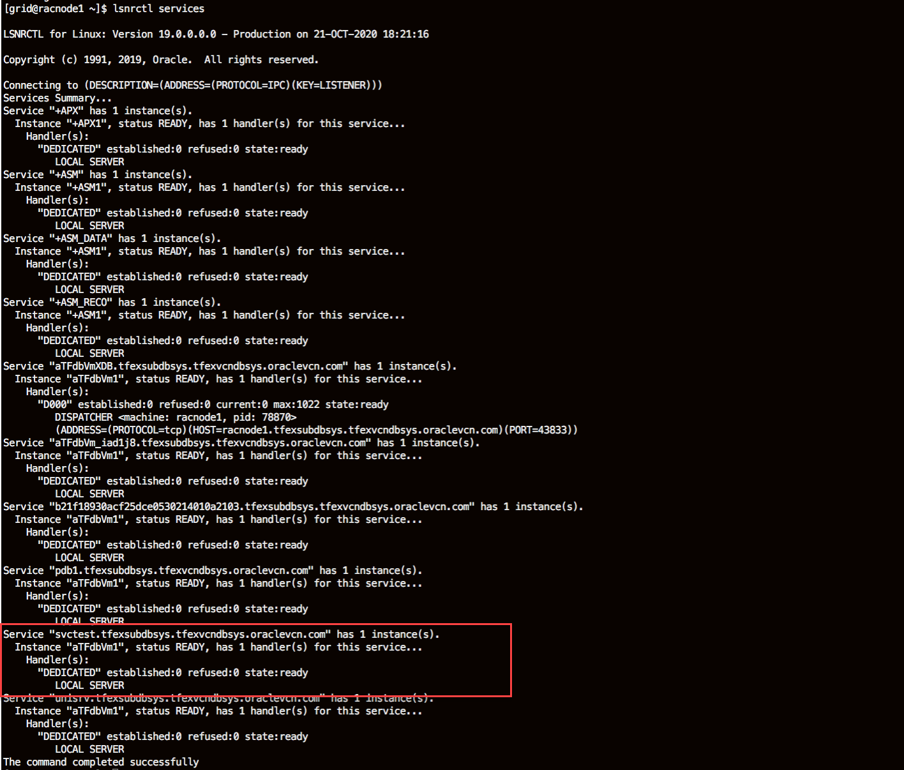
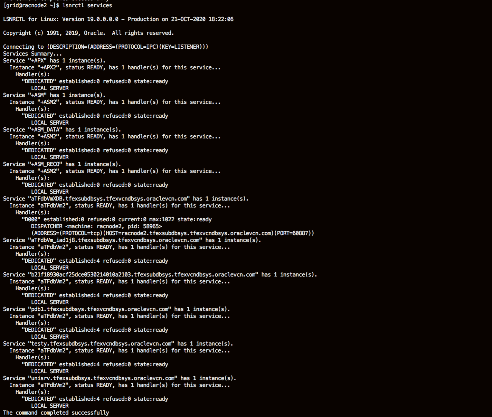
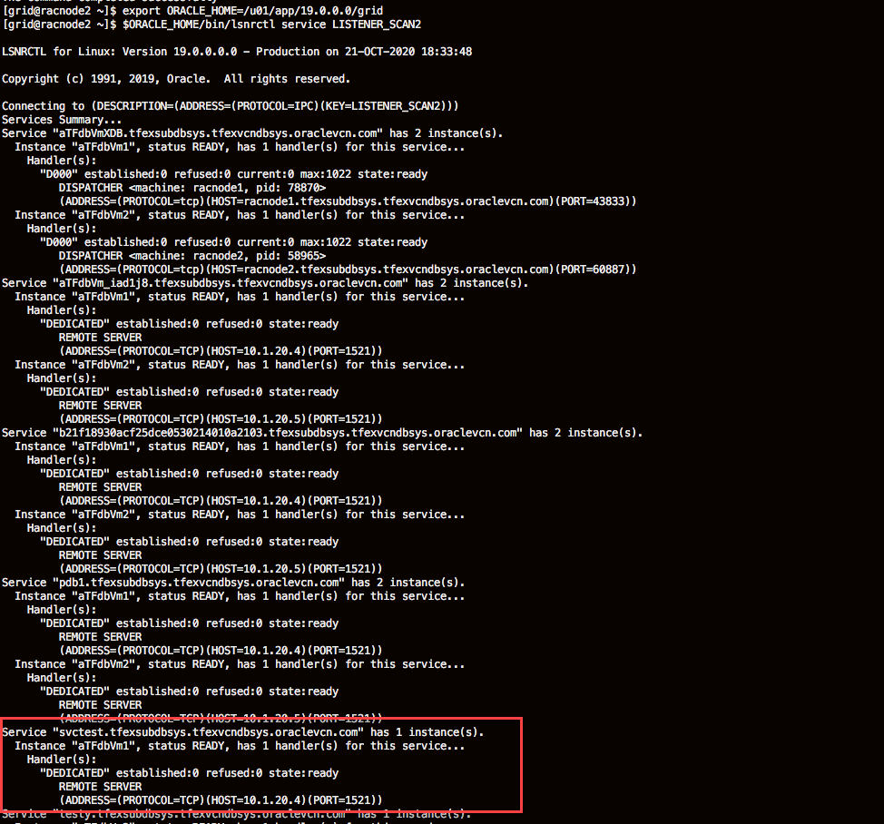
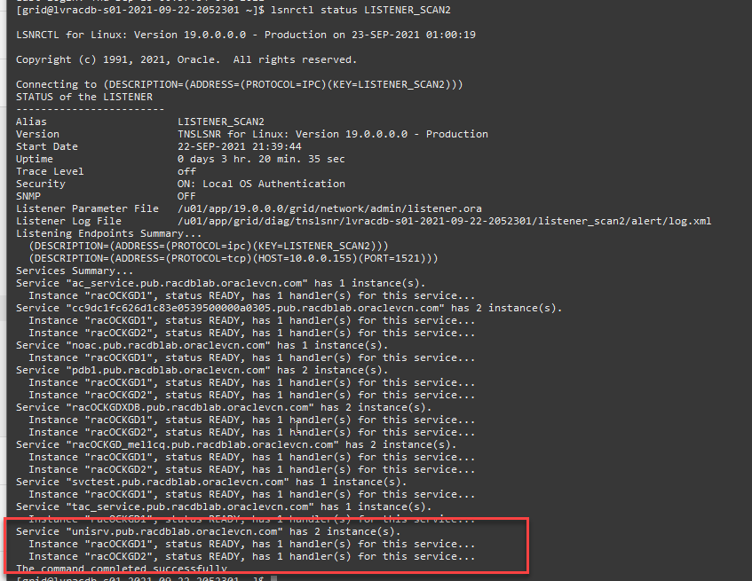
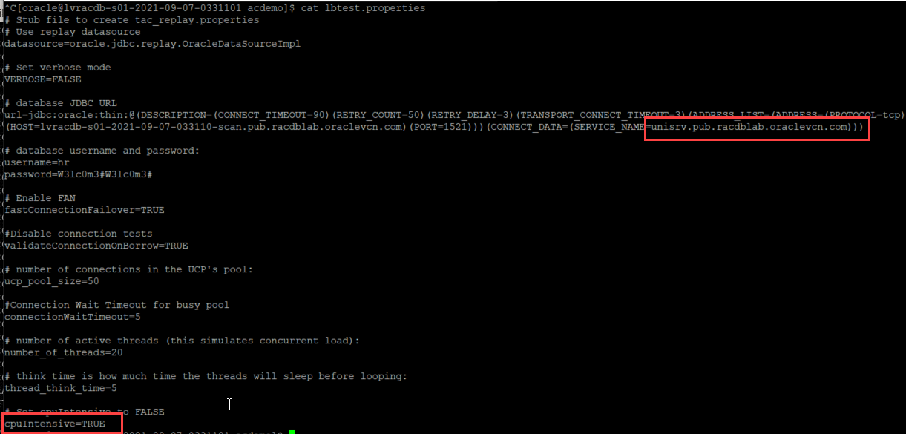
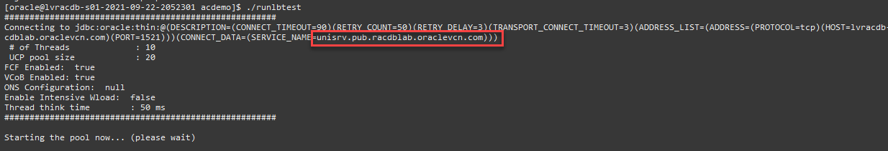
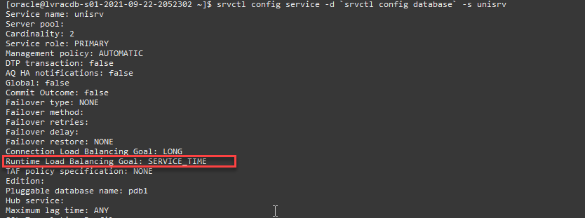

# Services

## Introduction
This lab walks you through the steps to demonstrate many of the capabilities of Oracle Database services.

Estimated Time: 20 Minutes

Watch the video below for a quick walk through of the lab.

[](youtube:HWdqRagr7UE)

### Prerequisites
- An Oracle LiveLabs or Paid Oracle Cloud account
- Lab: Generate SSH Key
- Lab: Build a DB System
- Lab: Install Sample Schema

### About Oracle Database services

Services represent groups of applications with common attributes, service level thresholds, and priorities. Application functions can be divided into workloads identified by services. You can also group work by type under services. For example, online users can use one service, while batch processing can use another and reporting can use yet another service to connect to the database.

A service can span one or more instances of an Oracle database, multiple databases in a global cluster, and a single instance can support multiple services.  The number of instances that are serving the service is transparent to the application. Services provide a single system image to manage competing applications, and allow each workload to be managed as a single unit.

Response time and CPU consumption metrics, performance and resource statistics, wait events, threshold based alerts, and performance indexes are maintained by the Automatic Workload Repository automatically for all services.  Service, module and action tags are used to identify operations within a service at the server. (MODULE and ACTION are set by the application) End to end monitoring enables aggregation and tracing at Service, Module and Action levels to identify the high load operations. Oracle Enterprise Manager administers the service quality thresholds for response time and CPU consumption, monitors the top services, and provides drill down to the top modules and top actions per service.

Connect time routing and runtime routing algorithms balance the workload across the instances offering a service. RAC use services to enable uninterrupted database operations. Planned operations are supported through interfaces that allow the relocation or disabling/enabling of services.

Application Continuity is set as an attribute of a service.

Oracle recommends that all users who share a service have the same service level requirements. You can define specific characteristics for services and each service can represent a separate unit of work. There are many options that you can take advantage of when using services. Although you do not have to implement these options, using them helps optimize application operation and performance.

For more information on Oracle Database Services visit [https://www.oracle.com/goto/ac](https://www.oracle.com/goto/ac)


## Task 1: Log in and identify database and instance names
You should have already identified your database name and instance name.  Each place in this lab where you see **<REPLACE xxx NAME>** make sure you use your correct instance and database names.
1.  Log in to the Oracle Cloud.
2.  Once you are logged in, open up a 2nd web browser tab.
3.  Start Cloud Shell in each.  Maximize both Cloud Shell instances.

    *Note:* You can also use Putty or MAC Cygwin if you chose those formats in the earlier lab.  
    

4.  Connect to node 1 as the *opc* user (you identified the IP address of node 1 in the Build DB System lab).

    ````
    ssh -i ~/.ssh/sshkeyname opc@<Node 1 Public IP Address>
    ````
    

5. Repeat this step for node 2.

    ````
    ssh -i ~/.ssh/sshkeyname opc@<Node 2 Public IP Address>
    ps -ef | grep pmon
    ````
      

6. Run the command to determine your database name and additional information about your cluster on **node 1**.  Run this as the *grid* user.

    ````
    <copy>
    sudo su - grid
    crsctl stat res -t
    </copy>
    ````
    

    

7. Find your database name in the *Cluster Resources* section with the *.db*.  Jot this information down, you will need it for this lab.

    
8. Confirm that you have the service you originally created running and note the node it is running on. My example uses a service named *testy*

    
9. Exit from the grid user

    ````
    <copy>
    exit
    </copy>
````

## Task 2:  Create a service

**NOTE** For simplicity we will often use the EZConnect syntax to specify connect strings to the database:

user/password@**//hostname:port/servicename**  EZConnect does not support all service characteristics. A fully specified URL or TNS Connect String is required for Application Continuity and other service characteristics. The 19c syntax **EZConnect Plus** can be used to set some parameters required for continuous service (including some of the application continuity characteristics), but not all of them.

1.  Create a new service **svctest** with *instance1* as a **preferred** instance and *instance2* as an **available instance**. This means that the service will normally run on the *instance1* but will failover to *instance2* if the first instance becomes unavailable.  Run this on node 1.

    *Note:* Remember to replace all instances of *aTFdbVm_replacename* with the database name you identified in Step 1.

    ````
    <copy>
    sudo su - oracle
    srvctl add service -d <REPLACE DATABASE NAME> -s svctest -preferred <REPLACE INSTANCE NAME 1> -available <REPLACE INSTANCE NAME 2> -pdb pdb1
    srvctl start service -d <REPLACE DATABASE NAME> -s svctest
    </copy>
    ````

    

2. Examine where the service is running by using **lsnrctl** to check the SCAN listener or a local listener on each node. **srvctl** will also show you where the service is running.

    The Oracle Listener runs from the Grid Home. You will assume the *grid* identity to use lsnrctl

    ````
    <copy>
    srvctl status service -d <REPLACE DATABASE NAME> -s svctest
    </copy>
    ````

    

3. Use the lsnrctl utility to list the services on both **node 1** and **node 2** as the *grid* user.

    If you are still running as the oracle user, exit to *opc* and then *su* to *grid*.

    ````
    <copy>
    exit
    su - grid
    export ORACLE_HOME=/u01/app/19.0.0.0/grid
    </copy>
    ````

    As the grid user

    ````
    <copy>
    lsnrctl services
    </copy>
    ````    

    
    


    Note that this service is only active on one instance at a time, so both **local** listeners will not include an entry for this service. In the example shown here, the listener on racnode2 would **not** have an entry for **Service "svctest.tfexsubdbsys.tfexvcndbsys.oraclevcn.com"**

4.  Any of the SCAN listeners will show where the service is offered. Note that SCAN Listeners run from the GI HOME so you have to change the ORACLE_HOME environment variable to view the information about the SCAN Listeners.  Run the lsnrctl command below on **node 2** as the *grid* user.

    ````
    <copy>
    $ORACLE_HOME/bin/lsnrctl service LISTENER_SCAN2
    </copy>
    ````
    

5. Repeat the same command on **node 1** as well.

    


## Task 3: Service Failover

1. Cause the service to fail over. After identifying which instance the service is being offered on, kill that instance by removing the SMON process at the operating system level.  Run this on **node 1**

    If you are still running as the *grid* user, exit to *opc* and then *su* to *oracle*

    ````
    <copy>
    exit
    sudo su - oracle
    export ORACLE_HOME=/u01/app/19.0.0.0/grid
    </copy>
    ````

    As the *oracle* user

    ````
    <copy>
    ps -ef | grep ora_smon
    </copy>
    ````
    This will show the SMON process id of your database  
    
    


2. In this example the process ID is 585689, which I can pass to the **kill -9 <process id>** command.  Identify your process id and issue the kill command as the *oracle* user

    ````
    kill -9 ######
    ````

    This will cause the instance to fail, any connections to the database on this instance would be lost. The CRS component of Grid Infrastructure would detect the instance failure, and immediately start the service on an **available** instance (based on the service definition). CRS would then restart the database instance.

3. Rerun the *srvctl status service* command and notice that the service has failed over to the other instance:

    ````
    <copy>
    srvctl status service -d <REPLACE DATABASE NAME> -s svctest
    </copy>
    ````

    Depending on where your service was running beforehand, you will notice something similar to

    

4. Manually relocate the service. Open a connection (with SQL*Plus) to the instance where the service is running. Use the SCAN address and the domain qualified service name in the format:

    ````
    sqlplus user/password@//<REPLACE SCAN NAME>/svctest.<DOMAIN NAME>
    ````

5. To get the SCAN address run the following command

    ````
    <copy>
    srvctl config scan
    </copy>
    ````  

6. Connect through sqlplus and replace the scan address name and the password with the password you chose for your cluster.
    **Note:** The service domain name will be the same domain as the SCAN Address

    ````
    <copy>
    sqlplus sys/W3lc0m3#W3lc0m3#@//<REPLACE SCAN NAME>/svctest.pub.racdblab.oraclevcn.com as sysdba
    </copy>
    ````

    


6. Using a different cloud shell window (connected to either node) open a SQL*Plus connection as SYS to the PDB associated with this service

    ````
    <copy>
    sqlplus sys/W3lc0m3#W3lc0m3#@//<REPLACE SCAN NAME>/pdb1.pub.racdblab.oraclevcn.com as sysdba
    </copy>
    ````
    and run the following SQL statement

    ````
    <copy>
    set wrap off
    col service_name format  a20
    select inst_id, service_name, count(*) from gv$session where service_name = 'svctest' group by inst_id, service_name;
    exit
    </copy>
    ````
    This statement will show you the instance this service is running and the number of open connections on this service.

    


7. Relocate the service using srvctl.  Execute the command on **node 2**
   **Note:** The oldinst is the instance the service is currently running on, newinst is the instance you will relocate to

    ````
    <copy>
     srvctl relocate service -d <REPLACE DATABASE NAME> -s svctest -oldinst <REPLACE INSTANCE NAME 2> -newinst <REPLACE INSTANCE NAME 1>
    </copy>
    ````
    which will move the service from one instance to another:

    

    Re-examine the v$session information:

    ````

    SQL> /
    INST_ID     SERVICE_NAME         COUNT(*)
    ---------- -------------------- ----------
       2         svctest                1
    ````
    It will still show connected sessions to the instance that no longer offers the service.

    The relocate service command will not disconnect active sessions unless a force option (**-force**) is specified. A stop service command will allow a drain timeout to be specified to allow applications to complete their work during the drain interval.

8. Disconnect the sessions from *svctest*, they will not be used in the next exercise.    

## Task 4: Connection Load Balancing
This exercise will demonstrate connection load balancing and why it is important to use the SCAN address and the VIPs as integral parts of your connection strategy

1. Examine the uniform service, named *unisrv*, that is **available** on both instances of your RAC database.  Execute this on **node 1**

    ````
    <copy>
    srvctl status service -d <REPLACE DATABASE NAME> -s unisrv
    </copy>
    ````
If it is not running start this service

    ````
    Service unisrv is running on instance(s) racKPEMW1,racKPEMW2
    ````    
    

2. Look at the entry for this server in the **lsnrctl service LISTENER_SCAN2** output. Note that any of the SCAN listeners can be used here.  Run this on **node 2** as the *oracle* user

    ````
    <copy>
    export ORACLE_HOME=/u01/app/19.0.0.0/grid
    $ORACLE_HOME/bin/lsnrctl service LISTENER_SCAN2
    </copy>
    ````

    where you will see similar to:

    

    You should notice that an entry for this service is configured for each instance.

3. Set your oracle environment and edit your tnsnames.ora file (in $ORACLE_HOME/network/admin wherever you are running your client connections from).

    ````
    . oraenv
    <<Press enter>>
    /u01/app/oracle/product/19.0.0.0/dbhome_1
    vi $ORACLE_HOME/network/admin/tnsnames.ora
    ````

    

    


4. Add the following two entries.  Click **:wq!** to save.

    *Note:* that these tnsnames entries do not comply with the recommended format for continuous availability. They are only used to be illustrative of connection load balancing (CLB)

    **Note:** In CLBTEST the HOST is the SCAN NAME (not including the \<\>)
              In CLBTEST_LOCAL each HOST is the *VIP* name or IP address of the VIPs registered on Node-1 and Node-2 in your cluster
    ````
    <copy>
    CLBTEST = (DESCRIPTION =
       (ADDRESS = (PROTOCOL = TCP)(HOST = <REPLACE SCAN NAME>)(PORT = 1521))
       (LOAD_BALANCE = no) (FAILOVER = yes)
       (CONNECT_DATA = (SERVER = DEDICATED) (SERVICE_NAME = unisrv.pub.racdblab.oraclevcn.com) ) )


    CLBTEST-LOCAL = (DESCRIPTION =
        (LOAD_BALANCE = on) (FAILOVER = off)
        (ADDRESS = (PROTOCOL = TCP)(HOST = <REPLACE VIP HOST1>)(PORT = 1521))
        (ADDRESS = (PROTOCOL = TCP)(HOST = <REPLACE VIP HOST2>)(PORT = 1521))
        (CONNECT_DATA = (SERVER = DEDICATED) (SERVICE_NAME = unisrv.pub.racdblab.oraclevcn.com)))

    CLBTEST-NODE1 = (DESCRIPTION =
        (LOAD_BALANCE = on) (FAILOVER = off)
        (ADDRESS = (PROTOCOL = TCP)(HOST = <REPLACE VIP HOST1>)(PORT = 1521))
        (CONNECT_DATA = (SERVER = DEDICATED) (SERVICE_NAME = unisrv.pub.racdblab.oraclevcn.com)))

    CLBTEST-NODE2 = (DESCRIPTION =
        (LOAD_BALANCE = on) (FAILOVER = off)
        (ADDRESS = (PROTOCOL = TCP)(HOST = <REPLACE VIP HOST2>)(PORT = 1521))
        (CONNECT_DATA = (SERVER = DEDICATED) (SERVICE_NAME = unisrv.pub.racdblab.oraclevcn.com)))    

    </copy>
    ````

    

    To run a client from either node, create an identical *tnsnames.ora* file on each node.

5. Run the command to get your scan name
    ````
    <copy>
    srvctl config scan
    </copy>
    ````

6. Run the nslookup command, on either node, followed by your scan name

    ````
    <copy>
    nslookup <REPLACE SCAN NAME>
    </copy>
    ````
    

7. Run the ping command on either node

    ````
    <copy>
    ping <REPLACE SCAN NAME> -c 2
    </copy>
    ````
    

8. Use the CLBTEST alias to connect

    ````
    <copy>
    $ORACLE_HOME/bin/sqlplus hr/W3lc0m3#W3lc0m3#@CLBTEST
    </copy>
    ````

9. Create 10 connections using the alias CLBTEST and look at where the connections were established

    You can do this by issuing the **host** command from within SQL\*Plus and then re-issuing the sqlplus connection from the shell.

    For example:

    ````
    $ORACLE_HOME/bin/sqlplus hr/W3lc0m3#W3lc0m3#@CLBTEST
    SQL> host
    os-prompt>  $ORACLE_HOME/bin/sqlplus hr/W3lc0m3#W3lc0m3#@CLBTEST
    SQL> host
    ````

    Examine where the sessions have been created by executing the following SQL from a session connected as **SYS**

    ````
    SQL> select inst_id, service_name, count(*) from gv$session where service_name = 'unisrv' group by inst_id, service_name;

    INST_ID SERVICE_NAME             COUNT(*)
    ---------- -------------------- ----------
        1     unisrv                   5
        2     unisrv                   5
    ````

    

    The SCAN listener attempts to distribute connections based on SESSION COUNT by default. The connections will not always end up equally balanced across instances, but for a small number of connections created at intervals they generally do.

    You can instruct the listener to use the load on an instance to balance connection attempts (the listener will store run queue information), but this is not the default.

10. Now do the same with the CLBTEST-LOCAL alias (close the first sessions as it will make it easier to illustrate what happens)

    ````  
    INST_ID     SERVICE_NAME          COUNT(*)
    ---------- -------------------- ----------
         1      unisrv                   8
         2      unisrv                   2
    ````

    Note that you can create multiple connections with the command:
    ````
    <copy>
    a=160
    while [ $a -gt 0 ]; do
    sqlplus hr/W3lc0m3#W3lc0m3#@CLBTEST-LOCAL & a=$((a-1));
    done
    </copy>
    ````
    This will spawn 160 sqlplus sessions - and the distribution may be similar to:
    ````  
    INST_ID     SERVICE_NAME          COUNT(*)
    ---------- -------------------- ----------
         1      unisrv                   85
         2      unisrv                   75
    ````

    To remove the sqlplus sessions enter the following commands:

    ````
    <copy>
    killall sqlplus
    while true; do
    fg;
    done
    </copy>
    ````
    Enter <ctrl-C> (the control-c command) when you see the following message scrolling on the screen:

    ````
    -bash: fg: current: no such job
    -bash: fg: current: no such job
    -bash: fg: current: no such job
    -bash: fg: current: no such job
    ^C
    ````

    This second case illustrates client-side load balancing. The TNS alias defined, through the use of FAILOVER=ON, instructs an address to be selected at random from the available ADDRESS entries. There is no guarantee of connection balancing. If you disable load balancing \(LOAD_BALANCE=OFF\), then the addresses will be tried sequentially until one succeeds. In the case where all instances are available all connections will go to the first ADDRESS in the list if client-side load balancing were disabled:

    ````
    INST_ID    SERVICE_NAME           COUNT(*)
    ---------- -------------------- ----------
      1         unisrv                   10
    ````
11. What if an instance is not available?  Shutdown one of the instances with srvctl - specify \"-f\" as you want to forcibly close services if any are running.

    ````
    <copy>
    srvctl stop instance -d <REPLACE DATABASE NAME> -i aTFdbVm2 -f
    exit
    </copy>
    ````

12. Attempt to use the CLBTEST-LOCAL alias to connect as the *oracle* user on **node 1**.  Remember to replace the password with the database password you chose when you provisioned the instance. If the ADDRESS to the instance you just stopped is chosen, you will see the following:

    ````
    <copy>sudo su - oracle</copy>
    ````


    ````
    [oracle@racnode1 ~]$ $ORACLE_HOME/bin/sqlplus hr/W3lc0m3#W3lc0m3#@CLBTEST-LOCAL
    SQL*Plus: Release 19.0.0.0.0 - Production on Mon Aug 24 08:34:32 2020
    Version 19.7.0.0.0
    Copyright (c) 1982, 2020, Oracle.  All rights reserved.

    ERROR:
    ORA-12514: TNS:listener does not currently know of service requested in connect descriptor
    Enter user-name:
    ````
    This address could be repeatedly tried \(it is a random access\)

    **Note:** If you use CLBTEST-NODE1 or CLBTEST-NODE2 you will force the connection to a Node Listener. Choosing the listener where the instance was stopped is guaranteed to fail.

    The CLBTEST alias uses the SCAN address and will only send requests to the available instances

    ````
    [oracle@racnode1 ~]$ $ORACLE_HOME/bin/sqlplus sh/W3lc0m3#W3lc0m3#@CLBTEST
    SQL*Plus: Release 19.0.0.0.0 - Production on Mon Aug 24 08:38:56 2020
    Version 19.7.0.0.0
    Copyright (c) 1982, 2020, Oracle.  All rights reserved.
    Last Successful login time: Mon Aug 24 2020 08:37:33 +00:00

    Connected to:
    Oracle Database 19c EE Extreme Perf Release 19.0.0.0.0 - Production
    Version 19.7.0.0.0
    SQL>
    ````
13. The recommended connect string for all Oracle Drivers of version 12.2 or later is:

    ````
    Alias (or URL) =
       (DESCRIPTION =
            (CONNECT_TIMEOUT=90)(RETRY_COUNT=20)(RETRY_DELAY=3)(TRANSPORT_CONNECT_TIMEOUT=3)
            (ADDRESS_LIST =(LOAD_BALANCE=on)
               (ADDRESS = (PROTOCOL = TCP)(HOST=primary-scan)(PORT=1521)))
            (ADDRESS_LIST =(LOAD_BALANCE=on)
               (ADDRESS = (PROTOCOL = TCP)(HOST=secondary-scan)(PORT=1521)))
            (CONNECT_DATA=(SERVICE_NAME = gold-cloud)))
    ````    

    This is showing how a RAC and Data Guard environment would be specified. The assumption is that both the PRIMARY and SECONDARY sites are clustered environments, hence specifying a SCAN ADDRESS for each one.

    Oracle recommends the connection string configuration for successfully connecting at failover, switchover, fallback and basic startup. Set RETRY\_COUNT, RETRY\_DELAY, CONNECT\_TIMEOUT and TRANSPORT\_CONNECT\_TIMEOUT parameters in the tnsnames.ora file or in the URL to allow connection requests to wait for service availability and connect successfully. Use values that allow for your RAC and Data Guard failover times.

14.  Update your tnsnames.ora file to specify a configuration similar to that below. This connect string will be used in later labs

    ````
    <copy>
    vi /u01/app/oracle/product/19.0.0.0/dbhome_1/network/admin/tnsnames.ora
    </copy>
    ````

    ````
    <copy>
    RECSRV=(DESCRIPTION =
     (CONNECT_TIMEOUT=90)(RETRY_COUNT=20)(RETRY_DELAY=3)(TRANSPORT_CONNECT_TIMEOUT=3)
     (ADDRESS_LIST =(LOAD_BALANCE=on)
     (ADDRESS = (PROTOCOL = TCP)(HOST=<REPLACE SCAN NAME>)(PORT=1521)))
     (CONNECT_DATA=(SERVICE_NAME = <REPLACE SERVICE NAME>.pub.racdblab.oraclevcn.com)))
    </copy>
    ````

    

15. Verify you can connect using this alias.

16. Restart the instance you stopped earlier

    ````
    <copy>
    srvctl start instance -d <REPLACE DATABASE NAME> -i aTFdbVm2
    </copy>
    ````

## Task 5 The difference between connection load balancing and runtime load Balancing

Ensure you restart any instances you previously shutdown.

In this exercise we will use the Java client you installed previously: **acdemo**

The acdemo application is a simple Java application that uses the Universal connection pool (UCP) to connect to the database and run a simple OLTP workload. The application is configured through a property file, and a simple shell script is provided to run the application.

1. Examine the lbtest.properties file

    ````
    <copy>
    sudo su - oracle
    cd /home/oracle/acdemo
    ls -al lbtest.properties
    </copy>
    ````
    ````
    $ ls -al /home/oracle/acdemo/lbtest.properties
       -rw-r--r-- 1 oracle oinstall 980 Sep  7 05:41 /home/oracle/acdemo/lbtest.properties
    ````
    ````
    <copy>
    more /home/oracle/acdemo/lbtest.properties
    </copy>
    ````
      

    You can see that the application will use the service *unisrv* to connect to the database. And will establish 20 connections. We are using the SCAN address in the URL, so with no modification we should see a balanced number of connections on each instance.

2. The unisrv service is configured as a uniform service (available on all instances).

    ````
    <copy>
    srvctl config service -d <REPLACE DB NAME> -s unisrv
    </copy>
    ````

    This should show both instances in the PREFERRED list if successful

    ````
    Service name: unisrv

    <some values removed>

    Service is enabled
    Preferred instances: racKPEMW1,racKPEMW2
    Available instances:
    ````  

    Check that the service is running on both instances

    ````
    <copy>
    srvctl status service -d <REPLACE DB NAME> -s unisrv
    </copy>
    ````

3. Ensure you are connected as the *oracle* user and then start the acdemo application using the runlbtest script.

    ````
    <copy>
    cd /home/oracle/acdemo
    ./runlbtest
    </copy>
    ````

          

    Make sure acdemo is using the *unisrv* service     

4. Look at the connection distribution by opening a SQL\*Plus connection, on either node, to the PDB associated with this service

    ````
    sqlplus system/W3lc0m3#W3lc0m3#@//<REPLACE SCAN NAME>/pdb1.pub.racdblab.oraclevcn.com as sysdba
    ````

    and run the following SQL statement

    ````
    <copy>
    set wrap off
    col service_name format  a20
    select inst_id, service_name, count(*) from gv$session where service_name = 'unisrv' group by inst_id, service_name;
    </copy>
    ````

    This statement will show you the instance this service is running and the number of open connections on this service.
    It should be relatively even

    ````
    INST_ID    SERVICE_NAME           COUNT
    ---------- -------------------- ----------
    1      unisrv                    10
    2      unisrv                    10
    ````

    The UCP pool manager will be handing these connections to worker threads as they need them. There are algorithms that influence this, such as those related to affinity (where you were connected before) or time-based (when your thread last requested a connection) but generally the connections are handed out equally (for connections on each instance and so forth)

5. We know that nodes in a cluster may not be equal in capacity, nor may there be equal distribution of workload on each node.

    If you look at the current response time for acdemo it is fairly equal - probably 5-6 ms per request.

    ````
    39 borrowed, 0 pending, 0ms getConnection wait, TotalBorrowed 71989, avg response time from db 5ms
    40 borrowed, 0 pending, 0ms getConnection wait, TotalBorrowed 73685, avg response time from db 6ms
    42 borrowed, 0 pending, 0ms getConnection wait, TotalBorrowed 74535, avg response time from db 6ms
    37 borrowed, 0 pending, 0ms getConnection wait, TotalBorrowed 75376, avg response time from db 5ms
    41 borrowed, 0 pending, 0ms getConnection wait, TotalBorrowed 75376, avg response time from db 5ms
    37 borrowed, 0 pending, 0ms getConnection wait, TotalBorrowed 75376, avg response time from db 5ms
    ````

    Consume CPU on one node with a database-external program. Download the CPU\_HOG utility to the opposite Node from where you are running the acdemo application. If, for example acdemo runs on Node-1, then download CPU\_HOG to Node-2.

    ````
    <copy>
    cd /home/oracle
    wget https://objectstorage.us-ashburn-1.oraclecloud.com/p/iMYwjIGTOrUvs4FQqoKY7ie7os3Ybocg1wob-G18rAneuZP-F__z_XoXUKB6hhIt/n/oradbclouducm/b/LiveLabTemp/o/cpuhog.zip
    </copy>
    ````
    Unzip the utility and set the execution bit (\+x)

    ````
    <copy>
    cd /home/oracle
    mkdir /home/oracle/cpu_hog
    cd cpu_hog
    unzip ../cpuhog.zip
    chmod +x atm_cpuload_st.pl primes
    </copy>
    ````

    Start the CPU\_HOG utility, specifying a target load of 90%

    ````
    <copy>
    cd /home/oracle/cpu_hog
    atm_cpuload_st.pl 90
    </copy>
    ````

    

    You should see some acdemo requests getting longer (they will periodically jump to 15 - 20 ms, a significant change) - this is because the threads are using connections on the overloaded node

    ````
    39 borrowed, 0 pending, 0ms getConnection wait, TotalBorrowed 71989, avg response time from db 38ms
    40 borrowed, 0 pending, 0ms getConnection wait, TotalBorrowed 73685, avg response time from db 39ms
    42 borrowed, 0 pending, 0ms getConnection wait, TotalBorrowed 74535, avg response time from db 40ms
    37 borrowed, 0 pending, 0ms getConnection wait, TotalBorrowed 75376, avg response time from db 47ms
    41 borrowed, 0 pending, 0ms getConnection wait, TotalBorrowed 75376, avg response time from db 47ms
    37 borrowed, 0 pending, 0ms getConnection wait, TotalBorrowed 75376, avg response time from db 40ms
    ````

6. Enable runtime load balancing on the unisrv service

    ````
    <copy>
    srvctl modify service -d <REPLACE DB NAME> -s unisrv -rlbgoal SERVICE_TIME
    </copy>
    ````
    Confirm the config

    ````
    srvctl config service -d <REPLACE DB NAME> -s unisrv
    ````

    


7. How Runtime Load Balancing (RLB) functions is that a smoothed rolling average of responses is calculated by service in the database. From this a metric is sent as a FAN event to subscribing clients. The RLB directive gives an indication to the client how database activity on each instance is performing (for that service). A guide is given to the pool to direct a portion of work to each instance - a lesser value to instances that are loaded.

    Examine the RLB statistics

    ````
    <copy>
    sqlplus sys/W3lc0m3#W3lc0m3#@//<REPLACE SCAN NAME>/pdb1.pub.racdblab.oraclevcn.com as sysdba
    </copy>
    ````

    Enter the following in to SQL\*plus

    ````
    <copy>
    set colsep '|' pages 60 space 2 lines 132 num 8 verify off feedback off
    col user_data heading "Service Metrics" format A80 wrap
    break on SERVICE_NAME skip 1

    SELECT
    TO_CHAR(ENQ_TIME, 'HH24:MI:SS') Enq_time, user_data
    FROM SYS.SYS$SERVICE_METRICS_TAB
    WHERE ENQ_TIME >= (select max(ENQ_TIME)- 60/1440/60 from SYS.SYS$SERVICE_METRICS_TAB )
    ORDER BY 1;
    </copy>
    ````


    You will see something similar to:

    ````
    ENQ_TIME  Service Metrics
    --------  --------------------------------------------------------------------------------

    10:03:37  SYS$RLBTYP('noac.pub.racdblab.oraclevcn.com', 'VERSION=1.0 database=racKPEMW_iad
            1pc service=noac.pub.racdblab.oraclevcn.com { {instance=racKPEMW2 percent=51 fla
            g=GOOD aff=FALSE}{instance=racKPEMW1 percent=49 flag=GOOD aff=TRUE} } timestamp=
            2021-09-07 09:59:37')

    10:04:07  SYS$RLBTYP('noac.pub.racdblab.oraclevcn.com', 'VERSION=1.0 database=racKPEMW_iad
            1pc service=noac.pub.racdblab.oraclevcn.com { {instance=racKPEMW2 percent=25 fla
            g=GOOD aff=TRUE}{instance=racKPEMW1 percent=75 flag=GOOD aff=FALSE} } timestamp=
            2021-09-07 10:03:37')

    10:04:07  SYS$RLBTYP('noac.pub.racdblab.oraclevcn.com', 'VERSION=1.0 database=racKPEMW_iad
            1pc service=noac.pub.racdblab.oraclevcn.com { {instance=racKPEMW2 percent=16 fla
            g=GOOD aff=TRUE}{instance=racKPEMW1 percent=84 flag=GOOD aff=FALSE} } timestamp=
            2021-09-07 10:04:07')

    10:04:37  SYS$RLBTYP('noac.pub.racdblab.oraclevcn.com', 'VERSION=1.0 database=racKPEMW_iad
            1pc service=noac.pub.racdblab.oraclevcn.com { {instance=racKPEMW2 percent=11 fla
            g=GOOD aff=TRUE}{instance=racKPEMW1 percent=89 flag=GOOD aff=TRUE} } timestamp=2
            021-09-07 10:04:37')
    ````

    The ratio of percent:percent for the instances will trend towards more work guided away from the Node where CPU\_HOG is running, as shown above

    ````
    racKPEMW1 percent - racKPEMW1 percent
        49                   51
        75                   25
        84                   16
        89                   11
    ````

    The connections are still distributed approximately 50:50 but the pool directs a greater quantity of work towards the instance(s) offering the best quality of service.

You may now *proceed to the next lab*.  

## Acknowledgements
* **Authors** - Troy Anthony, Anil Nair
* **Contributors** - Kay Malcolm, Kamryn Vinson
* **Last Updated By/Date** - Troy Anthony, September 2021
