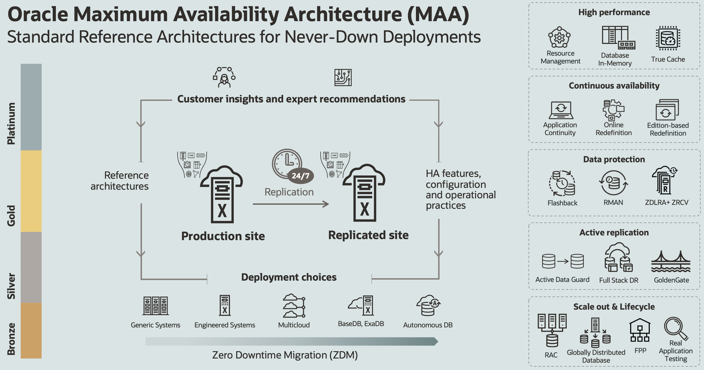

# Introduction

## Introduction to Real Application Clusters ##
Oracle RAC is a cluster database with a shared cache architecture that overcomes the limitations of traditional shared-nothing and shared-disk approaches to provide highly scalable and available database solutions for all business applications. Oracle RAC is a key component of Oracle's private cloud architecture.

Oracle Real Application Clusters provides customers with the highest database availability by removing individual database servers as a single point of failure. In a clustered server environment, the database itself is shared across a pool of servers, which means that if any server in the server pool fails, the database continues to run on surviving servers. Oracle RAC not only enables customers to continue processing database workloads in the event of a server failure, it also helps to further reduce costs of downtime by reducing the amount of time databases are taken offline for planned maintenance operations.

Oracle Real Application Clusters enables the transparent deployment of Oracle Databases across a pool of clustered servers. This enables customers to easily re-deploy their single server Oracle Database onto a cluster of database servers, and thereby take full advantage of the combined memory capacity and processing power the clustered database servers provide.

Oracle Real Application Clusters provides all the software components required to easily deploy Oracle Databases on a pool of servers and take full advantage of the performance, scalability and availability that clustering provides. Oracle RAC utilizes Oracle Grid Infrastructure as the foundation for Oracle RAC database systems. Oracle Grid Infrastructure includes Oracle Clusterware and Oracle Automatic Storage Management (ASM) that enable efficient sharing of server and storage resources in a highly available and scalable database cloud environment.

Watch the video below for an overview of Oracle RAC.

### About this Workshop
Oracle Real Application clusters can be deployed in a variety of ways.  On bare metal servers, in docker containers, on engineered systems and in the Oracle Cloud.

In this workshop you will create a 2-node Oracle Real Application Clusters database in the Oracle Cloud.  Oracle Cloud Infrastructure offers 2-node RAC DB systems on virtual machines. When you launch a virtual machine DB system, you choose a shape, which determines the resources allocated to the DB system. After you provision the system, you can change the shape to adapt to new processing capacity requirements.  

You will be using the VM.Standard2.2 shape with 4 OCPUs and 60GB of memory.

For more about Virtual DB systems, click [here](https://docs.cloud.oracle.com/en-us/iaas/Content/Database/Concepts/overview.htm).

### Workshop Objectives
- Connect to a DB System
- Clusterware and Fencing
- Fast Application Notification
- Install Sample Schema
- Services
- SQL and PL/SQL - Sequences
- Parallel Execution
- Oracle Scheduler
- PL/SQL Packages

Estimated Workshop Time:  4 hours

## More on Oracle RAC

Oracle RAC provides:
* High availability
* Scalability
* Database as a Service

Oracle Database with the Oracle Real Application Clusters (RAC) option allows multiple instances running on different servers to access the same physical database stored on shared storage. The database spans multiple hardware systems and yet appears as a single unified database to the application. This enables the utilization of commodity hardware to reduce total cost of ownership and to provide a scalable computing environment that supports various application workloads. If additional computing capacity is needed, customers can add additional nodes instead of replacing their existing servers. The only requirement is that servers in the cluster must run the same operating system and the same version of Oracle. They do not have to be the same model or capacity. This saves on capital expenditures allowing customers to buy servers with latest hardware configurations and use it alongside existing servers. This architecture also provides high availability as RAC instances running on different nodes provides protection from a server failure. It is important to note that (almost) all applications such as Oracle Applications, PeopleSoft, Siebel, SAP run without any changes on Oracle RAC.

## RAC and MAA
Oracle MAA is a collection of architecture, configuration, and life cycle best practices and blueprints. It provides Oracle’s customers with valuable insights and expert recommendations which have been validated and tested working with enterprise customers. This is also an outcome of ongoing communication, with the community of database architects, software engineers, and database strategists, that helps Oracle develop a deep and complete understanding of various kinds of events that can affect availability or data integrity. Over the years, this led to the development and natural evolution of an array of availability reference architectures.

RAC is a key underpinning of MAA.

## More Information on Oracle RAC

* [Visit the RAC site on OTN](https://www.oracle.com/database/technologies/rac.html)

## Acknowledgements

- **Authors/Contributors** - Troy Anthony, Anil Nair, Kay Malcolm
- **Last Updated By/Date** - Kay Malcolm, October 2020
