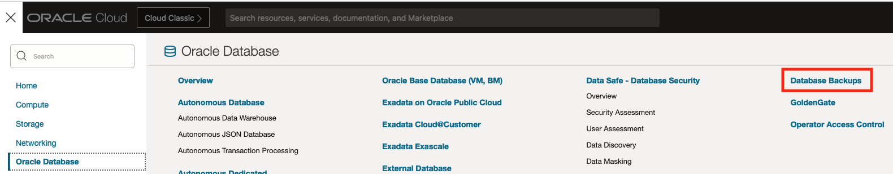
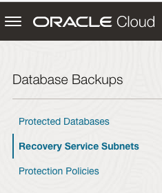
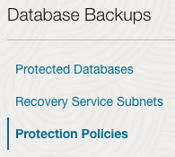

# Real-time Oracle Database protection with Autonomous Recovery Service

## Introduction

This lab will register the Recovery Service Subnet and create a custom protection policy.

Estimated Time: 5 minutes

### Objectives

In this lab, you will:
* Register the Recovery Service Subnet
* Create a policy for backup retention

## Task 1: Register the Recovery Service Subnet

1. Navigate to Database Backups
    

2. Select Recovery Service Subnets under Database Backups on the left
    

3. Click the Register Recovery Service subnet button
    

4. Enter the following information to Register the Recovery Service Subnet
    * Name: Recovery Service Subnet
    * Compartment: (need this)
    * Subnet: Select Recovery Service Subnet from the drop down menu

5. Click the Register button
    

## Task 2: Create a custom Protection Policy

1. Select Protection Policies
    

2. Click the Create protection policy button
    

3. Enter the following information to create a protection policy
    * Name: Any name you would like to use to identify the policy
    * Compartment:  The compartment being used
    * Backup retention period (in days): Enter the number of days to retain the backup

4. Click the Create button
    

## Learn More

* [Managing Recovery Service Subnets](https://docs.oracle.com/en/cloud/paas/recovery-service/dbrsu/manage-backup-networks.html#GUID-2093C2E1-4A88-4D56-9D12-C7F11816CB21)
* [Managing Protection Policies](https://docs.oracle.com/en/cloud/paas/recovery-service/dbrsu/manage-protection-policy.html#GUID-3823E813-1236-4755-B791-ABE1963C4EB8)

## Acknowledgements
* **Author** - Kelly Smith, Product Manager, Backup & Recovery Solutions
* **Last Updated By/Date** - Kelly Smith, May 2023
