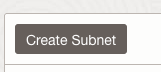

# Real-time Oracle Database protection with Autonomous Recovery Service

## Introduction

This lab will configure the tenancy for use with Autonomous Recovery Service

Estimated Time: 10 minutes

### Objectives

In this lab, you will:
* Create Create Policies to Enable Access to Recovery Service
* Create Security List with Ingress Rules
* Create a subnet in your database VCN

## Task 1: Create Policies to Enable Access to Recovery Service and Related Resources

1. Navigate to Policies
    

2. Click the Create Policy button
    

3. Enter the following information for the Policy
    * Name: Recovery-Service-Policy
    * Compartment: (need this)
    * Policy use cases: Select Autonomous Recovery Service from the drop down menu
    * Common policy templates: Select Ability to do all things with Autonomous Recovery Service

4. Click the Create button
    

## Task 2: Create the Recovery Service Security List with Ingress Rules

1. Navitgate to Virtual cloud networks

	

	> **Note:** Use this format for notes, hints, and tips. Only use one "Note" at a time in a step.

2. Select the Virtual Cloud Network (need these details from the LiveLab tenancy)

  

3. Select Security Lists under Resources on the left (need this image)

4. Click the Create Security List button
    

5. Enter the following information for the Security List
    * Name:  Recovery Service Security List
    * Compartment:  (need this information)

6. Click + Another Ingress Rule

7. Enter the following information for the Ingress Rule
    * Source CIDR: (need this information)
    * Destination Port Range: 2484,8005
    * Leave all other settings as default

8. Click Create Security List
    

## Task 3: Create the Recovery Service Subnet
    
1. Select Subnets under Resources on the left (need this image)

2. Click the Create Subnet button
  

3. Enter the following information for the subnet
    * Name:  Recovery Service Subnet
    * Compartment:  (need this information)
    * Type: Regional
    * IPv4 CIDR Block:  (need this)/24
    * Select Route Table:  (need this)
    * Subnet Access: Private Subnet
    * Security Lists: Select Recovery Service Security List from the drop down menu
    * Leave all other settings as default

4. Click Create Subnet
    

5. Wait for State to become Available
    

## Learn More

* [Policies to Enable Access to Recovery Service and Related Resources](https://docs.oracle.com/en/cloud/paas/recovery-service/dbrsu/recovery-service-permissions.html#GUID-867093E8-DBC2-4FD1-9002-5A5722749F9E)
* [Configuring Network Resources for Recovery Service](https://docs.oracle.com/en/cloud/paas/recovery-service/dbrsu/recovery-service-network.html#GUID-1D4A9C7A-41D6-46A6-A401-E5381FA04548)

## Acknowledgements
* **Author** - <Kelly Smith, Product Manager, Backup & Recovery Solutions>
* **Last Updated By/Date** - <Kelly Smith, May 2023>
