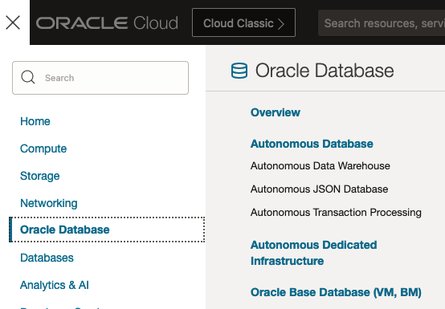
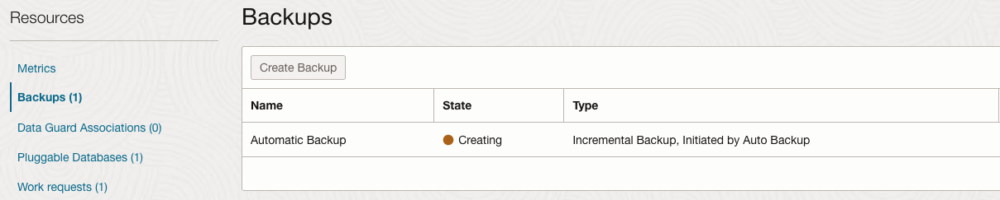

# Setup automatic backups for Autonomous Recovery Service

## Introduction

This lab shows you how to configure automatic backups for the Oracle Database with Autonomous Recovery Service as the backup destination.  

Estimated Time: 10 minutes

### Objectives

In this lab, you will:
* Configure Automatic Backups for Base Database Service with real-time protection enabled
* Monitor for backup completion

## Task 1: Configure Automatic Backups for Base Database Service

1. Navigate to Base Database Service
    

2. Click on your database system name

3. Click on your database name under the Databases section

4. In the button bar at the top click the Configure automatic backups button
    

5. Enter the following information to Configure automatic backups
    * Select the Enable automatic backups box
    * Backup scheduling (UTC): Select a time window to run backups from the drop-down menu
    * Backup Destination: Select Autonomous Recovery Service from the drop-down menu
    * Protection policy: Select the custom protection policy created in the previous lab
    * Select the Real-time data protection box
    * Deletion options after database termination: Select how to manage backups after the database is terminated

6. Click the Save changes button

## Task 2: Monitor the automatic backup

1. The backup will appear under Resources | Backups in the lower left of the database details page. 
    > **Note:** it may take 10-20 seconds to appear.
    

2. The backup will complete in approximately XX minutes.

## Learn More

* [Back Up a Database Using the Console](https://docs.oracle.com/en/cloud/paas/bm-and-vm-dbs-cloud/dbbackupoci/index.html)

## Acknowledgements
* **Author** - Kelly Smith, Product Manager, Backup & Recovery Solutions
* **Last Updated By/Date** - Kelly Smith, May 2023
