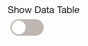

# Monitor & Create Alarms

## Introduction

This lab shows you how to use metrics to monitor backups of databases protected by the Autonomous Recovery Service.  When you used in conjunction with the OCI alarms you can be notified if the metrics exceed the threshold you specify.

Estimated Time: 10 minutes

### Objectives

In this lab, you will:
* Review protection metric 
* Configure an alarm for this metric

## Task 1: Review the protection metrics for your database

1. Navigate to Metrics Explorer
    

2. Select Last 7 days from the Quick selects drop down
    

3. In the Query 1 selection area choose the following options:
    * Compartment: Your compartment name
    * Metric namespace: oci-recovery-service
    * Metric name: DataLossExposure
    * Interval: 15 minutes
    * Statistic: Mean

4. Click Update Chart

5. Review the chart at the top to see the data loss exposure for the database in your compartment.  Data loss exposure shows the time since the database was last protected by backup.  When real-time protection is enabled, the value in the chart will be zero since the database is always being protected.

    Example chart:
    

6. You can also see a table of the values for Data Loss Exposure by toggling the Show Data Table option
    

## Task 2: Set an alarm to monitor the data loss exposure

1. Navigate to Alarm Definitions
    

2. Click Create Alarm

3. Provide the follow information in the dialog under each section:
    * Define alarm:
        * Alarm name: Type a name for the alarm definition.  Ex: Data Loss Alarm
        * Alarm summary: Provide a description of the alarm.  Ex: Data Loss Exposure too high for the database
    * Metric description
        * Compartment: Your compartment name
        * Metric namespace: oci-recovery-service
        * Metric name: DataLossExposure
        * Interval: 1 minutes
        * Statistic: Mean
    * Metric dimension - leave as default
    * Trigger rule
        * operator: greater than
        * Value: 120 (provide number of seconds)
        * Trigger delay minutes: 1
        * Alarm severity: Critical
        * Alarm body: Provide any steps you would like the notification reader to follow.
    * Define alarm notifications
        * Destination service: Notifications
        * Compartment: Your compartment name
        * Click Create a topic
            * Topic name: High-Data-Loss
            * Subscription protocol: Email
            * Subscription email: Enter an email you would like to use to see the results
    * Message group - leave as default
    * Message format - leave as default

4. Click Save.

5. You will receive an email confirming the subscription.

6. If you would like to see the notification from optional Task 3 & 4 click Confirm subscription in the email

## Task 3:  (Optional) Trigger the alarm

1. Navigate to Base Database Service
    

2. Click on your database system under Display name

3. Click Nodes under Resources on the left
    

4. Click the 3 dots on the far right and select Stop
    

5. Click Stop node on the confirmation pop up message

6. An email will appear when the threshold is passed

## Task 4: (Optional) Delete the Alarm to stop email notification

1. Navigate to Alarm Definitions
    

2. Click the name of your alarm

3. Click the Actions menu in the top right

4. Click Delete alarm.  This will prevent further alarms once the lab is complete.

## Learn More

* [Using the Console to View Protected Database Metrics](https://docs.oracle.com/en/cloud/paas/recovery-service/dbrsu/console-recovery-service-metrics.html)
* [Using Alarms to Monitor Protected Databases](https://docs.oracle.com/en/cloud/paas/recovery-service/dbrsu/alarm-recovery-service-metrics.html)
* [Documentation for Zero Data Loss Autonomous Recovery Service](https://docs.oracle.com/en/cloud/paas/recovery-service/dbrsu/)

## Acknowledgements
* **Author** - Kelly Smith, Product Manager, Backup & Recovery Solutions
* **Last Updated By/Date** - Kelly Smith, May 2023
