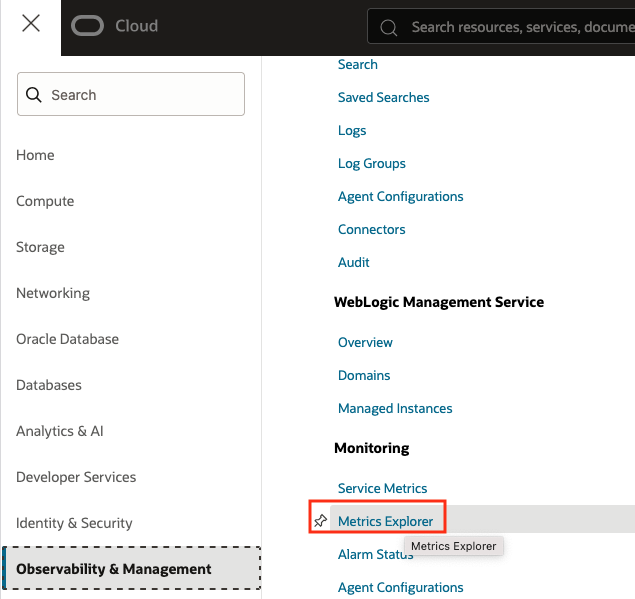
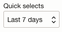
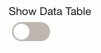

# Monitor & Create Alarms

## Introduction

This lab shows you how to use metrics to monitor backups of databases protected by the Autonomous Recovery Service.  When you used in conjunction with the OCI alarms you can be notified if the metrics exceed the threshold you specify.

Estimated Time: 10 minutes

### Objectives

In this lab, you will:
* Review protection metric 
* Configure an alarm for this metric

## Task 1: Review the protection metrics for your database

1. Navigate to Metrics Explorer
    

2. Select Last 7 days from the Quick selects drop down
    

3. In the Query 1 selection area choose the following options:
    * Compartment: Your compartment name
    * Metric namespace: oci-recovery-service
    * Metric name: DataLossExposure
    * Interval: 15 minutes
    * Statistic: Mean

4. Click Update Chart

5. Review the chart at the top to see the data loss exposure for the database in your compartment.  Data loss exposure shows the time since the database was last protected by backup.  When real-time protection is enabled, the value in the chart will be zero since the database is always being protected.

    Example chart:
    

6. You can also see a table of the values for Data Loss Exposure by toggling the Show Data Table option
    

7. You can also create an alarm for these metric by clicking the "Create Alarm" button.
Note: this LiveLab envrionment does not allow you to save any alarms.  

## Learn More

* [Using the Console to View Protected Database Metrics](https://docs.oracle.com/en/cloud/paas/recovery-service/dbrsu/console-recovery-service-metrics.html)
* [Using Alarms to Monitor Protected Databases](https://docs.oracle.com/en/cloud/paas/recovery-service/dbrsu/alarm-recovery-service-metrics.html)
* [Documentation for Zero Data Loss Autonomous Recovery Service](https://docs.oracle.com/en/cloud/paas/recovery-service/dbrsu/)

## Acknowledgements
* **Author** - Kelly Smith, Product Manager, Backup & Recovery Solutions
* **Last Updated By/Date** - Kelly Smith, July 2025
