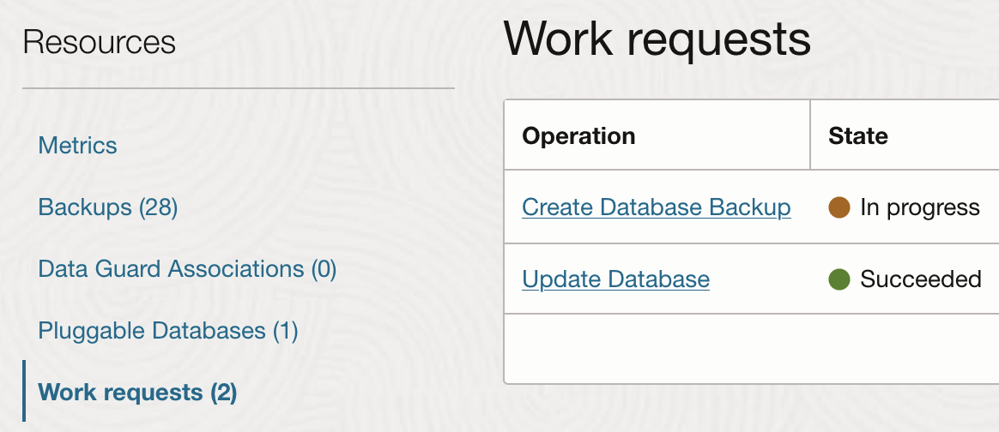

# Real-time Oracle Database protection with Autonomous Recovery Service

## Introduction

This lab shows you how start an on-demand backup which will backup the database immediately.  Once this backup starts you can monitor the status of the backup and see the results in the backup history.

Estimated Time: 10 minutes

### Objectives

In this lab, you will:
* Start an on-demand backup 
* Monitor the backup status
* Review the backup job in the history

## Task 1:  Start an on-demand backup

1. Navigate to Base Database Service
    

2. Click on your database system under Display name

3. Click on your database name under the Databases section

4. Click "Backups" under "Resources" in the lower left

5. Click "Create Backup"
    

6. Provide a name which will be used in the backup job history to identify this backup

## Task 2: Monitor the on-demand backup

1. The on-demand backup task will appear under Resources | Work requests in the lower left of the database details page.  
     Note: it may take 10-20 seconds to appear.
    

2. The backup will complete in approximately 10 minutes and the state will show Succeeded.

3. The backup will also appear under "Resources | Backups".  Note the name provided above is displayed in the list of backups.
    

## Learn More

* [Create an On-Demand Full Backup of a Database](https://docs.oracle.com/en/cloud/paas/bm-and-vm-dbs-cloud/dbbackupoci/index.html#GUID-B4412946-7452-479C-A763-5AE3462A540C)
* [Documentation for Zero Data Loss Autonomous Recovery Service](https://docs.oracle.com/en/cloud/paas/recovery-service/dbrsu/)

## Acknowledgements
* **Author** - Kelly Smith, Product Manager, Backup & Recovery Solutions
* **Last Updated By/Date** - Kelly Smith, May 2023
