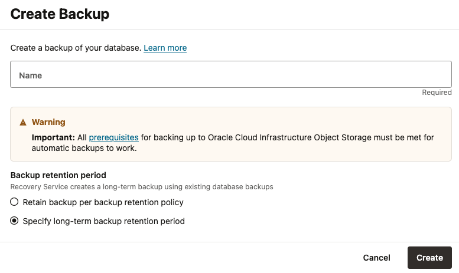
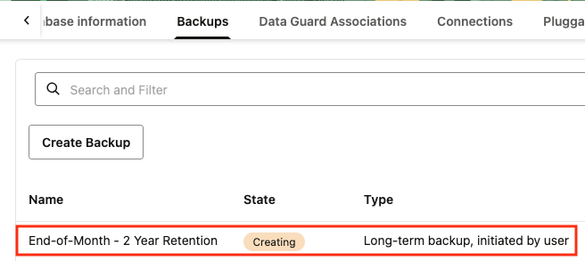

# Create an on-demand backup

## Introduction

This lab shows you how start an on-demand backup which will backup the database immediately.  The following two options are available for on-demand backups:  
1. An incremental backup that follows the retention policy for the database.  This is helpful if you are performing mantenance on the database and want a backup but don't want to adjust the regular schedule.
2. A long-term retention backup that follows a retention period you define.  This is helpful if you need a backup for compliance, like an end-of-month backup.  This full backup is created from your existing backups in Recovery Service, so there is no load on the database while creating long-term backups.

Once either of these backup types start, you can monitor the status and see the results in the backup history.

Estimated Time: 10 minutes

### Objectives

In this lab, you will:
* Start an on-demand backup 
* Monitor the backup status
* Review the backup job in the history

## Task 1:  Start an on-demand backup

1. Navigate to Base Database Service
    

2. Click on your database system under Display name

3. Click on the Databases tab
    

4. Click on your database name

5. Click on the Backups tab
    

6. Click the "Create Backup" button
    

7. Provide a name which will be used in the backup job history to identify this backup

8. Select one of the two Backup retention period options:

    - Retain backup per backup retention policy will create the an incremental backup
    - Specify long-term backup retention period will create a full backup from existing Recovery Service backups

9. Click "Create"

## Task 2: Monitor the on-demand backup

1. The on-demand backup task will appear under "Work requests" in the top right of the database details page.  
    > **Note:** it may take 10-20 seconds to appear.
    

2. The backup will complete in approximately 10 minutes and the state will show Succeeded

3. The backup will also appear under "Backups" with the name provided in Task 1 above
    

Note: "Long-term backup" type which appears in the backup history, if that backup option was selected in Task 1.

## Learn More

* [Create an On-Demand Full Backup of a Database](https://docs.oracle.com/en/cloud/paas/bm-and-vm-dbs-cloud/dbbackupoci/index.html#GUID-B4412946-7452-479C-A763-5AE3462A540C)
* [Documentation for Zero Data Loss Autonomous Recovery Service](https://docs.oracle.com/en/cloud/paas/recovery-service/dbrsu/)

## Acknowledgements
* **Author** - Kelly Smith, Product Manager, Backup & Recovery Solutions
* **Last Updated By/Date** - Kelly Smith, July 2025
