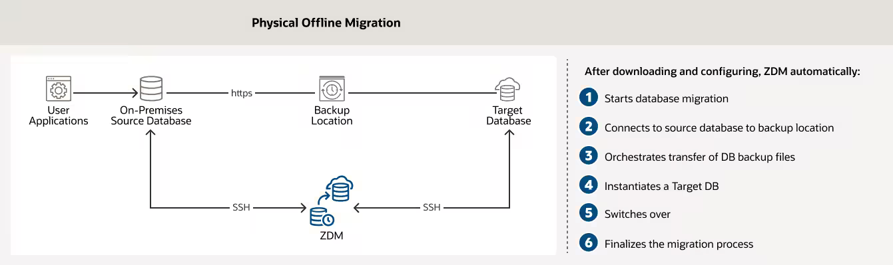
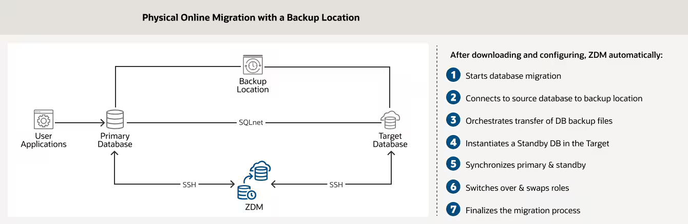
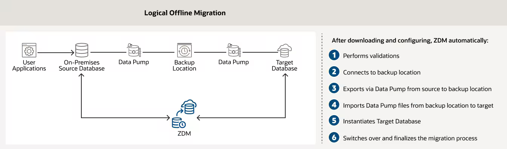
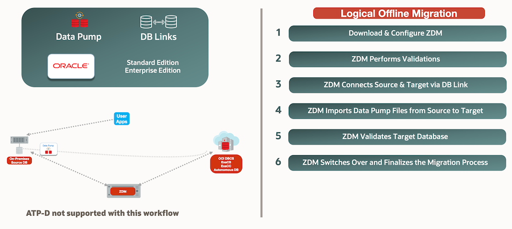
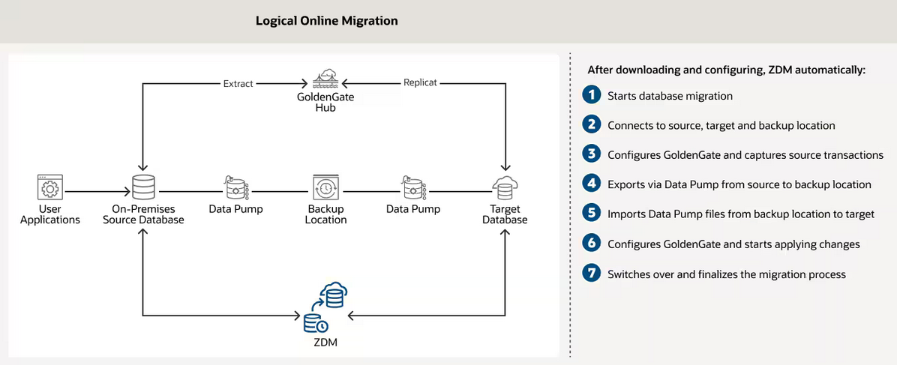

# Introduction

## About this workshop

This workshop will consist of a step by step logical online migration using DataPump to export/import the source/target database, an Oracle GoldenGate Hub for Database Synchronization and an Oracle Cloud Infrastructure (Oracle Cloud Infrastructure) object storage bucket as a backup location.

Estimated Time: 3 hours

### About Zero Downtime Migration

Oracle Zero Downtime Migration (ZDM) is the Oracle Maximum Availability Architecture (MAA)-recommended solution to migrate Oracle Databases to the Oracle Cloud. ZDM's inherent design keeps the migration process as straightforward as possible and ensures the most negligible impact on production workloads. The Source Database to be migrated can be on-premises, deployed on Oracle Public Cloud Gen 1 or Oracle Cloud Infrastructure. The Target Database deployment can be in a Database Cloud Service on Oracle Cloud Infrastructure (Oracle Cloud Infrastructure) Virtual Machine, Exadata Cloud Service, Exadata Cloud at Customer, or Autonomous Database. ZDM automates the entire migration process, reducing the chance of human errors. ZDM leverages Oracle Database-integrated high availability (HA) technologies such as Oracle Data Guard and GoldenGate and follows all MAA best practices that ensure no significant downtime of production environments. Oracle ZDM supports both Physical and Logical Migration workflows. 

Oracle ZDM supports Oracle Database versions 11.2.0.4, 12.1.02, 12.2.0.1, 18c, 19c & 21c. ZDM’s physical migration workflow requires the source and target databases to be in the same database release.  Starting with ZDM 21.1, the Logical Migration workflow supports cross-version migration, thus providing an in-flight upgrade while migrating to the Oracle Cloud.

Oracle ZDM allows the source database to be a non-CDB or a container database (CDB) with one or more Pluggable Databases (PDBs). Starting with release 21.1, Oracle ZDM allows non-CDB Databases to be migrated to Pluggable Databases on the fly, allowing for total conversion and adding more versatility to the migration workflow. 

The Zero Downtime Migration software offers a command line interface that you install and run on a host that you provision. The server where the Zero Downtime Migration software is installed is called the Zero Downtime Migration service host. You can run one or more database migration jobs from the Zero Downtime Migration service host.

### Migration Paths
ZDM supports on-premises databases to be migrated to a variety of Oracle Cloud Database Services and the Exadata Database Machine On-Premises:  
*	Oracle Database Cloud Service	(Bare Metal & Virtual Machine)
*	Oracle Exadata Cloud Service
*	Oracle Exadata Cloud at Customer
*	Oracle Autonomous Database - Oracle Autonomous Transaction Processing  (Dedicated and Shared)
* Oracle Autonomous Database - Oracle Autonomous Data Warehouse (Dedicated and Shared)

### Migration Workflows

#### Physical Offline Migration
ZDM physical offline migration leverages Oracle Recovery Manager and migrates the database using a backup and restore methodology. Customers can use this method when migrating to Oracle Database Cloud Services Virtual Machines, Exadata Cloud Service, Exadata Cloud at Customer and Exadata Database Machine On-Premises. 

#### Physical Online Migration
ZDM physical online migration leverages Oracle Recovery Manager and Oracle Data Guard. Customers should use this method when a highly available migration and minimizing any possible impact is a priority. Customers can use this method to migrate to Oracle Database Cloud Services Virtual Machines, Exadata Cloud Service, Exadata Cloud at Customer and Exadata Database Machine On-Premises.

#### Logical Offline Migration with Backup Location
ZDM logical offline migration with Data Pump and Backup Location offers customers a simple yet efficient method to migrate their databases to the Oracle Cloud. The backup location can be the Object Storage for Oracle Cloud Infrastructure migrations and NFS or the Recovery Appliance for Exadata Cloud at Customer.

#### Logical Offline Migration with Database Links
ZDM offline logical migration can also leverage Database Links to establish a direct connection between the source database and the target database in the Oracle Cloud, thus eliminating the need for a backup location. This methodology is recommended only for Databases smaller than 100Gb.

#### Logical Online Migration with Database Links
Oracle ZDM leverages a GoldenGate hub that will help synchronize both the source and target database while providing a highly available migration. Database Links are used for a direct connection between source and database target while the instantiation of the target database is done by using Data Pump.

#### Logical Online Migration with Backup Location
Customers can also leverage a designated backup location instead of using a direct Database Link between the source and the target database. Migration to Oracle Cloud Infrastructure-based databases will use the Object Store, whereas migrations to Exadata Cloud at Customer can choose between an external NFS filer or the Recovery Appliance as a backup location.

For more information on Oracle Zero Downtime Migration please visit ZDM's [product website](www.oracle.com/goto/zdm).

### Objectives

In this lab, you will:
* Learn about Oracle Zero Downtime Migration Fundamentals
* Install and Setup ZDM
* Configure Credential and Authentication Requirements for the Migration
* Source Database Configuration
* Target Database Configuration
* Provision and Deploy a ZDM GoldenGate Hub
* Response File Configuration
* Databasde Migration

### Prerequisites
This workshop requires an Oracle Cloud account.

Please *proceed to the next lab*.

## Learn More

* [Oracle Zero Downtime Migration - Product Page](http://www.oracle.com/goto/zdm)
* [Oracle Zero Downtime Migration - Product Documentation](https://docs.oracle.com/en/database/oracle/zero-downtime-migration/)
* [Oracle Zero Downtime Migration - Logical Migration Step by Step Guide](https://www.oracle.com/a/tech/docs/oracle-zdm-logical-migration-step-by-step-guide.pdf)
* [Oracle Zero Downtime Migration - Physical Migration Step by Step Guide](https://www.oracle.com/a/tech/docs/oracle-zdm-step-by-step-guide.pdf)

## Acknowledgements
* **Author** - Ricardo Gonzalez, Senior Principal Product Manager, Oracle Cloud Database Migration
* **Contributors** - LiveLabs Team, ZDM Development Team
* **Last Updated By/Date** - Ricardo Gonzalez, January 2022
