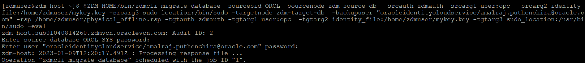

# Database Migration

In this lab, you will prepare a response file for migration , evaluate a migration and finally perform the actual migration.


Estimated Time: 30 mins

**<details><summary>Task 1 - Prepare Response File </summary>**
<p>

1. Login to ZDM Service Host.

   Login to ZDM Service Host using Public IP and ssh key.

2. Switch user to zdmuser

   Switch user to "zdmuser" using below command.

   sudo su - zdmuser
      
3. Prepare a response file.

   Below is sample response file in which you can use for ZDM Physical Offline Migration.

   Please note that this response file uses Oracle Object Storage to keep the Source Database Backup and the Target Database is Oracle Base Database(specified as VMDB).

   

   ```console
   TGT_DB_UNIQUE_NAME=ORCL_T
   MIGRATION_METHOD=OFFLINE_PHYSICAL
   DATA_TRANSFER_MEDIUM=OSS
   HOST=https://swiftobjectstorage.uk-london-1.oraclecloud.com/v1/xxxxxxxxx
   OPC_CONTAINER=ZDM-Physical
   PLATFORM_TYPE=VMDB
   SHUTDOWN_SRC=TRUE
   ```
   Please note that we have updated values for all parameters except for HOST which is specifci for your environment. 

   Use below method to prepare HOST value.

   Use the below format.

   https://swiftobjectstorage.<region_name>.oraclecloud.com/v1/<objectstorage_namespace>

   Replace region_name and objectstorage_namespace with your corresponding values.

   Save the contents to physical_offline.rsp file under /home/zdmuser.

</p>
</details>

**<details><summary>Task 2 - Start a Migration Evaluation </summary>**
<p>

1. Login to ZDM Service Host and switch to zdmuser.

2. Check the status of ZDM service.

   Export ZDM_HOME=/home/zdmuser/zdmhome

   $ZDM_HOME/bin/zdmservice status

   if the running shows as false then use below command to start ZDM.

   $ZDM_HOME/bin/zdmservice start

3. Prepare command for Physical Offline Migration Evaluation.

   Use the below sample command for ZDM Migration Evaluation and update it as per your environment.

   ```console
   $ZDM_HOME/bin/zdmcli migrate database  -sourcesid ORCL  -sourcenode zdm-source-db  -srcauth zdmauth  -srcarg1 user:opc  -srcarg2 identity_file:/home/zdmuser/mykey.key  -srcarg3 sudo_location:/bin/sudo  -targetnode zdm-target-db  -backupuser "oracleidentitycloudservice/xxxxxx.xxxxx@oracle.com"  -rsp /home/zdmuser/physical_offline.rsp  -tgtauth zdmauth  -tgtarg1 user:opc  -tgtarg2 identity_file:/home/zdmuser/mykey.key  -tgtarg3 sudo_location:/usr/bin/sudo -eval
   ```
   Below is a brief description of the flags used in above command.

   -backupuser             -->  Oracle Cloud tenancy user for which we have generated Auth Token in earlier Lab.
   -srcargg2 identity_file -->  location of private ssh key file which can be used to login to Source Database Server.
   -tgtarg2 identity_file  -->  location of private ssh key file which can be used to login to Target Database Server.
   -sourcenode             --> Host Name of Source Database server.
   -targetnode             --> Host Name of Target Database Server.
   -rsp                    --> Location of response file for migration.

4. Perform Migration Evaluation.

   Once you have updated the Evaluation command then proceed to execute the command as below.

   

   Please provide the SYS password of Source Database and Auth token when asked.

   Also note down the Migration Job ID.

5. Monotor the Migration Evaluation.

   Check the status of Migration Evaluation using below command.

   $ZDM_HOME/bin/zdmcli query job -jobid 1

   here 1 is the jobid.

   You will receive a similar ouput as below.

   

   Continue execute the status command until all phases have been completed with status "PRECHECK_PASSED"


Please *proceed to the next lab*.


