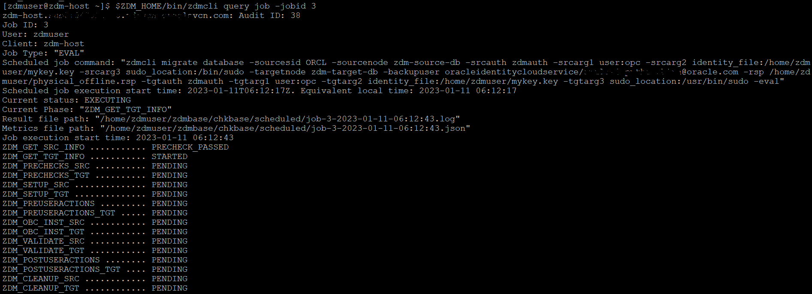
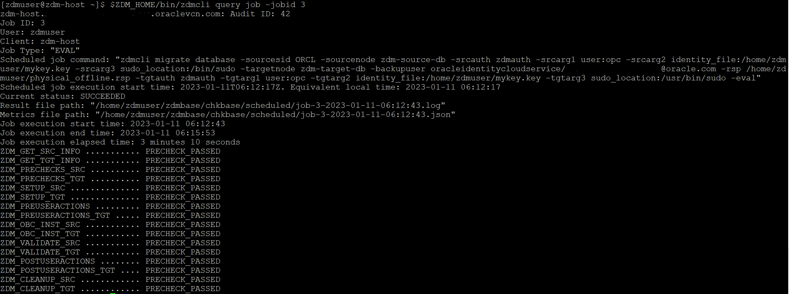
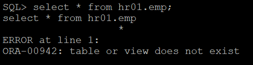
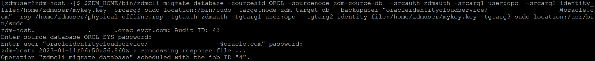

# Lab 8 : Migrate database

## Introduction

Estimated Time: 30 mins

### Objectives

In this lab

* You will prepare a response file for database migration.

* You will evaluate a database migration.

* You will perform the actual database migration.

### Prerequisites

This lab assumes you have :

* Oracle Cloud Account

* All previous labs have been successfully completed.

## Task 1 : Prepare response file

**1. Login to ZDM service host.**

   Login to ZDM service host using Public IP and ssh key.

**2. Switch user to zdmuser.**

   Switch user to "zdmuser" using below command.

   sudo su - zdmuser
      
**3. Prepare a response file.**

   Below is sample response file which you can use for ZDM Physical Offline Migration.

   Please note that this response file uses Oracle Object Storage to keep the source database backup and the target database is Oracle Base Database(specified as VMDB).

   ```console
   TGT_DB_UNIQUE_NAME=ORCL_T
   MIGRATION_METHOD=OFFLINE_PHYSICAL
   DATA_TRANSFER_MEDIUM=OSS
   HOST=https://swiftobjectstorage.uk-london-1.oraclecloud.com/v1/xxxxxxxxx
   OPC_CONTAINER=ZDM-Physical
   PLATFORM_TYPE=VMDB
   SHUTDOWN_SRC=TRUE
   ```
   Please note that above response file has already been updated for this lab except for HOST which is specific for your environment. 

   Use below method to prepare HOST value.

   Use the below format.

   "https://swiftobjectstorage.<region_name>.oraclecloud.com/v1/<objectstorage_namespace>".

   Replace "region_name" and "objectstorage_namespace" with your corresponding values.

   "objectstorage_namespace" values for your environment  was collected in Lab 7 Task 1.

   Save the contents to a file named as "physical_offline.rsp" file under /home/zdmuser.

   Please note that you can prepare your own response file if required to satisfy your requirements.

## Task 2 : Start database migration evaluation

**1. Login to ZDM service host.**

   Login to ZDM service host and switch the user to "zdmuser".

**2. Check the status of ZDM service.**

   export ZDM_HOME=/home/zdmuser/zdmhome

   $ZDM_HOME/bin/zdmservice status

   if the "running" shows as "false" then use below command to start ZDM.

   $ZDM_HOME/bin/zdmservice start

**3. Prepare command for ZDM Physical Offline Migration Evaluation.**

   Use the below sample command for ZDM database migration evaluation and update it as per your environment.

   ```console
   $ZDM_HOME/bin/zdmcli migrate database  -sourcesid ORCL  -sourcenode zdm-source-db  -srcauth zdmauth  -srcarg1 user:opc  -srcarg2 identity_file:/home/zdmuser/mykey.key  -srcarg3 sudo_location:/bin/sudo  -targetnode zdm-target-db  -backupuser "xxxxxxxx/xxxxxx.xxxxx@xxxxx.com"  -rsp /home/zdmuser/physical_offline.rsp  -tgtauth zdmauth  -tgtarg1 user:opc  -tgtarg2 identity_file:/home/zdmuser/mykey.key  -tgtarg3 sudo_location:/usr/bin/sudo -eval
   ```
  
  Please refer below document to know more about the parameters used in migration command.

  https://docs.oracle.com/en/database/oracle/zero-downtime-migration/21.3/zdmug/zero-downtime-migration-zdmcli-command-reference.html#GUID-37ABF830-2FC3-4F71-9132-DF05DCFABBB9


**4. Perform database migration evaluation.**

   Once you have updated the evaluation command then proceed to execute the command as below.

   

   Please provide the SYS password of source database and Auth token when asked.

   Also note down the Migration Job ID which is 3 in this case.

**5. Monitor the database migration evaluation.**

   Check the status of database migration evaluation using below command.

   $ZDM_HOME/bin/zdmcli query job -jobid 3

   here 3 is the jobid.

   You will receive a similar ouput as below.

   

   Continue to execute the status command until all phases have been completed with status "PRECHECK_PASSED" as shown below.

   

## Task 3 : Start database migration

**1. Create HR01.EMP table in source database.**

   We will create a user called "HR01" and a table called "EMP" under PDB called ORCLPDB in the source database.

   This is to enable us to perform a quick check on the success of database migration.

   a. Login to source database server.

   Login to source database using Public IP and ssh key.

   b. Login to ORCLPDB.

   Login to CDB using sqlplus and then switch to ORCLPDB using below command.

   alter session set container=ORCLPDB;

   Execute below statements
   ```console
   create user hr01 identified by "password";
   grant resource , connect to hr01;
   alter user hr01 quota unlimited on users;
   create table hr01.emp(ename varchar2(20),eno number);
   insert into hr01.emp values('Alpha',1);
   insert into hr01.emp values('Beta',2);
   commit;
   ```

   c. Verify the data in HR01.EMP table.

   Execute below statement when you are in ORCLPDB.
   ```console
   select * from hr01.emp;
   ```

   You will receive the below output.

   

**2. Verify HR01.EMP table in target database.**

   We know that there is no HR01.EMP table in target database , However let's verify it.

   a. Connect to target database server.

   Connect to target database server using Public IP and ssh key.

   b. Connect to ORCL_PDB1.

   Connect to CDB using sqlplus and switch to ORCL_PDB1 using below command.

   alter session set container=ORCL_PDB1;

   c. Verify existence of HR01.EMP table.

   ```console
   select * from hr01.emp;
   ```

   You will receive an output similar to the one below indicating that HR01.EMP table doesn't exist in target database which is expected.

   

**3. Start the database migration**

   We are now good to start the database migration.

   We can use the same command used for database migration evaluation except that "-eval" flag is not required.

   **a. Login to ZDM service host.**

   Login to ZDM service host using Public IP and ssh key.

   **b. Switch user to zdmuser.**

   Switch user to "zdmuser" using below command.

   sudo su - zdmuser
   
   **c. Execute database migration as below.**

   Execute below command to start the database migration.
   ```console
   $ZDM_HOME/bin/zdmcli migrate database -sourcesid ORCL -sourcenode zdm-source-db  -srcauth zdmauth -srcarg1 user:opc  -srcarg2 identity_file:/home/zdmuser/mykey.key -srcarg3 sudo_location:/bin/sudo -targetnode zdm-target-db  -backupuser "oracleidentitycloudservice/xxxxx.xxxx@xxxcle.com" -rsp /home/zdmuser/physical_offline.rsp -tgtauth zdmauth -tgtarg1 user:opc  -tgtarg2 identity_file:/home/zdmuser/mykey.key -tgtarg3 sudo_location:/usr/bin/sudo
   ```
   

   Please provide the SYS password of source database and Auth token when asked.

   Also note down the Migration Job ID which is 4 in this case.
   
   **d. Monitor the database migration using below command.**

   $ZDM_HOME/bin/zdmcli query job -jobid 4

   You will get a output similar to below.

   

   You can see the "JOB_TYPE" is "MIGRATE" which is different from the "JOB_TYPE" (EVAL)for the database migration evaluation.
      
   Continue to monitor the status until all phases have been completed with "COMPLETED" status as shown below.

   

**4. Verify the database migration.**

   ZDM has completed the database migration as seen in the previous output.

   Let's verify the HR01.EMP table in target database.

   a. Connect to target database server.

   Connect to target database server using Public IP and ssh key.

   b. Connect to ORCLPDB.

   Connect to CDB using sqlplus and switch to ORCLPDB using below command.

   alter session set container=ORCLPDB;

   c. Verify existence of HR01.EMP table.

   ```console
   select * from hr01.emp;
   ```
   If you receive similar output as below which means database migration has been successfully completed.
   

Congrats ! , you have successfully completed ZDM Physical Offline Migration Lab.

## Acknowledgements
* **Author** - Amalraj Puthenchira, Cloud Data Management Modernise Specialist, EMEA Technology Cloud Engineering
* **Last Updated By/Date** - Amalraj Puthenchira, January 2023


