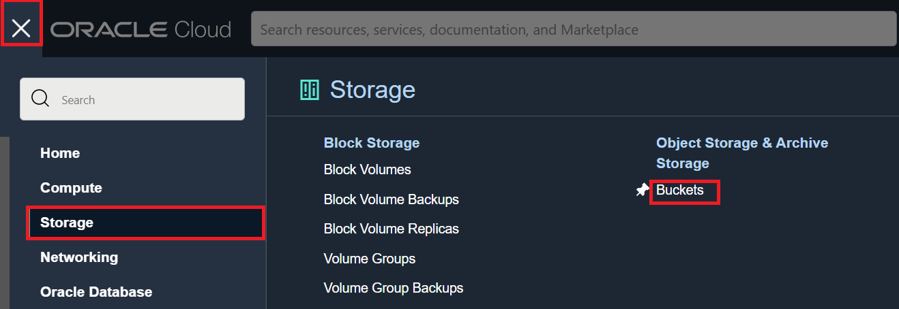
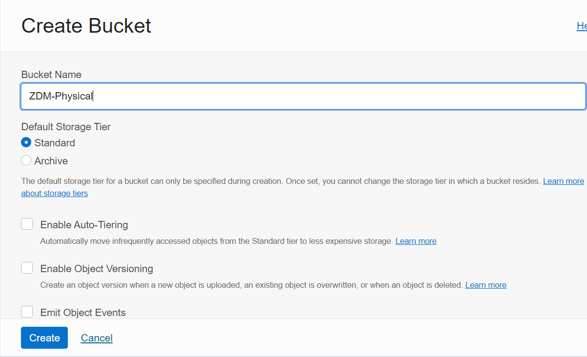
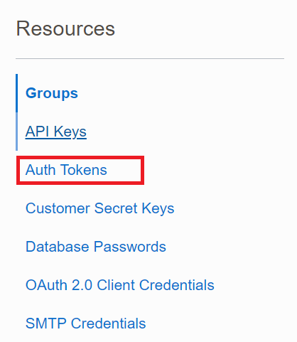

# Create Object Storage Bucket and Auth Token.

## Introduction

Estimated Time: 10 minutes

### Objectives

In this lab

* You will create an object storage bucket .

* You will create an Auth token for authentication.

### Prerequisites

* All previous labs have been successfully completed.

## Task 1 : Create Object Storage Bucket

1. Login to Oracle Cloud Console.

2. Navigate to Object Storage.

   Click the **Navigation Menu** in the upper left, navigate to **Storage** and then select **Buckets**.

   

3. Select the **Compartment**.

   Select appropriate compartment on the left side.

   

4. Create Bucket.

   Click on **Create Bucket**.

   

   Enter Bucket Name as **ZDM-Physical**.

   Leave everything as default and click on **Create**.

   

5. Collect the Object Storage NameSpace.

   Check the **Namespace** details under the **Bucket Information**.

   .

   Please note down the **Namespace** since it will be required in next lab.

## Task 2 : Create Auth Token

   We need an Auth token for the Oracle Cloud Tenancy user which will be used by ZDM to read and write from Object Storage Bucket.

1. Login to Oracle Cloud Console.
   
2. Navigate to user profile.

   Click the user profile on the upper right corner of Oracle Cloud Console and then select username which is logged in as below.

   

3. Navigate to **Resources**.

   Navigate to **Resources** on the left and click on **Auth Tokens**.

   

4. Create Auth Token.

   Click on **Generate Token** , provide a description for Token and click on **Generate Token** as shown below.

   

5. Copy the generated Token.

   Copy the generated token since it is required later for migration steps in next lab.

You may now **proceed to the next lab**.

## Acknowledgements
* **Author** - Amalraj Puthenchira, Data Management Modernise Specialist, EMEA Technology Engineering
* **Last Updated By/Date** - Amalraj Puthenchira, August 2023

