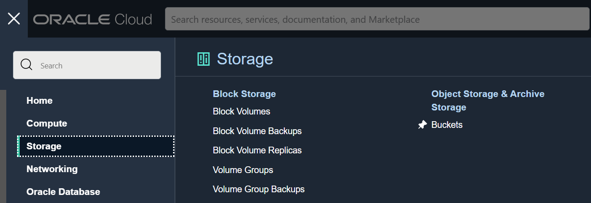
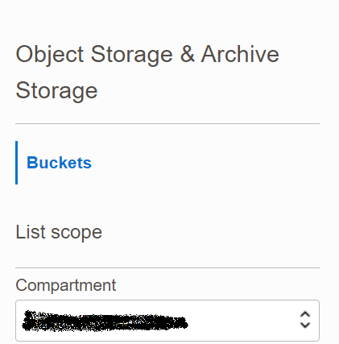
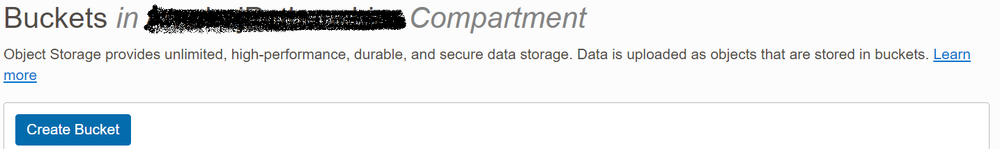
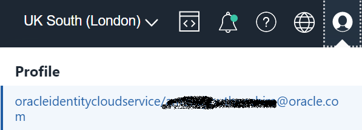

# Creation of Object Storage Bucket and Auth Token.

In this lab, you will create an object storage bucket and also a Auth token for authentication.

Estimated Time: 10 minutes

**

Task 1 - Create Object Storage Bucket 
**

1. Login to Oracle Cloud Console.

2. Navigate to Object Storage.

   Click the Navigation Menu in the upper left, navigate to Storage and then select Buckets.

   

      
3. Select the Compartment.

   Select appropriate compartment on the left side.

   

4. Create Bucket.

   Click on "Create Bucket"

   

   Enter Bucket Name as "ZDM-Physical"

   Leave all the defaults and click on "Create".

   

5. Collect the Object Storage NameSpace.

   Check the Namespace details under the Object Storage Bucket.

   

 

**

Task 2 - Create Auth Token 
**

We need an Auth token for the Oracle Cloud Tenancy user which will be used by ZDM to read and write from Object Storage.

1. Login to Oracle Cloud Console.
   
2. Navigate to User Profile.

   Click the Profile on the upper right corner of Oracle Cloud Console and then select username which is logged in as below.

   

3. Navigate to Resource.

   Navigate to Resource on the Left and click on Auth Tokens.

   

4. Create Auth Token.

   Click on Generate Token , provide a description for Token and click on Generate Token as below.

   

5. Copy the generated Token.

   Copy the generated token since it is required later for migration.

Please [proceed to the next lab](#next).

